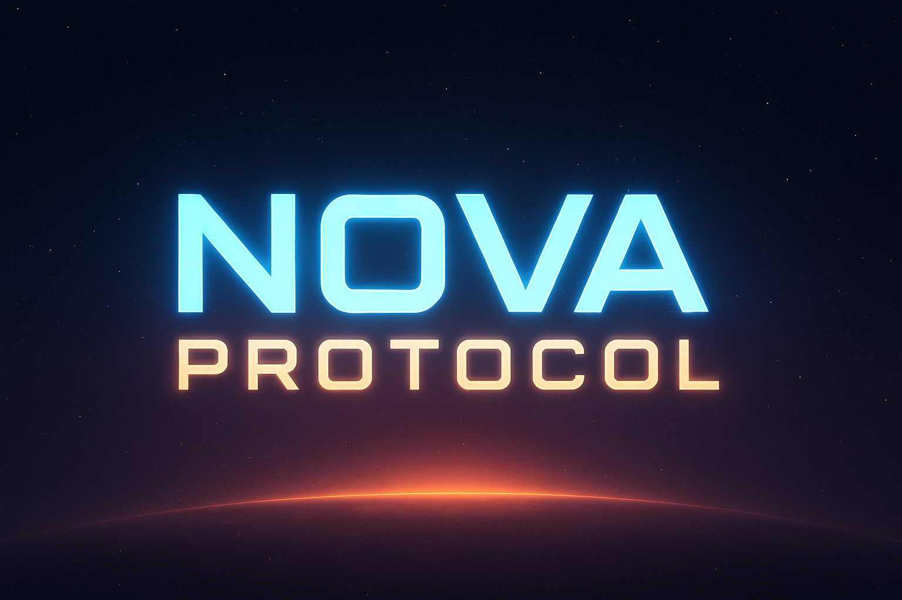

# Nova Protocol

A 3D space shooter built with [Bevy](https://bevyengine.org). Build ships out of
modular sections, then fly them through asteroid fields and gravity wells with a
diegetic autopilot that flies on real thrusters.

> **[Play in your browser](https://alexjercan.github.io/nova-protocol/)** - or
> read the [tutorial](https://alexjercan.github.io/nova-protocol/tutorial/) and
> [wiki](https://alexjercan.github.io/nova-protocol/wiki/) first.

## What you do

- **Build a ship** out of modular sections - hull, controller, thruster, turret,
  torpedo bay - each with its own mass and health. Lose a section, lose that
  capability.
- **Fly it for real.** The `GOTO`, `ORBIT` and `STOP` autopilot verbs drive the
  ship's actual controller and thrusters: you watch the hull swing and the plume
  light up. Any manual input takes back control instantly.
- **Work the gravity.** Large asteroids carry inverse-square gravity wells;
  `ORBIT` parks you in a stable circular orbit around the dominant one.
- **Fight.** An angular aim-assist cone locks the nearest hostile; turrets
  compute intercept lead and torpedo bays fire guided, blast-damage warheads,
  all sold with camera shake, hit rings and positional audio.

## Controls (quick reference)

| Action | Key |
| --- | --- |
| Main thruster burn | `W` / `Space` (or RT) |
| GOTO the current lock | `G` |
| ORBIT the gravity well | `O` |
| STOP (retrograde burn to rest) | `X` |
| Cancel autopilot | `Z` |
| Fire turrets | Left mouse |
| Cycle HUD (On / Cinematic) | `` ` `` |
| Pause | `Esc` |

Full controls are on the
[tutorial page](https://alexjercan.github.io/nova-protocol/tutorial/).

## Getting started

Nova Protocol is a Rust/Bevy workspace on the **nightly** toolchain
(`rust-toolchain.toml` pins it), plus a TypeScript site in [`web/`](web/). This
is the shortest path from a clone to a playable game, the served site, and green
tests.

**On NixOS**, prefix any `cargo`/`trunk` command below with `nix develop -c`
(or run `nix develop` once and work inside the shell): the flake provides the
nightly toolchain, the `wasm32-unknown-unknown` target, `trunk`, and every
system lib Bevy needs (udev, alsa, vulkan, X11/wayland). **Without Nix**,
install the pinned nightly toolchain and Bevy's Linux dependencies yourself.

```sh
git clone https://github.com/alexjercan/nova-protocol && cd nova-protocol

cargo run                           # 1. play the game (boots into the main menu)
cargo test --workspace --features debug   # 2. run the tests (headless; no display needed)
cargo run -p nova_probe_cli -- run --all     #    ...and the windowed sweep over every example

cd web && npm install && npm run serve    # 3. serve the content site (prints its port)
```

That is the bare minimum. For a **Play** button that launches the game locally,
the release and web builds, and every dev tool, read on. Deeper toolchain notes
live in the dev wiki:
[`web/src/wiki/dev/development.md`](web/src/wiki/dev/development.md).

## Build and run

```sh
cargo run                       # run the game (boots into the main menu)
cargo run --features dev        # dev build (inspector, wireframe, debug tooling)
cargo build --release           # release profile
trunk serve                     # web build (WASM), served on :8080 (see scripts/serve-web.sh for the full site)

cargo run --example             # list the examples in examples/ (by category)
cargo run --example scenario_grammar    # run one; add --features debug for autopilot ones
```

The `examples/` tree is grouped by category (`systems`, `sections`, `ui`,
...); the run-harness (`probe`, below) is the front door for driving them for
correctness and performance. See
[`web/src/wiki/dev/development.md`](web/src/wiki/dev/development.md) for the
example catalog and [`AGENTS.md`](AGENTS.md) for the architecture, scenario
system, and section model.

## The landing site (`web/`)

The marketing/content site (landing page, blog, tutorial, wiki) lives in
[`web/`](web/) as a self-contained TypeScript + Webpack + Tailwind project,
separate from the Rust workspace. It fronts the game: the deploy publishes the
site at the root and the WASM game under `/play/`.

```sh
cd web
npm install
npm run serve   # dev server on a free 7XXX port (site only - see the note below)
npm run build   # static bundle in web/dist/
npm run ci      # format check + lint + test + build
```

**The game and the mod portal are separate builds.** `npm run serve` on its own
serves only the content site, so the **Play** button (and `/play/`) falls back
to the landing page, and the in-game Explore tab has no `/mods/` to fetch. There
are two ways to get the whole thing locally:

*Live dev (everything watched, one command):* `scripts/serve-web.sh` starts the
site, the game (`trunk serve`) and the mod portal, each on its own free port in
7000-7999, and proxies `/play/` and `/mods/` onto the site's origin - the same
shape as the deploy. Every part rebuilds on save; the banner prints the URL:

```sh
nix develop -c scripts/serve-web.sh            # debug game build
nix develop -c scripts/serve-web.sh --release  # optimized game build
```

Ports are random so several worktrees can serve at once. Pin any of them with
`NOVA_UI_PORT`, `NOVA_GAME_PORT` or `NOVA_MODS_PORT`. To run the servers
yourself instead, point the site's proxies at them with `GAME_DEV_URL` and
`MODS_DEV_URL`.

*One-shot preview (closest to the deploy):* build everything and serve the
combined static output - no dev servers, no proxies, real deploy layout. This is
the one to check before a release. Run inside the dev shell so both `trunk` and
`node` are on PATH:

```sh
nix develop -c scripts/preview-web.sh            # debug game build
nix develop -c scripts/preview-web.sh --release  # optimized game build
# open http://localhost:8090/ and click Play
```

The `deploy-github-page` workflow
([`.github/workflows/deploy-page.yaml`](.github/workflows/deploy-page.yaml))
does the same assembly in CI: the webpack site at `/nova-protocol/` and the
Trunk game at `/nova-protocol/play/`.

## Tools

Every dev tool and script, with its exact invocation and a one-line purpose.
Run the `cargo` ones from the repo root (prefix with `nix develop -c` on Nix);
the deeper docs live in the dev wiki linked in each row.

### Rust CLIs

| Tool | Command | What it does |
| --- | --- | --- |
| Content CLI | `cargo run -p nova_assets --bin content -- gen\|lint` (also `lint --target <mod> --report <path>`) | Author + validate content: `gen` regenerates the base `*.content.ron` from the Rust builders; `lint` runs every content check in one pass - references/geometry, combat balance/fairness (the old `audit`, now folded in), and flight-rig input overlaps - and with `--report <path>` writes a per-mod document (`--format md\|html`) pinpointing file + element + fix for each finding. See [`content.rs`](crates/nova_assets/src/bin/content.rs). |
| Probe (run-harness) | `cargo run -p nova_probe_cli -- run <example>` / `cargo run -p nova_probe_cli -- report <run-dir>` | Drives autopilot examples headless and writes reports under `probe-runs/<short-commit>/`; `--profile`, `--samply`, `--fps`, `--all`, `--baseline`, `--platform web` extend it; `report` re-renders run dirs. See [`development.md`](web/src/wiki/dev/development.md). |
| `perf_web` | (not called directly - built and driven by `probe run <example> --platform web`) | The WASM measurement build the probe boots under headless Chromium to capture the web frame line. Its own crate ([`crates/nova_perf_web`](crates/nova_perf_web/)): it links the whole game, which `nova_probe` must not. See [`development.md`](web/src/wiki/dev/development.md). |
| Meta-sidecar gen | `cargo run -p nova_meta_gen -- [--assets <dir>]...` | Writes default `.meta` sidecars for assets that lack one (for `AssetMetaCheck::Always` on the web); normally runs as a Trunk `post_build` hook. A web-build tool under `tools/`, not a game crate - but a workspace member so Cargo pins its Bevy (version + features) to the game's. Stays Rust (unlike the portal generator): it asks Bevy for each loader's default meta, so it cannot drift when Bevy bumps - a Python hardcode would (spike 20260718-152255). See [`tools/nova_meta_gen`](tools/nova_meta_gen/). |
| Dispatch benchmark | `cargo bench -p nova_scenario` | Criterion baseline/regression benchmark for the scenario event-dispatch hot path (report in `target/criterion/`). See [`benches/scenario_dispatch.rs`](crates/nova_scenario/benches/scenario_dispatch.rs). |

### Scripts (`scripts/`)

Every file in `scripts/` is listed here.

| Script | Command | What it does |
| --- | --- | --- |
| Git hooks | `./scripts/setup-hooks.sh` | Points `core.hooksPath` at the tracked `.githooks/`, arming the pre-commit `cargo fmt --check` guard. Run once per fresh clone; idempotent, and worktrees inherit it. |
| Third-party licenses | `./scripts/gen-licenses.sh` | Regenerates `credits/THIRD-PARTY-LICENSES.md` via `cargo-about`; fails if a dependency carries a license not in `about.toml`. Needs `cargo install cargo-about`. |
| Mod-portal gen | `python3 scripts/gen-portal.py --source webmods --shipped assets/mods.catalog.ron --out <dir>` | Builds the static mod portal (`catalog.json` + hashed, versioned file copies) from a `webmods/` source tree (stdlib-only Python). Also run by `deploy-page.yaml` and `preview-web.sh`. See [`mod-portal.md`](web/src/wiki/dev/mod-portal.md). |
| Web screenshots | `python3 scripts/gen-web-screenshots.py` (`--report`, `--self-test`, `--no-icons`) | Validates + copies the captured game screenshots and the 44x44 section icons into `web/src/assets/`. `--report` prints the advisory coverage worklist (every image the site references but does not ship, with its owner class) and always exits 0. See [`development.md`](web/src/wiki/dev/development.md). |
| Scenario thumbnails | `python3 scripts/gen-scenario-thumbnails.py` (`--check`) | Generates the deterministic **placeholder** 320x180 picker thumbnail for every picker-visible scenario, into the owning mod's tree (`assets/base/thumbnails/`, `webmods/<mod>/thumbnails/`). Overwrite with real art at the same paths, no code change. `--check` verifies the committed PNGs match a fresh render. |
| Placeholder sounds | `python3 scripts/gen-placeholder-sounds.py` | Generates the deterministic **placeholder** WAVs for the gameplay + UI cues, into `assets/base/sounds/` and `assets/sounds/`. Overwrite with real audio at the same paths, no code change. See [`assets/sounds/README.md`](assets/sounds/README.md). |
| NOVA OS terminal SFX | `python3 scripts/gen-nova-os-sfx.py` | Bakes the `assets/sounds/nova_*.wav` terminal cues - an offline render of the WebAudio recipes in `web/design/nova_os_terminal_poc.html`. These are the intended final chrome, not placeholders. Deterministic (fixed seed), so a rerun is a no-op in `git status`. |
| Obj -> hull cubes | `python3 scripts/cut-obj-into-hulls.py <ship.obj> --out <dir>` (`--self-test`) | Cuts a monolithic Kenney `.obj` ship into grid-aligned cube `.glb` pieces (cut only; turning cubes into sections is done in-game). |
| Live web dev | `nix develop -c scripts/serve-web.sh [--release]` | Starts the site, the game and the mod portal on free 7XXX ports and proxies them onto one origin (`/`, `/play/`, `/mods/`). Everything rebuilds on save. |
| Mod portal server | `nix develop -c scripts/serve-mods.sh [--once]` | Generates the static mod portal and serves it on a free 7XXX port, regenerating on every `webmods/` edit. Started for you by `serve-web.sh`. |
| Local site preview | `nix develop -c scripts/preview-web.sh [--release]` | One-shot static build of the full published site (no dev servers, no proxies) on `:8090`, with the game at `/play/` and the portal at `/mods/` - the closest thing to the deploy. |
| Dev-server ports | `source scripts/dev-ports.sh` | Not a command - a sourced helper library (no shebang, not executable). Allocates the random free 7000-7999 ports `serve-web.sh` and `serve-mods.sh` run on, so several worktrees can serve at once without colliding. |
| Web page shots | `nix develop -c scripts/shoot-web-pages.sh [outdir]` | Builds and statically serves `web/`, then drives headless chromium over the six landing-page kinds at desktop and mobile widths. Writes `<kind>-<width>.png` plus a `manifest.txt` naming the commit and URL per file, for before/after comparison. Requires `chromium` on PATH. |

## Project layout

Cargo workspace; the root crate is thin wiring (`src/main.rs` is the CLI entry,
`src/lib.rs` re-exports `nova_core`) and the real code lives in `crates/`. A
deeper tour is in [`project-tour.md`](web/src/wiki/dev/project-tour.md).

| Crate | Responsibility |
| --- | --- |
| `nova_core` | `AppBuilder`: assembles all plugins. Start here. |
| `nova_gameplay` | Sections, integrity, input (player + AI), HUD, targeting, flight/autopilot, camera. Owns `GameStates`. |
| `nova_scenario` | Scenario/modding engine: actions, events, filters, variables, objects, the content lint. |
| `nova_assets` | Asset loading; content builders and the `content` CLI (gen/lint, balance audit + input-overlap folded into lint). |
| `nova_modding` | Mod loading/merging: bundles, installed catalog, portal client, downloads. |
| `nova_mod_format` | Engine-free serde types for the mod formats (portal wire schema). |
| `nova_menu` | Main/pause menus, settings, mods UI, scenarios picker. |
| `nova_editor` | Ship editor scene: build UI, keybind chips, play-test transition. |
| `nova_ui` | Shared UI theme + widgets (menu, editor, HUD chrome). |
| `nova_events` | Game event kinds and entity id/type-name components. |
| `nova_info` | Exposes `APP_VERSION` (set by `build.rs`). |
| `nova_debug` | Debug tooling (inspector, wireframe, overlays); `debug` feature only. |
| `nova_probe` | Run-harness: frame-time capture + perf reporting over autopilot runs. |
| `nova_meta_gen` | `.meta` sidecar generator for the web build (Trunk post_build hook). Lives under `tools/` (web-build tooling), a workspace member; not a game dependency, so bare builds skip it. |
| `web` | The landing/content site (TypeScript + Webpack + Tailwind). |

## License

See [`LICENSE`](LICENSE).
