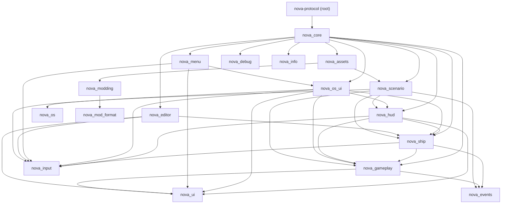
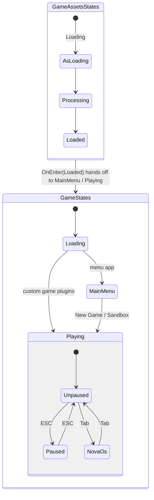
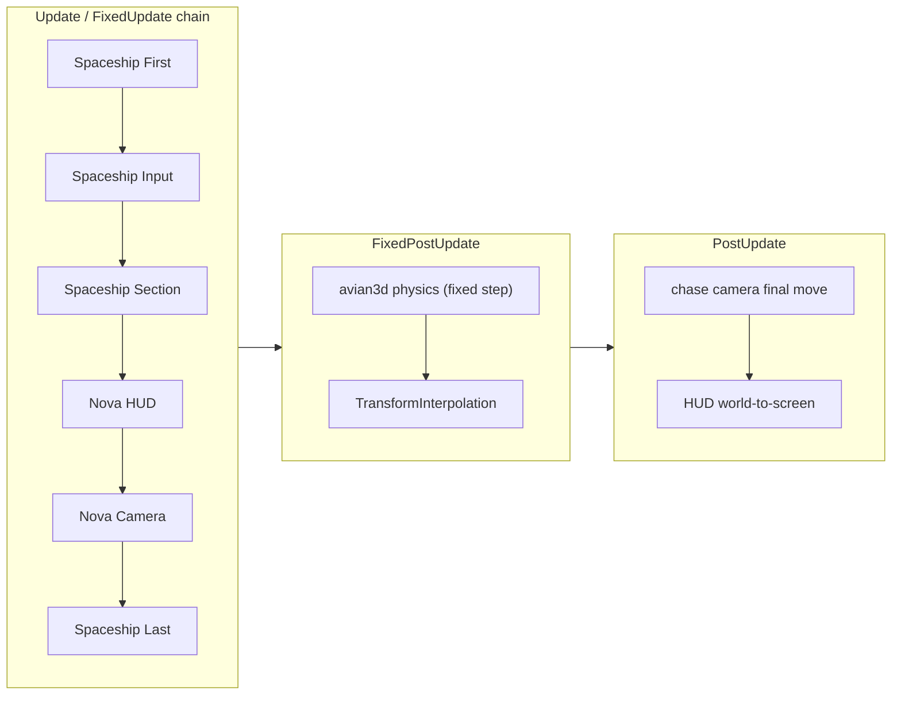

# Architecture

> New to the codebase? Start with the [Project tour](project-tour.md) for a
> faster orientation, then come back here for the detail.

Nova Protocol is a 3D space shooter built on **Bevy 0.19** with **avian3d** physics.
It is a Cargo workspace: the root `nova-protocol` crate is a thin shell and all the
real code lives under `crates/`.

## Crate map

| Crate           | Responsibility |
|-----------------|----------------|
| `nova-protocol` (root) | `src/main.rs` = clap CLI + entrypoint. `src/lib.rs` re-exports `nova_core`. Runnable examples in `examples/`. |
| `nova_core`     | Thin wiring only: `AppBuilder` assembles every plugin (window/log/asset setup, status UI). No gameplay logic. |
| `nova_menu`     | Main menu (owns the `MainMenu` state UI: New Game / Sandbox / Settings / Exit) and the ESC pause overlay. Buttons write `GameMode` and hand off to `Playing`. The Settings modal (audio volume, graphics preset, interface skin, and the Controls tab that REBINDS every action in `nova_input`, one binding group at a time) is shared by both entry points and persisted cross-platform in `settings_store` (RON file / localStorage), keybind overrides included. |
| `nova_editor`   | The ship editor scene (`NovaEditorPlugin`). Comes up on entering `Playing`, only in `GameMode::Sandbox`. |
| `nova_gameplay` | The shared gameplay layer under the ship: `integrity/` (health, the two damage readings `erosion` and `carve`, and the debris a carve leaves in `spew`/`chunk`), `damage`, `gravity` (gravity wells), `markers` (the entity markers the ship tags with and this layer reads), `math`, `audio` (the bus-and-route sound engine every voice in the game goes through: `bus` for the four routes and the three volume tracks, `mixing` for the distance rolloff and the cue throttle, `spatial` for the stereo placement, `voice` for the one playback path), `juice`, `shake`, `settings` (`MasterVolume`/`GraphicsQuality` + apply systems; the per-bus `InterfaceVolume`/`WorldVolume`/`MusicVolume` live in `audio/bus`), `mesh` (the procedural `TriangleMeshBuilder`, plus the `SignedField` an asteroid is meshed from and carved in - nothing here takes a finished mesh apart), `transform`, `relations`, `beacon`, `objectives` (the `GameObjectives` list, its panel and the conveyance tags), `lifetime` (`TempEntity`/`DespawnEntity`), `cooldown`, `plugin`. Also owns `GameStates`, `PauseStates`, and the `GameMode` resource. Knows nothing about a ship. |
| `nova_ship`     | The ship and how it is flown: `sections/` (the modular hull, its ammo, and the authored damage looks in `damage_effects`/`damage_cracks`/`damage_sparks`/`damage_plume`), `input/` (player rigs, the AI pilot and gunner, radar targeting with deliberate lock-on, and the flight and camera action DEFAULTS it registers into `nova_input`), `flight/` (the diegetic controller and its autopilot verbs), `camera/` (the chase-camera controller and the chase/skybox/post/WASD rigs under it), `physics/` (the PD attitude controller) and `ship_audio/` (the soundtrack those five produce). Depends on `nova_gameplay` and never the reverse; `NovaShipPlugin` owns the `SpaceshipSystems` brackets and `nova_core` adds it after `NovaGameplayPlugin`. |
| `nova_hud`      | The flight HUD: one module per widget (crosshairs, target inset, ammo readout, flight status, objective markers, the comms panel, the keybind dock, the screen-indicator projection they all share). Reads gameplay state and never drives it, so the dependency runs `nova_hud -> nova_gameplay`. `nova_core` adds `NovaHudPlugin` render-gated, and the crate places `NovaHudSystems` between the section and camera sets itself. |
| `nova_os`       | NOVA OS logic with no UI in it: the terminal model (`terminal`), the shell command language and typo suggestions (`shell`), and the app runtime seam (`app`). |
| `nova_os_ui`    | The NOVA OS cockpit monitor the player opens with Tab: the CRT casing and shader, the terminal nodes and keyboard/pointer systems (`terminal`), and the two apps that run on it - `map` (schematic local space) and `ship` (schematic player ship). A PEER of the flight HUD, not one of its widgets: `nova_core` adds it, and nothing in `nova_hud` reaches into it (it reads `NovaHudAssets` and `NovaHudSystems`, so it sits ABOVE `nova_hud`). |
| `nova_scenario` | Scenario/modding engine: `events`, `filters`, `actions`, `variables`, `world`, `loader`, `objects/`, `lint/` (the scenario half of the `content -- lint` checks), `render_scale` (the Low-preset resolution lever: scenario view into a reduced offscreen target, upscaled to the window). See [Scenario engine](scenario-system.md). |
| `nova_events`   | Game event kinds and entity identity components, shared between gameplay and scenario. |
| `nova_events_macros` | Procedural macros behind `nova_events`' derives. |
| `nova_assets`   | `bevy_asset_loader` setup. Loads glb/textures/shaders/sounds, and loads the base game's own generated content (`assets/base/`) through the same bundle machinery as mods. Owns the mod merge (`register_bundles`, `EnabledMods`, `ModCatalog`), the portal client and downloads (`portal/`), and prefs persistence. |
| `nova_modding`  | Bundle/content/catalog ASSET LOADERS and the `Content` routing enum. See [Mod files](https://alexjercan.github.io/nova-protocol/create/mod-files/). |
| `nova_mod_format` | Pure serde types for the mod formats (bundle manifests, catalog declarations, the portal wire schema). Engine-free; re-exported by `nova_modding`. The static mod portal is built by `scripts/gen-portal.py`, not a crate. See [Publish a mod](https://alexjercan.github.io/nova-protocol/create/publish-a-mod/). |
| `nova_input`    | The bindings registry, a leaf crate under every rig and every rebind surface: the one table (`InputBindings`) that says which named actions exist, what each is called on screen, and which physical sources it holds, plus the shared capture (`poll::InputSources`) every rebind row reads and the by-name `dispatch`. Owners register their own defaults into it; nothing here knows what an action DOES. |
| `nova_ui`       | Shared UI, a leaf crate everything that renders UI draws from: the theme palette/metrics (`theme::*`), the `UiSkin` visual-language switch (`skin`), the themed widgets (`widget`: button, slider, segmented control, list rows, panel chrome), screen-level composition (`screen`: scrollable viewports and the list-beside-details layout the menu screens and the NOVA OS drawer share), the flight-HUD chip language (`hud`), player-facing unit formatting (`units`), the shared typeface (`font`), the generic `status_bar` and the keyboard-ownership arbiter (`input_mode`: one app-global `InputMode` resolved from per-frame claims, with `InputModeSystems` as the ordering handle every keyboard consumer gates behind). Consumed by `nova_gameplay`, `nova_hud`, `nova_os_ui`, `nova_menu`, `nova_editor` and `nova_assets`. |
| `nova_debug`    | Debug-only plugin (inspector, overlays). Compiled only under the `debug` feature. |
| `nova_info`     | Exposes `APP_VERSION`, injected by `build.rs`. |
| `nova_autopilot` | Scripted automation drivers and the run-completion protocol the harness examples share. Engine-facing but game-agnostic; `nova_debug`, `nova_probe` and `nova_probe_cli` all build on it. See [Automation harness](automation-harness.md). |
| `nova_probe`    | Dev tooling (not in the shipped game): the IN-GAME half of the run-harness - the capability plugins an example wires to collect evidence about its own run (`capabilities::` `frametime`, `timeline`, `invariants`, `snapshot`, `census`, `framecost`, all bundled by `NovaProbePlugin`), the `contract` an example declares, and the wire format the host reads. See [Measuring performance](performance.md) and [Building and running](development.md). |
| `nova_probe_cli` | Dev tooling: the HOST half of the run-harness - spawns autopilot runs as child processes, grades their artifacts (`evaluation`) and renders the reports (`report`). Owns the `cargo run --features debug probe run/report` CLI. The two halves meet at the filesystem: nothing in `nova_probe` reads a run's output back. |
| `nova_perf_web` | The wasm app `probe run --platform web` boots and measures: the real game started into a scenario with the frame-time capture armed. Dev tooling, never shipped. |
| `nova_authoring` | The OFFLINE half of the content pipeline (never shipped): the Rust builders that define every built-in scenario and section, the `content -- gen` serializer that writes them to the committed `assets/base/**/*.content.ron`, and the `content -- lint` walk that validates a content tree. |
| `nova_meta_gen` | Binary under `tools/` (web-build tooling, not a game crate): writes default `.meta` sidecars for web assets that lack one (a Trunk `post_build` hook for `AssetMetaCheck::Always`). Boots a headless Bevy app, so it stays Rust. |

The dependency layering the table describes, from top-level shell down to leaf crates:



The graph is curated for readability, not exhaustive: `nova_core` and `nova_menu`
depend on nearly every crate below them, and edges implied by the layering (for
example `nova_menu -> nova_ship`) are pruned. The authoritative dependency list
for any crate is its `Cargo.toml`. Two edges people guess wrong:

- **`nova_ui` is not menu-only.** Every crate that renders UI draws on it -
  `nova_gameplay` (which adds `NovaUiPlugin` render-gated), `nova_hud` (the
  chip language and screen-indicator styling), `nova_os_ui`, `nova_menu`,
  `nova_editor` and `nova_assets`.
- **`nova_scenario` reaches up into `nova_ship` and `nova_hud`.** It spawns
  ships and drives HUD-facing surfaces (comms dwell limits, target-inset render
  targets), so it sits beside them, not below them.

The dev-tool crates hang off this graph without joining it: `nova_debug` builds
on `nova_autopilot` plus the game crates it inspects; `nova_probe` wires
`nova_core` + `nova_autopilot` into a measurable app; `nova_probe_cli` depends
only on `nova_probe`, `nova_autopilot` and `nova_assets` (it is a host process,
not a game plugin); `nova_perf_web` is `nova_core` + `nova_probe`; and
`nova_authoring` reads half the workspace to build and lint content offline.

Every crate exposes a `pub mod prelude`. Import from the prelude
(`use nova_gameplay::prelude::*`), not from inner modules. `nova_core::prelude`
re-exports all sub-crate preludes, so top-level code and examples usually just do
`use nova_protocol::prelude::*`.

### Generic helpers live here too

The generic, non-Nova Bevy helpers (WASD/chase cameras, skybox, post-processing,
the mesh builder and the signed field, PD controller, health, status bar, the generic game-event queue
`GameEventsPlugin`/`EventWorld`) are nova's own: the camera and transform rigs,
the mesh toolkit in `nova_gameplay`, the camera rigs and the PD controller in
`nova_ship`, the status bar and
tween in `nova_ui`, the event engine in `nova_events`, the inspector and
wireframe layers in `nova_debug`. They live in nova crates on purpose:
splitting a generic layer out before the game is done produces generic-looking
code shaped by one game's needs. Whether any of it deserves extracting is a
question for after the game ships.

`nova_ui::status_bar` is the shape that line is drawn on. It is a generic
readout - a row of value/colour closures over any `Any` subject - and it stays
in the leaf crate. Nova's own damage readout is NOT built on it: it is
diegetic, and every section fractures its own material as its `DamageLevel`
rises (`nova_ship::sections::damage_cracks`), from a vocabulary each section
AUTHORS (`damage_effects`). That readout keys on Nova's section graph, its
authored vocabulary and an extended material, so it is game-specific and is not
a promotion candidate. A generic widget and a diegetic one are different things
at different layers, and the test is whether another game could take it as it
stands.

Boundary policy, from most game-agnostic to most game-specific:

1. The generic-leaning modules named above - reusable Bevy primitives that
   happen to live in a nova crate; keep them free of game-specific types.
2. `nova_gameplay` - the shared gameplay layer, ship-agnostic.
3. `nova_ship` - the ship above that layer.
4. `nova_hud` and `nova_os_ui` - consumers of the ship and of gameplay, above
   both. `nova_os_ui` is above `nova_hud` in turn: it orders itself against
   `NovaHudSystems`.
5. `nova_core` - wiring only.

## App assembly

`AppBuilder` (in `crates/nova_core/src/lib.rs`) is the single place the app is wired:

```rust
AppBuilder::new()                 // Bevy DefaultPlugins + window/log/asset/render setup
    .with_game_plugins(my_plugin) // optional: your own systems/observers
    .build()                      // adds the plugin stack, returns App
```

`AppBuilder::headless()` is the same builder with no wgpu device, no window, no
winit event loop and none of the visual game plugins. Rendering is fixed by the
CONSTRUCTOR rather than by a setter, because `DefaultPlugins` bakes the wgpu and
window settings the moment the builder starts - a later setter could not reach
them. It is one switch and not two because the halves cannot be separated:
`bevy_hanabi` panics without a render sub-app, so dropping the device forces
dropping the plugins that need it.

`build()` inits `GameStates` + `PauseStates`, then adds, in order:
`EnhancedInputPlugin`, `GameAssetsPlugin`, `LoadingScreenPlugin`,
`NovaGameplayPlugin`, `NovaShipPlugin` (the ship orders its sets inside
gameplay's `SpaceshipSystems` brackets, so it comes after), `NovaScenarioPlugin`,
then - render-gated, a headless harness run draws neither - `NovaHudPlugin` and
`NovaOsUiPlugin` (HUD first: the monitor orders itself against
`NovaHudSystems`), then `NovaEditorPlugin` and `NovaMenuPlugin` (both only when
no custom game plugins were supplied - the menu fronts the default app and
nothing else, so an example that brings its own game plugins goes straight
`Loading -> Playing`), and finally `DebugPlugin` under the `debug` feature. On
`OnEnter(GameAssetsStates::Loaded)` it hands off to `MainMenu` (or straight to
`Playing` when the menu is off) and spawns the status UI.

`NovaGameplayPlugin` pulls in avian3d `PhysicsPlugins` (zero gravity, projectile
collision hooks), `bevy_rand`, `bevy_hanabi` particles (on wasm via the WebGPU
backend), `NovaUiPlugin` (render-gated), the transform/lifetime/mesh rigs, and
the shared gameplay sub-plugins: integrity, damage, gravity, relations, audio,
juice, settings. The ship stack (input, sections, flight, camera, physics) is
`NovaShipPlugin`'s, and the HUD is `NovaHudPlugin`'s - both added by
`nova_core`, not by gameplay.

## States

- `GameStates { Loading, MainMenu, Playing }` (`nova_gameplay`) - top-level
  lifecycle. `MainMenu` only occurs when `NovaMenuPlugin` fronts the app (the
  default editor app); examples with custom game plugins go straight
  `Loading -> Playing`. The `GameMode` resource (`Sandbox` default | `NewGame`)
  records what the menu handed off to.
- `PauseStates { Unpaused, Paused, NovaOs }` - the freeze axis. `Paused` is the
  ESC pause overlay; `NovaOs` is the Tab ship-computer takeover (same clock
  freeze, cursor freed, no pause menu). Both frozen variants enter only from
  `Unpaused` and exit back to it, never into each other. `nova_gameplay` owns
  the enum and gates the spaceship sets; `nova_menu` owns the toggle, the
  overlay UI, and the clock freeze (`Time<Virtual>` + `Time<Physics>`). Only
  meaningful inside `Playing`; leaving `Playing` resets it.
- `GameAssetsStates { Loading, Processing, Loaded }` (`nova_assets`) - asset
  pipeline. Scenario setup hooks `OnEnter(GameAssetsStates::Loaded)` - see
  `examples/systems/system_scenario_grammar.rs`.

The top-level lifecycle, the pause overlay nested inside `Playing`, and the asset
pipeline that gates entry:



Leaving `Playing` resets `PauseStates` back to `Unpaused`.

## Frame flow

Gameplay systems run in an explicit chain, configured identically in `Update` and
`FixedUpdate`. `nova_ship::NovaShipPlugin` declares the brackets and the ship
sets; `nova_hud` slots `NovaHudSystems` into the gap itself:

```
SpaceshipSystems::First -> SpaceshipInputSystems -> SpaceshipSectionSystems
    -> NovaHudSystems -> NovaCameraSystems -> SpaceshipSystems::Last
```

- Physics (avian3d) runs in `FixedPostUpdate` on a fixed timestep. Rigid bodies get
  `TransformInterpolation` so rendering stays smooth between physics ticks.
- `PostUpdate` hosts the chase camera's final move and the HUD's world-to-screen
  projection, ordered after it.
- While `Paused`, the input and section sets are gated off and the clocks freeze.
- `PreUpdate` hosts `nova_ui`'s `InputModeSystems`, which resolves that frame's
  `ClaimKeyboard` messages into the one `InputMode` every keyboard system then
  gates on. A claimant writes its claim `.before(InputModeSystems)`; a consumer
  reads the resolved mode with `in_input_mode`, `in_input_mode_at_most` or
  `owns_or_enters`.

The render-rate chain (run in both `Update` and `FixedUpdate`) versus the
fixed-timestep physics step and the interpolation that smooths rendering between
ticks:



### Update vs FixedUpdate - which schedule does my system go in?

The chain above is configured IDENTICALLY in `Update` and `FixedUpdate`
(`nova_ship::NovaShipPlugin`, two `configure_sets` calls with the same set order),
so a gameplay set can host systems in either schedule. The split is not
cosmetic: since every dynamic body opted into avian's `TransformInterpolation`,
the game carries two pose representations on two clocks:

- **Raw physics pose** -- avian `Position`/`Rotation`, advanced on the 64 Hz
  `FixedUpdate` tick. This is the truth the simulation integrates.
- **Render pose** -- `Transform`, eased between the previous and current physics
  states, with `GlobalTransform` propagated from it in `PostUpdate`.

Which schedule:

- Put a system in **FixedUpdate** when it feeds the physics sim -- forces and
  impulses, spawns whose motion the fixed clock advances (torpedoes, which
  physics integrates; gun rounds, which `nova_gameplay::rounds` sweeps by hand
  after the physics step), guidance. It
  MUST read the raw `Position`/`Rotation` (or compose the root's raw pose with a
  local mount offset). During `FixedUpdate` of frame N, `GlobalTransform` still
  holds the eased pose propagated in frame N-1's `PostUpdate`, so it is stale
  render state here; the avian child-collider pose is one tick stale too.
- Put a system in **Update** (or `PostUpdate`) when it consumes the rendered
  frame -- camera, HUD world-to-screen projection, effects. It reads the eased
  `Transform`/`GlobalTransform`, and every pose in one on-screen computation must
  come from the same frame. A consumer of `PostUpdate`-written state must be
  ordered after its producer.
- Put a system in **FixedUpdate** when what it computes DECIDES a fixed-step
  consequence, **even when the same value is also drawn**. This is the rule that
  is easiest to get wrong, because such a system looks like render-rate work: it
  has an on-screen output, so it reads as belonging beside the camera and the
  HUD. Ask instead whether anything on the fixed clock BRANCHES on what it
  writes. If it does, the state that branch samples advances once per FRAME
  while the branch is taken once per STEP, and the outcome is a function of the
  host's frame rate.

Why gameplay is split across both: the chain runs in `Update` for
render-rate work and in `FixedUpdate` for sim-rate work; the same set order in
both keeps ordering consistent wherever a system lands.

The fixed loop runs on the SINGLE-THREADED executor (`AppBuilder::assemble`), so
a `FixedUpdate` system gets no parallelism from its neighbours - only from its
own `par_iter`. That is a deliberate trade for the schedules' size; the number
behind it is in [Measuring performance](performance.md#the-fixed-loop-is-single-threaded-on-purpose).

What breaks if a system lands in the wrong schedule -- worked example: a
`FixedUpdate` system reading `GlobalTransform`. `thruster_impulse_system` used to
apply its impulse at the thruster child's `GlobalTransform`, i.e. the previous
frame's eased pose, up to ~2 ticks of ship motion behind the raw physics it was
pushing, while taking thrust DIRECTION from the raw `Rotation` -- mixing both
clocks in one impulse. The application-point error is proportional to velocity;
at speed a COM-centered engine developed an uncompensated lever arm the throttle
balancer could not see, and the measured failure was a zero-true-torque lateral
engine spinning the hull to 7.1 rad/s in 15 frames (0 rad/s after reading the raw
pose). The fix (`thruster_section.rs`, see the comment above `apply_linear_impulse_at_point`)
composes both application point and thrust direction from the root's raw
`Position`/`Rotation`. The same footgun produced the bullet-spew, HUD-jitter and
crosshair-twitch bugs in that family; all were error proportional to velocity,
which is why they only showed at high speed.

Worked example for the third rule -- a DRAWN value that gates a fixed-step
branch. A turret's aim chain solved the intercept, drove the hinges and wrote
the joint pose in `PostUpdate`, which is where a thing you can see belongs. But
`shoot_spawn_projectile` runs in `FixedUpdate` and asks, per tick, whether the
muzzle is inside a 0.92 deg cone of that aim point. The barrel's pose was
therefore a staircase with one step per FRAME, its tracking residual scaled with
the frame period, and the cone is narrower than the residual's span: measured on
`stress_point_defense`, the battery held its trigger 9.7% of the time at 20 fps
and 60.6% at 106 fps -- same scene, same seed, a six-fold difference in how
strong point defence was. Moving the whole chain (solve, hinge controller, joint
sync) onto the fixed clock made the trigger duty 0.811-0.817 across the same
span. Nothing about the aim chain looked like sim work; the tell was that a
`FixedUpdate` system branched on its output.

Cross-system communication goes through events and observers (Bevy `On<...>`
observers, e.g. the integrity/destruction chain) rather than direct calls. Prefer
adding an event/observer over coupling two systems.

## Assets

`assets/` is **runtime-only** - everything the game actually loads: `shaders/`
(`.wgsl`), `icons/`, `sounds/` (UI chrome: menu clicks + objective chimes),
and the `base/`/`mods/` data (`.ron`). The base game's own art and world audio
live UNDER `assets/base/` (exported `gltf/` models `.glb`, `textures/`,
`sounds/` `.wav` world cues, `banner.png`), referenced by base content with
`self://` and by mods with `dep://base/<path>`. It is the whole directory the
web (Trunk `copy-dir`) and native (`release.yaml`) builds ship, so non-runtime
files must not live here. The Blender SOURCES the `gltf/` models are exported
from live OUT of the shipped tree, in top-level `art/blender/`, because nothing
loads them at runtime. The built-in sections, ships, styles, scenarios and
campaigns ARE data: the Rust builders under
`crates/nova_authoring/src/base_content/` (`sections/`, `ships/`, `styles.rs`,
`scenarios/`, `campaigns.rs`, `assets.rs`) are the single source, and
`cargo run content gen` serializes them to the
committed `assets/base/**/*.content.ron` the game loads like any other bundle.
Never hand-edit the generated files; edit the builders and re-run `gen`.

## Find it in the code

- App assembly, plugin order: `AppBuilder` - `crates/nova_core/src/lib.rs`;
  game binary and CLI flags - `src/main.rs`.
- States: `GameStates`, `PauseStates`, `GameMode` -
  `crates/nova_gameplay/src/lib.rs`; ESC overlay and clock freeze -
  `crates/nova_menu/src/pause.rs`.
- Frame-flow sets: `SpaceshipSystems` - `crates/nova_gameplay/src/plugin.rs`;
  chained in `Update` + `FixedUpdate` by `NovaShipPlugin` -
  `crates/nova_ship/src/lib.rs`.
- Who owns the keyboard: `InputMode`, `ClaimKeyboard` and `InputModeSystems` -
  `crates/nova_ui/src/input_mode.rs`; the editor's claimant -
  `declare_editor_keyboard_owner` in `crates/nova_editor/src/lib.rs`.
- The two damage readings: `DamageLevel` -
  `crates/nova_gameplay/src/integrity/erosion.rs`; `DamageMarks` and the carve
  cost model - `crates/nova_gameplay/src/integrity/carve.rs`.
- Asset gate and mod merge: `GameAssetsPlugin` -
  `crates/nova_assets/src/plugin.rs`; `register_bundles` -
  `crates/nova_assets/src/merge.rs`.
- API detail: `cargo doc --open -p nova_core` (any crate from the map works).
