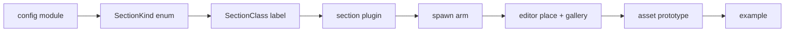

# Add a ship section

Ship-section kinds are a CLOSED enum. There is no data-driven registry for
them: `SectionKind` (`crates/nova_ship/src/sections/base_section.rs`) is a
Rust enum, every match on it is exhaustive, and the compiler will not let you
land a new variant until every site handles it. Adding a kind is a fixed
sequence of ~10 edits across `nova_ship`, `nova_gameplay`, `nova_scenario`,
`nova_editor`, `nova_os_ui`, and `nova_authoring`,
ending at a runnable example.

## Why it is closed

Section kinds are first-class engine concepts, not content. Each kind carries
its own typed config, its own spawn bundle, its own behavior systems, and its
own arm in every exhaustive match over section kinds -- none of which a RON
author could supply. What IS data-extensible is the section CATALOG: a `SectionConfig`
(base stats + one `SectionKind` instance) is authored in RON and loaded at
runtime (see the [Ship sections](sections.md) reference and
[modding](https://alexjercan.github.io/nova-protocol/create/sections/)). New KINDS are code; new INSTANCES of an existing
kind are data. This guide is about the former.

The closed enum is a feature: it means "did I wire the new kind into the ship
computer / the editor / spawning?" is a compile error, not a silent gap.



## Checklist

Do these in order. Steps 2-7 will not compile until the ones before them exist,
and the exhaustive matches force you through 3-7 once the enum has the variant.

Replace `<kind>` / `<Kind>` below with your section name (e.g. `shield` /
`Shield`).

1. **New config module.**
   Create `crates/nova_ship/src/sections/<kind>_section.rs`, modelled on
   `hull_section.rs` (simplest) or `turret_section/` (a multi-file module:
   behavior + FixedUpdate systems). It defines: a `<Kind>SectionConfig` struct, a `<kind>_section`
   bundle fn, a `<Kind>SectionMarker` component, a `<Kind>SectionPlugin`, and a
   `prelude` re-exporting them. The bundle MUST insert the marker and the
   `SectionClass` for the kind:

   ```rust
   pub fn shield_section(config: ShieldSectionConfig) -> impl Bundle {
       (
           ShieldSectionMarker,
           SectionClass::Shield,
           // ... kind-specific render/behavior components
       )
   }
   ```

   Any distance, speed or acceleration on `<Kind>SectionConfig` is typed
   `Meters`, `MetersPerSecond` or `MetersPerSecondSquared` (`nova_events::units`)
   and never a bare `f32` - a reach, a blast radius, a muzzle speed. The type is
   what documents the unit for the RON author and what the editor stamps the
   row's `m` / `m/s` / `m/s2` from, and `to_engine()` where the value reaches
   Bevy or avian is the one crossing. What stays a bare `f32` is what the engine
   owns: a collider extent or a build-grid offset, which are cells. See
   [Units and scale](architecture.md#units-and-scale).

   Then register the module in `crates/nova_ship/src/sections/mod.rs`: add
   `pub mod <kind>_section;` and re-export `<kind>_section::prelude::*` in the
   module `prelude`.

2. **Add the enum variant.**
   In `crates/nova_ship/src/sections/base_section.rs`, add the variant to
   `SectionKind` (grep for `enum SectionKind`):

   ```rust
   pub enum SectionKind {
       Hull(HullSectionConfig),
       Thruster(ThrusterSectionConfig),
       Controller(ControllerSectionConfig),
       Turret(TurretSectionConfig),
       Torpedo(TorpedoSectionConfig),
       Shield(ShieldSectionConfig),
   }
   ```

3. **Section class.**
   Add the variant to `SectionClass` in
   `crates/nova_gameplay/src/damage.rs` (grep for `enum SectionClass`). It is a
   LABEL, not a damage key -- there is no resistance table, so there is nothing
   else to fill in on the damage NUMBER. How much a section takes is its
   `health`; how far a round gets through it is the travel rule, which reads
   `Health.max` and never the class. What the section LOOKS like as it is
   damaged is a separate, authored decision - step 8.

   The NOVA OS ship app labels sections by this enum: add an arm to the
   exhaustive matches `code_prefix`, `kind_glyph`, `kind_description` and
   `kind_index` in `crates/nova_os_ui/src/ship/sections.rs`, and to
   `section_kind_label` in `crates/nova_os_ui/src/terminal/content.rs`.

4. **Wire the section plugin.**
   In `crates/nova_ship/src/sections/mod.rs`, add your plugin to the
   `add_plugins((...))` tuple in `SpaceshipSectionPlugin::build` (grep for
   `impl Plugin for SpaceshipSectionPlugin`),
   passing the `render` flag like the others:

   ```rust
   <kind>_section::ShieldSectionPlugin {
       render: self.render,
   },
   ```

5. **Spawn arm.**
   In `crates/nova_scenario/src/objects/spaceship.rs`, add a match arm to
   `insert_spaceship_sections` (grep for it, then its `match &config.kind`). At
   minimum insert the kind bundle; add input-binding handling only if your kind
   needs it (see the `Turret` / `Thruster` arms for that pattern):

   ```rust
   SectionKind::Shield(shield_config) => {
       section_entity.insert(shield_section(shield_config.clone()));
   }
   ```

   This is the production spawn path; see the [Scenario engine](scenario-system.md)
   for how the spaceship object and its section observer fit together.

6. **Editor placement arms.**
   Two exhaustive matches, in two files. `default_binds_for`
   (`crates/nova_editor/src/placement.rs`) gives the kind its default key/pad
   binding, or `vec![]` if it takes none - model `Hull` for unbindable,
   `Thruster` or `Turret` for bindable. `insert_preview_section`
   (`crates/nova_editor/src/preview.rs`) inserts the `<kind>_section(...)`
   bundle beside the shared `preview_section(...)` recipe, plus the kind's
   input-binding component if it has one.

   Nothing here computes a placement POSE. The editor mates link points
   (`snap_placement`, `nova_ship::sections::link_points`), so orientation comes
   from the two sockets, not from the kind - which is what lets a part mate the
   same way up on any socket. Recording the placed section into
   `player_config.sections` is likewise generic
   (`register_preview_section`), so the arms only insert.

7. **Parts gallery category + readouts.**
   In `crates/nova_editor/src/gallery/catalog.rs`, add a `GalleryCategory`
   variant (with its `ROW` entry, `label()` and `accepts()` arms), then arms to
   `kind_label()` and `behaviour()`. All of them match `SectionKind`
   exhaustively, so the compiler walks you through it:

   ```rust
   // accepts
   Self::Shields => matches!(kind, SectionKind::Shield(_)),
   // kind_label - the tile's category line
   SectionKind::Shield(_) => "shields",
   // behaviour - the two or three numbers a builder picks the part BY
   SectionKind::Shield(shield) => {
       vec![("capacity".to_string(), format!("{:.0}", shield.capacity))]
   }
   ```

8. **Asset prototype.**
   In `crates/nova_authoring/src/base_content/sections/standard.rs`, add a
   `SectionConfig` to `standard_section_prototypes()` so the catalog ships a
   ready-to-place
   instance. Give it a stable snake_case `id` (this is what
   `sections.get_section("...")` and RON authors reference). The id is a
   runtime STRING that nothing type-checks: keep it a literal beside the
   builder, and promote it to a `const` in
   `crates/nova_ship/src/sections/catalog_ids.rs` only when a crate that cannot
   reach `nova_authoring` has to name it.

   ```rust
   SectionConfig {
       base: BaseSectionConfig {
           id: "basic_shield_section".to_string(),
           name: "Basic Shield Section".to_string(),
           description: "A basic shield section for spaceships.".to_string(),
           health: 100.0,
           damage_effects: DamageEffects(vec![DamageEffect::Cracks, DamageEffect::Sparks]),
           ..default()
       },
       kind: SectionKind::Shield(ShieldSectionConfig { /* ... */ }),
   },
   ```

   `damage_effects` is a real design decision per kind, not boilerplate. The
   shipped rule: a hull authors nothing (defaulting to `[Cracks]`), anything
   carrying machinery adds `Sparks`, and a thruster adds `Plume` on top. Pick by
   what the part IS - a turret is all function and fails by sparking, a hull
   has nothing but material to lose. The rule the vocabulary is kept honest by:
   no section loses geometry, so every effect is a material or a particle. See
   [Ship sections internals](sections.md#the-authored-looks).

   If your config needs a render-mesh `AssetRef`, add a field to
   `BaseContentAssets` and its `from_paths()` in
   `crates/nova_authoring/src/base_content/assets.rs`.

   The builders do not feed the game directly: regenerate the committed RON
   with `cargo run content gen` and commit
   `assets/base/sections/base.content.ron` with the code change - the
   `content_ron_parity` test fails on drift.

9. **Example.**
   Add `examples/systems/<what it proves>.rs`, modelled on the existing
   per-section ranges (`system_attitude_hold.rs` and
   `system_thrust_and_plume.rs` are the most compact), plus its
   `[[example]]` block in the root Cargo.toml (auto-discovery is off; the
   catalog is the source of truth) - `catalog_matches_disk` in
   `crates/nova_probe_cli/tests/catalog_drift.rs` fails until disk and catalog
   agree, and `systems_ranges_assert_their_invariant_roster` beside it fails
   until the new range has a named invariant roster. The example builds a minimal
   `ScenarioConfig` (a controller + your section), triggers
   `LoadScenario(...)`, and under `--features debug` drives an autopilot probe
   that asserts the kind's behavior end to end. Run it:

   ```text
   NOVA_AUTOPILOT=1 cargo run --example <what it proves> --features debug
   ```

## Done

The compiler is your checklist enforcer for 2-7: if it builds, every
exhaustive match handles the new kind. Steps 1, 8, and 9 are the ones with no
compile-time backstop -- the module wiring, the catalog instance, and the
runnable proof -- so double-check those by hand.

## Find it in the code

- The enum and base config: `SectionKind`, `BaseSectionConfig` -
  `crates/nova_ship/src/sections/base_section.rs`; model modules
  `hull_section.rs` (minimal) and `turret_section/` beside it.
- Class label: `SectionClass` - `crates/nova_gameplay/src/damage.rs`; NOVA OS
  label matches - `crates/nova_os_ui/src/ship/sections.rs`.
- Spawn arm: `insert_spaceship_sections` -
  `crates/nova_scenario/src/objects/spaceship.rs`.
- Editor arms: `default_binds_for` - `crates/nova_editor/src/placement.rs`;
  `insert_preview_section` - `crates/nova_editor/src/preview.rs`;
  `GalleryCategory` - `crates/nova_editor/src/gallery/catalog.rs`.
- Cross-crate prototype ids: `crates/nova_ship/src/sections/catalog_ids.rs`.
- Prototypes: `standard_section_prototypes` -
  `crates/nova_authoring/src/base_content/sections/standard.rs`.
- API detail: `cargo doc --open -p nova_ship`.
