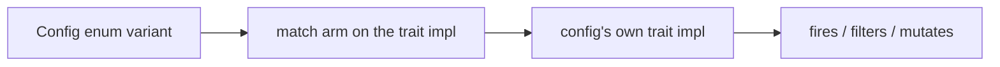

# Extend the scenario engine

The scenario engine is config-open but code-closed. Authoring a scenario in RON
from the primitives that already exist is a data change and lives in its own
guide (see [Create your first scenario](https://alexjercan.github.io/nova-protocol/create/author-a-scenario/)). Adding a NEW
primitive - a new event, filter, action, or object kind - is a Rust change, and
each of the four follows one repeated recipe: define the config, wire it into
the matching dispatch enum, add the arm on the trait impl that fans out to it,
and export it. This is the "how to add" companion to
[Scenario engine](scenario-system.md) (the "what it is" reference); read that
first for the vocabulary (`NovaEventWorld`, handlers, filters, actions, scoped
objects).

The dispatch shape is identical everywhere: an enum variant carries a config
struct, a `match` arm on the trait impl delegates to that config's own impl.



## The NovaEventWorld seam

Read this once; recipes 2 and 3 depend on it. Filters and actions never touch
the Bevy `World` directly. They see only `NovaEventWorld`
(`crates/nova_scenario/src/world.rs`), the resource that holds scenario state:
variables, objectives, `next_scenario`, and a queue of deferred command
closures. What a filter or action may touch:

- `world.get_variable(key)` / `world.insert_variable(key, VariableLiteral)` -
  the typed scenario variables.
- `world.push_objective(ObjectiveActionConfig)` /
  `world.remove_objective(id)` - HUD objectives (synced write-on-diff into
  `GameObjectives`).
- `world.next_scenario = Some(NextScenarioActionConfig { .. })` - queue a
  scenario switch.
- `world.push_command(|commands| ...)` - defer anything that needs real world
  access (spawning, querying entities, resource mutation). The closure gets a
  `&mut Commands`; for a full `&mut World` (id -> Entity lookups) queue a
  `commands.queue(move |world: &mut World| ...)` inside it, the shape
  `DespawnScenarioObjectActionConfig` uses.

Nothing runs against the world synchronously. Each frame
`NovaEventWorld::state_to_world_system` (in `world.rs`) syncs objectives into
`GameObjectives`, runs a queued non-lingering `NextScenario` switch, then drains
the command queue - so every `push_command` closure lands at frame end, in
order. The unit tests in the `actions/` submodules exercise exactly this:
mutate a `NovaEventWorld`, call
`NovaEventWorld::state_to_world_system(&mut world)` to
drain, then assert on the world (see
`despawn_action_removes_the_scoped_object_by_id` in `actions/spawn.rs`).

## Recipe 1: add an event kind

An event is fired somewhere in the engine, and scenarios react to it through a
handler. Adding one is two files: the event type (`nova_events`) and its config
variant (`nova_scenario`), plus the firing site.

1. In `crates/nova_events/src/lib.rs` define the marker event and its info
   struct with the `EventKind` derive. The info is what a handler's filters
   read; give it the pair shape (`id`, `other_id`, `other_type_name`) if it
   targets an object so the `Entity` filter composes like the others.

   ```rust
   #[derive(Debug, Clone, EventKind, Reflect)]
   #[event_name("ondocked")]
   #[event_info(OnDockedEventInfo)]
   pub struct OnDockedEvent;

   #[derive(Debug, Clone, serde::Serialize, serde::Deserialize, Default, Reflect)]
   pub struct OnDockedEventInfo {
       #[serde(rename = "id")]
       pub id: String,
       #[serde(rename = "other_id")]
       pub other_id: String,
       #[serde(rename = "other_type_name")]
       pub other_type_name: String,
   }
   ```

   Export both from the `nova_events` prelude (the `pub use super::{...}` block
   at the top of `lib.rs`).

2. In `crates/nova_scenario/src/events.rs` add a ROW to the
   `scenario_events!` table near the bottom of the file. The enum, the
   `From<EventConfig> for EventHandler<NovaEventWorld>` arm, `ALL`, `COUNT`,
   `name` and `label` are all generated from it - do not hand-edit any of
   them, and do not edit the macro body above the table:

   ```rust
   scenario_events! {
       // ...
       /// Fires once when a ship docks (`id` = the dock, other = the ship).
       OnDocked => OnDockedEvent { label: "On Docked" },
   }
   ```

   The doc comment on the row is the one a reader gets; the `label` is the row
   the editor's trigger menu lists it under.

3. Fire it. Engine-driven events fire from `crates/nova_scenario/src/loader/`
   with `commands.fire::<OnDockedEvent>(OnDockedEventInfo { .. })` (see the
   `OnStart` site in `loader/lifecycle.rs`, `OnUpdate` in `loader/clock.rs`, and
   orbit-lifecycle/the lock events in `loader/trackers.rs`); object-local events (an
   area entering/leaving) fire from the object's own observer, the way
   `objects/area.rs` fires `OnEnterEvent` from its own trigger. A kind may also
   fire from a system it owns: `objects/asteroid_carve.rs` fires
   `OnDestroyedEvent` out of `carve_asteroid_fields` when a rock's field is
   exhausted, because "destroyed" there is a geometry test rather than a
   health-zero marker.

`EventConfig` is `Copy` and derives serde, so the new variant is authorable from
RON with no extra work.

## Recipe 2: add an event filter

A filter gates whether a handler's actions run; all filters on a handler must
pass. Everything lives in `crates/nova_scenario/src/filters.rs`.

1. Define the config struct and its `EventFilter<NovaEventWorld>` impl. `filter`
   returns a bool and may read `world` (variables) and `info` (the fired event
   data); it must not mutate.

   ```rust
   #[derive(Clone, Debug)]
   #[cfg_attr(feature = "serde", derive(serde::Serialize, serde::Deserialize))]
   pub struct VariablePresentFilterConfig {
       pub key: String,
   }

   impl EventFilter<NovaEventWorld> for VariablePresentFilterConfig {
       fn filter(&self, world: &NovaEventWorld, _: &GameEventInfo) -> bool {
           world.get_variable(&self.key).is_some()
       }
   }
   ```

2. Add the variant to `EventFilterConfig` (grep for `enum EventFilterConfig`)
   and the arm to `impl EventFilter<NovaEventWorld> for EventFilterConfig` (grep
   for `impl EventFilter<NovaEventWorld> for EventFilterConfig`):

   ```rust
   pub enum EventFilterConfig {
       Entity(EntityFilterConfig),
       Conditional(ConditionalFilterConfig),
       Expression(ExpressionFilterConfig),
       VariablePresent(VariablePresentFilterConfig),
   }

   // in the filter match:
   EventFilterConfig::VariablePresent(config) => config.filter(world, info),
   ```

3. Export the config struct from the module `prelude` (the `pub use super::{...}`
   block at the top of `filters.rs`).

4. Make it authorable in the editor (see [Two surfaces author the
   vocabulary](#two-surfaces-author-the-vocabulary)): derive `Reflect` on the
   config, tag any string that names something with the [`Names`
   attribute](scenario-system.md#the-vocabulary-and-who-documents-it), and add
   the `FilterChoice` variant in `crates/nova_editor/src/event.rs` -
   `ALL`, `label`, `stem`, `operands`, `stock`, plus the `filter_choice`,
   `filter_config` and `filter_config_mut` arms. The matches are exhaustive, so
   the compiler names every one of them.

## Recipe 3: add an event action

An action runs when a handler passes, in order. Everything lives in
`crates/nova_scenario/src/actions/`: the TABLE in `actions/mod.rs`, the macro
that reads it in `actions/registry.rs`, and each action's config and impl in
the submodule for what it touches (`audio.rs`, `cinematic.rs`, `flow.rs`,
`mission.rs`, `sequence.rs`, `ship.rs`, `spawn.rs`, `timer.rs`, `view.rs`).

`EventActionConfig` is GENERATED. `scenario_actions!` turns one table row into
the enum arm, the dispatch, the creative-map class, the reflected payload
accessor and the whole authoring-menu surface. Four things it cannot generate
are yours: the payload struct, the editor's stock value, the lint arm if the
action names anything, and the docs.

1. Define the config struct and its `EventAction<NovaEventWorld>` impl.
   `fn action(&self, world: &mut NovaEventWorld, info: &GameEventInfo)` mutates
   the seam and nothing else - use `world.insert_variable`, `world.push_objective`,
   `world.next_scenario`, or `world.push_command(...)` for world access. Anything
   needing an id -> Entity lookup queues a `commands.queue(move |world: &mut World| ...)`
   inside the pushed command, scoped with `With<ScenarioScopedMarker>` (a raw id
   match would also hit ship sections that carry `EntityId`).

   ```rust
   #[derive(Clone, Debug)]
   #[cfg_attr(feature = "serde", derive(serde::Serialize, serde::Deserialize))]
   pub struct VariableClearActionConfig {
       pub key: String,
   }

   impl EventAction<NovaEventWorld> for VariableClearActionConfig {
       fn action(&self, world: &mut NovaEventWorld, _: &GameEventInfo) {
           world.insert_variable(self.key.clone(), VariableLiteral::Boolean(false));
       }
   }
   ```

2. Add a ROW to the `scenario_actions!` table in `actions/mod.rs`. Rows are in
   the order an authoring menu lists them - mission surface, then the world,
   then the ships in it, then the run's own flow, authoring aids last - and
   that order IS `ActionTag::ALL`, so put the row where the action belongs in
   the menu:

   ```rust
   registry::scenario_actions! {
       // ...
       /// Clear a scenario variable back to false.
       VariableClear(VariableClearActionConfig) {
           label: "Variable Clear",
           stem: "clear",
           effect: Bookkeeping,
           inspect: Reflect,
       },
   }
   ```

   The two fields worth thinking about:

   - `effect` is the creative-map class. `Bookkeeping` touches only scenario
     state and presentation; `Injection` reaches into the simulation in a way
     playing could not have produced, and the badge reports it by name;
     `Nested` means the class is whatever the actions it schedules are worth.
   - `inspect` is `Reflect` for every action but one: the editor draws the
     payload's fields from the reflection. `Opaque` is for a payload the editor
     lifts into its own tree and draws itself, which today is only a beat chain.

   If the action NESTS other actions, it also needs an arm in
   `EventActionConfig::step_chain` and `step_chain_mut` (`actions/mod.rs`).
   That is the one place a nesting arm is declared, and every walker in the
   tree - the lint, the frame grouping, `walk`, `walk_mut` - reads it. Adding
   the arm is the whole job; missing it is a bug that only shows up in the
   walker nobody thought about.

3. Export the config struct from the `actions/mod.rs` `prelude` block.

4. Make it authorable in the editor: derive `Reflect` and tag the naming
   strings, as in recipe 2. The editor's list is not its own -
   `ActionChoice` is a type alias for the scenario crate's `ActionTag`
   (`crates/nova_editor/src/event.rs`), so `ALL`, `label` and `stem` come off
   the table row you just wrote and there is no second list to keep in step.
   What the editor still owes you is one arm in `ActionChoiceExt::stock`: the
   value a freshly added action starts life as, with every id field EMPTY.
   The match is exhaustive, so the compiler asks for it.

   A leaf action needs nothing else from the tree. An action the editor holds
   as more than a leaf - because its steps are child NODES, or because its
   panel shows a head rather than the whole payload - is an `ActionKind`
   variant of its own, and owes arms in `action_config`, `action_config_mut`
   and `action_choice` beside it. `Sequence` and `Cinematic` are there because
   their steps are children; `VariableSet` because its panel is a head. All
   three matches are exhaustive.

5. Lint it, if it names anything. An action that carries an id, a channel or a
   file reference needs an arm in `crates/nova_scenario/src/lint/` so an
   unresolvable name is an error at lint rather than a surprise at load. This
   is the fourth thing the table cannot generate.

Templates: the tests at the bottom of the `actions/` submodules are the
pattern to copy -
`despawn_action_removes_the_scoped_object_by_id` (`actions/spawn.rs`; queued
world lookup, scoped),
`hint_emphasis_actions_drive_the_resource` (`actions/mission.rs`; resource
mutation through the drain),
`objective_marker_attach_and_detach_drive_the_component` (`actions/mission.rs`;
component insert/remove).
Each fires the action into a `NovaEventWorld`, drains with
`NovaEventWorld::state_to_world_system`, then asserts.

## Recipe 4: add a scenario object kind

A scenario object is a scoped entity spawned by `SpawnScenarioObject`; the
kind decides its own body (or none - four of the six shipped kinds are
static). Model it on `crates/nova_scenario/src/objects/beacon.rs` or
`salvage.rs`. Do NOT model it on the asteroid: it is the least representative
kind in the directory, split across three modules with two plugins, carrying no
`Health` and outside the integrity graph entirely.

> A kind is not required to be a physical body. `beacon.rs` declares
> `RigidBody::Static` (the base bundle supplies no body), and `light.rs` is a
> pure-render kind: it splits config from component with an `Add` observer so the `render`
> flag can skip the Bevy light entirely for headless tools. Note that scene
> lighting itself is authored content - a scenario with no `Light` object
> renders black, so any new example or fixture that renders needs one.

1. Add the type-name const to `crates/nova_events/src/lib.rs`, beside
   `EntityTypeName` and the other `*_TYPE_NAME` values, and export it from that
   crate's prelude. It goes there, not beside the object, because a reader that
   matches on it - `nova_os_ui`'s map, `nova_gameplay` - must not depend on
   `nova_scenario` to name a kind (CONVENTIONS, Nova 5).

   ```rust
   /// [`EntityTypeName`] value for an authored mine.
   pub const MINE_TYPE_NAME: &str = "mine";
   ```

2. Create `crates/nova_scenario/src/objects/<kind>.rs`. It holds a config struct,
   a marker component, a `<kind>_scenario_object(config) -> impl Bundle`
   builder, and (optionally) a `Plugin` for any observers/systems the kind needs.
   The bundle carries the marker plus an `EntityTypeName`; the shared
   `base_scenario_object` (id, name, transform, visibility,
   `ScenarioScopedMarker`) is added by the spawn path, not here. It
   deliberately carries NO body - each kind declares its own `RigidBody` (the
   asteroid adds `Dynamic` + `TransformInterpolation`; four of the six kinds
   are static).

   Every distance, speed or acceleration the config carries is `Meters`,
   `MetersPerSecond` or `MetersPerSecondSquared` (`nova_events::units`), never a
   bare `f32`: the TYPE is what says what the number means, it is what the
   editor stamps a row's unit from, and `to_engine()` at the spawn site is the
   one place it becomes a Bevy or avian number. A vector position is `Meters3`.
   The exception, and the only one, is a value the engine owns outright - a
   build-grid cell, a collider extent. See
   [Units and scale](architecture.md#units-and-scale).

   An authored field NAMES its value. A config that carries a `String` id has
   one table that says which ids exist, and an id that table does not know is
   an error at the earliest point that can see it - a `content lint` error
   first, a loud refusal on the load path second. It is never resolved to a
   house answer. An `Option` is right only where absence is a documented
   OVERRIDE with runtime-derived behavior behind it, and the field's own doc
   comment says what the absence MEANS: `AsteroidConfig::mass` (absent = the
   global rule about which radii are wells) and `lock_signature` (absent = the
   radius) are the shipped precedent. `AsteroidConfig::material` is the
   counter-example: it is a plain required `String`, because "how is this rock
   shaded" has no runtime answer to fall back on.

   ```rust
   #[derive(Component, Clone, Debug, Reflect)]
   pub struct MineMarker;

   #[derive(Clone, Debug)]
   #[cfg_attr(feature = "serde", derive(serde::Serialize, serde::Deserialize))]
   pub struct MineConfig {
       /// Trigger radius.
       pub radius: Meters,
       pub damage: f32,
   }

   pub fn mine_scenario_object(config: MineConfig) -> impl Bundle {
       (
           MineMarker,
           EntityTypeName::new(MINE_TYPE_NAME),
           // ... the kind's own components
       )
   }

   pub mod prelude {
       pub use super::{mine_scenario_object, MineConfig, MineMarker};
   }
   ```

3. Register the module in `crates/nova_scenario/src/objects/mod.rs`: add
   `pub mod <kind>;`, re-export `<kind>::prelude::*` from the `mod.rs` prelude,
   and if the kind has a plugin add it in `ScenarioObjectsPlugin::build` (like
   `AsteroidPlugin`, which takes `render`).

4. In `crates/nova_scenario/src/actions/spawn.rs` add the variant to
   `ScenarioObjectKind` (grep for `enum ScenarioObjectKind`) and the spawn arm in
   `impl EventAction<NovaEventWorld> for ScenarioObjectConfig`:

   ```rust
   pub enum ScenarioObjectKind {
       Asteroid(AsteroidConfig),
       Spaceship(SpaceshipConfig),
       Beacon(BeaconConfig),
       SalvageCrate(SalvageCrateConfig),
       Light(LightConfig),
       Mine(MineConfig),
   }

   // in the spawn match:
   ScenarioObjectKind::Mine(config) => {
       entity_commands.insert(mine_scenario_object(config.clone()));
   }
   ```

The new kind is now spawnable from any handler, in RON, as a
`SpawnScenarioObject` action:

```ron
SpawnScenarioObject(ScenarioObjectConfig(
    base: BaseScenarioObjectConfig(
        id: "mine_1",
        name: "Proximity Mine",
        position: (0.0, 0.0, -2000.0),
        rotation: (0.0, 0.0, 0.0, 1.0),
    ),
    kind: Mine(MineConfig(radius: 50.0, damage: 40.0)),
))
```

## Two surfaces author the vocabulary

A RON file is one way to write a handler; the editor's EVENTS mode is the other,
and it draws every row it shows by REFLECTION off the same config structs. So a
config that is not `Reflect` is a construct the editor cannot show, and a string
field with no [`Names`](scenario-system.md#the-vocabulary-and-who-documents-it)
attribute is a blank box where the panel could have offered the ids the document
actually spawns.

AN `AssetRef<A>` FIELD PICKS ITS OWN FILE. The panel reads the sort off the
type, so a field typed `AssetRef<Image>` offers the images the installed bundles
DECLARE in their `resources` lists, written as the `dep://<mod>/<file>` ref that
resolves - and marks a `dep://` path no bundle ships. Do not add
`#[reflect(ignore)]` to an asset field a builder is meant to change: an ignored
field has no row at all.

A FIELD'S DOC COMMENT IS ITS TOOLTIP. `nova_editor` builds against
`bevy/reflect_documentation`, so the first paragraph of the `///` above a field
- or above the variant a choice row stands on - is what the panel says when the
pointer rests on that row. Write it for the person filling the box in, not for
the person calling the constructor: a field nobody documented is a row the
editor cannot explain.

What each of the four recipes owes the editor:

| Recipe | What the editor needs |
| --- | --- |
| Event kind | Nothing. `EventConfig` is a `Reflect` enum of unit variants generated from the `scenario_events!` table, and the handler's trigger row is walked off it, so a new event appears in the list. |
| Filter | `Reflect` + `Names` on the config, and a `FilterChoice` variant with its `stock` value. |
| Action | `Reflect` + `Names` on the config, and a `stock` arm. The choice list itself is the scenario crate's `ActionTag`, so there is no variant to add - just the value a new action starts as. |
| Object kind | `Reflect` + `Names` on the config, an `ObjectChoice` variant in `crates/nova_editor/src/node.rs` to place it with, and the arms the compiler then asks for (`glyph`, `preview`, `stage`, `inspect`). |

`stock` is what the kind switch puts on a node the moment it is switched TO -
a valid config with empty ids, never a `Default` that lowers into something the
lint refuses.

## Checklist

Whichever recipe you follow, the change is done when: the config struct derives
`Clone`, `Debug`, `Reflect` and the serde pair; every field says what it is for
in a doc comment; every string that names something carries its `Names`
attribute; every file a builder may change is an `AssetRef<A>` the reflection
can see; the table has its row (and, for a nesting action, its `step_chain`
arm); the type is exported from its module prelude; the editor has its `stock`
value (events excepted); the lint refuses a name that cannot resolve; and (for
an event) something fires it. Then it is reachable from code-built scenarios, from a RON
data file, and from the editor.

## Find it in the code

- Events: the `scenario_events!` table - `crates/nova_scenario/src/events.rs`;
  event types and the `EventKind` derive - `crates/nova_events/src/lib.rs`.
- Filters: `EventFilterConfig` - `crates/nova_scenario/src/filters.rs`.
- Actions: the `scenario_actions!` table -
  `crates/nova_scenario/src/actions/mod.rs`; the macro that reads it -
  `actions/registry.rs` (submodules: audio, cinematic, flow, mission, sequence,
  ship, spawn, timer, view).
- Objects: `ScenarioObjectKind` - `crates/nova_scenario/src/actions/spawn.rs`;
  kind modules under `crates/nova_scenario/src/objects/`.
- The seam: `NovaEventWorld` - `crates/nova_scenario/src/world.rs`.
- What a string names: `Names` - `crates/nova_scenario/src/names.rs`; the
  editor's choices: `FilterChoice`, and `ActionChoice` (an alias for
  `nova_scenario`'s `ActionTag`) with `ActionChoiceExt::stock` -
  `crates/nova_editor/src/event.rs`.
- API detail: `cargo doc --open -p nova_scenario` (event engine:
  `-p nova_events`).
