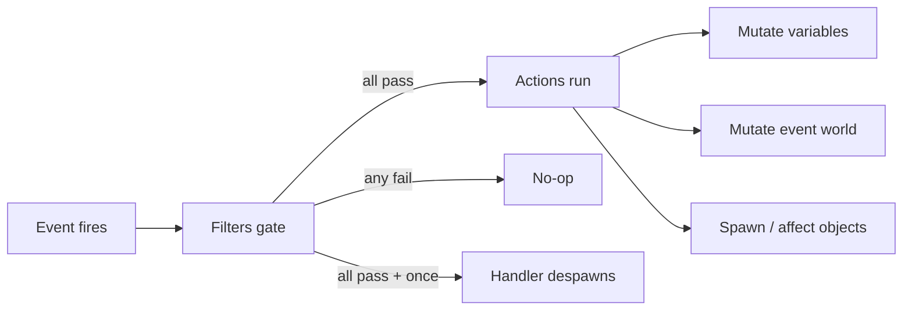

# Scenario / modding system

> How-to companions: [Create your first scenario](https://alexjercan.github.io/nova-protocol/create/author-a-scenario/) to write one
> in RON with existing primitives, or [Extend the scenario engine](guide-extend-scenarios.md)
> to add new event, filter, action, or object kinds in Rust. The exhaustive
> construct-by-construct catalog for authors is the
> [modding reference](https://alexjercan.github.io/nova-protocol/create/reference/); this page is the engine's
> internals.

`crates/nova_scenario` is the data-driven scenario engine, the layer for
missions, objectives, and reactive world behavior. A scenario is a list of
event handlers; each pairs an event with filters (all must pass) and actions
(run in order). It builds on `GameEventsPlugin`/`EventWorld` from
`nova_events`; nova_scenario provides `NovaEventWorld` and the enums below.

Three surfaces write that list: a RON file, a Rust builder under
`nova_authoring`, and the editor's EVENTS mode, which lifts a handler into nodes
you select and inspect - a condition included, drawn as a page of its own - and
lowers them back on save (`crates/nova_editor/src/event.rs`). All three produce
the same `ScenarioEventConfig`, so nothing below cares which one wrote it. The
editor reads its TOOLTIPS off these configs too: a field's doc comment is what
the panel says about it, through `bevy/reflect_documentation`.

## Scenario structure

- `ScenarioConfig` - `id`, `name`, `description`, `cubemap` (skybox),
  `skybox_brightness` (lux, defaults to `DEFAULT_SKYBOX_BRIGHTNESS`), `events`.
- `ScenarioEventConfig` - one handler: `label` (optional, what the handler is
  for in the author's words - the editor's tree reads it beside the trigger),
  `name: EventConfig`, `once`, `filters`, `actions`. `once` retires the handler the first time its filters PASS (not
  the first time its event fires): the loader-spawned entity is despawned, and
  `ScenarioEventConfig::build_handler` is the single place a config becomes a
  runtime handler, so the loader and every headless rig honour the same fields.
- `GameScenarios(HashMap<ScenarioId, ScenarioConfig>)` - all known scenarios,
  populated by `nova_assets` (ready at `GameAssetsStates::Loaded`).
- `CampaignConfig` - `id`, `name`, `scenarios` (ordered member scenario ids,
  hidden ones allowed); a first-class content kind (`Campaign((..))`).
- `GameCampaigns(HashMap<CampaignId, CampaignConfig>)` - all known campaigns, the
  ordered campaign->scenario mapping the Scenarios picker groups/launches by,
  populated by `nova_assets` alongside `GameScenarios`.
- `CurrentScenario(Option<ScenarioConfig>)` - the loaded scenario, if any. The
  `scenario_is_live` run condition gates the ship input/section sets on it.

## Loading / unloading (`loader/`)

- `LoadScenario(ScenarioConfig)` - trigger to load: look one up in
  `GameScenarios`, `commands.trigger(LoadScenario(cfg.clone()))` (see
  `examples/systems/system_scenario_grammar.rs`). Load tears down the previous
  scenario, spawns the camera, input context, one handler per event, fires
  `OnStart`. No engine
  light: a scene is lit by the `Light` objects it authors, and one that authors
  none renders black.
- `ScenarioLoaded` - fired after a load; carries `scenario_id`,
  `handler_count`, `object_count` for smoke-test assertions.
- `UnloadScenario` - tears everything down and clears `CurrentScenario`.
- `ScenarioScopedMarker` - any entity carrying it is despawned (recursively)
  on load/unload. Teardown also runs `NovaEventWorld::clear()` and clears all
  HUD hint emphasis.

Cleanup contract: every entity spawned while a scenario is live must (1) carry
`ScenarioScopedMarker` (all scenario objects do), (2) carry a lifetime
component - `register_scenario_scoping` tags every transient with
`ScenarioScopedMarker` the moment it declares one (`TempEntity` for countdown
transients, `SfxAudioMarker` for SFX one-shots), so projectiles, blasts,
debris, blast cosmetics and still-playing sounds all die with their scenario,
(3) be a child of a scoped entity, or
(4) be torn down by a `Remove` observer (the HUDs on `PlayerSpaceshipMarker`).
Anything else leaks.

A `TempEntity` does NOT clean itself up reliably: its countdown runs on
`Time<Virtual>`, which the pause menu and the outcome overlay STOP. A torpedo
blast that fuzes on the frame the player dies therefore outlives the whole
Defeat overlay and survives Retry, arriving in the reloaded scenario with its
damage intact. Scoping ON the lifetime component, rather than trusting the
lifetime to run out, is what closes that.

### The load warms every hull the scenario can spawn

A section's glTF is resolved by the render observer that builds its mesh child,
so the FIRST ship wearing a hull paid for that hull's art. A hull no `OnStart`
event spawns is therefore cold when its beat arrives: `first_shift`'s warship
and both of `menu_duel`'s corvettes appeared in placeholder art and dressed
themselves a moment later.

`preload::scenario_render_meshes` walks the loaded config for `SpawnScenarioObject`
and `ScatterObjects` actions, resolves each ship's `ShipSource` and every
section's `SectionSource` against the two catalogs, and collects the render
meshes. That walk is possible at all because a spawn action carries its object's
WHOLE config inline rather than an id looked up at spawn time, so what a
scenario can spawn is readable before it spawns anything.

Three parts make it work:

- `AssetRef::resolve` is idempotent, so the spawn site is unchanged - it asks
  the `AssetServer` for the same path and gets back a handle that is already
  warm.
- `ScenarioPreload` HOLDS the handles for the scenario's lifetime. Without a
  strong handle bevy frees the mesh again long before the mid-mission spawn.
- The load WAITS: `scenario_has_settled` and the LOADING panel both hold while
  the warm-up is pending, bounded by its own deadline so a missing or broken
  mesh cannot hang the load. A failed mesh counts as settled and is named in a
  warning; the section spawns in placeholder art, exactly as it would have.

Ships are the only object kind involved. A beacon and a salvage crate build
primitives, an asteroid meshes itself on a worker, and a light and an anchor
have no mesh at all. The warm-up is also registered only when
`NovaScenarioPlugin::render` is set: a headless rig builds no mesh children, so
there is nothing to warm and nothing to wait for.

## The vocabulary, and who documents it

Three closed enums are the whole authored language, one dispatch match each:

| Enum | File | Trait it dispatches to | Creator reference |
| --- | --- | --- | --- |
| `EventConfig` | `events.rs` | `EventHandler<NovaEventWorld>` (via `From`) | `/create/events/` |
| `EventFilterConfig` | `filters.rs` | `EventFilter<NovaEventWorld>` | `/create/filters/` |
| `EventActionConfig` | `actions/mod.rs` | `EventAction<NovaEventWorld>` | `/create/actions/` |

**The construct-by-construct catalog is `/create/`, not this page.** Every
event's exact firing condition, every filter field, every action's RON and
defaults are the authored CONTRACT and have to be exact; a second copy here
would be nobody's job to update, and a reader would have no way to tell which
one was true. This chapter covers what the enums do not show.

A config is held together by STRINGS, and to the type system every one of them
is a `String`: `SetAllegiance` names a ship, `TimerCancel` names a timer,
`NextScenario` names a scenario. `Names` (`names.rs`) puts the difference on the
field as a reflect attribute - `#[reflect(@Names::Object)]` and its
`NewObject` / `Variable` / `Timer` / `Objective` / `Scenario` / `Order` /
`Section` siblings - so
anything walking a config by reflection can offer the ids in scope and mark one
that resolves against nothing. The editor's inspector is the reader that exists;
a surface keeping its own list of which field names what goes stale the day an
action is added, which is the failure the attribute removes. A new string field
that refers to something declares what, or it is a blank box.

Events carry identity, not payload-by-position: entities wear
`EntityId(String)` and `EntityTypeName(String)`, and every PAIR event has the
same filter shape - a subject `id` plus an `other_id` / `other_type_name`.
Which entity is the subject is per-event (area against body, well against ship,
target against locker), which is why the filter is one struct rather than one
per event. Lock, orbit, and player STOP/GOTO completion events are one-shot
EDGES with no hidden timer behind them: a target switch queues end-old then
start-new, a successful GOTO reports only after physical settle, and a scenario
that needs a continuous hold composes the edges with a keyed timer.

Filters read and never mutate; they take `&NovaEventWorld` and the fired
`GameEventInfo` and return a bool, and every filter on a handler must pass.
Actions take `&mut NovaEventWorld` and run in order. Neither touches the Bevy
`World` directly - see the seam below.



A `once` handler retires on the PASS edge, so a refused event leaves it live
and a beat waiting on a condition keeps every later chance at it. Retirement
is a despawn, which `maintain_handler_index` turns into an index removal
before the next dispatch; the dispatcher also holds a pass-local spent set,
because one drain pass walks the whole queue against a single index snapshot
and two queued events of the same name would otherwise reach the same handler
twice.

### What an action does that its RON cannot show

Most actions are a straight write into `NovaEventWorld`. Six are not, and the
difference is engine behaviour rather than authored syntax:

- **`Outcome`** is not just an overlay. Setting one puts the app into
  `PauseStates::Paused` for as long as it is set, so physics, AI, weapons and
  timers stop behind the banner while the overlay's own buttons stay live.
  Scenario teardown clears it, which also releases the pause.
- **`SetCamera`** has to WIN every frame. It drops `WASDCameraController` and
  pins a `ScriptedCameraPose` that is re-enforced in
  `CameraAuthoritySystems::Override`, because both camera controllers keep
  writing the camera `Transform` otherwise - the same swap the
  player-ship-spawn observer does.
- **`SetCameraAnchor`** is the same override, SOLVED every frame instead of
  once: `ScriptedCameraAnchor` names an entity, an offset in its local or the
  world frame, and what to look at, and `track_scripted_camera_anchor` rebuilds
  the pose from wherever that entity now is. `ScriptedCameraTransform` is the
  one thing `Override` enforces, so the two pose kinds compose - swapping one
  for the other never drops the camera. Losing the anchor entity releases the
  override rather than freezing the shot, and a `look_at` entity that dies
  falls back to the anchor. It is camera authority ONLY: it issues no helm
  order and does not change input authority.
  `ReleaseCamera` removes both pose kinds. There is nothing to restore because
  the scenario camera IS the player's chase camera - the chase sync keeps
  writing in `CameraAuthoritySystems::Solve` the whole time the override is up,
  so dropping the override hands the view straight back.
- **`SuspendPlayerControl`** sets the shared `PlayerControlSuspended` gate and
  immediately clears held burn, RCS, rotation, radar, combat stance, and weapon
  intent. Player input observers also read that gate because observers bypass
  system-set run conditions. `ResumePlayerControl` lowers it. Both are
  idempotent, and scenario teardown always resumes control. The flight context
  is lowered while suspended; `Always` remains live for pause, menu, and an
  explicitly always-live cinematic-skip binding. Physics, timers, AI, scripted
  orders, and the cinematic do not use the player gate.
- **`SetSkybox`** installs DEFERRED. The skybox setup observer reads the image
  immediately and would panic on a handle that has not loaded, so the action
  only tags the scenario camera with `PendingSkyboxSwap` and
  `apply_pending_skybox_swaps` inserts the real `SkyboxConfig` once the image
  is in. A failed load warns and leaves the sky alone.
- **`NextScenario`** with `linger: true` does not switch on its own: it parks
  the request until something clears the flag. That something is the
  scenario-advance input or an outcome-overlay button, which is how Continue
  and Retry ride a queued switch.

`HintEmphasisSet` is worth one line for the same reason: the keybind dock hides
verbs the ship cannot use, so an emphasis on an unavailable verb REVEALS its
chip in the dim band rather than doing nothing. That is how a tutorial points
at a key before it lights up.

Actions fan out to one submodule per family beside `actions/mod.rs` -
`flow`, `mission`, `sequence`, `ship`, `spawn`, `timer`, `view` - and adding
one is [Extend the scenario engine](guide-extend-scenarios.md).

### `Sequence` keeps its cursor in the engine

`Sequence` is the one action whose state does not live in the action. A
`SequenceActionConfig` is an authored LITERAL key plus an ordered list of
steps; running it calls `NovaEventWorld::start_sequence`, which files a
`SequenceRun` - key, steps, cursor, the time the step became current - in the
event world beside the keyed timers. The config is immutable and shared
(`Arc<Vec<SequenceStepConfig>>`), so the same chain can be authored once and
started from several handlers.

The cursor CANNOT live in the action: handlers are dispatched from an index
snapshot and an action config is read-only during a pass, so a step counter
held there would be per-fire, not per-run. Keying it by an authored literal
also keeps `content lint` whole-program - no id in authored content is
computed, so the linter still resolves every reference statically.

Three pieces move a chain forward:

- `advance_scenario_sequences` runs in `Update`, chained after
  `sample_scenario_queries` and before `tick_scenario_timers` and
  `fire_on_update`. It drains `take_ready_sequence_step` and runs the actions
  the step returns. Queries are sampled first so a gate filter reads this
  frame's values.
- A step's `until` gate is a real handler. `sequence_gate_handlers` walks a
  handler's actions and spawns one extra `EventHandler` per gated step,
  carrying a private `SequenceGateAction { key, step }`. It is inert unless
  the cursor stands on exactly that step, so a gate cannot open a chain it
  does not belong to, and the gate opens the run rather than running the beat.
  That costs one frame of latency between the gate event and the beat.
- `take_ready_sequence_step` stamps `since = now` on the step it hands back,
  so ONE clock jump delivers at most one step of any one chain. Steps with no
  delay still collapse into a single pass, because the driver loops.

Both waits on a step apply together, and the semantics are WAIT, never SKIP.
That makes a shut gate a soft-lock, which is why a gated step carries a
`deadline`: expiry stops the run and logs an `error!` naming the key, the step
and the event it waited for. `start_sequence` holds the other loud half - a
restart on a live key is refused and logged, because one key is one cursor.

Because a step's action list is a FRAME of its own, four walkers had to learn
to recurse into it: `inline_queries`, `object_count`, the lint's
`collect_declared` / `check_action`, and the per-event spawn-id pass. The
shared helpers are `EventActionConfig::walk` and
`ScenarioEventConfig::action_groups`, which returns a handler's own actions
plus one group per `Sequence` step it starts, however deeply nested. Any new
rule that reasons about "one frame" reads `action_groups`, not `actions`.

## Variables and the event world (`world.rs`, `variables.rs`)

`NovaEventWorld` holds the scenario state: variables, objectives,
`next_scenario`, and a queue of deferred command closures. Filters and actions
mutate only this resource, never the Bevy `World`; world access goes through
`world.push_command(|commands| ...)`. Each frame `state_to_world_system` syncs
objectives into `GameObjectives` (write-on-diff), runs a queued non-lingering
`NextScenario` switch, and drains the command queue.

The drain is CHUNKED, not one flush. A chapter's `OnStart` queues a closure per
object, and applying them together cost one ~300 ms frame - a frame nothing can
be drawn on, so the LOADING panel froze on the exact frames it exists to cover.
Commands are applied one at a time until `SPAWN_DRAIN_BUDGET` (3 ms) of the
frame is spent, so a big scene arrives over several frames and a slower machine
takes MORE FRAMES rather than a longer one. One command per apply is also what
keeps each object atomic: a ship's sections all land inside one apply, so the
`Added<SectionLinkPoints>` batch the integrity graph and the derived skin key
off is complete the first time they see it.

While commands remain, the scenario is SETTLING (`EventWorld::is_settling`).
The dispatcher holds every handler, and a handler that queues world work stops
the current pass, so no handler ever runs against a world known to be
incomplete. The scenario clock stops, keyed timers do not expire, watches are
not sampled, the `OnUpdate` pulse does not fire, and the LOADING panel stays up.
The world is not yet LIVE, rather than briefly inconsistent. Held events are not
dropped: they dispatch in order on the frame the world goes live.

`scenario_has_settled` - the run condition the clock and the pulse read - holds
for one more reason: the glTF warm-up above. Dispatch is not, so `OnStart`
still fires and the scene still builds while the art arrives; what waits is the
scenario CLOCK, so no mission time passes behind a panel the player cannot see
past.

Variables are typed literals (`String`, `Number`, `Boolean`) with a small
expression tree: `VariableExpressionNode` (add/subtract), `VariableTermNode`
(multiply/divide), `VariableFactorNode` (literal/name/parens);
`VariableConditionNode` (less/greater/equal) yields booleans for filters.

The tree has a TEXT form (`syntax.rs`): `Display` renders it as
`scenario.elapsed > 90` and `FromStr` parses that back. The authored form is
still the RON nest - the text is what one editor row can hold, and what a tree
row reads as when it is shut. Round trip is the contract in both directions,
parse-of-render and render-of-parse, which is what lets a panel own a condition
without a save quietly rewriting it. The syntax spells the grammar and nothing
more: no operator the crate cannot evaluate, and `a - b - c` parses rightward
because `Subtract(Term, Expression)` nests that way.

The editor takes a condition APART along the same grammar: each operator is one
document node with its two sides as children, and a leaf holds whatever fits one
row of the text form. Those nodes are NOT part of the tree - the rail shows the
filter and stops - and the panel draws the whole condition as a page instead,
one row per node, each writing to its own entity. `Parens` is dropped on the way
in - the nesting says what the brackets said - and put back on the way out
wherever the position needs it, so a sum under a product lowers as `(a + b) * 2`.
What a switched operator cannot hold it does not keep: an operand a value has no
place for is dropped rather than left hanging where no row would show it.

### Two clocks pace a transition

`/create/actions/` documents the three gears a scenario switch has - hard cut,
delayed cut and modal hold. The engine fact underneath them is that they do not
all run on the same clock, which is the only part that is not obvious from the
RON:

- A `NextScenario` **delay** ticks on `Time<Virtual>`, the pause-frozen
  scenario clock, so a player who pauses holds the cut.
- An `Outcome`'s **`auto_advance_secs`** cannot, because the overlay it belongs
  to STOPS `Time<Virtual>`. It runs on the wall clock instead. A timed banner
  that used the scenario clock would never fire.

Anything that has to keep counting behind a frozen overlay is in the same
position and has the same answer.

### Story pacing is a QUEUE, not a slot

`StoryMessage` writes into a bottom-left comms stack rather than a
latest-wins line: arrival order, a bounded number of cards visible, and a
lossless pending queue behind them. The whole log stays in the feed too. That
is why a burst of lines is survivable - but one line per beat is still the
style, and the queue is the safety net.

Two consequences for anything that fires story lines:

- **The stack is a HUD surface `nova_scenario` reaches up into.** The dwell
  limits and the card budget live with the HUD, not with the action, which is
  one of the two edges [Architecture](architecture.md) calls out as running the
  "wrong" way on purpose.
- **It is scenario-scoped**, so teardown clears the log and nothing bleeds into
  the next scenario or the menu - the same rule as objectives, HUD readouts and
  hint emphasis.

Field-level detail (`dwell` and its clamp, `icon`, the two lint warnings) is
the authored contract and lives in `/create/actions/`.

### Typed queries and watched variables

The engine exposes read-only world state through typed QUERIES, and a scenario
samples one into a WATCHED variable. `/create/expressions/` is the authored
reference for both - the query kinds, their properties, and the beat and wave
shapes built on them. Three mechanism facts sit under it:

- **The watch owns the name.** A watched variable is written by the sampler
  each live, unpaused update, so `VariableSet` on that name is REJECTED while
  ordinary reads - `Name("...")` expressions, `HudReadout` - work normally. A
  variable is therefore either authored or watched, never both.
- **The clock is not created by exposing it.** `nova_scenario` keeps an
  internal scenario clock for keyed timers whether or not any content asks;
  `Scenario(Elapsed)` only publishes it. Both stop together under pause and
  behind the outcome overlay, and both restart on a retry - which is what makes
  a run timer show the FINAL time behind a Victory banner instead of counting
  on under it.
- **`Entity` is strict-single, and unavailability propagates.** Zero matches,
  several matches, or a match missing the property leaves the query
  unavailable, and an expression over an unavailable value fails CLOSED. Missing
  is not zero, which is the difference between a gate that never opens and a
  gate that opens immediately.
- **The entity sampler runs only if something reads it.** Sampling walks every
  `EntityId` in the world and allocates per match, so its cost scales with the
  WORLD - a duel carries about 1,800 ids, most of them ship sections - and not
  with the scenario. `ScenarioConfig::reads_an_entity_query` decides at load,
  over the watches AND the inline expression factors together, because an
  inline query has to be answerable the first time its action runs. Anything
  that adds a new place an expression can be authored has to be added to
  `ScenarioConfig::inline_queries` with it.

Watches freeze under pause and clear at teardown, like every other piece of
scenario-scoped state.

### The `OnUpdate` pulse SLEEPS (`loader/wake.rs`)

`fire_on_update` used to queue an event every frame, and the dispatcher then
walked the whole bucket re-evaluating filters that could not have changed their
answer. It now runs behind a gate, and a scenario with nothing to react to
queues nothing. The rigidbody analogy is exact: the scenario sleeps until
something wakes it.

Two things wake it, both derived at load by `wake.rs` and held in a
`WakeProfile`:

- **A write.** `NovaEventWorld::insert_variable` is the single write path, so
  every write joins a dirty set; the pulse fires when that set meets a variable
  an `OnUpdate` filter reads. What an `OnUpdate` handler WRITES joins what it
  reads, or a counter it advances itself would freeze the moment nothing else
  in the scenario writes.
- **A scheduled time.** `GreaterThan(scenario_elapsed, 95.0)` is known at load,
  so the crossing is scheduled rather than polled. Only a bare clock read
  against a literal schedules; `scenario_elapsed * 2` is arithmetic.

Three properties are worth knowing before reading the code:

- **Nothing is authored.** The filters already declare all of it. An authored
  wake list would be a second source of truth that can disagree with them -
  name two variables, read three, and the handler silently never fires on the
  third. `/create/` does not grow.
- **The default is `EveryFrame`, and it is the fail-safe.** A filterless
  `OnUpdate`, an `Entity` or `Timer` filter, an inline `Query(..)`, a watch fed
  by a per-frame sample, or a clock compared against a variable all fall back to
  the old behaviour. A case the analyser does not understand is SLOW, never
  wrong.
- **The decision is per SCENARIO, not per handler.** The gate either queues the
  event or does not; per-handler gating would mean changing the `nova_events`
  dispatcher. One per-frame handler therefore holds the whole scenario awake,
  and that is sometimes correct - a speed ladder and a HUD countdown are both
  continuous questions.

A `Sequence` step's `until` gate is a real handler the loader spawns, so it is
scanned with the authored ones. A gate waiting on `OnUpdate` that was not a
reason to wake would stall its chain forever.

Measured on a headless run, as the share of frames that queue the event:

| scenario | pulses / frames | why |
| --- | --- | --- |
| `ledger_ch1` | 350 / 22500 | milestones plus four scheduled lines |
| `ledger_ch3` | every frame | a `player_speed` ladder, correctly polling |

## Scenario patterns

The engine holds three facts for content - `once`, keyed timers, and a
`Sequence` cursor - and everything past those is one numeric variable plus
`Expression` filters. Two variable idioms recur; both are worked end to end in
the [Gauntlet worked example](#the-gauntlet-worked-example) below. Excerpts
here are verbatim from `webmods/gauntlet/gauntlet.content.ron`.

`once` and `Sequence` are what a variable is NOT for. A flag whose only reader
is its own filter - seeded in `OnStart`, read by one gate, written by that
gate's own action - is the engine's fact, and `once` carries it. A step
counter whose only job is to keep paced beats in order is the engine's fact
too, and a `Sequence` cursor carries it. Keep a variable where another handler
reads it: an ORDERING counter like `gate` below, driven by where the PLAYER
is, or a signal like "the convoy lost a ship".

### The gate-counter ordering pattern

A single numeric variable acts as a state machine that enforces ORDERED entry:
each stage's handler is guarded on the counter holding that stage's value, and
the last thing the handler does is bump the counter to arm the NEXT stage only.
An event that arrives out of order finds the counter on a different value and
does nothing.

Gauntlet's variable is `gate` (the index of the gate to thread next, `1..=7`).
`OnStart` seeds it:

```ron
VariableSet((
    key: "gate",
    expression: Term(Factor(Literal(Number(1.0)))),
)),
```

Each gate's `OnEnter` handler carries two filters - an `Entity` filter that
matches the area/body, and an `Expression` filter that pins the counter - so
only the in-order entry fires:

```ron
(
    name: OnEnter,
    filters: [
        Entity((
            id: Some("gauntlet_gate_1"),
            other_id: Some("player_spaceship"),
        )),
        Expression((Equal(
            Term(Factor(Name("gate"))),
            Term(Factor(Literal(Number(1.0)))),
        ))),
    ],
    actions: [
        ObjectiveComplete((id: "gate_1")),
        VariableSet((
            key: "gate",
            expression: Term(Factor(Literal(Number(2.0)))),
        )),
        // ... re-point the objective marker at gate 2 ...
    ],
),
```

Because gate 2's handler filters `Equal(gate, 2.0)`, flying through gate 3
early - or back through gate 1 again - matches no live handler and is inert. The
`scenario_gate_course` rig's
`gates_advance_only_in_order_and_only_for_the_named_ship` test pins exactly
this on a synthetic course: an out-of-order entry does not advance `gate`.

Use it whenever stages must be visited in sequence (a gate run, a guided tour, a
tutorial's step chain). The base `first_shift` starter uses the same idiom
with a `beat` counter; see [Built-in scenarios](#built-in-scenarios).

### The act-gating pattern

A post-decision event can otherwise flip an already-decided outcome: in Gauntlet
a wreck normally means Defeat, but a wreck that drifts into a rock AFTER the win
must not overwrite the earned Victory. The fix is to guard the Defeat handler on
the same counter, past a terminal value the winning handler sets.

The FINISH handler bumps `gate` one past the last real gate (to `8.0`, the
terminal done-state) as it declares Victory:

```ron
// Terminal: bump past the last gate so no OnEnter re-fires
// AND the player-death Defeat handler (gated gate < 8) can
// never flip an earned Victory to Defeat.
VariableSet((
    key: "gate",
    expression: Term(Factor(Literal(Number(8.0)))),
)),
Outcome((
    outcome: Victory,
    message: Some("You ran the gauntlet clean. ..."),
)),
```

The `OnDestroyed` Defeat handler is then guarded `gate < 8`, so a death blast
after the course is finished declares nothing:

```ron
(
    name: OnDestroyed,
    filters: [
        Entity((
            id: Some("player_spaceship"),
        )),
        Expression((LessThan(
            Term(Factor(Name("gate"))),
            Term(Factor(Literal(Number(8.0)))),
        ))),
    ],
    actions: [
        Outcome((
            outcome: Defeat,
            message: Some("You wore your hull down to nothing ..."),
        )),
        NextScenario((
            scenario_id: "gauntlet_run",
            linger: true,
        )),
    ],
),
```

The rig's `a_wreck_after_the_finish_declares_nothing` test seeds `gate` to
`8.0`, fires the death, and asserts no outcome and no retry (its sibling
`a_wreck_before_the_finish_declares_defeat_with_a_retry` pins the other half).
Use this whenever a lethal
event can still fire after the scenario is decided (a boss's death explosion
catching the player, a wreck sliding into a hazard): pick a terminal counter
value the winning handler sets, and guard every outcome handler against it.

### The Gauntlet worked example

`webmods/gauntlet` is the reference implementation for both patterns. Trace it
end to end:

- The content file `webmods/gauntlet/gauntlet.content.ron` - one NEW scenario,
  no base overrides; the gate-counter and act-gating idioms above live here with
  header comments explaining the two geometric invariants.
- The time-trial wiring: `OnStart` fires one `HudReadout` on `scenario_elapsed`
  (`Time` format) for a live `mm:ss.s` clock, and seeds a `crash` counter that
  hazard-zone `OnEnter` handlers bump on each graze. Crossing FINISH bumps `gate`
  to its terminal `8.0`, then TWO `crash`-gated `Outcome(Victory)` handlers fire
  in the same pulse (exactly one matches): `crash == 0` earns the CLEAN RUN
  banner, `crash > 0` the plain finish. The final time is shown by the frozen
  readout behind the banner (the clock stops on the outcome pause), so the banner
  text only has to vary the clean-run line - no message interpolation needed.
- The test rig `crates/nova_assets/tests/scenario_gate_course.rs` - authors a
  synthetic course as a RON string, drives the real handlers, and pins the
  ordered-gate sequencing, the repeatable penalty zone, the two counter-keyed
  win banners, the act-gating and the readout wiring. Run it with
  `cargo test -p nova_assets --test scenario_gate_course`. Geometry invariants
  (gate areas do not overlap; the racing line clears every rock's worst-case
  body past `ASTEROID_GEOMETRIC_FACTOR_MAX`) are a CONTENT concern, checked per
  bundle by `content lint`.
- The [first-scenario guide's completed flow](https://alexjercan.github.io/nova-protocol/create/author-a-scenario/#3-plan-one-short-story)
  is the gentler, single-counter cousin of the gate-counter pattern.

## Scenario objects (`objects/`, `ScenarioObjectKind`)

One module per kind under `objects/`, one arm in the `ScenarioObjectKind` match
in `actions/spawn.rs`. The authored fields of each kind - and every trap in
them - are `/create/objects/`; what follows is what the modules have in common.

All share `BaseScenarioObjectConfig` (id, name, position, rotation) and spawn
scoped entities via `base_scenario_object`, which deliberately carries NO body:
each kind declares its own `RigidBody`, and only the asteroid and the planet
opt into `Dynamic` + `TransformInterpolation`. A carved rock also emits new
dynamic bodies at runtime - every piece a crater severs (`CarvedChunkMarker`,
`integrity/chunk.rs`) - so the spawn kinds are not the whole population of a
live scene.

Four engine facts the object configs do not show:

- **`BodyRadius` is DERIVED from the mesh, not read from the config.** Both
  ground kinds publish `radius * unit_extent`, and the two extents are nothing
  alike: an asteroid's noise mesh puts it in `[3.5, 6.0]`, a planet's is
  `1 + relief`, about 1.05. Everything measured off a body - the gravity well's
  clamp, the sphere of influence, an orbit ring, a GOTO standoff - reads that
  derived number, so moving content between the two kinds means carrying the
  DERIVED radius across, not the authored one.

- **Nothing supplies a light.** `Light` is an ordinary spawned kind
  (`objects/light.rs`) and the engine adds none of its own, so a scenario that
  authors no `Light` renders black. This catches every new backdrop.
- **What a rock is MADE of is required, and it decides how it looks.**
  `AsteroidConfig::material` names a KIND - `rock`, `metal`, `ice`, `carbon`,
  or the `plain` control - and `objects/asteroid_kind.rs` is the one table that
  maps a kind to a look. The look is uniform data for a triplanar
  `ExtendedMaterial` (`objects/asteroid_surface.rs`), so a carved and remeshed
  rock wears the same surface it did before the hit. There is NO default and no
  fallback: a config without the field fails to deserialize, an id the table
  does not know is a `content lint` error and a refusal to render, and
  `ScatterObjects` writes a kind into every copy from an authored weighted mix.
- **A rock has no `health` field, and that is not an omission.** What an
  asteroid is made of IS its durability; the mechanism is
  [below](#how-an-asteroid-carves). Its `radius` is `Meters` like every other
  authored length; its `mass` is not, and that is deliberate. `mass` is the
  body's `mu`, an L^3/T^2 quantity - an SI one would be a THOUSAND times the
  world-unit one - so it stays engine-side in u^3/s^2 with the
  `GravitySettings` cutoff it is measured against. It sets both the pull
  `a = mu / r^2` and the sphere of influence, the distance where that decays to
  `GravitySettings::soi_cutoff_accel` (0.25 u/s^2, which is 2.5 m/s^2), so a
  well is authored by the SOI it should have: `mu = soi_cutoff_accel * soi^2`,
  both terms engine-side. The inspection planetoid's 27 000 buys a 328.6 u
  sphere of influence, and 328.6 u is the 3.29 km the HUD reads. An `Anchor`
  publishes the same `GravityWell` from an AUTHORED radius instead of a
  mesh-derived one, which is what makes it deterministic where a carved rock is
  not.
- **Ship section geometry is LINTED, not clamped.** Overlapping unit-cube cells
  and a turret or torpedo mount whose base (local -Y under its rotation) faces
  an empty neighbour cell are `content lint` ERRORS, so a bad hull fails
  authoring rather than spawning wrong. See
  [Ship sections internals](sections.md).

### How an asteroid carves

An asteroid is the one body in the game with nothing to hide behind. A ship
carves through its cladding and stops at the structure underneath, because a
plate is one cell thick and the hull it is bolted to is a glTF model nothing can
cut. A rock is solid all the way down, so a carve here goes as deep as the hit
deserves.

**The field IS the rock.** `pristine_field(seed, radius)` is the only
description of an asteroid's shape. `pristine_rock_mesh` is that field meshed,
and it is what the spawn path draws and collides with; the reseed on the first
hit calls the same function with the same seed and gets the same grid back. It
used to be two shapes - a subdivided octahedron displaced by the noise for the
shipped mesh, and a field for the carved one. They agreed to within a cell, which
is not the same as agreeing: the first hit moved the silhouette and changed the
size of every facet, and that pop was visible on a rock the shot had barely
scratched.

**The grid is kept only while it is needed.** 140 KB on an arena rock and 275 KB
on the biggest the cap allows, and a scenario scatters a hundred rocks most of
which are never touched - so the spawn path meshes the field and DROPS it. The
first hit pays to build it again (tens to hundreds of thousands of noise
samples); from then on nothing resamples.

**The cost model.** The field is what the rock is meshed and collided from, so
it is engine geometry: every figure in this paragraph is in world units, and the
authored `Meters` radius crosses once on the way in (`pristine_rock_mesh`).
`FIELD_CELL_WORLD` is 0.5 WORLD units - a 5 m cell - and the cell COUNT is
derived from it, the opposite way round from how this started. A crater is a
world-sized thing (a 4-damage PDC round carves 0.62 u, a 6.2 m sphere, whatever
it lands on), so a grid whose cells grew with the rock could not draw that
round's hole on anything big: 32 cells across a 30 m rock is a 1.02 u cell, four
times the round being fired at it. Coarseness is the ART, not a resolution knob
- a finer grid only makes a smoother rock. `FIELD_RESOLUTION_MIN` is 16 and
`FIELD_RESOLUTION_MAX` is 40; the cap BINDS above an authored radius of about
18 m, and what it costs there is the cell (a 30 m rock is gridded at 0.82 u, so
a PDC round on one is under a cell and only sustained fire - whose mark GROWS
where it is held - opens a hole). `41^3` corners is 275 KB per carved rock, paid only by
rocks that are hit. `FIELD_MARGIN` is 1.08, only just over 1 because carving
never ADDS material.

**Nothing happens in the frame that asked for it.** The seed and the whole carve
- split, surface nets, collider, and the geometry of every piece the cut freed -
run on the async compute pool, at most one job in flight per rock, and the rock
keeps drawing the surface it already had until one lands. What the main thread
pays is the sphere subtraction the mark itself reaches, and then PLACEMENT: one
transform and one spawn per piece. A remesh also waits until the grid actually
loses a cell (a quantized `meshed_volume` compare), so sub-cell hits accumulate
in the field without paying for connectivity, surface generation or a collider
rebuild.

`CarveApplyReport` is what holds that line, and it counts GRIDS rather than
milliseconds because a count reads the same on every box. One grid per rock is
its own new solid; one per PIECE means the main thread is holding a
quarter-megabyte field to ask it questions each of which is a scan of all of it.
It used to. Three rocks landing in one frame with five pieces between them
measured 17.5 ms in that frame against a 0.02 ms median; the same frame with the
pieces built on the worker measures 0.03 ms. `bug_carve_apply` is the range that
holds it there.

**Severing and death.** `SignedField::split_off_islands`
(`crates/nova_gameplay/src/mesh/field.rs`) hands back whatever the cut freed. A piece past `CHUNK_MIN_VOLUME`
becomes a rigid body of its own, meshed by the SAME surface nets the rock is,
carrying `v + omega x r`; anything smaller is announced as a carve and goes out
as dust. Both decisions are the worker's: the threshold is a WORLD volume and the
grid is in the rock's own unit space, so the job is told the scale it cannot see.
When the remaining solid falls under `CHUNK_MIN_VOLUME`, or the surface
comes back empty, the rock inserts `IntegrityDestroyMarker`, fires
`OnDestroyedEvent` itself and despawns its root - so a rock's `OnDestroyed` comes
from `nova_scenario`, not from `nova_gameplay`'s integrity stack.

**`BodyRadius` only ever SHRINKS.** Everything sized off a rock's surface -
standoff distances, orbit clearances, the sphere of influence - was authored
against the pristine radius, so shrinking keeps every one of those valid and
growing would silently invalidate them. The collider density rides along
unchanged, so avian re-derives mass from the volume that is left: a carved rock
is a lighter rock.

**The surface is sampled by POSITION.** `AsteroidSurfaceMaterial` / `RockHeight`
are triplanar in the body's own local space, so a carved rock wears exactly the
surface an uncarved one does and there is no per-triangle quilting. It is also
why a severed piece must not inherit that material blindly - a piece is a new
body with a new origin, and it reads the grain from a different place.

## Built-in scenarios

The builders live under
`crates/nova_authoring/src/base_content/scenarios/`. `main_menu/` gives each
menu backdrop its own file, and `nova_protocol/` owns the campaign chapters plus
the stage, cast and pacing vocabulary they share. Its `first_shift.rs` builds the
New Game starter - the
beat-chain reference: one `beat` counter gates every handler, and count
milestones run on `OnUpdate` handlers keyed on the counter (handler order
within one event is not load-bearing). The builders are an OFFLINE inventory,
not the runtime path: `content -- gen` serializes them to
the committed `assets/base/scenarios/*.content.ron`, `base.bundle.ron` lists
them, and `crates/nova_assets/src/merge.rs` merges the parsed RON into
`GameScenarios` like any mod's. `content_ron_parity` pins builders == RON.

The orbit tracker derives lifecycle edges from live autopilot state. Once the
ship first reaches `Hold` it also sums signed radial-angle changes around the
sticky orbit plane, and each net revolution fires `OnOrbitLap`. Counting starts
at the RING, not at the verb, because the insertion approach curves around the
well and would otherwise bank most of a lap for free. It then survives every
phase the autopilot flies there - `Align` and `Burn` during ORBIT are the
correction that puts the ship back on the ring, not a departure from it - and
is written off only by an absence from `Hold` longer than
`ORBIT_LAP_GRACE_SECS`. So authored lap objectives need no guessed timer, and
one nudge does not silently cost the player three quarters of a revolution.

## Adding new pieces

- Event: event + info structs in `nova_events/src/lib.rs`, an `EventConfig`
  variant in `events.rs`, and something that fires it (engine-driven events
  live in `loader/` - `OnStart` in `lifecycle.rs`, `OnUpdate` in `clock.rs`,
  the orbit/lock trackers in `trackers.rs`; area events in `objects/area.rs`;
  `OnNeutralized` fires from `nova_gameplay`'s integrity stack, and a rock's
  `OnDestroyed` from `objects/asteroid_carve.rs` when its field is exhausted).
- Action: config struct + `EventAction<NovaEventWorld>` impl in the right
  `actions/` submodule (`flow`/`mission`/`sequence`/`ship`/`spawn`/`timer`/
  `view`), plus an
  `EventActionConfig` variant in `actions/mod.rs`.
- Filter: same pattern in `filters.rs` (`EventFilterConfig`).
- Object: a module under `objects/` (config + bundle function, plugin in
  `objects/mod.rs`) plus a `ScenarioObjectKind` variant/match in
  `actions/spawn.rs`. Its `*_TYPE_NAME` const goes in `nova_events`, beside
  `EntityTypeName`, so readers below `nova_scenario` can match on it.

## Find it in the code

- Engine plugin: `NovaScenarioPlugin` - `crates/nova_scenario/src/lib.rs`;
  generic dispatch: `EventHandler` - `crates/nova_events/src/engine.rs`.
- Vocabulary enums: `EventConfig` - `crates/nova_scenario/src/events.rs`;
  `EventFilterConfig` - `crates/nova_scenario/src/filters.rs`;
  `EventActionConfig` - `crates/nova_scenario/src/actions/mod.rs`.
- The state seam: `NovaEventWorld` - `crates/nova_scenario/src/world.rs`;
  variables and expressions - `crates/nova_scenario/src/variables.rs`; their
  text form: `crates/nova_scenario/src/syntax.rs`.
- What an authored string names: `Names` -
  `crates/nova_scenario/src/names.rs`; the editor that reads it -
  `crates/nova_editor/src/event.rs` (the script as nodes).
- Loading and scoping: `ScenarioLoaderPlugin`, `ScenarioScopedMarker`,
  `scenario_is_live` - `crates/nova_scenario/src/loader/mod.rs`; the glTF
  warm-up: `ScenarioPreload`, `scenario_render_meshes` -
  `crates/nova_scenario/src/loader/preload.rs`; what the pulse wakes for:
  `WakeProfile`, `configure_scenario_shape` -
  `crates/nova_scenario/src/loader/wake.rs`.
- Objects: `ScenarioObjectsPlugin` - `crates/nova_scenario/src/objects/mod.rs`;
  kind dispatch: `ScenarioObjectKind` -
  `crates/nova_scenario/src/actions/spawn.rs`.
- Asteroid carving: `AsteroidField`, `carve_asteroid_fields`, `pristine_field` -
  `crates/nova_scenario/src/objects/asteroid_carve.rs`; the mesher underneath:
  `SignedField` - `crates/nova_gameplay/src/mesh/field.rs`; the cost of the
  material itself: `DAMAGE_PER_UNIT_VOLUME` -
  `crates/nova_gameplay/src/integrity/carve.rs`.
- Asteroid kinds: `AsteroidKind`, `asteroid_kind_look`, `ASTEROID_KINDS` -
  `crates/nova_scenario/src/objects/asteroid_kind.rs`; the surface they drive:
  `AsteroidSurfaceMaterial` - `crates/nova_scenario/src/objects/`
  `asteroid_surface.rs` and `assets/shaders/asteroid_surface.wgsl`.
- API detail: `cargo doc --open -p nova_scenario` (event engine:
  `-p nova_events`).
