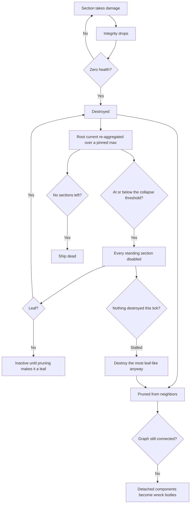

# Spaceship sections and integrity

> To add a new section kind, follow the guide
> [Add a ship section](guide-add-section.md).

Ships are assembled from modular **sections**. Each section is a child entity of
the ship root with its own collider, mass, and health, and contributes one
behavior (structure, thrust, steering, guns). The **integrity** system tracks
how sections connect and handles damage, disabling, and cascading destruction.

## Sections (`nova_ship::sections`)

A section is a `SectionConfig { base: BaseSectionConfig, kind: SectionKind }`.
`BaseSectionConfig` is shared by all kinds: `id`, `name`, `description`, `mass`,
`health`, optional `impact_sound` / `destroy_sound`, optional `collider`,
structural `link_points`, `hide_in_editor`, and `damage_effects` - the authored
list of looks this section wears as it is damaged (see [Damage is two
readings](#damage-is-two-readings)).

`SectionKind` variants (one module per kind under `crates/nova_ship/src/sections/`;
`turret_section/` and `torpedo_section/` are directories, not single files):

| Kind         | What it does |
|--------------|--------------|
| `Hull`       | Passive structure/armor. Just a `render_mesh`. |
| `Thruster`   | Forward thrust (`magnitude`); drives the exhaust visual. |
| `Controller` | Attitude controller (`steering_lag`, `max_angular_acceleration`); lag derives the internal PD gains. Also grants flight `verbs` (STOP/GOTO/ORBIT maneuvers plus LOCK targeting and RCS fine-translation). A ship needs one to be drivable; several SHARE one attitude loop (see below). |
| `Turret`     | Aims and fires bullets. An authored joint tree (hinges + muzzles, each joint with its own `offset`/`axis`/`speed`/limits/`render_mesh`), section-wide `muzzle_speed` + authored `bullet_damage` + `bullet_kind`, per-muzzle `fire_rate`, optional `ammo_capacity`. |
| `Torpedo`    | Torpedo bay. Fires guided torpedoes of an authored `torpedo_type` (name, tint, `max_speed`, `weave_angle`, `weave_rate`) that detonate an Explosive area blast (`blast_radius`, `blast_damage`), optional `ammo_capacity`. The TYPE is the run-in - how fast and how evasively; everything else on the config is the tube. |

`GameSections(Vec<SectionConfig>)` is the resource of section blueprints.
Generic prototypes are authored in
`crates/nova_authoring/src/base_content/sections/standard.rs`; semantic craft
parts live under `base_content/ships/`. Their explicit `section_catalog()` is
generated into `assets/base/sections/base.content.ron` by `content -- gen` and
merged into the resource by
`crates/nova_assets/src/merge.rs`. The outer-skin cladding is not a prototype at
all: a ship's skin is DERIVED from the structure it wraps by `nova_ship`'s
`shell_skin` ([below](#the-derived-skin)), so no id names a plate. Look a
section up with
`sections.get_section("basic_thruster_section")`.

### Stacked controllers share one loop

Every live controller torques the hull in parallel, so a hull with several of
them would multiply both its gains and acceleration authority by the section
count.
`update_controller_stack_tuning`
(`crates/nova_ship/src/sections/controller_section.rs`) prevents that: it runs
first in `FixedUpdate` (`ControllerSectionSystems::SyncStack`), derives ONE
ship-level attitude loop per root, and writes each live controller a share of
it into its `PDController`. The authored numbers stay put in
`ControllerSectionTuning`, which is what the pass re-derives from when a
controller dies. The smallest live `steering_lag` supplies the stack's base
response; acceleration authority is ranked independently.

The ship-level loop, for `n` live controllers on the curve
`stack_curve(n, limit) = limit - (limit - 1) / n`:

- acceleration authority: each controller's authored
  `max_angular_acceleration` at its rank weight, summing to
  `stack_curve(n, 2.0)` of the strongest - 1.00 / 1.50 / 1.75 / 1.90 at n = 1
  / 2 / 4 / 10, with a hard ceiling of 2x. The PD converts each principal-axis
  acceleration into the torque required by the live inertia, so hull size does
  not change handling by default.
- P gain: DIVIDED by `stack_curve(n, 1.5)`, which increases the effective
  steering lag so the stack brakes earlier and lands on the commanded attitude
  instead of sailing past it.
- D gain: held at exactly one fastest computer's worth. This is not tuning: `kd * dt`
  crosses 2 at two controllers on the shipped tuning, and past that the PD
  limit-cycles instead of parking (the corkscrew that used to follow a
  released maneuver).

`ship_turn_rate` (`flight/guidance.rs`) then sums the live acceleration shares,
which is why the flight layer is ordered after `SyncStack`. `n = 1` is the
identity case.

### Meshes and colliders (authorable)

Two authorable knobs decouple a section's look and physics from the default unit
cube (`crates/nova_ship/src/sections/base_section.rs`). Unset content still uses
the unit-cube defaults:

- `render_mesh_transform` (optional, on every mesh-bearing kind; for turrets
  it sits per JOINT in the joint tree) - an offset /
  rotation / scale applied to the section's render mesh child ONLY, so a model
  can be re-seated visually without moving the collider or (for turrets) the
  joint tree. Type `RenderMeshTransform`.
- `collider` on `BaseSectionConfig` (optional) - the physics shape:
  `Cuboid { size }`, `Sphere { radius }`, `Capsule { radius, length }`, or
  `Cylinder { radius, height }` (the last three along local Y). `None` resolves
  to the unit cube (`Cuboid { size: (1,1,1) }`) - the shape every section had
  before colliders were authorable. Section mass is `density * collider_volume`,
  so a larger collider is also heavier.

## Building a ship

A `SpaceshipConfig` (`crates/nova_scenario/src/objects/spaceship.rs`) has a
`controller` (`None`, `Player`, or `AI`), an `allegiance`, an optional
`collapse_threshold` (below), a `skin` flag (the
[derived cladding](#the-derived-skin)), and a list of
`SpaceshipSectionConfig`, each placing one section at a `position` + `rotation`
relative to the ship root (world units), with a `source` (`Inline` /
`Prototype`) and optional `modifications`. The player
config carries the input mapping (section id -> key/gamepad bindings) plus
`speed_cap` and `infinite_ammo`; the AI config carries `patrol`/`orbit`/`leash`/`engage_delay`.

Spawning: the base scenario bundle gives the root `RigidBody::Dynamic`; the
spaceship object adds `SpaceshipRootMarker`, and an observer
(`insert_spaceship_sections`) spawns each section as a direct child. Every
section gets `SectionMarker`, its `Collider` (the authored `collider` shape, or
a unit cube by default), `SectionLinkPoints`, `ConnectedTo`, and `Health` (`base_section` in
`sections/base_section.rs`), so the ship is one rigid body whose child colliders
each carry their own health.

See the semantic Racer, CargoA, and CargoB builders under
`crates/nova_authoring/src/base_content/ships/` for complete generated examples.
The editor (`crates/nova_editor`) assembles ships interactively using
`preview_section`, which has no health or rigid body and never enters the
damage pipeline.

### The derived skin

`skin: true` on a ship's hull asks the game to CLAD it. Nothing authors a plate:
`spawn_ship_skin` (`sections/shell_skin.rs`) reads the finished section batch on
the same `Added<SectionLinkPoints>` edge the integrity graph is built off,
buckets the sections into cells (the lattice is read off the sections, so a hull
mirrored about its centreline is not cut in two), and derives one plate per cell
of outer surface from the eight boundary samples that cell shares with its
neighbours. The same structure always gives the same skin.

- A plate is a `SectionFixture` (`sections/fixture.rs`): `Collider`, `Health`,
  density and `HealthIsolated`, but no `SectionMarker`. So it never joins the
  integrity graph, never counts toward the ship's health, never wears a
  section's damage effects (`owning_section` in `damage_cracks.rs` stops its
  ancestor walk at the first fixture), and never reaches the palette. Losing one costs the ship nothing it can
  DO - which is the line between a fixture and a section.
- Each plate is a CHILD of the section it clads, so a destroyed section takes
  its own cladding down with it and nothing has to hunt the plates of a part
  that no longer exists.
- On a LIVE ship, derivation runs at spawn and nowhere else. The skin is a pure
  function of the structure, so re-running it would grow back whatever combat
  blew off; `despawn_dead_fixtures` takes a dead plate away and nothing puts it
  back.
- `ShipSkinPlugin { render }` is split at the render line, not at the look line:
  the derivation and the sweep are gameplay and run headless, and `render` gates
  only the meshes hung on each plate by the `dress_skin_plate` observer.

Cladding is OPT IN. The derivation reads a hull as unit cells, which the
catalog's cube sections are and the modelled semantic parts (the racer, the
haulers) are not.

#### The editor's live preview

The build view clads the ship being ASSEMBLED, and it re-derives rather than
spawning once: `sync_editor_skin` (`nova_editor/src/skin.rs`) runs after
`sync_placement_ghost`, hashes the structure it is about to read, and respawns
the whole skin when that hash moves. Nothing is patched and nothing is
diffed - the derivation is a pure function, so throwing the plates away and
asking again is both the simplest answer and the one that cannot drift. On a
384-plate ship a reflow costs about 2 ms and an unchanged frame about 0.1 ms;
a real build is an order of magnitude smaller than that, and the ghost only
travels in whole cells (placement mates sockets), so dragging a part does not
re-derive per frame.

Two things it does differently from the spawner:

- The part UNDER THE POINTER is structure, while its placement is legal. That
  is the feature: a hull is dragged about under the skin and the cladding
  closes around it before the click. A REFUSED ghost contributes nothing - it
  will not be built, so cladding it would draw a ship that cannot exist.
- A preview plate is DISPLAY ONLY: `ShipSkinMarker` and a pose, so the shared
  `dress_skin_plate` observer still draws it, but no `SectionMarker`, no
  `Collider` and no health. The placement solver never counts one as a part,
  the pointer never hits one, and the `Q` pipette cannot arm one.

Both readings go through `read_structure` (`shell_skin.rs`), so the lattice the
editor clads on and the lattice the flown ship clads on cannot drift - and the
build state carries the toggle into the `SpaceshipConfig` the scenario spawns,
so what you see in the editor is what you fly.

#### The plate vocabulary and skin styles

The derivation works out far more than it keeps. `read_plates`
(`sections/skin_reading.rs`) is a SECOND PASS over the finished plates that reads
it back out as a `PlateReading` each: which way the plate faces, what its top is
shaped like (`Flat` / `Step` / `Ridge` / `Peak` / `Bevel` / `Brink` / `Spur`),
which way it falls away, how enclosed its cell is, how long the run of like plate
through it is and which way that run points, how far it is from the end of that
run, how much of its cell it fills, how deep the structure under it goes, and how
close the mouth of a fitting is. The plates are the whole input - their cells are
the clad set, `cell - anchor` is the face each shows - so a reading cannot drift
from the skin it describes. It costs about 0.6 ms on a 384-plate ship, against
1.6 ms to derive the skin itself.

The FALLING PLATE is three reliefs and not one, which matters because it is four
fifths of every ship. A corner sample dies to the cell floor for exactly one
reason - open space stands at it - so counting the dead corners says how many
ways a plate falls: one corner is a `Bevel` (a panel with a corner taken off),
two on one side is a `Brink` (the straight edge of a hull), and anything more is
a `Spur` (a tip, an outer corner, a saddle). Summing those corner directions and
turning them by the plate's own rotation gives `PlateReading::fall`, the
OUTBOARD direction - a cardinal on a `Brink`, a diagonal on a corner, and zero
where a plate falls two ways and cancels. It is the second alignment axis: a
piece turned to `along` lies down an edge, and one turned to `fall` leans out
over it.

A `ShipStyleConfig` (`sections/skin_style.rs`) is CONTENT resolved by id out of
`GameStyles`, exactly as a section prototype resolves out of `GameSections`. It
carries a material per surface role and a list of decoration fixtures, each with
a model `AssetRef` and a `ScatterRule` written in the vocabulary above. The mod
merge routes `Content::Style` into `GameStyles` with the same last-wins overlay
every other kind gets, so a mod restyles a base look by declaring its id.

`scatter_decor` (`sections/skin_decor.rs`) turns plates plus readings plus a
style into placements. It takes the READINGS, not the structure, so the scatter
cannot reach past the vocabulary into the derivation. Two properties are
load-bearing:

- DETERMINISM. There is no RNG. A plate's claim is a hand-written FNV-1a hash of
  its cell, its out face and the fixture's id - hand-written because
  `DefaultHasher` is not promised to be stable across releases of the standard
  library, and a ship that comes back wearing different antennae after a
  toolchain bump would break the same promise the derived skin exists to keep.
  The editor re-derives and re-scatters on every structure change, so anything
  less would flicker while a hull is dragged.
- GRID CLAIMING, not blue noise. A rule claims cells on its own `stride` and a
  piece is yawed to `PlateReading::along` or to `PlateReading::fall`. Poisson
  sampling deliberately destroys alignment, and alignment is the difference
  between decoration that reads as bolted on and decoration that reads as
  confetti.

One thing is decided by a BLOCK of hull rather than by a cell, and it is the
DENSITY NORMALISATION. Every other knob is per plate and they multiply, so a rule
tuned on a 150-plate generated hull put one visible piece on a 20-plate editor
build. `ScatterRule::patch` is a floor: within each block of `patch` cubed cells,
keyed by the out face, a rule that the share left with nothing claims its lowest
hashing eligible plate. A block is a fixed division of the ship's own cells, so a
hull that grows by one cell keeps every piece outside the block it grew into; the
floor never displaces another rule's piece, so priority still means what it says.
With `chance: 0.0` the share picks nothing and the rule is purely "one piece per
block", which is a density that reads the same at any hull size.

A decoration is a `SectionFixture` like a plate, and a child of the PLATE, one
level further out - so a plate shot off takes its greebles, and
`damage_cracks`'s `owning_section` walk stops at the first fixture it meets
whichever of the two it started under. The base game generates its greeble models from committed JSON recipes
(`scripts/gen-greebles.py`), and the mod-facing format is documented in
[Ship skin styles](https://alexjercan.github.io/nova-protocol/create/styles/).

What a hull actually OFFERS is worth knowing before writing a rule, and a
GENERATED hull and a HAND-BUILT one offer almost opposite things. Measured, per
ship:

| subject | plates | flat | step | ridge | peak | bevel | brink | spur |
|---|---|---|---|---|---|---|---|---|
| `wfc_ships` row | 132-162 | 6-22 | 18-22 | 0-4 | 0 | 10-14 | 48-66 | 34-42 |
| editor build | 19-27 | 0 | 2-3 | 3-8 | 1-3 | 0 | 0 | 9-17 |

A hand-built ship has NO flat plate, no bevel and no brink at all: it is spurs,
ridges and studs, because almost every cell of it is one cell wide. So a rule
written for flat panels lands nowhere on the thing the owner actually builds, and
no density normalisation can rescue it - a floor over an empty eligible set is
still empty.

Both `spawn_ship_skin` and the editor's `sync_editor_skin` log that histogram plus
a per-rule `taken of reach` tally at debug, where REACH is everything the rule's
filter and lattice admit before the share and before priority. The two zeroes
mean opposite things: `x0 of 78` is a rule starved by one above it or thinned away
by its own share, and `x0 of 0` is a filter that matches nothing this hull has.

## Integrity: damage -> disable -> destroy

The destruction stack is nova's own, in
`crates/nova_gameplay/src/integrity/`, with the ship adapter in
`crates/nova_ship/src/sections/integrity.rs`. `NovaIntegrityPlugin` composes
eight generic pieces, and the ship adds its own `ShipIntegrityPlugin` on top:

- `health.rs` - the hit-point store: `Health`, `HealthApplyDamage` and the
  `HealthZeroMarker` its observer adds at zero.
- `core.rs` (`IntegrityCorePlugin`) - the generic disable/destroy core, plus
  the mass-times-velocity impact damage.
- `erosion.rs` (`DamageLevelPlugin`) and `carve.rs` (`DamageMarksPlugin`) - the
  two damage READINGS, below.
- `spew.rs` (`CarveSpewPlugin`) and `chunk.rs` (`CarvedChunkPlugin`) - what a
  carve leaves behind: dust from every carve, and a real rigid body wherever a
  cut actually severed material.
- Ship-owned `ShipIntegrityPlugin` (`nova_ship`, not one of the eight) - derives
  the section graph, handles disabled sections, rolls section health up to the
  ship root, and collapses a root that falls below its
  `StructuralCollapseThreshold`.
- `explode.rs` - reacts to destruction: debris, mesh fragments, `OnDestroyedEvent`.
  Destructibility is SEMANTIC (`ExplodableEntity` plus the destroy marker), never
  where a `Mesh3d` sits: a section keeps its gameplay components on a root and
  draws through `SectionRenderOf` descendants, so the geometry walk in
  `mesh/explode.rs` collects the whole subtree. That walk is also the only thing
  that decides whether a body HAS geometry - it reports an empty
  `ExplodeFragments` when it finds none, and the finale reads that one answer.
  There is NO FALLBACK: an empty walk emits nothing and logs it, and
  `destruction_finale` asserts that never happens. The generic cube burst that
  used to run there made a body which had silently failed to come apart look like
  a body that had come apart badly, so the bug behind it survived every playtest
  that saw it. **How a destroyed section itself comes apart is being replaced and
  is deliberately not written up here.**
- `neutralize.rs` - combat-death: fires `OnNeutralized` when a ship stops
  being a threat.

Graph build: every section prototype authors local `link_points` with an id,
position, and outward unit normal. When avian links a collider to its body
(`ColliderOf`), `ShipIntegrityPlugin` transforms those points into ship-root
space. Coincident points with opposed normals become symmetric `ConnectedTo`
neighbor edges. IDs are for diagnostics and UI, not compatibility. A malformed,
ambiguous, or disconnected graph is rejected as a whole; collider contact and
center distance never create fallback edges. `SpaceshipRootMarker` requires
`IntegrityRoot` AND `DamageMarks`: a ship's hits belong to the ship, not to
whatever collider stopped them, because a crater has to cross the seams between
the plates and sections it reaches. Asteroids are not in the graph at all - a
rock carries no `Health` and no `IntegrityRoot`, only `DamageMarks`, and its
death is decided by its own remesh (see
[Scenario engine](scenario-system.md)).

Editor placement mates the same sockets, so the editor cannot build a ship the
graph would reject. `snap_placement` (`nova_ship::sections::link_points`) poses a
part from one mate: the two sockets become coincident and their normals opposed,
which leaves only the ROLL about that axis free - the builder's choice, alongside
which of the part's own sockets does the mating.

That roll has a defined ZERO, and it is what makes one part usable on every
other part. Each socket carries an implied up vector, `link_point_up(normal)`:
ship up (+Y) projected onto the socket's plane, or forward (+Z) on the sockets
that face +-Y. It is DERIVED from the normal rather than authored, so two parts
that never met agree on it without anyone writing a second vector, and
`snap_placement` mates the two socket FRAMES rather than just the two normals.
Aligning normals alone leaves the roll to whichever axis a shortest-arc rotation
happened to sweep about - and for a socket facing exactly opposite the part's
own, to an arbitrary perpendicular.

The other half is the normals themselves. An authoring tool that derives a
socket from part GEOMETRY gets whatever angle the neighbour happened to sit at,
so `cardinal_axis` snaps the derived normal to the nearest axis. It is
antisymmetric (`cardinal_axis(-d) == -cardinal_axis(d)`), so both ends of one
authored edge stay exactly opposed and no existing mate is lost. Without it the
cargob's pod faced its fuselage 36 degrees off -X and anything mated onto that
socket arrived tilted by exactly that much - which is what made parts look like
they only fit the craft they were cut from.

`box_link_points(size)` is the general face-socket helper
(`unit_cube_link_points` is `box_link_points(Vec3::ONE)`). A part authored at its
own size mates against a part of any other size, because the sockets meet face to
face and the roll comes from the axis alone; `pdc_kinetic_turret_section` (and
its `pdc_pierce_turret_section` twin, the same gun with a different round) is the
shipped example - one compact mount that fits every hull, replacing ten per-craft
copies of the same gun.

`candidate_link_point_mates` is
the same pairing WITHOUT the ambiguity and connectivity gates, because a ship
under assembly is legitimately disconnected; the editor uses it to see which
sockets are taken and to refuse a placement that would leave one with two
suitors. Collider bounds enter only as the overlap refusal, under the ship lint's
rule: interpenetration is allowed exactly where a mate says the interface is
intentional.

`scripts/cut-obj-into-parts.py` proposes candidates for freshly cut parts: two
parts whose bounds meet at a seam and overlap across it get one socket each at
the centre of that shared face, written into the part manifest as `link_points`.
A recipe part can author its own list instead (in ship space, like every other
recipe coordinate), which replaces the generated one. They are candidates for a
human to judge - shipped gameplay sockets stay hand-authored in `nova_authoring`.

Damage flow:

1. A hit triggers `HealthApplyDamage` (`nova_gameplay::integrity::health`);
   its observer subtracts the amount and adds `HealthZeroMarker` at zero. The amount also bubbles up `ChildOf`, clamped to
   what the section actually had left - so overkill on one section cannot kill
   the ship (a 1000 hit on a 100 hp section costs the root 100). `apply_damage`
   also takes an `at: Option<Vec3>` and records a mark there, so a hit says
   WHERE as well as how much; the ram path passes the rammer's transform.
2. Zero health -> `IntegrityDisabledMarker`. A depleted ship section is destroyed
   at any graph degree. The leaf rule remains for healthy sections disabled by
   final structural collapse.
3. Destruction prunes the node from its neighbors' lists. If surviving structure
   becomes disconnected, the controller-bearing component keeps ship identity
   and every other component becomes an inert dynamic wreck body.
4. `aggregate_ship_health` keeps the root's `current` equal to the sum of its
   living sections, over a `max` that is PINNED - a running maximum, never
   re-derived from the survivors. A destroyed section despawns, so a live
   denominator would make the HP bar fill up as a ship is shot apart (150/1100
   reading 100/100) and would make any fraction of it rebound. It is a running
   maximum rather than a set-once pin because a ship's sections can land across
   several frames.
5. At or below its `StructuralCollapseThreshold` (`collapse_threshold` on the ship,
   default 0.05) the root gets `StructuralCollapseMarker` and the ship starts
   TEARING ITSELF APART, rather than dying on the spot: `cascade_structural_collapse`
   disables every section still standing and hands them to steps 2 and 3 above.
   The extremities are leaves, so they go first and burst their debris; the
   prune turns their neighbors into leaves, and those go on the next frames.
   The wreck peels from the outside in instead of vanishing - how long that
   takes is the remnant's DEPTH, so a chain peels from both ends over several
   frames while a shallow remnant whose sections are all already leaves goes in
   one. Every section's own debris burst fires either way.
6. The ROOT dies last, and of the same rule. Each destroyed section leaves the
   sum, so step 4 walks `current` down to zero on its own; with no structure
   left the recompute marks the root `HealthZeroMarker` and the ordinary chain
   destroys it, which is what fires `OnDefeated`/`OnDestroyed`. That is also
   the standalone backstop for a last section removed WITHOUT a damage bubble
   (a direct destroy, a detach), which nothing else would mark, and it is what
   threshold `0.0` reduces the whole rule to.

**The no-progress override.** Disabling a section costs it no health - only
DESTRUCTION takes it out of the root's sum - so a remnant with no leaf never
drains. Four hulls mated in a ring each keep two neighbors, none ever becomes a
leaf, nothing is destroyed, `current` never falls and the root never dies: an
immortal disabled hulk. So the leaf rule is treated as a preference for the
ORDER a wreck comes apart in, not a correctness requirement. A cascade tick
that disables nothing new AND does not see the standing-section count fall is a
stall, and the most leaf-like survivor is destroyed whatever its neighbors.
Breaking one node out of a ring leaves a chain, so the ordinary cascade
resumes and the peel is kept everywhere it is possible. Progress is measured as
that count FALLING rather than against a frame budget, because the cascade's own
gaps are irregular while a count that fell is direct evidence a section died.

A severed wreck fragment is persistent until scenario teardown. Its healthy
sections remain damageable, but `SectionInactiveMarker` disconnects every
controller, thruster and weapon from the lost command bus. Fragments inherit
rigid point velocity and receive a momentum-balanced 1 u/s kick away from the
cut. They are unsigned debris, not ships: no allegiance, control, defeat event,
or scenario identity.

A ship is disabled progressively, so a collapsing ship can keep shooting for a
few frames; its weapons stop as their own sections go. That also means the
unified defeat edge usually comes from `neutralize.rs` partway through the
peel, and the root's later destruction fires only `OnDestroyed` - `DefeatedMarker`
is what keeps `OnDefeated` to exactly one.

Structural collapse is a MATERIAL test and stands apart from neutralization
(`neutralize.rs`), which is a CAPABILITY test: a ship can be out of the fight
with a sound hull (a derelict to board, salvage or let limp away), and a ship
can collapse while its guns still work.

The cascade a single section walks through:

## Damage is two readings

Health decides when something dies. It cannot decide what the wreck LOOKS like,
because a pool is one number for a whole body and the only geometry one number
can drive is geometry that changes everywhere at once. So there are two readings
taken off a hit, and neither is a look of its own.

**`DamageLevel(f32)`** (`integrity/erosion.rs`) - 0.0 pristine to 1.0 destroyed,
derived from the entity's OWN `Health` every time health moves. Read it, never
write it. Because it is a function of health rather than an accumulator beside
it, a body at half health always looks the same amount of wrecked, a reload
restores the look for free, and a scripted `destroy` grades exactly like a shot.
Derived per entity and not per aggregate: a skin plate is `HealthIsolated`, so a
stripped plate reads as stripped while the hull under it still reads as
untouched.

**`DamageMarks(Vec<DamageMark>)`** (`integrity/carve.rs`) - where the hits
LANDED, each a sphere `{ at, radius }` in the LOCAL frame of the body carrying
the list. A hit is recorded on the nearest ancestor carrying `DamageMarks`, never
on whatever collider it met. That is what makes a carve continuous: a ship's
plates each derive from the same list, so two plates sharing a boundary compute
the same depression at it and a crater crosses the seam instead of stopping at
it.

### What material costs

`DAMAGE_PER_UNIT_VOLUME` is **8.0 hit points per cubic world unit**. It is the
whole coupling between what a weapon costs and what it looks like it did, and it
is ABSOLUTE: the same round makes the same hole in a pebble and in a planetoid,
because the hole is what the round's energy is worth. Pricing a crater against
the body it landed on is the other design, and it makes a big rock unshootable
and a small one vanish on contact.

`mark_radius(amount)` is therefore `(amount / 8.0 * 3 / (2 * pi))^(1/3)` - a
HEMISPHERE, because a hit lands ON a surface. The shipped kinetic PDC round
(4.0 damage) carves 0.62 units.

A mark is priced by what the hit ABSORBED, never by what it asked for
(`absorbed_by`): the first `Health` at or above the hit clamps it, a node already
spent pays nothing, and a chain with no pool at all spends the whole hit in
material. Without the clamp a slug that crosses a plate would be charged for the
plate and then charged again, in full, for the hull behind it.

### The merge, and why a hole follows the aim

Sustained fire has to dig ONE hole rather than two dozen dents, and that job has
a SIZE - the width of the hole the last round made - which is why it is capped in
world units and not proportionally.

- `MARK_MIN_RADIUS` 0.15: below this a sphere cannot reach a boundary sample of
  the cell it lands in, so it would cost a budget slot and change nothing.
  Grazing fire should crack, which is the level's job.
- `MERGE_REACH` 4.0: a ceiling expressed as a multiple of the INCOMING bite,
  never of the grown crater. Testing the grown radius is what let a crater's own
  growth widen the area that captured the next hit, which widened it again until
  one crater ate the whole body.
- `MERGE_MAX` 1.0 WORLD unit, converted into the body's own frame by
  `DamageMarks::add`: "the round landed IN the hole the last one made". This is
  the cap that actually binds, and it is why the hole follows the aim.
- `MARK_BUDGET` 24. At the budget the SMALLEST crater is folded into its own
  nearest neighbour to free a slot, so nothing is dropped, paid volume is
  conserved, and the hit that just landed is recorded where it landed.

A blast is the same defect wearing a different hat: it asks for its pressure once
per collider it overlaps, and a hull built out of hundreds of them would grow one
crater hundreds of times. `record_blast_marks` sums contributions PER OWNING
BODY and cuts them as one crater, capped at the blast's own radius.
`apply_blast_damage` queues that BEFORE the health triggers, so every body prices
against one pre-damage snapshot - the same contract `NovaBlast` already states
for its pressure pass.

### What a carve leaves

`CarveSpew { entity, at, radius }` fires whenever a mark changed a body's shape,
in world space. `spew.rs` observes it and throws 2 to 7 shards sized off the
crater: kinematic, no collider, `TempEntity(2.5)`. They are born INSIDE the body
they came off, so a dynamic body with a collider would spawn interpenetrating and
the solver would shove the two apart - a ship kicking itself sideways every time
it was shot. An event rather than a direct spawn, so a mod that wants a puff or
nothing at all replaces the observer instead of patching the carve.

Real geometry leaves a body only where a carve actually SEVERED it, and only the
body being cut knows that. `chunk.rs` is what a severed piece spawns through;
`CHUNK_MIN_VOLUME` (1.0 cubic unit) is the floor under which a crumb goes out as
dust instead. The asteroid is the only body that takes this path - see
[Scenario engine](scenario-system.md).

### The authored looks

WHICH looks a section wears is content, not engine. A section authors
`DamageEffects`, a list of `DamageEffect`, and `damage_effects.rs` turns each
variant into exactly one component. Nothing else translates, and no effect system
reads the list - each reads only its own component. So the authored list is the
CONTENT vocabulary, the components are the RUNTIME vocabulary, and a Rust mod
that wants a look nobody authored inserts its own component and touches neither.

| variant | component | what it does |
|---|---|---|
| `Cracks` | `DamageCracks` | Fractures the section's own material clone, glows through when critical, burns out cold when dead. Replaced SCORCH, a whole-body red tint that fought every authored paint scheme and said nothing about WHERE a section was failing. |
| `Sparks` | `DamageSparks` | Throws sparks, faster the worse it is, past level 0.35. Removes nothing. |
| `Plume` | `DamagePlume` | Guts and flickers a thruster's exhaust past level 0.35, floored at 25 percent so it never reads as SHUT DOWN. Touches no thrust. |

`Default` is `[Cracks]` and not the empty list, so unchanged content and
third-party mods keep behaving; `DamageEffects::none()` is the explicit "wears
nothing", because "I want none" and "I did not say" are different statements.

The rule the vocabulary is kept honest by: **NO SHIP SECTION LOSES GEOMETRY.**
Every effect here is a material or a particle, and the only thing that changes a
ship's shape is a whole PIECE leaving - a plate shot off, a section destroyed. A
`Carve` effect that cut a real crater out of authored art was built and then
removed: reading a solid out of a drawn mesh costs 6-15 ms per mesh, a ship's
marks belong to its root, so one round anywhere on a hull turned every mesh under
it into a solid in one frame - 325 meshes, 2.0 seconds. A rock still carves,
because a rock's solid is analytic and its collider IS its mesh.

## Typed damage (`crates/nova_gameplay/src/damage.rs`)

Weapon damage is authored, not emergent from bullet physics, and it is ONE
number: there is no resistance table and no per-section multiplier anywhere in
the damage path. A projectile carries
`ProjectileDamage { amount, power, layers, kind }` with a `DamageType`:
`Kinetic`, `Pierce`, or `Explosive`. `apply_damage` is the single point at which
any weapon enters the health store, and it is a plain `HealthApplyDamage`
trigger - nothing between the weapon and `on_damage` reinterprets the number.

A type is a way of TRAVELLING, not a multiplier. That was the point of dropping
the table: a round visibly crossing three sections is legible from the cockpit,
a 1.5x is not. `SectionClass` survives the table as the ship computer's section
LABEL (`nova_os_ui` reads it for codes, glyphs and descriptions); nothing in the
damage path branches on it.

Turret bullets are given a near-zero physical mass (`NEUTRALIZED_BULLET_MASS`)
so the impact path's mass-times-velocity damage
(`on_impact_collision_deal_damage`, `integrity/core.rs`) is negligible and the
authored amount is the only weapon damage. Torpedoes detonate a `NovaBlast`.
`damage.rs` computes linear falloff from each collider's world centre. For a
target it then walks the centre ray through closer live ship sections: a
survivor stops pressure, while a destroyed section transmits 65 percent. All
blasts collected in one fixed tick read one pre-damage health snapshot. Health is
charged per COLLIDER; the crater is cut once per BODY (see
[Damage is two readings](#damage-is-two-readings)).

### The torpedo fuze

`CONTACT_FUZE` is 1.0 unit to the target's SKIN, not to its centre of mass. A
torpedo holding a locked ENTITY asks the physics broad phase for the nearest
point on that body via `SpatialQuery::project_point_predicate`, filtered to the
colliders avian links to that body - solid, so a nose already inside the hull
reads zero, and a torpedo threading a formation cannot fuze on the wrong ship.
`contact_reach(speed, dt) = CONTACT_FUZE.max(speed * dt)` widens the window to
the step about to be taken, so a fast closer cannot pass straight through it.

The old fuze was half the blast radius measured to the centre of mass. It had
three consequences and no upside: a torpedo always stood off exactly half a
blast radius and so always delivered exactly half its rated pressure; against a
rock the crater was cut in vacuum beside the surface, because a rock's centre is
buried under twelve units of solid; and nothing in the game had a contact fuze at
all.

That fallback survives for the one case with nothing to touch: a torpedo with a
target POSITION but no entity (a scripted launch, or one whose target died in
flight) still fuzes at `blast.radius * 0.5`. A torpedo launched with no lock
never receives a target position at all, so it cannot detonate - it flies its
lifetime, deals a contact ding and is deleted, and the bay still spends the
round.

Note `weave_fade` is measured off the BLAST RADIUS and not off the fuze: full
weave beyond three blast radii, linearly to zero at half a blast radius. The
terminal sprint has to start where the corkscrew stops helping, out at
point-defense range, not where the warhead finally fires.

### Closing speed

Both BULLET types are speed-driven, and the term is computed at the hit, not at
the muzzle: `closing_speed(round_velocity, target_velocity)` projects the same
relative velocity `on_impact_collision_deal_damage` uses onto the round's own
line of flight (projecting onto the line BETWEEN the bodies is unusable - at
contact they are touching, so that direction is noise). Both curves are the
speed ratio against `REFERENCE_CLOSING_SPEED` (100 u/s, the shipped PDC's
`muzzle_speed`), clamped:

- `kinetic_damage_multiplier` scales what a hit DEALS, clamped to `[0.25, 2.0]`;
- `pierce_power_multiplier` scales how far the round GETS - it divides what a
  layer costs - clamped to `[0.5, 3.0]`.

Linear, not the ram model's own curve: `impact_damage` is impulse plus absorbed
energy, and at bullet speeds the quadratic energy half reads ~3.9x at twice the
reference, which would turn a ~400 DPS PDC into ~1600. Both read exactly 1.0 at
the reference, so authored `bullet_damage` values keep the feel they were tuned
for. Speed scaling is deliberately NOT in `apply_damage`: a ram already carries
its velocity in the amount, and a blast has no line of flight.

### The travel rule

`pierce_remainder` (`damage.rs`) is the whole rule, one branch per type;
`spend_piercing_damage` deals `hit_bite` through `apply_damage` and then calls
it.

- KINETIC spends its DAMAGE. `amount` doubles as the budget: a hit that fails to
  destroy the target has by definition put the whole bite into it, so the round
  dies; a hit that destroys it costs only the health that was there, priced back
  through the speed curve that scaled the bite, and the rest flies on. A slug
  can never deal more in total than it was fired with.
- PIERCE spends POWER, never damage. `amount` is flat - the same bite into every
  layer, no speed term and no decay with depth. Crossing a layer costs that
  layer's `Health.max` divided by `pierce_power_multiplier`. MAX, not remaining,
  for two reasons: light plating stays nearly free while a heavy block is
  expensive (the spaced-armour intuition), and softening a section with other
  fire cannot open a cheaper hole through it. A rake's TOTAL damage therefore
  exceeds what it was fired with, which is intended. `PIERCE_BASE_POWER` (300 hp
  of thickness) is the budget and `MAX_PIERCE_LAYERS` (6) the backstop under it,
  because cheap plating alone would not bound the chain.

A target with no `Health` on the hit collider (an asteroid, a planetoid, a pool
that lives on an ancestor) has no thickness to price and nothing provably
destroyed, so it is a wall to both types at any speed. Nothing in the rule knows
what it hit, so destructible cover needs no special case. Torpedoes do not use
it - they detonate on a [contact fuze](#the-torpedo-fuze).

The carve reads the same absent pool and draws the OPPOSITE conclusion, and the
pair is easy to misremember. `absorbed_by` walks the same `ChildOf` chain: no
pool anywhere up it means the whole hit is spent in MATERIAL. That is the
asteroid rule, not a fallback - a rock's remaining solid is its durability, and
clamping against a pool it does not have would stop rocks carving at all.

One avian trap the hit callsite has to handle: `CollisionStart` is raised once
per EVENT-ENABLED collider, so a contact with events on both sides arrives
twice with `collider1`/`collider2` swapped. An asymmetric rule must act on one
ordering only (`resolve_bullet_hit` keys on the round being named first;
`on_nova_blast_collision` on the blast being `body1`), or it pays out twice
per contact. A symmetric rule - ram damage - wants both.

## Ammo

- `SectionAmmo` (`sections/ammo.rs`): optional magazine on a weapon section.
  Absent = unlimited fire; `ammo_capacity` in the turret/torpedo config opts in.
  The player `infinite_ammo` flag builds that ship's weapons without magazines,
  but only under the `debug` feature: a shipped build logs a warning and keeps
  the authored magazines, so unlimited fire is a dev cheat, never a player state.
- `SectionReload` (`sections/ammo.rs`): optional idle batch reload on a
  magazine, from the turret/torpedo config `reload: Some((delay, amount))`.
  Every successful shot resets progress; every completed quiet delay restores
  one batch until full. Fire runs before `tick_section_reload` in FixedUpdate so
  a shot wins an exact completion tick. Unlimited weapons never reload. The HUD
  reads `progress()` and `incoming_rounds()` to pulse only the next batch.
- `LoadedBullet` (`sections/turret_section/mod.rs`): the turret's loaded-round slot
  (damage type + amount), seeded from the config. Fired bullets and the HUD ammo
  readout colors read this slot, so swapping ammo types is one component write.
- `DefaultProjectileRender` (`sections/turret_section/render.rs`): the built-in
  round art, ONE mesh + material per `DamageType`, built in `FromWorld`. The
  render observer reads the round's own `ProjectileDamage.kind` and hands out
  clones, because a turret's authored `projectile_render_mesh` is per-TURRET
  while the fired type comes from `LoadedBullet` at runtime. Every shipped
  turret leaves that field `None`, so this IS the shipped path at 100 rounds/s
  per muzzle: it must never allocate per shot, and
  `default_projectile_render_allocates_no_assets_per_shot` pins that. Its meshes
  come from `sections::nose_cone_mesh` (a cylinder and a cone, merged), which
  the torpedo warhead's `DefaultTorpedoRender` shares. The warhead colours ITS copy of that
  mesh from the launched `TorpedoType`'s tint - the material was already per
  projectile (`SectionCracksMaterial` clones a section's material per section,
  for the same reason), so per-type colour costs nothing the shared mesh handle
  protects. Note the cracks clone is an `ExtendedMaterial` rather than a
  `StandardMaterial`, which is why a section also keeps a `FragmentMaterial`
  pointing at its pristine standard material.

## Find it in the code

- Section kinds and base config: `SectionKind`, `BaseSectionConfig` -
  `crates/nova_ship/src/sections/base_section.rs`.
- Spawn path: `insert_spaceship_sections` -
  `crates/nova_scenario/src/objects/spaceship.rs`.
- Integrity core: `NovaIntegrityPlugin` -
  `crates/nova_gameplay/src/integrity/mod.rs`; graph, sever and collapse:
  `ShipIntegrityPlugin` - `crates/nova_ship/src/sections/integrity.rs`.
- Typed damage and the travel rule: `DamageType`, `apply_damage`,
  `pierce_remainder` - `crates/nova_gameplay/src/damage.rs`.
- The two damage readings: `DamageLevel` -
  `crates/nova_gameplay/src/integrity/erosion.rs`; `DamageMarks`,
  `DAMAGE_PER_UNIT_VOLUME`, `mark_radius`, `record_blast_marks` -
  `crates/nova_gameplay/src/integrity/carve.rs`.
- Carve leftovers: `CarveSpew` - `crates/nova_gameplay/src/integrity/spew.rs`;
  `spawn_carved_chunk`, `CHUNK_MIN_VOLUME` -
  `crates/nova_gameplay/src/integrity/chunk.rs`.
- Authored damage looks: `DamageEffect`, `fit_damage_effects` -
  `crates/nova_ship/src/sections/damage_effects.rs`, with one module per look in
  `damage_cracks.rs`, `damage_sparks.rs` and `damage_plume.rs`.
- Derived skin and styles: `ShipSkinPlugin` -
  `crates/nova_ship/src/sections/shell_skin.rs`; `ShipStyleConfig` -
  `crates/nova_ship/src/sections/skin_style.rs`.
- API detail: `cargo doc --open -p nova_ship` (integrity and damage:
  `-p nova_gameplay`).
