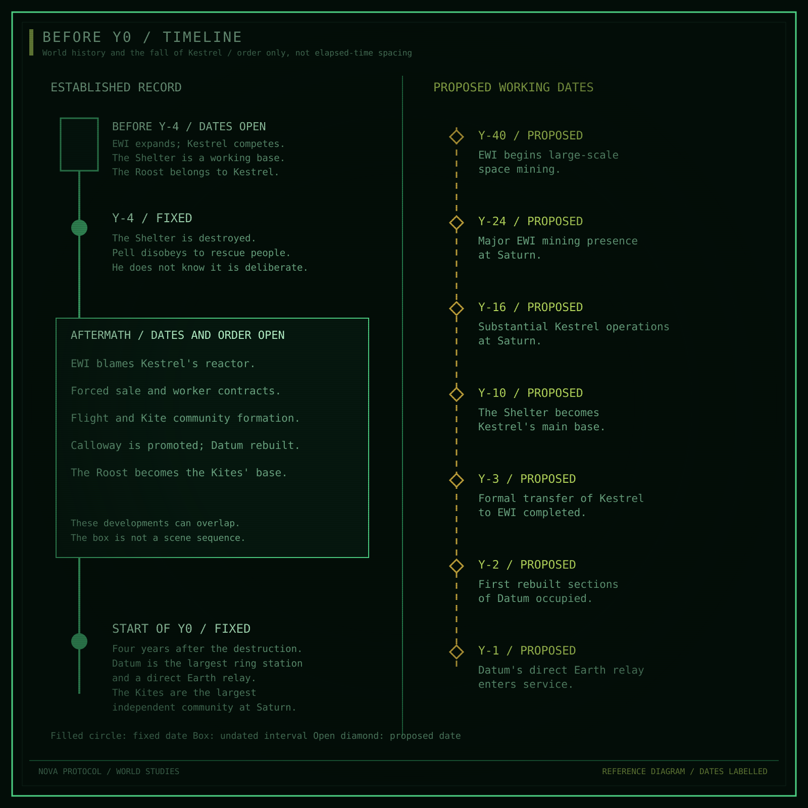

Atlas / Established sequence and proposed dates

# Timeline

**Y0 is the book's reference year.** Y-4 is four years earlier. No date in an
Earth calendar, numbered century, month system, or in-universe epoch is fixed.
The record ends at the start of Y0; it does not schedule future events.

This timeline has two layers. The first records established events and their
known order. The second proposes dates to give the earlier world more depth.
Those dates must be reviewed together rather than silently becoming canon
through repetition on individual pages.

<figure class="plate">

<figcaption>Filled circles mark fixed dates, a box marks undated developments, and open diamonds mark proposed years. Spacing is not proportional to elapsed time. The tables below provide the full text record.</figcaption>
</figure>

The timeline is reference material. [The Fall of Kestrel](../story/fall-of-kestrel.md)
connects motives, choices, consequences, and proposed motifs. That brief supplies
one historical thread; the Atlas also records histories that do not originate
with the Shelter.

## Established sequence

| Date or interval | Event | What remains unknown |
| --- | --- | --- |
| Before Y-4; dates open | EWI mines on Earth and gains an early lead in large-scale space mining | Founding date, first space operations, and expansion milestones |
| Before Y-4; dates open | Kestrel operates as a substantial independent competitor with better worker rights | Founders, growth, and the basis of its competitive position |
| Before Y-4 | The Shelter serves as Kestrel's main base; the Roost is a Kestrel station | The stations' ages, layouts, and the Roost's original role |
| Y-4 | EWI deliberately destroys the Shelter with a charge placed by a crew who believe it is for breaking ice | Exact date, placement circumstances, casualty count, and additional participants |
| Y-4, in response to the destruction | Pell disobeys orders and rescues Kestrel people without knowing the attack was deliberate | Exact orders, rescue sequence, and numbers |
| After the destruction | EWI presents the catastrophe as Kestrel's reactor failure and blames Kestrel | How that account is distributed, investigated, and accepted |
| After the destruction, before Y0 | The aftermath forces Kestrel to sell; EWI takes over its interests and contracts former workers | Legal and financial sequence; the timing of practical control versus final transfer |
| After the destruction, before Y0 | Survivors and contract refusers form the Kites' human foundation; Pell becomes a Kite | First organisation, adoption of the name, and stages of growth |
| After the destruction, before Y0 | Calloway receives promotion; EWI rebuilds the site as Datum under his authority | Appointment date, construction stages, and the extent of reused structure |
| By the start of Y0 | Datum is the largest station in the rings and a direct Earth communications relay | Opening dates, the measure of size, and alternative communications |
| By the start of Y0 | The Kites are Saturn's largest independent community, based at the Roost | Date of occupation, resident numbers, and the basis of concealment |

The undated aftermath rows are not a precise order between every event.
Contracts, flight, reconstruction, and community formation may overlap. No
exact sequence is fixed beyond the dependencies stated in the articles.

## Proposed working chronology

<aside class="proposal">
<strong>All dates in this section are proposals</strong>

Recommendation: give industrial expansion several decades, then keep the four-year aftermath crowded and unfinished. This lets the world have careers and institutions older than the Shelter incident. The dates below are working placements, not newly approved facts.

</aside>

| Proposed year | Working milestone | Purpose and consequence |
| --- | --- | --- |
| Y-40 | EWI begins large-scale space mining | Gives the company a space-industrial history before Saturn's present crisis; does not date its terrestrial founding |
| Y-24 | EWI establishes a major mining presence at Saturn | Leaves time to build dependencies and a resident workforce before Kestrel's fall |
| Y-16 | Kestrel has substantial Saturn operations | Gives it an independent operating history rather than making it a brief interruption to EWI control |
| Y-10 | The Shelter becomes Kestrel's main base | Allows six years of life under that arrangement before Y-4; does not require a newly built station |
| Y-3 | Kestrel's formal transfer to EWI is completed | Allows practical emergency dependence to precede final paperwork; does not make all worker contracts simultaneous |
| Y-2 | Datum's first rebuilt sections are occupied | Introduces phased reconstruction, subject to a viable construction and transport model |
| Y-1 | Datum's direct Earth relay enters service | Places the established Y0 capability before the reference point without making it humanity's first Earth link |

Y-4 and Y0 remain the fixed anchors around these proposals. No proposed row
moves the destruction or changes the four-year interval.

## Dates that should remain open for now

- EWI's founding and the beginning of its terrestrial monopoly power.
- Fleet's formation and changes to its mandate.
- Kestrel's founding and the Roost's original construction or closure.
- Calloway's appointment and the first planning of Datum.
- The Kites' naming, first shared government, and occupation of the Roost.
- Birth dates, ages, and career starts for Pell, Halloran, Okono, and Calloway.

Those dates depend on institutional and character decisions not yet made.
Giving each an arbitrary year would add precision without adding a usable
history.

## Parallel histories

The Shelter is the central established incident, not the origin of everything.
Earth's industrial damage, Fleet's political culture, family migration, and
other pirate communities need histories of their own. Their eventual
chronologies must not imply that all exploitation or resistance began in Y-4.

The proposed span also raises a demographic question: how much life at Saturn
is organised around temporary recruits, and how much around people who regard
it as their permanent home? No birth, school, or generation at Saturn is fixed
by the dates alone.

## Review dependencies

Before accepting the proposed years, review [transport](../questions/world.md#transport-and-cargo),
[construction](../questions/world.md#habitats-and-gravity),
[collapse](../questions/history.md#collapse-and-transfer), and
[calendar and chronology](../questions/history.md#calendar-and-chronology).
The [story brief](../story/fall-of-kestrel.md#truth-account-and-knowledge)
holds the event's detailed knowledge boundary.
