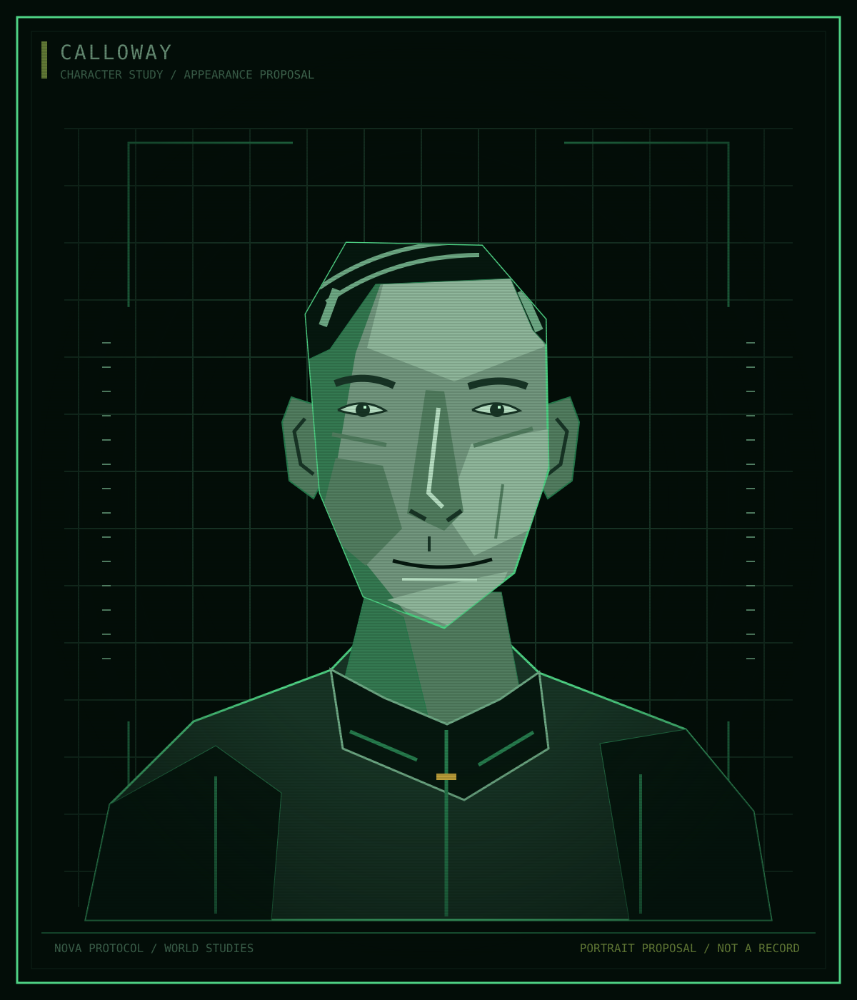

Atlas / Characters / Datum

# Calloway

<table class="infobox">
<caption>Calloway</caption>
<tbody>
<tr><td colspan="2" class="image">
Appearance proposal. No military rank, insignia, or ancestry is established.
</td></tr>
<tr><th scope="row">Position at Y0</th><td>Station director of Datum</td></tr>
<tr><th scope="row">Formal address</th><td>Director Calloway</td></tr>
<tr><th scope="row">Affiliation</th><td>EWI</td></tr>
<tr><th scope="row">The Shelter</th><td>Knew the charge's true purpose, with the Board</td></tr>
<tr><th scope="row">Earlier connection</th><td>Pell's superior in Y-4</td></tr>
<tr><th scope="row">First name, age, prior rank</th><td>Open</td></tr>
</tbody>
</table>

**Calloway** is the station director of [Datum](../locations/datum.md). He was
rewarded with promotion after the destruction of the Shelter, an attack whose
real purpose he knew alongside EWI's Board. His advancement is an established
outcome, not an innocent career change made suspicious only by later events.

## Established history

In Y-4, Pell served under Calloway in EWI. Calloway and the Board were the only
people who knew the demolition charge's actual purpose. The crew placing it
believed it was for breaking ice and died in the explosion along with people
at the Shelter.

Pell disobeyed orders and went to rescue Kestrel people. The rescue separated
him from EWI. Calloway was subsequently promoted and placed in charge of the
station EWI rebuilt at the ruined site. By Y0, Datum is the largest station in
the rings and a direct Earth communications relay.

Calloway's exact earlier rank, route to that appointment, and the terms of a
prior promise remain open. It is not established that a complete Datum
redevelopment plan existed before the attack. His position gives authority at
Datum, not command of all EWI or Fleet.

## Knowledge and responsibility

Unlike the placement crew, Pell, Halloran, or Okono, Calloway knew the charge's
true purpose at the time. The official reactor account is therefore a cover
account from the author's perspective, not a mistake the story needs to excuse
in him. His exact participation in drafting or distributing that account is
not yet established.

<aside class="proposal">
<strong>Character development proposal</strong>

The following appearance, habits, motives beyond the established ambition, personality, and voice are a draft. They deepen Calloway without revising his responsibility or inventing private meetings and promises.

</aside>

## Appearance and bearing

The portrait proposes carefully parted hair, a narrow face, a high collar,
and controlled stillness. Clothing fits and is maintained. The contrast with
worker portraits concerns access and presentation, not a fixed EWI uniform or
proof of a military rank. Age and ancestry remain open.

## Personality

Calloway is attentive to the order of a meeting, who is entitled to ask a
question, and which account will remain after everyone leaves. He can be
courteous, remember details, and arrange work competently. His cruelty need
not announce itself in every ordinary exchange.

He treats his own ambition as responsible stewardship and other people's
resistance as disruption. Praise is personal; blame is procedural. Greed and
cowardice coexist because the risks that advance him are usually borne by
people with less power.

His weakness is not universal stupidity but the need to remain the person who
appears to have anticipated events. When someone demonstrates a limit to his
control, he can become more concerned with restoring his position than solving
the practical problem. This is a proposed character fault, not a prescribed
future downfall.

## Goals and aspirations

**Immediate:** maintain Datum's output, his standing with the Board, and the
appearance that his authority produces order. Which targets and reporting
arrangements define that standing remain open.

**Longer term:** make his promotion feel like recognition of an indispensable
administrator, not a favour that can be withdrawn. He wants security through
importance, which makes him dependent on the institution that rewards him.

**Private:** receive respect that does not appear to be purchased or commanded.
As a social proposal, he takes care over hosting and remembers a guest's
preferences. That attention can be genuine enjoyment and a way of controlling
a room at the same time. It is not evidence of hidden innocence.

**Fear:** being expendable to the Board in the way he treats workers as
expendable. He need not acknowledge that comparison to himself.

## Relationships

| Person or group | Established connection | Proposed pressure |
| --- | --- | --- |
| EWI's Board | Shared knowledge of the attack; subsequent promotion | Approval offers advancement but not guaranteed security |
| Pell | Former subordinate who disobeyed during the rescue | Disobedience challenges Calloway's account of legitimate authority; private feelings remain to be reviewed |
| Datum's workers | Subject to his station authority within EWI | He may know enough particulars to manage them without treating their wants as equally important |
| Halloran and Okono | No personal relationship established | Their employment does not imply direct encounters, special suspicion, or a shared ship history |

## Voice

Calloway speaks in complete, measured sentences. He offers acknowledgement
without conceding the substance of a complaint. He uses impersonal language
for harm and active language for success. Under pressure he narrows the allowed
question or invokes the person entitled to decide it. His polish can slip.

**Likely vocabulary:** appropriate, continuity, reviewed, available, agreed,
responsibility, authorisation. Do not use all of them in every line.

**Sample voice, not established dialogue:**

> "I understand the request. Approval is a separate matter."

> "We can discuss the arrangement. We are not suspending it."

Avoid speeches that confess the attack to people who do not know about it.
A courteous sentence can enforce a cruel choice without mentioning a reactor,
a conspiracy, or a plan for future violence.

## Open questions

What was Calloway's previous authority? How did he become useful to the Board?
What can he decide at Datum, and what must he seek approval for? What does his
public reputation look like to people who know only the reactor account? Who
can challenge him in private without immediately losing their position?

See [management and the Board](../questions/power.md#management-and-the-board),
[the story brief](../story/fall-of-kestrel.md#pressure-and-purpose), and
[titles and address](../language.md#titles-and-forms-of-address).
