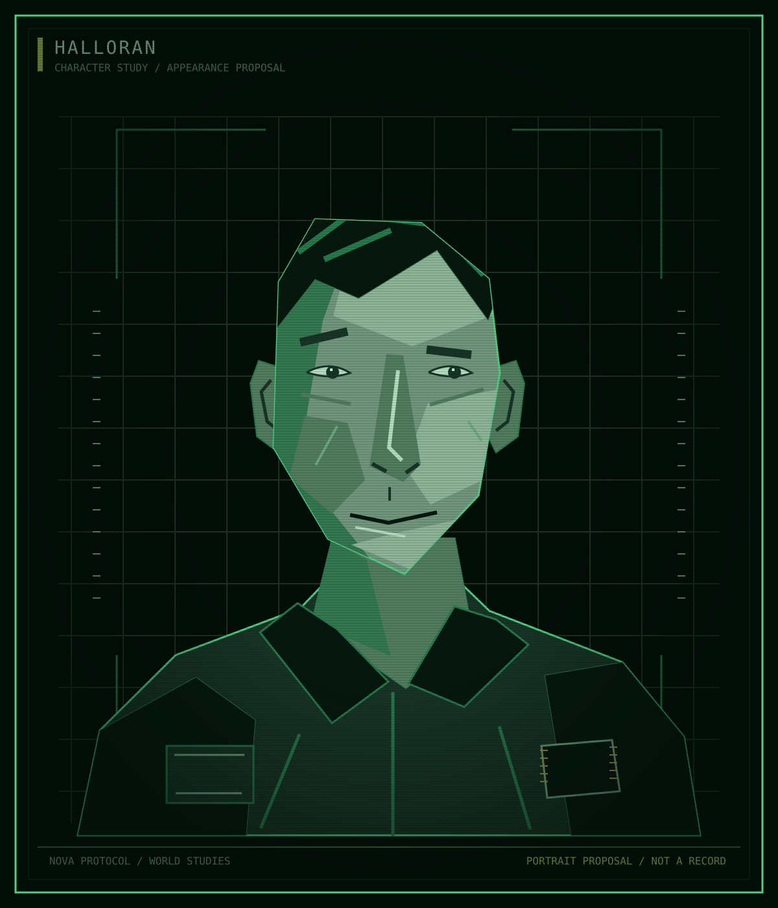

Atlas / Characters / Former Kestrel employee

# Halloran

<table class="infobox">
<caption>Halloran</caption>
<tbody>
<tr><td colspan="2" class="image">
Appearance proposal. No age, ancestry, or job is fixed by the portrait.
</td></tr>
<tr><th scope="row">Employment history</th><td>Kestrel, then EWI after the forced sale</td></tr>
<tr><th scope="row">First name and age</th><td>Open</td></tr>
<tr><th scope="row">Role and assignment</th><td>Open; Meridian assignment not decided</td></tr>
<tr><th scope="row">Shelter connection</th><td>Employer's main base; location during attack open</td></tr>
</tbody>
</table>

**Halloran** experienced Kestrel employment before being brought under EWI
contracts after the forced sale. That gives Halloran a practical comparison
between two ways of organising industrial work. It does not automatically
supply a political allegiance, a dead relative, or a place at the Shelter
during the attack.

## Established history

Kestrel offered better worker rights than EWI. Halloran worked for Kestrel and
was among the former workers brought into EWI employment after the destruction
and collapse. The transfer was part of a forced corporate sale; its exact
papers and consequences for a particular employee remain open.

Halloran's first name, age, pronouns, job, current assignment, and earlier life
are not established. In particular, Halloran is not yet a confirmed member of
Meridian's crew. A relationship with Okono, Pell, or Calloway must not be inferred
merely because these are the four named people in the book.

## Knowledge

Halloran knows the experience of both employers. That does not establish
knowledge of sabotage. Presence at the Shelter, direct observations, later
suspicions, and evidence at Y0 remain open. Anger about the acquisition could
be justified without knowing the cause of the explosion.

<aside class="proposal">
<strong>Character development proposal</strong>

The following appearance, personality, motives, personal habits, and voice are a draft for review. They do not settle Halloran's role, current ship, or connection to the attack.

</aside>

## Appearance and bearing

The portrait proposes an angular face, short uneven hair, an alert sideways
look, and a jacket repaired rather than replaced. One raised eyebrow gives the
expression a questioning quality without making Halloran permanently sneer.
Age, gender presentation, ancestry, and the reason for any wear remain open.

## Personality

Halloran notices the difference between what a person promised and what they
later describe as unavoidable. A good memory for particulars supports dry
humour and practical scepticism. Halloran is less impressed by a slogan than
by a right someone has actually been allowed to use.

The weakness is scorekeeping. Being correct about a broken promise can become
more important than recognising that another worker is also trapped. Humour
can expose a supervisor's evasion or embarrass a colleague who cannot afford
to answer back. Halloran should not always occupy the morally correct side of
a conversation merely because Kestrel was the better employer.

For the earlier personal outlook, propose someone who valued predictability
more than loyalty to a brand. Kestrel made some form of ordinary planning
possible. The exact right and the plan it supported are still open. That gives
the lost employer meaning without inventing an ideal childhood or a personal
bereavement at the Shelter.

## Goals and aspirations

**Immediate:** regain some control over work and a credible ability to leave.
Halloran wants answers that change conditions, not just an admission that the
conditions are bad.

**Longer term:** live somewhere that does not make shelter conditional on one
employer's approval. That could mean remaining at Saturn under different terms;
it does not automatically mean return to Earth or joining the Kites.

**Private:** be valued for more than detecting what is wrong. As a small social
detail, propose a taste for competitive table games and an unreliable ability
to stop commenting on other people's moves. Enjoyment and irritating habits
can share a source without becoming a symbolic lesson in every scene.

**Fear:** accepting so many small reductions that the old right begins to seem
imaginary. This is different from wanting every aspect of Kestrel restored.

## Relationships

| Person or group | Established connection | Proposed pressure |
| --- | --- | --- |
| Kestrel workers | Shared former employer; individuals not named | Different memories complicate a simple account of what was lost |
| EWI | Employment after the sale | Dependence without loyalty; an argument can cost more than pride |
| Okono | No current working relationship established | If assigned together, familiar workarounds may look like complicity to Halloran and necessity to Okono |
| Pell | No personal relationship established | Shared dislike of EWI need not mean agreement with his methods |

## Voice

Halloran prefers a pointed question, a concrete comparison, or a short remark
to a long speech. Humour is dry and often arrives after a pause. Under real
pressure the jokes stop; the demand becomes narrower and more exact.

**Likely vocabulary:** agreed, changed, paid, due, enough, before, show me.
Use comparisons to Kestrel when they matter, not as a catchphrase.

**Sample voice, not established dialogue:**

> "That is the third meaning you've given the same promise."

> "I asked when we could leave. You told me why we should stay."

When comfortable, Halloran can be curious and playful. Avoid making every
exchange a confrontation or making sarcasm a substitute for a developed
relationship.

## Open questions

What work does Halloran do? Which Kestrel right mattered personally? Is Halloran
currently assigned to Meridian alongside Okono, or elsewhere? Who depends on
Halloran, and who is allowed to point out when a joke has become cruel? What
would practical independence look like without an assigned future escape?

See [personal histories](../questions/history.md#personal-histories),
[Meridian](../ships/meridian.md#crew-relationships), and
[current relationships](../questions/history.md#current-wants-and-relationships).
