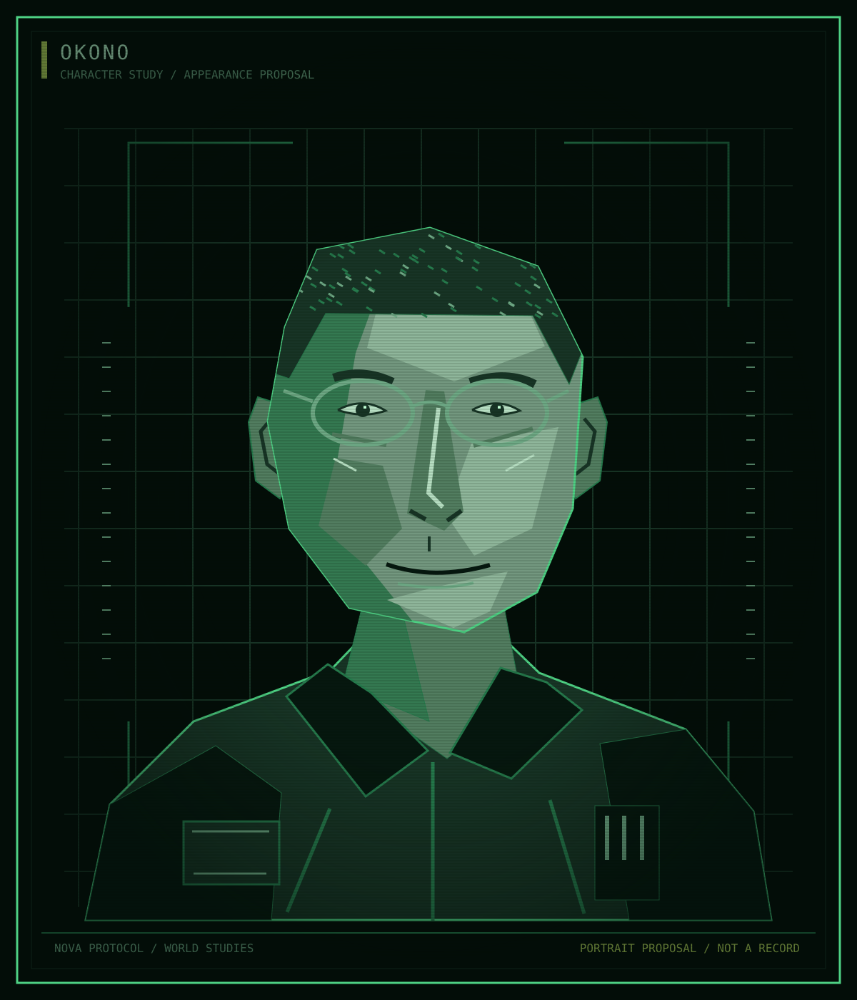

Atlas / Characters / Meridian

# Okono

<table class="infobox">
<caption>Okono</caption>
<tbody>
<tr><td colspan="2" class="image">
Appearance proposal. Glasses and work clothing are not approved equipment specifications.
</td></tr>
<tr><th scope="row">Affiliation</th><td>EWI</td></tr>
<tr><th scope="row">Profession</th><td>Engineer</td></tr>
<tr><th scope="row">Assignment</th><td>Meridian, throughout his career</td></tr>
<tr><th scope="row">The Shelter</th><td>Serving during the period; no complicity in the attack</td></tr>
<tr><th scope="row">First name, age, seniority</th><td>Open</td></tr>
</tbody>
</table>

**Okono** is an engineer assigned to [Meridian](../ships/meridian.md). He has
spent his career with that ship, including the period of the Shelter's
destruction. EWI is his established professional environment, not proof of his
approval of the company or knowledge of its crimes.

## Established history

Okono's career-long assignment and engineering profession are fixed. His exact
career length, training, seniority, and command responsibilities are not.
"Engineer" must not silently become "chief engineer", captain, or the designer
of equipment used in the attack.

He had no complicity in the Shelter attack. Meridian's location and task during
Y-4 remain open. The ship is not placed at the attack site simply because its
engineer was serving in EWI at that time.

## Knowledge

Okono's technical competence does not give him the explanation available to the
author. Neither direct observations of the event nor later suspicions or proof
are established. A technical opinion, if eventually assigned to him, would need
to follow from something he could actually examine or learn.

<aside class="proposal">
<strong>Character development proposal</strong>

The following appearance, earlier outlook, personality, aspirations, habits, and voice form a draft for review. No nationality or accent is inferred from his surname.

</aside>

## Appearance and bearing

The portrait proposes a rounded face, short textured hair, thin work glasses,
and an open utility collar. Okono looks attentive rather than permanently
exhausted. The glasses and clothing are visual choices, not a claim about
medical history, technology, or uniform regulations. His exact age remains open.

## Personality

Okono separates what is functioning from what is safe. He is patient with
someone willing to learn and irritated by confidence that substitutes for
understanding. He tends to describe a consequence rather than accuse a person
of bad intentions.

His strength can conceal his predicament. Quietly solving a fault keeps people
safe today, but can make the cost of management's decisions disappear from
view. He can mistake the fact that he has found a workaround for evidence that
a condition is tolerable. This does not make him responsible for EWI's abuse;
it creates a personal disagreement worth exploring.

For his earlier outlook, propose that attachment to the craft and the familiar
ship grew stronger than attachment to the company. Meridian can feel like a
place he knows how to inhabit even when EWI is the reason life aboard it is
constrained. How he first obtained the assignment remains open.

## Goals and aspirations

**Immediate:** keep Meridian and the people aboard it safe enough to work
without concealing what the work actually costs them.

**Longer term:** have enough authority over maintenance to stop calling a
continuing emergency ordinary operation. This is not automatically a wish for
promotion, command, or ownership of the ship.

**Private:** have something useful to offer people when nothing is broken.
As a small social proposal, he enjoys cooking for a few others and dislikes
being asked to explain the method before they have tasted the result. Not
every pleasure needs to resemble engineering.

**Fear:** an avoidable failure occurring after he has assured someone that a
workaround will hold. What risks he will refuse needs review; do not assign a
past fatal accident merely to explain this fear.

## Relationships

| Person or group | Established connection | Proposed pressure |
| --- | --- | --- |
| Meridian's crew | Career-long ship assignment; other individuals not fixed | Trust built through work may also make people expect endless accommodation |
| EWI management | Employer's authority over the work | Competence can attract more responsibility without more control |
| Halloran | No current shared assignment established | If they work together, their disagreement should concern real choices, not a debate staged between company slogans |
| Pell and the Kites | No personal link or allegiance established | Respect for practical care need not become automatic trust in armed resistance |

## Voice

Okono makes distinctions: what is known, what is likely, and what cannot yet
be promised. He does not hedge everything. When the situation requires action,
he gives short instructions and names the relevant limit. In comfortable
company he can tell an anecdote without turning it into a lesson.

**Likely vocabulary:** holds, fails, ready, checked, enough, safe, not yet.
Specific technical terms should depend on systems the book actually establishes.

**Sample voice, not established dialogue:**

> "It runs. That is not the same as being ready."

> "Give me the symptom first. We can argue about the cause after that."

Avoid making him an emotionless source of explanations. Technical language can
be accurate without being obscure, and a person who explains a fault can still
be poor at explaining why they are unhappy.

## Open questions

What is Meridian's primary work? What does Okono have authority to stop? How
long has he served, and who taught him? Is Halloran a current crewmate? What
makes Okono refuse a workaround rather than perform another one? What else does
he want from life, and who knows that part of him?

See [Meridian](../ships/meridian.md), [maintenance](../questions/world.md#food-health-and-maintenance),
and [current wants](../questions/history.md#current-wants-and-relationships).
