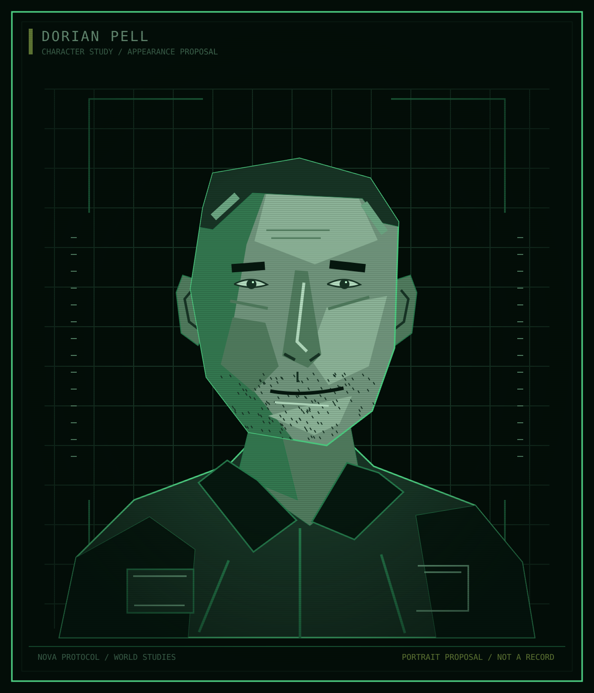

Atlas / Characters / The Kites

# Dorian Pell

<table class="infobox">
<caption>Dorian Pell</caption>
<tbody>
<tr><td colspan="2" class="image">
Appearance proposal. Clothing does not establish rank or faction colours.
</td></tr>
<tr><th scope="row">Affiliation at Y0</th><td>The Kites</td></tr>
<tr><th scope="row">Earlier service</th><td>EWI, under Calloway</td></tr>
<tr><th scope="row">Established action</th><td>Disobeyed orders to rescue Kestrel people in Y-4</td></tr>
<tr><th scope="row">Rank and age</th><td>Open</td></tr>
<tr><th scope="row">Current authority</th><td>Open; armed-faction leadership proposed</td></tr>
</tbody>
</table>

**Dorian Pell** is a Kite whose separation from EWI began with his rescue of
Kestrel people during the Shelter's destruction. He acted without knowing the
explosion was deliberate. His decision belongs to what he could see and do at
the time, not to knowledge of the Board's plan.

## Established history

In Y-4, Pell served under Calloway in EWI. He disobeyed orders and went to rescue
people at the Shelter. That rescue separated him from EWI and led to his
becoming a Kite. No exact order, rank, earlier ship assignment, rescue count,
or additional rescue participant is established.

At Y0, the Kites are Saturn's largest independent community. Pell belongs to
that community; he is not established as its founder, sole leader, or elected
representative. How separation became membership remains part of
[The Fall of Kestrel](../story/fall-of-kestrel.md#displacement-and-community).

## Knowledge

Pell did not know the attack was intentional. His later suspicions and any
evidence at Y0 remain open. Anger at Calloway or knowledge of EWI's treatment of
workers would not, by themselves, prove sabotage. His rescue gives him an
experience to describe, not an automatic explanation of the whole event.

<aside class="proposal">
<strong>Character development proposal</strong>

The appearance, earlier personal outlook, traits, wants, relationships beyond the facts above, and voice below are a coherent draft for review. They are not additional established history.

</aside>

## Appearance and bearing

The portrait proposes close-cropped hair, a broad, tired face, stubble, and
clothing kept serviceable rather than uniform. Pell holds himself as if ready
to move before a conversation has finished. His exact age, physical history,
and any scars or injuries remain open; the drawing establishes none of them.

## Personality

Pell is attentive to who will bear a decision's cost. He is less interested in
whether an arrangement sounds fair than in whether a particular person can
survive it. Directness and practical care make him useful in a crisis. They can
also make him impatient with people who need time to think or disagree.

His central contradiction is that he opposes ownership of people but can act
as if responsibility for them gives him the right to choose for them. He can
mistake refusal of his advice for indifference to danger. That is a fault to
explore, not proof that he will become a tyrant.

For his earlier outlook, consider someone who joined EWI believing clear duties
and competent crews could make difficult work worthwhile. The rescue need not
be a sudden conversion from cruelty to goodness. It can expose a limit that
had never before been tested so sharply. The actual recruitment history is
still to be chosen.

## Goals and aspirations

**Immediate:** keep people outside EWI control alive and able to refuse it.
The proposed armed-faction role would give him a practical way to act, while
also making his priorities compete with residents' needs.

**Longer term:** help create a community that no employer can dissolve by
withdrawing a contract. He may be better at resisting threats than imagining
what an ordinary secure life would look like.

**Private:** have relationships that do not depend on someone needing rescue
or protection. As a small social detail, propose that he enjoys preparing food
for other people more than attending a meeting held in his honour. Care need
not always appear as force.

**Fear:** leaving someone behind because procedure made inaction seem sensible.
That fear can distort judgement without giving him proof of the Shelter attack.

## Relationships

| Person or group | Established connection | Proposed pressure |
| --- | --- | --- |
| Calloway | Former superior; Pell disobeyed orders during the rescue | Pell rejects the authority Calloway represents; the exact private history stays open |
| The Kites | Pell is a member | Armed leadership may create tension between protection and consent |
| Halloran | No personal relationship established | If they know each other, Halloran can challenge whether Pell's demands leave a real choice |
| Okono | No personal relationship established | If they meet, neither competence nor EWI service should determine trust automatically |

## Voice

Pell uses people's names, active verbs, and concrete obligations. He tends to
ask who is affected before asking how a decision is justified. Under pressure,
his sentences shorten and he interrupts abstract explanations. In comfort, he
can be dry rather than solemn.

**Likely vocabulary:** people, room, enough, leave, owe, decide, still here.
These are tendencies, not required words in every line.

**Sample voice, not established dialogue:**

> "Tell me who goes without. Then tell me why."

> "You can disagree with me. You still get a place at the table."

The second line describes an ideal he should have to practise, not a guarantee
that he never fails it. Avoid making every speech a manifesto or every mention
of Calloway an accusation supported by facts Pell does not possess.

## Open questions

What authority does Pell hold? Who can refuse him? What earlier relationships
matter more to him than his position? What methods would make someone call him
a fanatic, and whose judgement would that be? Which aspects of this proposed
protectiveness appeal to him, and which does he recognise as a problem?

See [current wants and relationships](../questions/history.md#current-wants-and-relationships),
[the Kites' government](../questions/power.md#the-kites), and
[the language guide](../language.md#character-voice).
