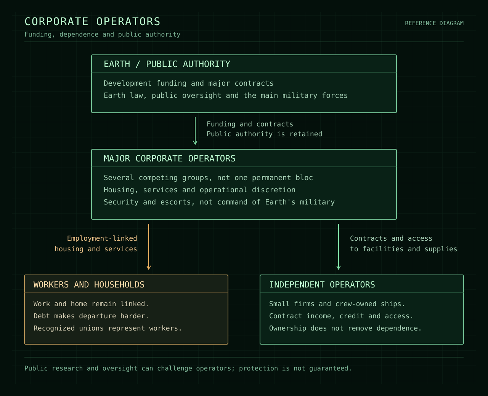

Nova Protocol / Encyclopedia / Organizations

# Corporate operators

This article concerns the major companies as a group.
Individual companies have not yet been named or assigned specific holdings.

<table class="infobox">
<caption>Corporate operators</caption>
<tr><th scope="row">Type</th><td>Commercial organizations</td></tr>
<tr><th scope="row">Area of activity</th><td>Saturn's developing settlement network</td></tr>
<tr><th scope="row">Economic basis</th><td>Earth-backed development and local demand</td></tr>
<tr><th scope="row">Legal position</th><td>Facility operators under Earth law</td></tr>
<tr><th scope="row">Workforce</th><td>Primarily recruits from existing Earth operations</td></tr>
<tr><th scope="row">Armed forces</th><td>Security and escorts</td></tr>
</table>

**Corporate operators** are the major commercial groups involved in the early
settlement and industrial development of Saturn. Their projects combine
resource production with construction, transport, and permanent habitation.
Several groups compete for contracts and influence; no single company controls
the entire development program.

The operators' power extends beyond the employment relationship. Control of
facilities, housing, and services gives them substantial influence over the
lives of residents and the businesses that supply the settlements. They remain
subject to Earth law, but operational discretion and compromised oversight
allow them to restrict rights in practice.

## Development and operations

Earth funds infrastructure and guarantees major contracts. The companies earn
income from building and operating the settlement network while seeking
long-term control of facilities and markets. The local economy is not yet
expected to support itself.

Production initially serves Saturn's expansion. Extraction, processing,
construction, maintenance, and logistics supply growing settlements. The
allocation of these activities among individual companies remains undefined;
this overview does not give each industry an exclusive owner.

<figure class="plate">

<figcaption><strong>Visual concept.</strong> Station housing and industrial
structures share one installation. Its architecture, apparent scale, nearby
ships, and position relative to Saturn are proposals, not an approved place or
engineering design. <a href="../images/encyclopedia/industrial-station-concept.svg">Open illustration</a>.</figcaption>
</figure>

## Workforce and residency

Recruitment primarily transfers existing workers from Earth. Relocation is
voluntary, but economic pressure makes refusal difficult. Some recruits intend
to complete their work and return; others bring households and consider Saturn
their permanent home.

Housing and essential services depend on approved employment. Losing an
assignment can therefore threaten a household's place in the settlement. Debt
and the cost of departure make leaving harder, reinforcing the dependence
created by employment-linked residency.

Recognized unions and workplace representatives operate within this system.
Their presence is normal, but recognition does not ensure effective protection.
Representation as an employee is distinct from the still-unsettled question of
representation as a resident.

## Authority and public oversight

Operators use safety requirements and operational necessity to justify
restrictions. The hazards are real, but their application is selective.
Continuing expansion creates repeated grounds for extending measures described
as temporary.

Earth retains public authority and control of the main military forces.
Companies maintain security and escort forces; major military intervention
requires a state decision. Corporate influence can secure public support, but
it is not automatic command of Earth's military.

Public oversight and public-service research provide possible checks on
operators' claims. Government corruption, funding pressures, and deference to
facility management can weaken those checks. A finding that contradicts an
operator does not guarantee intervention.

<figure class="plate">

<figcaption><strong>Reference diagram.</strong> Selected relationships from the
agreed setting. Arrows describe funding and dependence, not a complete chain
of command. The separation of state military power from company security is
intentional. <a href="../images/encyclopedia/corporate-relationships.svg">Open diagram</a>.</figcaption>
</figure>

## Competition and independent businesses

The major groups share an interest in preserving employer control, but they do
not form a single permanent bloc. Competition for contracts and influence can
create openings for workers, officials, and smaller businesses without making
a rival company benevolent.

Independent operators can negotiate contracts and serve different customers,
but access to facilities and supplies remains important to their survival.
Debt-financed crews are particularly vulnerable to losing a major contract.
Independence provides choices, not freedom from the larger companies' power.

## Related subjects

- [Expansion and economy](../setting.md#expansion-and-economy)
- [Homes and working lives](../setting.md#homes-and-working-lives)
- [Rights and company control](../setting.md#rights-and-company-control)
- [State authority and security](../setting.md#state-authority-and-security)
- [Worker representation](../setting.md#worker-representation)
- [Independent operators and salvage](../setting.md#independent-operators-and-salvage)
- [Encyclopedia index](index.md)
