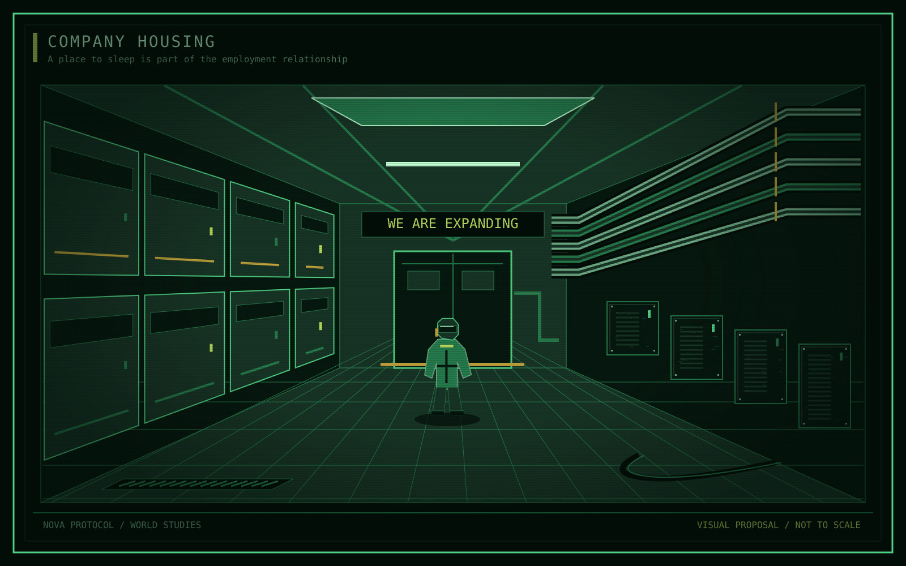

Institution / Industry and labour

# EarthWorks Industrial

<table class="infobox">
<caption>EarthWorks Industrial</caption>
<tbody>
<tr><th scope="row">Abbreviation</th><td>EWI</td></tr>
<tr><th scope="row">Origin</th><td>Earth</td></tr>
<tr><th scope="row">Leadership</th><td>EWI's Board</td></tr>
<tr><th scope="row">Principal business</th><td>Mining on Earth and in space</td></tr>
<tr><th scope="row">Saturn objective</th><td>Monopoly over ring mining</td></tr>
<tr><th scope="row">Major station</th><td>Datum, managed by Calloway</td></tr>
<tr><th scope="row">Naming</th><td>Survey terms for ships and stations</td></tr>
<tr><th scope="row">Slogan</th><td>"We are expanding"</td></tr>
</tbody>
</table>

**EarthWorks Industrial (EWI)** is an Earth-origin mining corporation with a
poor public reputation and extensive political influence. Its terrestrial
operations remain active. Pollution, damaged landscapes, and abusive labour
conditions are part of its public image. Knowledge of those practices is not
knowledge of its secret responsibility for [the Shelter](../locations/shelter.md).

Its [Board](board.md) treats workers as expendable and expansion as a continuing
claim on resources and lives. In Saturn's rings, distance and dependence make
its labour system especially difficult to escape.

<aside class="proposal">
<strong>Proposed dates: Y-40 and Y-24</strong>

Place the beginning of EWI's large-scale space mining in Y-40 and a major Saturn mining presence in Y-24. These working milestones give its space business a history older than the Shelter crisis. They do not date its terrestrial founding or establish that it invented spaceflight.

</aside>

<nav class="article-toc" aria-label="Article contents">
<strong>Contents</strong>
<ol>
<li><a href="#employment-without-an-exit">Employment without an exit</a></li>
<li><a href="#direct-and-licensed-operations">Direct and licensed operations</a></li>
<li><a href="#expansion-and-violence">Expansion and violence</a></li>
<li><a href="#different-experiences">Different experiences</a></li>
<li><a href="#open-questions-and-gaps">Open questions and gaps</a></li>
</ol>
</nav>

## Employment without an exit

EWI controls more than wages. In its direct operations, it also controls housing,
essential supplies, and access to passenger transport. Deductions and
company-controlled prices prevent most workers from saving enough to leave.
Leave is rare. Cargo takes priority over the expense of moving people.

A contract can appear temporary while the dependence it creates is not.
Completing work does not necessarily produce a berth on a ship home. Workers
may send credits to relatives on Earth while remaining unable to join them.

This is a coercive labour system, not simply an unpopular employer. Refusing
work threatens the means of staying alive. Joining an independent community
exchanges that control for scarcity and exposure; it is not a comfortable exit.
Exact contract clauses, deductions, and transport obligations are not yet fixed.

<figure class="plate">

<figcaption>Company housing, visual proposal. The scale of the machinery dominates the space left for its occupants. This is not a floor plan.</figcaption>
</figure>

<aside class="proposal">
<strong>Proposed everyday texture</strong>

Machinery vibrates through sleeping compartments. Worn seals and leaking equipment wait for maintenance while extraction continues. On Earth, the same priorities leave dust, smoke, oil spills, and dried lakes; in space, the damage enters the places workers must breathe and sleep.

</aside>

## Direct and licensed operations

EWI owns and runs substantial facilities itself. [Datum](../locations/datum.md)
is one of them. Smaller [licensed operators](operators.md#licensed-operators)
work under its terms without being identical to EWI departments. Dependence on transport, servicing, purchasing,
or facilities limits their practical freedom.

Local management is uneven, not harmless. A manager may tolerate irregular
salvage because it keeps equipment working. Another may suppress it. Managers
can also hide their own failures from superiors. The resulting gaps permit
activity that the Board would oppose if it understood its full extent.

## Expansion and violence

EWI uses financial pressure, manipulation, and coercion to ruin competitors or
force sales. Acquiring a working operation preserves equipment, labour, and
income. Openly destroying one carries costs even for a politically dominant
company.

The Shelter demonstrates that those costs do not rule out deliberate mass
killing. Calloway and the Board concealed the attack as Kestrel's own reactor
failure. The destruction and its aftermath forced Kestrel to sell. Calloway
was promoted and placed in charge of the rebuilt station, Datum.

EWI's power reaches [Earth](../locations/earth.md) and [Fleet](fleet.md).
That influence enables selective enforcement and protection of corporate
interests. It does not make every act of violence useful or every worker loyal.

## Different experiences

**Halloran** worked for Kestrel and was brought under EWI employment after the
forced sale. Kestrel was industrial and much smaller than EWI, but offered
better worker rights. Halloran can compare those conditions directly.
Halloran's location during the destruction is not established.

**Okono** has spent his career as an engineer assigned to Meridian, including
at the time of the Shelter's destruction. That service does not make him
complicit in the attack. Familiarity with EWI conditions does not establish
approval of them. Neither character's knowledge or suspicions at Y0 are fixed.

See [Halloran](../characters/halloran.md) and [Okono](../characters/okono.md)
for their individual histories and proposed present concerns. Neither employment history establishes a current relationship between
them or an assigned future role.

## Relationships

- **The Board:** EWI's leadership directs the corporation; it is not a separate
  company. Only the Board and Calloway knew the Shelter charge's true purpose.
- **Earth and Fleet:** resource dependence and political influence protect
  corporate interests. This does not make every resident or officer loyal.
- **Kestrel:** a substantial rival was forced to sell. Its people were absorbed,
  displaced, or fled; Kestrel is not an established surviving rival at Y0.
- **Licensed operators:** EWI imposes terms while retaining direct operations of
  its own. Independence in name need not mean practical bargaining power.
- **The Kites and other independents:** local tolerance of useful salvage and
  irregular work coexists with efforts to silence organised resistance.

See the [relationship summary](../atlas/relationships.md) for the wider comparison.

## Open questions and gaps

The employment trap needs a specific sequence from recruitment through wages,
deductions, leave, and attempted departure. The Board's influence needs a chain
of authority. Its industrial power needs actual resources, buyers, and services.
These mechanisms should reinforce one another without making EWI all-knowing.

See [employment](../questions/power.md#employment-and-the-worker-trap),
[management](../questions/power.md#management-and-the-board), and
[resources](../questions/world.md#resources-and-industry).

## Related articles

- [Saturn's three economic sectors](../locations/saturn.md#three-overlapping-sectors)
- [Earth Fleet and corporate protection](fleet.md)
- [Kestrel](kestrel.md) and [its collapse](../story/fall-of-kestrel.md#collapse-and-reconstruction)
- [EWI's Board](board.md)
