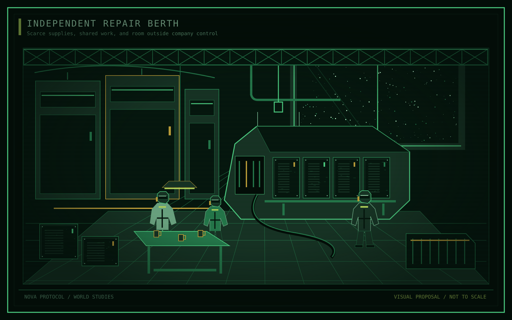

Community / Independence and resistance

# The Kites

<table class="infobox">
<caption>The Kites</caption>
<tbody>
<tr><th scope="row">Position</th><td>Saturn's largest independent community</td></tr>
<tr><th scope="row">Human foundation</th><td>Kestrel survivors and people who refused EWI contracts</td></tr>
<tr><th scope="row">Base</th><td>The Roost, a former Kestrel station listed as disabled</td></tr>
<tr><th scope="row">Shared aims</th><td>Freedom from EWI and an end to its corrupt control</td></tr>
<tr><th scope="row">Known member</th><td>Dorian Pell</td></tr>
</tbody>
</table>

**The Kites** are Saturn's largest independent community. Their human foundation
lies in the destruction of [the Shelter](../locations/shelter.md) and the coercive
absorption of Kestrel's interests into EWI. Survivors and people who refused the
new contracts made lives outside corporate employment.

They are a community with armed capacity, not only a collection of combat crews.
Their shared commitment to freedom and opposition to EWI does not give them one
agreed strategy, a fixed government, or a guaranteed victory.

<nav class="article-toc" aria-label="Article contents">
<strong>Contents</strong>
<ol>
<li><a href="#participation">Participation</a></li>
<li><a href="#survival-and-secrecy">Survival and secrecy</a></li>
<li><a href="#the-roost">The Roost</a></li>
<li><a href="#pell-and-the-shelter">Pell and the Shelter</a></li>
<li><a href="#names">Names</a></li>
<li><a href="#formation-and-present-disagreements">Formation and present disagreements</a></li>
<li><a href="#open-questions-and-gaps">Open questions and gaps</a></li>
</ol>
</nav>

## Participation

Three overlapping forms of participation describe the community without
establishing a formal hierarchy:

- **Residents** make homes and sustain life outside EWI control.
- **Supporters inside the official economy** conceal loyalties while remaining
  workers or operators within it.
- **Armed crews** defend, raid, or take the fight to EWI.

These are not ranks or exclusive identities. Participation does not require a
personal connection to the Shelter. The Kites are not the only pirates or
independent people in Saturn, and Saturn is not the only place with piracy.

## Survival and secrecy

Salvage, repair, informal trade, and piracy sustain life at the margins of the
[official economy](../locations/saturn.md#three-overlapping-sectors). Supplies are uncertain.
Freedom can come with worse material conditions than EWI employment, without
making that employment freely chosen.

EWI tolerates parts of the marginal economy because irregular labour and
recovered material can be useful, or because removing people costs more than a
local manager wants to spend. It does not therefore approve of the Kites.
Organised independence threatens its control in a way isolated survival does not.

The company can exploit relationships that also shelter resistance. Managers
need not agree, and the Board need not understand every local arrangement.
There is no secret guarantee of protection for the community.

<figure class="plate">

<figcaption>Independent repair berth, visual proposal. This is not the Roost's established layout and does not demonstrate a means of concealing it.</figcaption>
</figure>

<aside class="proposal">
<strong>Proposed everyday texture</strong>

A say in work, care without a payroll deduction, and a place at a communal table give freedom a practical meaning. Scarce food and unreliable equipment remain real costs. A shared meal is not evidence that the community has enough.

</aside>

## The Roost

The Kites' base is [the Roost](../locations/roost.md), a former Kestrel station officially listed as
disabled. The community is secretive. The station's listed status is not, by
itself, an explanation of how habitation and supply activity remain concealed.
That practical question is still open.

Its population, layout, condition, and concealment methods are not established.
The existence of a base does not establish that all Kites live there.

## Pell and the Shelter

Dorian Pell served under Calloway in EWI at the time of the Shelter's destruction.
He disobeyed orders to rescue Kestrel people. That rescue separated him from EWI
and led to his becoming a Kite. He did not know the explosion was deliberate.

<aside class="proposal">
<strong>Open character proposal</strong>

Pell may lead a committed armed faction rather than command the whole community. His authority, methods, and the grounds on which others might call him a fanatic remain undecided.

</aside>

## Names

The Kites retain Kestrel-style naming for their own craft and places: birds for
ships, and places birds shelter or nest for stations. Captured craft receive
corporate or contract terms as ironic claims to what was owed.

The Roost is an established place. Other naming examples are vocabulary, not a
list of vessels that must exist.

## Formation and present disagreements

The community's human foundation follows the Shelter's destruction in Y-4.
Its first shared organisation, adoption of its name, and occupation of the
Roost do not yet have dates. These need not be one founding event. People can
begin helping one another before agreeing on a community's identity or rules.

<aside class="proposal">
<strong>Proposed internal pressure</strong>

Receiving another household, reserving supplies for an armed crew, and helping supporters still under EWI contracts can compete for the same resources. Residents disagree over obligations and acceptable risk, not only over how strongly they dislike EWI. Shared freedom needs a way to make decisions without turning dependence on armed protection into a new form of ownership.

</aside>

## Relationships

**EWI** is both the power the Kites oppose and the employer of some concealed
supporters. **Fleet** protects recognised order under strong EWI influence;
its treatment of pirates threatens more people than armed raiders alone.

**Kestrel** supplies much of the community's human foundation and naming
tradition, not an inherited constitution. **Other independents** may trade,
assist, compete, or refuse without belonging to the Kites. **Pell** is a member;
his authority over armed crews or residents remains a proposal to review.

See the [relationship summary](../atlas/relationships.md).

## Open questions and gaps

The Kites need rules for membership, allocation, disagreement, and the use of
force. They also need a distinction between the whole community, the Roost's
residents, and any faction Pell might lead. Largest independent community does
not mean largest station or a single hidden population.

See [the Kites](../questions/power.md#the-kites),
[the Roost's history](../questions/history.md#reconstruction-and-the-roost), and
[Pell's present wants](../characters/pell.md#goals-and-aspirations).

## Related articles

- [EWI employment and the cost of leaving](ewi.md#employment-without-an-exit)
- [Fleet's treatment of piracy](fleet.md#protection-and-legitimacy)
- [Other independents](operators.md)
- [The Shelter's destruction and aftermath](../story/fall-of-kestrel.md)
