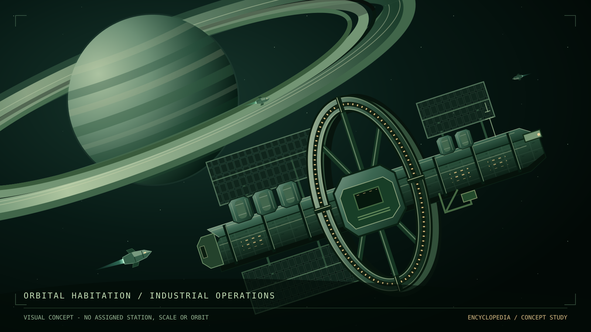

Nova Protocol / World reference

# Encyclopedia

<figure class="plate">

<figcaption><strong>Visual concept.</strong> No specific station, orbit, scale,
or engineering design is established by this illustration.</figcaption>
</figure>

Read the [world overview](setting.md) or [browse by subject](contents.md).
