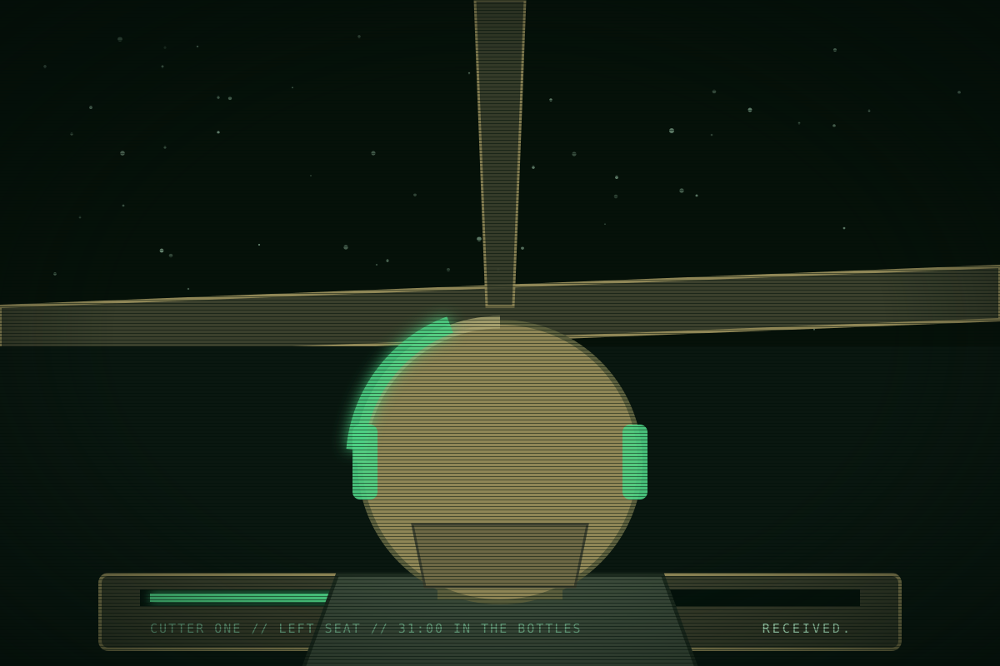

This page is about the person in Cutter One's left seat. The book never names them. For the boat, see the Ships pages. For the two people beside them, see <a href="halloran.html">Nadia Halloran</a> and Bastian Okoro.

# The captain

<table class="infobox ewi">
<caption>The captain</caption>
<tr><td colspan="2" class="image">
The left seat of Cutter One. The book never shows the face.
</td></tr>
<tr><th>Seat</th><td>Captain and pilot, Cutter One</td></tr>
<tr><th>Employer</th><td>EWI, Meridian's boat deck</td></tr>
<tr><th>From</th><td>Earth</td></tr>
<tr><th>At Saturn since</th><td>Y-4, weeks after the Shelter</td></tr>
<tr><th>Term</th><td>Second. Renewed Y-1. Rotation due Y+2 under section six.</td></tr>
<tr><th>Ticket</th><td>Earth small-craft licence. Company boat rating.</td></tr>
<tr><th>Name</th><td>Not given</td></tr>
<tr><th>Says</th><td>"Say again." "Received." Numbers.</td></tr>
</table>

The captain flies Cutter One and holds its ticket. They came out from Earth in
Y-4, a few weeks after the Shelter, on a passage the company advanced and a
contract they read all the way through. They have flown four hundred shifts with
the same two people since, and they believe, against the evidence of everyone
around them, that the deal will be kept: two terms and a rotation home. The
season is what that belief does when the company breaks it.

## Before Saturn

The book does not say why the captain left Earth, and the captain does not say
either. What is known aboard Cutter One: an Earth small-craft licence earned on
orbital tugs, a habit of reading contracts to the end, nobody on Earth who
writes, and a passage advanced by the company at two years of a working wage.
Halloran has three theories. Okoro has one and keeps it.

The captain came down the lane in the weeks when Kestrel's people were signing,
and was posted to Meridian's boat deck because Meridian had lost a tender, its
officer and four hands the month before, and needed a pilot who would not ask
about it. Nobody told the new pilot the story. The plaque was already up.

## The seat

Cutter One is a Meridian work boat: a short-shift cutter with a saw, an arm, a
tag rack and forty hours of bottles for three. The captain flies it and signs
for it. Halloran works the arm and the tags and is the better pilot. Okoro keeps
it running. The three have flown together since the captain's second week, first
because the deck gave the new pilot the boat nobody else wanted, a Kestrel hand
and a deck hand with a dead officer's habits, and then because they would not be
split. Four hundred shifts. The deck calls them the long boat, and the captain
has never asked whether it means anything but long-serving.

## What the captain believes

The deal. The captain read all nine sections on the passage out and signed
anyway, and has kept the company's side of the contract in mind ever since as if
the company were doing the same: three years, a renewal, rotation after two
terms. When the first term ended in Y-1 and the renewal came, the captain was
the only person on the boat deck who was not surprised. Renewal is in the
contract. "One more term and I'm home" is the captain's line, said flat and
meant. The reply is always the same, from Halloran: "Read section nine." The
captain has read section nine, and believes it says what it says and no more.

This is not faith in the company. The captain does not like the company and does
not say so, because saying so costs and changes nothing. It is faith in a
bargain: that work done is owed for, that a roster is a promise, that a word
given on the radio means what it said. The company's warmth does not fool the
captain. The captain hears it as the sound of a party keeping its word, and will
hear it that way until the day it plainly is not.

## How the captain works

Checklists, aloud. Readbacks, verbatim, on every instruction, which Control
finds either reassuring or a rebuke and can never decide which. Numbers instead
of adjectives: never "we're low", always "thirty-one hours". The captain says
"please" on the radio, which nobody at Saturn does, and "say again" more than
anyone on the deck, because the captain would rather ask twice than assume once.
The boat flies procedure, and procedure has kept three people alive for four
years in a trade that kills through carelessness, so the crew allow it and mock
it in equal measure.

Under pressure the captain gets quieter and slower, not louder. The voice drops
to readbacks and numbers. Halloran calls this the Earth voice and has learned to
fear it, because it means the captain has stopped hoping and started counting.

## What the captain wants

To go home with the account square. Not rich. Square: the debt paid, the term
served, the rotation taken, and nothing owed in either direction. The captain
does not want to be a hero and does not understand people who do. The plaque on
Meridian's bay wall is, to the captain, a man who left his roster, and the
captain has never understood why that earned brass.

## What the captain fears

Being the one who miscounted. The captain's whole method rests on the numbers
protecting the crew, and the fear under it is a shift where the numbers were
right and the crew die anyway, because something outside the checklist decided.
That is the strike. It is also the desk saying nine days: a number, delivered
kindly, that the captain checks and finds correct.

## What the season does to the captain

The spine fixes the end: the captain leads the flight. This page makes it follow
from the belief. The company breaks the bargain three times where the captain
can hear it. The desk writes off a boat with forty hours of air. The record says
Meridian was told to hold its posts. The desk hunts its own roster to get a
recorder back. The captain keeps the crew's side of the deal anyway: the
recorder is Meridian's roster, and a roster is a promise, so the 412 get their
names. When the company offers rotation home by name at the end, in the warm
voice, the captain hears it in the Earth voice at last. The account is square.
The company owes the crew nothing, the crew owe the company nothing, and the
captain leaves. A man who left his roster becomes, by the end, something the
captain understands.

## Voice test

> Control: "Cutter One, Control. The desk moved the clear-by
> date. Leave the tag and come home an hour early. Thank you."
> Control, Cutter One. Received: leave tag four, return one hour early. Tag
> four is half set, and I would rather not leave a half-set tag for the tugs.
> Request ten minutes to finish it. Please.

> A voice in the clear, on no roster: "Hey. Company boat.
> Who am I talking to?"
> Unidentified station, this is an EWI cutter on Meridian's roster, on a work
> channel. Say again your callsign. You don't have one. Then I am not talking
> to anyone. Cutter One out.

> Halloran, across the cabin: "One more term and I'm
> home."
> That's my line. Twenty-two months. And you can stop saying section nine
> before I have finished the sentence.

## Hooks

- A believer in the deal on a boat of people who know better. Every company
  kindness lands differently on the captain than on the crew.
- Readbacks and numbers are a voice the reader can hear without a name or a
  face.
- The captain's judgement of Pell, a man who left his roster, is set up to
  turn when the company leaves its roster first.
- The Earth voice is a tell the reader can learn. When the captain goes quiet,
  something is wrong.
- "The account is square" gives the ending its line without a speech.

## Open questions

- Why the captain left Earth. The book leaves it blank on purpose and the crew
  have theories. Decide whether it is ever answered.
- Whether there is anyone on Earth to rotate home to. The page assumes nobody
  who writes.
- What the crew call the captain. "Cap" from Halloran and "Skipper" from Okoro
  are proposals.
