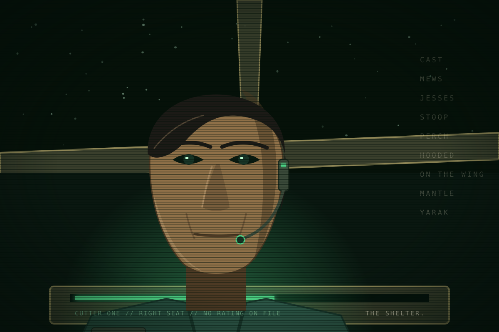

This page is about Cutter One's right seat. For the cooperative she flew for, see <a href="../world/kestrel.html">Kestrel</a>. For the people who kept its words, see <a href="../world/kites.html">The Kites</a>.

# Nadia Halloran

<table class="infobox kestrel">
<caption>Nadia Halloran</caption>
<tr><td colspan="2" class="image">
Halloran in the right seat, lit by the tag plot.
</td></tr>
<tr><th>Seat</th><td>Right seat, Cutter One. Arm, saw, tags, sensors.</td></tr>
<tr><th>Employer</th><td>EWI since Y-4, under settlement</td></tr>
<tr><th>Before</th><td>Kestrel, Y-13 to Y-4. Pilot of Harrier.</td></tr>
<tr><th>Born</th><td>Y-36, the Belt</td></tr>
<tr><th>Term</th><td>Second. Renewed Y-1.</td></tr>
<tr><th>Rating</th><td>Kestrel pilot. No company boat rating.</td></tr>
<tr><th>Colour</th><td>Bone white under green</td></tr>
<tr><th>Says</th><td>"Cast." "Cut the jesses." "The Shelter."</td></tr>
</table>

Nadia Halloran flew Kestrel's supply boat Harrier for nine years and was two
days out on a run the day the Shelter died. She came back to a dead station and
a company story. She went to the Roost with the survivors, and she left it, and
signed with the company because there was nothing else at Saturn to sign with.
She has sat in the right seat of a company boat for four years without being
allowed to fly it. She is the best pilot on Meridian's boat deck and the only
person on it who says the Shelter when Control is listening.

## Kestrel

Born in the Belt to a tug family, flying at sixteen, at Saturn at twenty-two
with the last of the rush. She joined Kestrel in Y-13 because it was the only
outfit on the plate that let a pilot vote, flew cutters for two years, and then
took Harrier: the run between the Shelter, the Roost, the Nest and the perches,
nine years of it. She knows every dead Kestrel station by the way it takes a
docking. She learned the words from the founder's own cast and uses them the way
they were meant, as the plain language of the trade.

Harrier was two days out at the Nest the day the Shelter died. Halloran flew
back on the guard channel's fragments and found the ring open, the company
tender gone and the company's version already on the relay: a reactor failure,
condolences to the roster, section nine. Nobody had searched.

## The Roost, and leaving it

She went to the Roost that month, as about a hundred did, and spent the first
winter there. It was a hundred and thirty people on a dead station with three
months of air, and the man running the only boat that could cut ice off-plate
was the officer who had run Meridian's boat deck. She would not live under him,
whatever he had done, and she would not watch the Roost starve on principle. In
the spring she flew a skiff to the transit stations, sold it, and signed with
EWI under the settlement that every Kestrel hand was offered: a berth, a term, a
sum against passage she had not taken, and a clause about the Shelter. Solberg
stayed. Pell knows her name.

She has never told anyone on a company boat that she was there. Four hundred
Kestrel hands under contract know roughly where the Roost was. None has said. It
is the one thing the settlement did not buy.

## The right seat

The company rates its boat pilots on a course it charges against remaining term
and schedules at the desk's discretion, and the desk has never scheduled it for
a Kestrel pilot. Halloran works Cutter One's arm, saw and tag rack, and reads
its sensors, and is better at all of it than the boat needs. On long transits,
with the captain's word and no one else's, she flies. The boat's certified
recorder holds four years of it.

She joined the boat in the captain's second week, because the deck put the two
people it least wanted to place in the same cabin with the new pilot. She has
stayed because the cabin is the only place on the plate where she says what she
thinks and is answered.

## What she wants

To fly. To not be bought a second time. And for the dead to be named: Kestrel's
five hundred and seventy-nine have no plaque, no letter and no roster anyone
reads, and she keeps their names in a list she does not show. She will not let
it happen twice to anyone. That is why, when a ship of 412 dies in front of her,
she goes into the wreck for its recorder.

## What she fears

Being settled. It is her word for a Kestrel hand who has stopped saying the
Shelter, and she has watched it happen to most of the four hundred. She checks
herself for it. And she fears the Roost found because of her: a company boat
with a beaconing recorder on a heading she alone knows.

## How she speaks

First names. No ranks: "Cap" is not a rank in her mouth. Kestrel's words when it
is her own business and the company's when she is angry, because her sarcasm is
the contract quoted back at Control in its own language, section and clause. She
does not say thank you. She says the Shelter and takes the correction as part of
the sentence. Short, dry, and quieter than the captain expects when it matters,
because Kestrel talked plainly and she still does.

## Voice test

> Control: "Cutter One, Control. The desk moved the clear-by
> date. Leave the tag and come home an hour early. Thank you."
> Control, Nadia. Half a tag is a tug crew's bad day. We'll finish it and be
> home on your hour, because the Cap will fly it that way. The Shelter can
> move its date again if it likes. Yes, I heard you. Section five. Noted.

> A voice in the clear, on no roster: "Hey. Company boat.
> Who am I talking to?"
> Nobody, in the clear, on a work channel. You're a long way from your perch,
> whoever you are. Go hooded before the pickets hear you.

> The captain, across the cabin: "One more term and I'm
> home."
> Read section nine. I'm home, Cap. Have a look around.

## Hooks

- A pilot who may not fly, beside a licensed pilot she is better than.
  Competence against the ticket, every shift.
- She knows the way to the Roost and has never said so aboard a company boat.
  Leading a company boat there is the price of arriving.
- She left the Kites once. Solberg stayed. Pell knows her name. Every Roost
  scene starts from that.
- Kestrel's dead have no plaque and she keeps their names. That is why
  Meridian's recorder leaves the wreck.
- One Kestrel word to a stranger in the clear tells the reader whose side she
  is on before she knows it herself.
- The boat's recorder holds four years of her flying without a rating: a small
  crime the crew share.

## Open questions

- Her family in the Belt: alive, dead or never mentioned. The page assumes
  never mentioned.
- Whether she met Pell at the Roost in Y-4 or only heard him. The page says
  met, once, and did not like him.
- Whether Kestrel had ranks. The page assumes none, by charter, which is why
  she has none for anyone.
