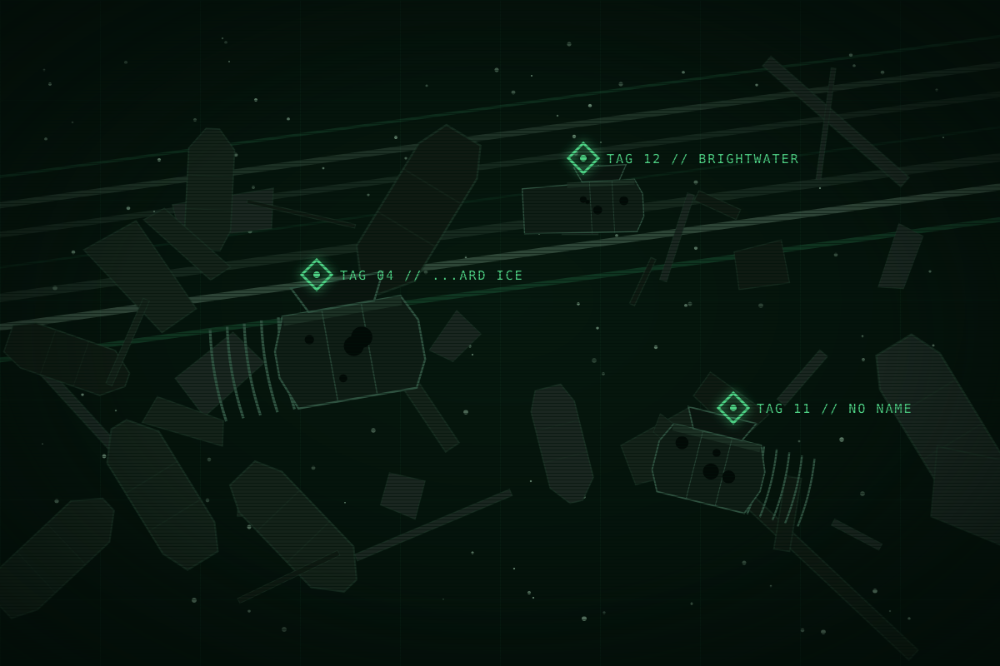

This page is about the fourteen small companies that worked Saturn before EWI owned it, and about the junk they left. For the last of them, see <a href="kestrel.html">Kestrel</a>.

# The dead companies

<table class="infobox">
<caption>The dead companies</caption>
<tr><td colspan="2" class="image">
The junk site: tagged hulls nobody can name, in a field twenty years deep.
</td></tr>
<tr><th>Count</th><td>Fourteen, Y-22 to Y-4</td></tr>
<tr><th>Bought</th><td>Eight</td></tr>
<tr><th>Bankrupt</th><td>Five</td></tr>
<tr><th>Lost</th><td>One</td></tr>
<tr><th>What is left</th><td>Junk in the eddies, people on EWI's roster, one set of words</td></tr>
<tr><th>Largest field</th><td>The junk site, sector M</td></tr>
</table>

Between the first cut in Y-22 and the Shelter in Y-4, fourteen companies worked
ice at Saturn. Thirteen were small and one was Kestrel. Eight sold to EWI, five
went bankrupt against its prices, and one was finished. Nobody who works the
plate today can name most of them, and the hulls they left are what the plate is
made of at its edges. A company, at Saturn, is a plaque, and then it is junk.

## The roll

| Company | Years | What it was | How it ended | What is left |
| --- | --- | --- | --- | --- |
| Halvard Ice | Y-22 to Y-13 | A family firm with two haulers. The first claim registered at Saturn. | Sold its claims to EWI and went home, the only company that did | A hauler in the junk site, its name half gone: ...ARD ICE |
| Brightwater | Y-20 to Y-12 | A refinery barge that bought other companies' slabs | Bankrupt when EWI's carrier undercut the water price | The barge, in the junk site |
| Tessera Mining | Y-19 to Y-11 | A station on a rock in sector L | Bought. The station was stripped and the rock cleared. | Nothing |
| Lantern Salvage | Y-17 to Y-9 | Skiffs that picked the other companies' junk | Bankrupt. Its skiffs went into the junk and came out again as Kite skiffs. | The skiffs |
| Oriel Water | Y-16 to Y-10 | Two cutters and two owners | Sold to EWI. Both owners took EWI contracts. | The cutters. One owner is a deck hand on Meridian today. |
| Ninefold Ice | Y-15 to Y-8 | A nine-share partnership | Bought, share by share, over two years | A tender in the junk site, its owner disputed to the end |
| Sable Point | Y-14 to Y-9 | One hauler | Lost the hauler to ice and folded | The hauler, somewhere off-plate |
| Kestrel | Y-18 to Y-4 | A cooperative of 1,400 | A demolition charge, reported as a reactor failure | Words, stations, people |

And six more, whose names survive only in the registry EWI keeps.

## Where the junk goes

Nobody clears junk, because clearing costs and a dead hull is nobody's. Wrecks
drift out of the worked sectors into the slow eddies around the moonlets and
stay there. EWI clears a field only where it means to build, and it is building
where the small companies died, because that is where the claims were.
Meridian's job at the junk site is to tag every hull for the tugs, so that
Azimuth can put company installations where Halvard and Brightwater used to be.

## What a company leaves

A tag number, once a boat has been past it. A plaque, if it had a hero. A name
half gone from a plate. Its people, on EWI's roster, under section nine. Its
skiffs and tenders, worked over by whoever found them. And its words, if it had
any. Only Kestrel had words.

## Hooks

- The junk gives every scene at the site a name to read off a hull and a
  company to shrug about.
- Lantern's skiffs are the Kites' skiffs: the Scavengers fly the scavengers'
  boats.
- The Oriel owner on Meridian's deck is a small voice with a whole history. He
  sold, and he is still here.
- A dead tender with no owner is a ship nobody will come looking for.

## Open questions

- Which company's tender becomes the crew's ship. The book can leave the owner
  unknown on purpose, or name it once.
- The six unnamed companies, if a hull ever needs a name.
- Whether Sable Point's hauler is ever found.
