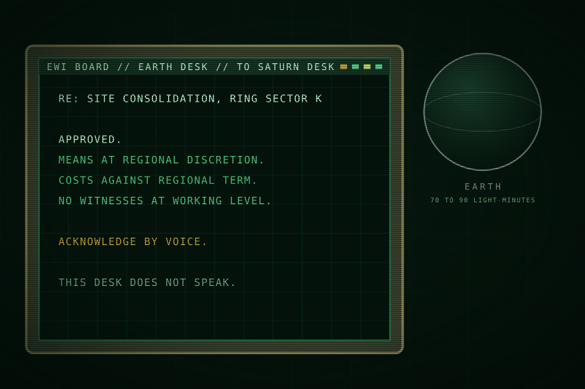

This page is about Earth as Saturn sees it, and about the seven people who run EWI from there. For the company itself, see <a href="ewi.html">EarthWorks Industrial</a>.

# Earth and the Board

<table class="infobox earth">
<caption>Earth and the Board</caption>
<tr><td colspan="2" class="image">
The Board speaks in text, through desks, and asks for a voice back.
</td></tr>
<tr><th>Earth</th><td>Home. Rights, courts, the press, the rotation.</td></tr>
<tr><th>Distance</th><td>70 to 90 light-minutes</td></tr>
<tr><th>Law at Saturn</th><td>The Outer Resources Act</td></tr>
<tr><th>Rule with teeth</th><td>The certified recorder</td></tr>
<tr><th>The Board</th><td>Seven seats. EWI's governing body since Y-12.</td></tr>
<tr><th>Speaks</th><td>In text, through the Earth desk</td></tr>
<tr><th>Never</th><td>On the radio, in its own voice</td></tr>
</table>

Earth is where rights apply. Everyone at Saturn came from it, everyone under
contract is owed a passage back to it, and nothing that happens at Saturn is
decided there. The Board of EarthWorks Industrial sits on Earth, seven seats,
and decides everything at Saturn without ever being heard there. The two belong
on one page because they are the same fact seen from both ends of the relay.

## Earth

### What Earth is to Saturn

Home, in every conversation. The rotation home is the one thing every worker is
owed and the one thing the company decides the timing of. Earth is also where
the press is, where courts are, and where a company's share price lives, and
those are the only forces that move the Board or Fleet. A death at Saturn is a
line in a file. A death on the front page of Earth is a cost.

### The Act

Earth governs the outer system through the Outer Resources Act, which everyone
calls the Act. The Act gives a company operating rights beyond the Belt and lets
it regulate itself, in exchange for three duties.

- **The registry.** Every claim is registered, so that title can be settled on
  Earth afterwards.
- **The roster.** A company keeps a roster of everyone it carries and reports
  the changes, so that Earth knows who is out there.
- **The recorder.** Every crewed hull carries a certified recorder, so that
  Earth can read what happened.

The first two duties are paper, and a company keeps them the way it likes. At
Saturn, EWI runs the registry office and files its own rosters. The third duty
has teeth, because it is a device. A certified recorder is tamper-evident and
append-only. It signs every entry, holds the ship's whole record, beacons on the
certified channel when it leaves its seat, and can be read by any Earth
inspector years later. A company can purge every other system aboard and not
this one, because without a certified recorder the hull loses its certification
and cannot legally carry a crew.

Earth cannot be at Saturn. It can read the record afterwards. Every actor in the
story knows that the record is the only law that reaches the plate, and behaves
accordingly: the desk keeps the recorders because it must, and keeps its worst
decisions off them where it can.

### The public

On Earth, EarthWorks Industrial is a respectable employer. Pension funds hold
it. WE ARE EXPANDING is an advertisement before it is a banner. The press likes
disasters and heroes, in that order, and it made a hero of a boat-deck officer
four years ago because the company handed it one. Fleet's budget depends on the
public mood in the same way, which is why Fleet keeps its losses quiet. The
Board manages the public the way it manages everything, as a cost.

## The Board

### What it is

EWI's governing body: seven seats and a chair, all on Earth, meeting in a room
the story never shows. It took the company from its founder in Y-12, and the
Board era is the era of the squeeze. It owns the company's strategy and its
language.

### How it works

The Board orders outcomes and leaves means to desks. An order goes as text from
the Board to the Earth desk, from the Earth desk to a regional desk, and from
the regional desk to whoever carries it out. At each step the language gets a
little warmer and a little less specific. The Board says consolidate; the desk
says allocate; the captain says hold your posts. This is not carelessness. It is
how the Board is never in a room where anything happened.

The Board's words are allocation words: consolidation, operational need,
regional discretion, costs against term, no witnesses at working level. It never
says kill, destroy or lie, and it never needs to.

### The one exception

Relay text is signed by the desk that sends it, and a receiving recorder keeps
it like everything else aboard, so a Board order is attributable. What it is not
is specific. The Board never speaks in its own voice, so the only way the means
behind a Board order enter a certified recorder is if the desk acknowledges it
aloud. The Board asks for a voice back on orders it does not want questioned
later, because a voice on the desk's own recorder binds the desk. Once, in Y-4,
that habit put the Board's order and a regional commander's acknowledgement on
the same record. The Board did not think of the recorder as a risk, because
nobody at Saturn had ever read one.

### How the Board speaks

> The Earth desk to the Saturn desk, text
> RE: SITE CONSOLIDATION, RING SECTOR K. APPROVED. MEANS AT REGIONAL
> DISCRETION. COSTS AGAINST REGIONAL TERM. NO WITNESSES AT WORKING LEVEL.
> ACKNOWLEDGE BY VOICE.

> The Earth desk to a carrier, text, the next day
> OUR CONDOLENCES TO THE ROSTER. SECTION NINE APPLIES. THE STANDARD LETTER
> WILL ISSUE FROM THIS DESK. THANK YOU FOR YOUR SERVICE IN A DIFFICULT WEEK.

### What it fears

A record it did not write. The front page. An inquiry with Fleet's name on it.
When something goes wrong at working level, the Board's method is the same every
time: find the one person whose discretion the means fell under, and let the
language that protected the Board protect it again.

## Hooks

- The Board is never a face. Any scene with the Board is a screen with text on
  it.
- "Acknowledge by voice" is the mechanism that puts the Board's order on a
  recorder without the Board ever speaking.
- Earth's rules reach Saturn only as devices: registry, roster, recorder. The
  recorder is the one that works.
- The warming of language down the chain is the company's whole voice in one
  idea. Every desk line should be a little kinder than the order it carries
  out.

## Open questions

- Whether any Board member is ever named. A later season may want one.
- Whether Earth has any presence at Saturn at all, even an inspector who never
  comes.
- What the press printed about the Shelter, exactly. A later page can quote
  it.
