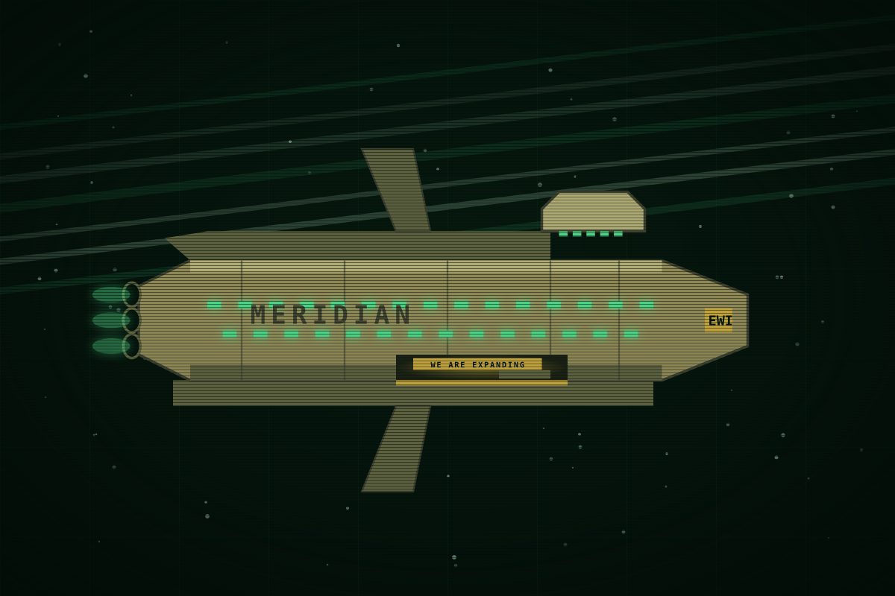

This page is about the company. For its owners, see <a href="earth-and-the-board.html">Earth and the Board</a>. For the people who work for it, see the People pages.

# EarthWorks Industrial

<table class="infobox ewi">
<caption>EarthWorks Industrial</caption>
<tr><td colspan="2" class="image">
Meridian, the first carrier, with its bay open on the banner.
</td></tr>
<tr><th>Type</th><td>Orbital construction, then mining and ice</td></tr>
<tr><th>Founded</th><td>Y-31, Earth orbit</td></tr>
<tr><th>Founder</th><td>Tobias Vell, survey engineer</td></tr>
<tr><th>Run by</th><td>The Board, since Y-12</td></tr>
<tr><th>Saturn desk</th><td>Datum, on the Shelter's rock</td></tr>
<tr><th>Ships at Saturn</th><td>Meridian, Azimuth, Parallax</td></tr>
<tr><th>Small craft</th><td>Pickets and tugs</td></tr>
<tr><th>People at Saturn</th><td>About 1,750</td></tr>
<tr><th>Colour</th><td>Phosphor green</td></tr>
<tr><th>Slogan</th><td>WE ARE EXPANDING</td></tr>
<tr><th>Names</th><td>Survey words</td></tr>
</table>

EarthWorks Industrial is the company. It owns the ships, the ice, the contracts
and the way home, and everyone at Saturn who is not a Kite works for it. It is
not cruel. It is cheap, and every evil in the story is one of its savings.

## History

Founded in Y-31 by Tobias Vell as an orbital construction contractor: the
earthworks of Earth orbit, habitats and yards. Vell was a survey engineer and
named his hulls after the words of his trade, Meridian, Azimuth, Parallax,
Datum, and the company kept the habit after it stopped keeping him. It came to
Saturn in Y-14 with one idea, the carrier: a refinery that moves to the ice
instead of a station the ice is hauled to. Meridian was the first, built in Y-15
for the trip. Azimuth followed in Y-9. Parallax, a Fleet security ship bought
surplus in Y-7, gave the company guns.

The Board took the company from Vell in Y-12, and the squeeze began: buy the
claims that would sell, undercut the rest, buy the people, clear the sites. By
Y-5 Kestrel was the last competitor. In Y-4 the Shelter died in what the company
reported as a reactor failure, and Kestrel folded within weeks. Datum went up on
the Shelter's rock between Y-3 and Y-1, and the officer who had commanded
Meridian that week took the desk in it.

## How it is organised

The Board on Earth orders outcomes. The Earth desk passes them to regional
desks. The Saturn desk at Datum allocates: it owns the roster, the relay, the
registry office, the contracts and the guns, and it tells carriers where to go.
Captains run their ships. Each carrier has a Control, a boat deck and boats, and
a Control operator is the ship's voice to every boat it flies.

The desk is the company at Saturn. When people say the company, they mean the
desk, and when the desk speaks, it speaks in the warm second person of someone
who has your file open.

## The contract

Everyone under EWI at Saturn has signed the same document, and everyone knows it
by its sections.

| Section | What it holds | What people call it |
| --- | --- | --- |
| 1 | The term: three years | |
| 2 | Wages, and the deductions from them | |
| 3 | Passage, advanced by the company and charged | the ticket |
| 4 | Kit, air and consumables, charged as used | |
| 5 | Conduct and policy. Company names for company places | the Datum clause |
| 6 | Rotation home after two terms, subject to section nine | the rotation |
| 7 | Medical and recovery, costs against remaining term | |
| 8 | Roster and record. The worker consents to both | |
| 9 | Renewal at the company's option, and under it the Nova Protocol | section nine |

Section nine's text will have its own page in The company's paper. Nobody quotes
it. Everybody knows what it says.

## The Nova Protocol

The company's procedures carry the names of things in the sky. Transit is a
rotation home. Eclipse is a communications hold. Perihelion is a renewal review.
Nova is a site lost. When a site is declared lost, its roster closes, no
recovery is attempted, the standard letter goes to next of kin from the Earth
desk, and the site's remaining costs are set against the remaining terms of any
survivors. It sits under the renewal clause in section nine because both are
about what the company may do with a person at its own option.

Everyone at Saturn knows the term the way soldiers know "missing in action". It
is applied by the desk, in a warm voice, and it is filed as late as the desk can
manage, because a closed roster puts the loss on the desk's own books. That lag
is a fact the story uses: a dead ship's roster can stay open for days, and every
code on it stays valid.

## Culture

The company is warm. It uses first names on the radio, says thank you, and never
says no: it says "not at this time", "costs against", "recovery in nine days".
It puts its slogan on every bay wall and a plaque beside it for every hero it
has had to have. It memorialises cheaply and prominently.

Its people know all of this and joke about it, which is the story's tone. The
jokes are old and shared.

- **Section nine.** Said whenever anyone mentions the future. "One more term
  and I'm home." "Read section nine."
- **Different gravity.** "On Earth they'd have to give you notice." "Rights
  are an Earth thing. Different gravity."
- **We are expanding.** Said when anything breaks, spills or vents.
- **Datum.** Kestrel hands call the headquarters the Shelter, which is a
  policy violation under section five, and Control corrects them, which is a
  ritual.

Nobody makes the jokes angrily. Anger costs.

## How the company speaks

> The desk to a carrier, on the relay
> Meridian, Datum. Good morning. I have the site's clear-by date in front of
> me and I would like to keep it. Anything you need from this desk, ask early
> and I'll allocate it. Thank you.

> Control to a boat, on the work channel
> Boat Three, Control. You're forty metres left of the lane and I'd rather you
> weren't. Guard stays on speaker, that's a regulation and not a suggestion.
> Thank you.

> A deck chief to a boat crew, on the deck
> That's not a fit, that's a wish. Pull it and do it again. Somebody has to
> fit the next one too.

## How it deals with a competitor

In order of cost: buy the claim. If the owner will not sell, undercut the water
price until the owner folds and buy the claim from the receiver. Buy the people
with contracts, settlements and silence clauses. Clear the site and register it.
Once, when the last competitor would not fold, the company bought the claim
beside its largest station and cracked the ice there with a Fleet-surplus
demolition charge. Only the Board and Meridian's commander that week knew the
charge was aimed. At working level it was an accident, and the placement crew
was written off under section nine. This is the single act of cruelty in the
company's history, and the company does not think of it as one. It thinks of it
as the cheapest way the Shelter could have been consolidated.

## Hooks

- The company appears on the page only as habits and paperwork: the banner,
  the plaque, the jokes, the warm voice. Never a speech.
- The procedure names give the desk a vocabulary that sounds like weather.
- The open-roster lag is a mechanism, not a detail.
- "Thank you" at the end of the worst sentences.

## Open questions

- The Earth desk's name and voice, if it ever speaks.
- How many regional desks EWI has. The book assumes Saturn, Jupiter and the
  Belt.
- Whether Tobias Vell is alive, and what he thinks. A possible voice for a
  later season.
