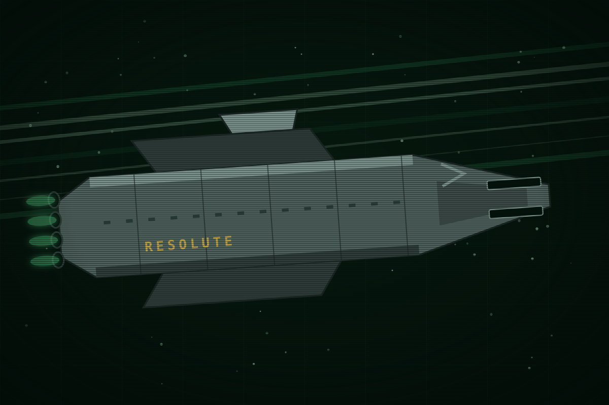

This page is about Earth's navy and its quiet hunt. For the ship it lost, see the Ships pages.

# Earth Fleet

<table class="infobox fleet">
<caption>Earth Fleet</caption>
<tr><td colspan="2" class="image">
Resolute, before it was Severance: a rail-gun frigate laid up for sale.
</td></tr>
<tr><th>What it is</th><td>Earth's navy</td></tr>
<tr><th>Built up</th><td>The Belt Emergency, Y-30 to Y-24</td></tr>
<tr><th>Since</th><td>Cut back every budget</td></tr>
<tr><th>Ships named for</th><td>Virtues</td></tr>
<tr><th>Colour</th><td>Blue</td></tr>
<tr><th>At Saturn</th><td>Nothing stationed</td></tr>
<tr><th>Missing</th><td>Resolute, seven weeks before Y0</td></tr>
<tr><th>Hunting with</th><td>Vigilant, Commander Marsh</td></tr>
<tr><th>Hunts by</th><td>Transmissions</td></tr>
</table>

Earth Fleet is the only owner of armoured ships in the system, and there are not
many of them. It was built for a war that ended twenty-four years before the
story and has been paid for reluctantly since. It sells what it cannot afford to
keep, listens to everything, arrives late, and writes the account. It is not
evil. It is slow, embarrassed, and interested in the story it can tell
afterwards.

## History

The Belt Emergency, Y-30 to Y-24, was six years of convoy escort and claim wars
among the Belt's mining settlements, and Fleet was built to end it. Rail-gun
frigates like Resolute and heavier hulls like Vigilant were laid down in those
years. When the Emergency ended, the public wanted the money back. Fleet has
been cut every budget since: hulls laid up at outer yards, crews reduced, stores
sold as surplus to anyone with a use for them. EWI bought a security ship and
demolition charges from those sales. Fleet knows what a company does with a
demolition charge and prefers not to.

## Doctrine

Fleet's strength is listening. It has few hulls and the outer system is large,
so it finds things by their transmissions: picket buoys on the lanes, listening
posts at the yards, the big antennas of its remaining ships. A ship that talks
is found. A ship that keeps silent is lost. That is why Fleet's challenge
traffic is constant: every challenge is an invitation to answer, and every
answer is a fix.

Fleet's weakness is the same fact from the other side. It cannot be everywhere,
and where it is not, its law is a voice on the guard channel that nobody has to
obey.

## The loss of Resolute

Resolute was a rail-gun frigate of the Emergency generation, two hundred and
sixty metres, laid up at Fleet's Callisto yard with a caretaker crew of twelve,
awaiting sale as surplus. The intended buyer was EarthWorks Industrial, whose
Saturn desk had asked for a second security ship for Scavenger interdiction.
Fleet told the buyer only that the sale was on administrative hold. Seven weeks
before Season 1, a salvage contractor's crew arrived at the yard with papers in
order, boarded Resolute for survey, and left with it. The caretakers were put in
the frigate's own boat with a beacon and were found four days later, unharmed.
The papers had been bought. The contractor did not exist.

Fleet told nobody. The public would have asked why a warship was for sale to a
company at all, and why twelve sailors were left in a boat by scavengers, and
the answers to both questions cost budgets. So the hunt is quiet: a challenge on
the guard channel repeated across the outer system, any vessel with contact with
Fleet hull Resolute report, and Vigilant working the lanes by ear. Nobody at
Saturn was told a warship was loose, not even the desk that had bought it.
Meridian had no warning because Fleet's embarrassment reached the plate before
its warning did.

## Vigilant and the hunt

Vigilant is heavier than Resolute and slower. Resolute can run from it and
cannot fight it. Commander Marsh has hunted Resolute for seven weeks with a
competent method inside an incompetent mandate: listen, triangulate, close.
Fleet's challenge reaches the junk site in fragments through the whole campaign,
and nobody there cares, because Fleet is always looking for something.

## How Fleet speaks

Callsign first, then the formula. Fleet says "this is Earth Fleet" as if the
name were an order, and "you are directed" instead of asking. It does not use
first names on the air and it does not say thank you.

> Fleet challenge, on guard, repeated
> Any vessel, any vessel. This is Earth Fleet. Any vessel with contact with
> Fleet hull Resolute, report contact to Earth Fleet on this channel.
> Resolute, if you receive, you are directed to respond. Earth Fleet out.

> Vigilant to a ship it has found
> Unidentified hull, this is Earth Fleet warship Vigilant. You are held on our
> sensors. You are directed to cut your drive and identify. Acknowledge.

## Hooks

- Fleet's silence is the reason nobody at Saturn knew. Its embarrassment is a
  plot mechanism.
- Fleet arriving late and taking the credit is in character, not a twist.
- Fleet's own recorders keep whatever is broadcast where it can hear. Fleet
  cannot classify what it did not record alone.
- Every Fleet challenge is a clock for whoever is transmitting.

## Open questions

- The Belt Emergency in one paragraph, if a person's page needs a past.
- Resolute's class name and armament beyond two rails.
- How the Kites got the papers. An ex-Fleet Kite would answer it and give the
  Kites a face.
