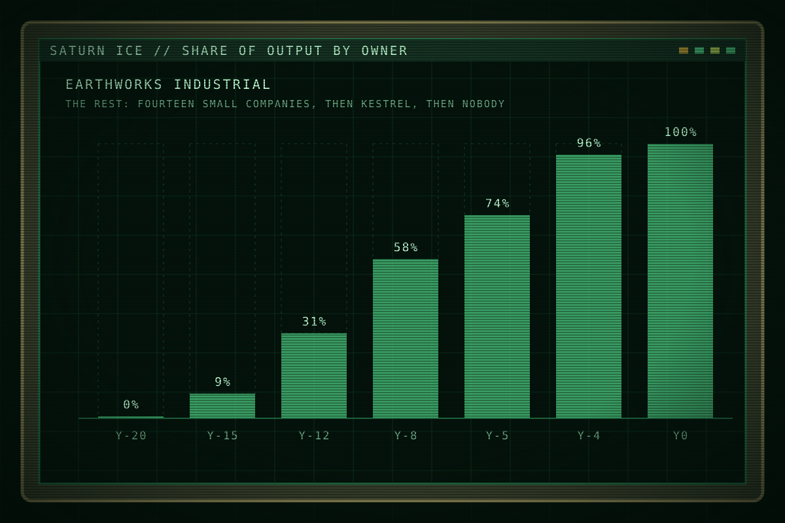

This page is about the product and its economy. For the company that owns it, see <a href="ewi.html">EarthWorks Industrial</a>.

# Ice

<table class="infobox">
<caption>Saturn ice</caption>
<tr><td colspan="2" class="image">
EWI's share of the ice cut at Saturn, Y-20 to Y0. The rest was the small companies, then Kestrel, then nobody.
</td></tr>
<tr><th>Product</th><td>Water ice, cut in slabs</td></tr>
<tr><th>Used for</th><td>Water, air, reaction mass, shielding</td></tr>
<tr><th>Buyers</th><td>Outer-system stations, the transit lines, Fleet's depots</td></tr>
<tr><th>Price set by</th><td>EWI, since Y-4</td></tr>
<tr><th>Registry</th><td>Earth's Outer Resources Registry. Its Saturn office is run by EWI under contract.</td></tr>
</table>

Water is the one thing everything beyond the Belt needs and cannot make.
Stations drink it and breathe it. Ships burn it, split into hydrogen and oxygen.
Hulls hide behind it from the sun. Saturn's rings hold more of it, closer to
hand, than anywhere else people have reached, and whoever owns the rings sets
the price of water for the outer system. Since Y-4 that has been one company.

## Why Saturn

Jupiter's moons have water under gravity wells that cost fuel to climb. Comets
are far and slow. The Belt is mostly rock. Saturn's rings are water lying loose
in a shallow orbit, and a cutter with a saw can take a slab out of them for the
cost of the shift. Nothing else in the outer system is that cheap, so ring ice
became the outer system's water within a decade of the first cut, and the price
of ring ice became the price of everything that moves.

Earth does not need Saturn's water. It has its own. That is the political fact
under everything else: the people who could regulate Saturn have no stake in it,
and the people who have a stake in it cannot regulate anything.

## How ice is worked

A claim is a volume of ring staked by survey and registered with Earth's Outer
Resources Registry. At Saturn the registry's office is run by EWI under
contract, so a company registering a claim against EWI files it with EWI.

Cutters cut slabs. Tugs haul them. A refinery melts, filters and splits them,
and the product ships out on the lane in tankers or in the carriers' own holds.
The small companies refined at stations on rocks. EWI refines aboard carriers
that move to the ice, which is why it won.

The words of the trade are plain. A **seam** is a rich band of ice. A **cut** is
a shift's work. **Slab** and **melt** are the product before and after. A
**claim line** is the surveyed edge everyone can see on a plot. **Working
level** is everyone who touches the ice, as against the desk.

## The rush and the squeeze

| When | What |
| --- | --- |
| Y-22 | The first small companies cut ice at Saturn. Halvard Ice registers the first claim. |
| Y-18 | Kestrel is founded as a cooperative. |
| Y-15 | Fourteen companies work the inner sectors. |
| Y-14 | EWI's first carrier, Meridian, arrives. A carrier refines at the ice and undercuts every station. |
| Y-12 to Y-6 | EWI buys the claims it can and undercuts the rest into bankruptcy. Eight sell, five fold. |
| Y-5 | Kestrel is the last competitor at Saturn. |
| Y-4 | The Shelter dies. Kestrel folds within weeks. |
| Y-4 to Y0 | One company. The Saturn price is EWI's price. Azimuth carries the installations that turn cleared claims into company sites. |

## The price of a person

The same accounting that runs the ice runs the people who cut it, and the
contract is where the story's cruelty lives, as arithmetic.

Passage from Earth to Saturn costs about two years of a working-level wage, and
the company advances it. Kit, air and consumables are charged as used. A term is
three years. At the end of a term the company may renew for a further term at
its option, where operational need exists, and operational need always exists.
Rotation home is earned after two terms, subject to section nine. In practice a
worker who came out owing two years' wages is renewed until the debt is paid,
and the debt grows with every charge.

**Costs against remaining term** is the phrase. Anything the company spends on a
worker beyond wages, a recovery, a medical evacuation, a tow, is set against the
worker's remaining term and lengthens it. A rescue is therefore a cost to the
rescued, and a rescue the company can avoid is a saving to everyone. The [Nova
Protocol](ewi.html#the-nova-protocol) is that saving written as procedure: when
a site is lost, its roster closes, no recovery is attempted, and the cost of the
loss stops.

Nobody at Saturn needs this explained. They joke about it.

## Hooks

- Every EWI evil is a line item. Write villainy as accounting and let the
  reader do the sum.
- The trade gives the crew a vocabulary and a competence: seams, cuts, tags,
  tugs.
- The registry office: the company keeps the book its competitors' claims are
  written in.
- "Costs against remaining term" is the kindest voice in the story saying the
  worst thing.

## Open questions

- Production figures, if a page ever needs a tonne.
- Whether Fleet buys its depot water from EWI directly. The book assumes yes,
  which is one more reason Fleet is quiet.
- What happened to the Halvard family. They are the one company that went
  home.
