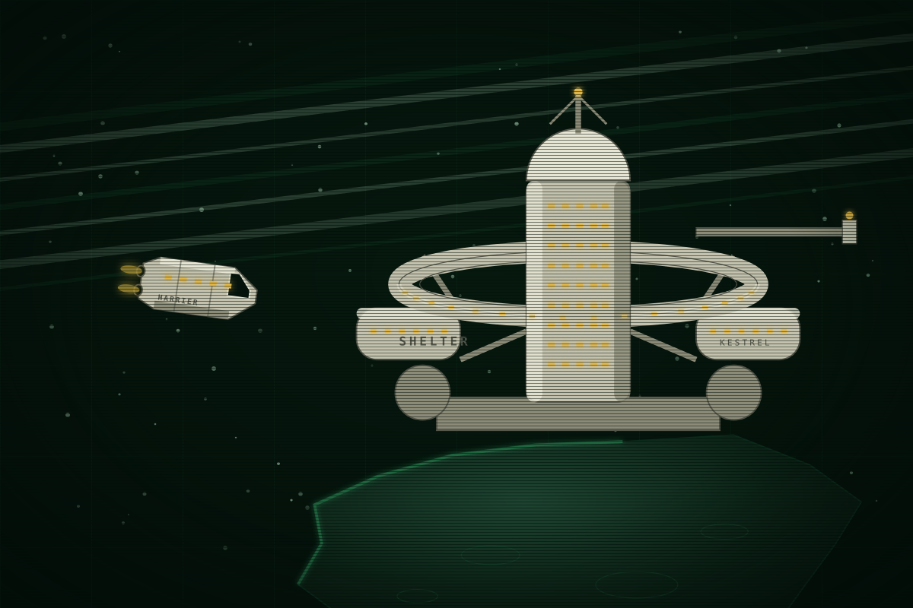

This page is about the cooperative that EWI finished. For the people who came out of it, see <a href="kites.html">The Kites</a>.

# Kestrel

<table class="infobox kestrel">
<caption>Kestrel</caption>
<tr><td colspan="2" class="image">
The Shelter on its rock, and Harrier leaving it on a run.
</td></tr>
<tr><th>Type</th><td>Ice-mining cooperative</td></tr>
<tr><th>Founded</th><td>Y-18</td></tr>
<tr><th>Dissolved</th><td>Y-4</td></tr>
<tr><th>Members at peak</th><td>About 1,400</td></tr>
<tr><th>Stations</th><td>The Shelter, the Roost, the Nest, and nine smaller</td></tr>
<tr><th>Ships</th><td>Osprey, Harrier, cutters</td></tr>
<tr><th>Colour</th><td>Bone white</td></tr>
<tr><th>Names</th><td>Birds, and where birds live</td></tr>
<tr><th>Words</th><td>Falconry</td></tr>
<tr><th>Ended by</th><td>A demolition charge, reported as a reactor failure</td></tr>
</table>

Kestrel was a small honest ice miner and the last competitor EWI had at Saturn.
It was a cooperative: every hand a member, every member a vote, no desk. It
named its ships after birds and its stations after the places birds live, and it
talked on the radio in the words of falconry, because its founder had grown up
around hawks. It died in Y-4 when the claim beside its largest station was
cracked with a demolition charge, and it is alive today as a way of naming
things, a way of talking off the radio, and a dozen dead stations nobody
registered.

## Origins

Founded in Y-18 by Belt cutter crews who came to Saturn in the rush and would
not work for a desk. The charter was simple: a share for every hand, a vote for
every share, and no officer who did not also cut ice. The founder, a Belt pilot
whose family had flown hawks, gave the cooperative its words and its first
station's name. Kestrel grew slowly and paid for everything with ice, and by Y-8
it was the largest thing at Saturn that EWI did not own.

## Stations

Kestrel registered one station with Earth, because registration costs and the
members voted against paying Earth for the rest. That vote is why the Kites
cannot be found.

| Station | What it was | Fate |
| --- | --- | --- |
| The Shelter | The largest: a ring habitat and a tower on a rock in sector K. About 800 members at peak, 610 aboard the day it died. | Destroyed Y-4. EWI cleared the rock and built Datum on it. |
| The Roost | A small station two days off the working sectors. Two hundred at peak. | Abandoned Y-4. The Kites' home. |
| The Nest | The yard, where Kestrel refitted its boats | Abandoned Y-4. Stripped to the frame. |
| Nine smaller | Perches: one-crew relay and rest stations across the sectors | Dead, unregistered, scattered |

## Ships

Osprey was the hauler that carried Kestrel's ice to the lane. Harrier was the
supply boat that ran between the stations, and it was away on a run the day the
Shelter died; its pilot came back to a dead station and a company story. The
cutters carried the names of small hawks and are junk now, bone white among the
company's green.

## The words

Kestrel talked plainly, first names and no ranks, and it talked in falconry. The
words are the cooperative's fingerprint: anyone who uses one on the radio was
Kestrel, or learned from someone who was.

| Word | Meaning at Kestrel | Where it comes from |
| --- | --- | --- |
| a cast | A crew | The collective noun for hawks flown together |
| the mews | The boat deck, the hangar | Where hawks are kept |
| jesses | Dock tethers. "Cut the jesses" is undock. | The straps on a hawk's legs |
| stoop | A fast dive onto something | The hawk's dive |
| perch | A hold position | |
| roost | Home. To dock for the night. | |
| a fledge | A new hand | A young bird first flying |
| molt | A refit | |
| hooded | Off the air, dark | A hooded hawk is calm and blind |
| on the wing | Under way | |
| mantle | To cover another ship with your own hull | A hawk spreading its wings over its prey or its young |
| in yarak | Ready, sharp, fit to fly | A hawk in hunting condition |

Nobody alive should be using these on the radio. Hearing one is hearing a ghost.

## The end

By Y-5 Kestrel was the last competitor, and EWI's offers had been refused by
vote three times. In Y-4 EWI registered the claim beside the Shelter, K-7, with
the registry office EWI runs, and sent Meridian to work it. A survey tender set
a demolition charge on the ice two hundred and forty metres from the Shelter's
ring, for the ice, and the charge killed the station and the crew who set it.
The company reported a Kestrel reactor failure. Kestrel's insurer refused the
claim, because a reactor failure is operator fault, and the shares were
worthless within a week.

Six hundred and ten were aboard. Thirty-one came out, on a company tender whose
officer had refused an order. About four hundred of Kestrel's people signed with
EWI in the weeks after, with settlements and silence clauses, because there was
nothing else at Saturn to sign with. About a hundred vanished. The rest went
home, or died.

## What survives

The words, on the radio, in the mouths of people who are not supposed to know
them. The bone-white plates in every junk field. A dozen dead stations nobody
can find. Four hundred people under contract who call Datum the Shelter when
Control is not listening, and one who does it when Control is.

## Hooks

- The words let the reader hear who someone was without a caption, and let a
  character recognise a stranger by one syllable.
- The unregistered stations hide the Kites for four years and are found only
  by following someone home.
- The cooperative vote is the exact opposite of the desk. Every Kestrel habit
  is an argument against EWI without a speech.
- "Mantle" is a word waiting for a sacrifice.

## Open questions

- The founder's name and fate.
- Osprey's fate: sold, junked, or flying for someone.
- How many of the six hundred and ten are on the plaque nobody made for them.
