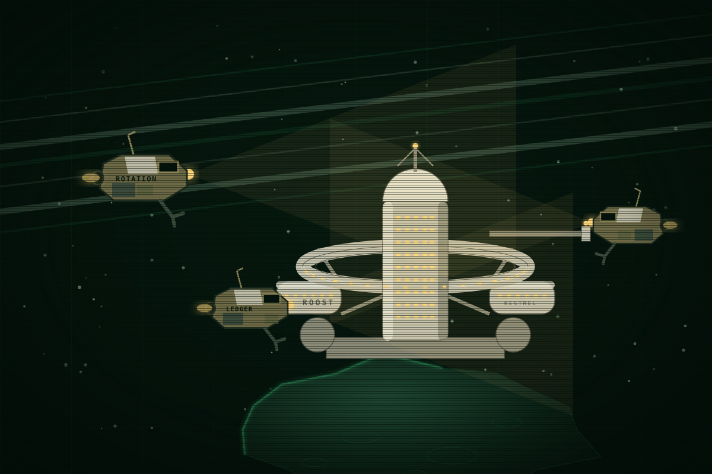

This page is about the people who fell off every roster. EWI, Fleet and the press call them Scavengers. For their leader, see the People pages.

# The Kites

<table class="infobox kites">
<caption>The Kites</caption>
<tr><td colspan="2" class="image">
The Roost: a dead Kestrel station with its windows lit amber, and skiffs around it.
</td></tr>
<tr><th>What they are</th><td>An off-roster community</td></tr>
<tr><th>Founded</th><td>Y-4, the night the Shelter died</td></tr>
<tr><th>Home</th><td>The Roost, a dead Kestrel station</td></tr>
<tr><th>People</th><td>About 300</td></tr>
<tr><th>Village run by</th><td>A council. Solberg is its voice.</td></tr>
<tr><th>Ship run by</th><td>Dorian Pell</td></tr>
<tr><th>Ship</th><td>Severance, was Resolute, since seven weeks before Y0</td></tr>
<tr><th>Small craft</th><td>Skiffs, out of Lantern's junk</td></tr>
<tr><th>Colour</th><td>Amber</td></tr>
<tr><th>Names</th><td>Kestrel's for their own. Company words for what they take.</td></tr>
<tr><th>Called by others</th><td>Scavengers</td></tr>
</table>

The Kites are the people at Saturn who are on no roster: the volunteers who
"died" with Pell, the Kestrel hands his tender pulled out of the Shelter, the
ones who vanished rather than sign, the renewed workers who walked off company
ships at the junk, and the drifters who fell off every list. They live in a dead
Kestrel station called the Roost and have spent four years scraping a life, and
then weapons, out of the junk. Seven weeks before Season 1 they stole a warship.
Until then they were a joke.

## Origin

The night of the Shelter, a company tender left Meridian against orders with its
boat-deck officer and four volunteers aboard, crossed to the wreck, and pulled
thirty-one Kestrel hands out of the Shelter's broken ring before its air ran
low. Meridian did not follow and did not search. The tender went dark on purpose
and ran for the Roost, a Kestrel station two days off the working sectors that
Kestrel had never registered. Thirty-six people arrived. One of the thirty-one
was Solberg.

Over the first year about a hundred Kestrel hands who would not sign found their
way to the Roost, and then a trickle of others: renewed EWI workers who walked
off at the junk sites, people the company had written off and who took it
literally. By Y-1 there were three hundred.

## How they live

Air and water from ice cut quietly off-plate, where no survey looks. Power from
salvaged cells. Food from the Roost's ring, which Kestrel built to grow it.
Parts from the junk, which is inexhaustible. Money from salvage sold through
brokers at the transit stations who do not ask where a Brightwater pump came
from. And, from the second year, from company caches: sealed modules at worked
sites, taken before the tugs came for them. That is the Scavenger in the
company's word for them.

Until Y0 the Kites had one rule that everyone kept: take cargo, never crews. In
four years of raiding, nobody died at a Kite's hand. The company lost modules
and filed them. The Kites were a cost, not an enemy, and the company treated
them the way it treats every cost, by not spending anything on them.

The village decides by council, with Solberg as its voice, in Kestrel's way. The
ship is Pell's. The sixty who crew it chose to, and the choice is the fault line
under everything that happens in Season 1.

## The name

A kite is a hawk that lives on what it finds. The name is Kestrel's way, a bird,
and the insult taken back on their own terms. They keep Kestrel's words for
themselves and their homes: the Kites, the Roost, a cast, the mews. What they
take from a company gets a company word, said straight and meant as a receipt: a
skiff called Rotation, a skiff called Ledger, a warship called Severance. It is
a joke, and it is bookkeeping, and it says in one word that the thing was owed.

## Taking Resolute

The Kites learned from the brokers that Fleet was selling a laid-up frigate at
the Callisto yard, and who the buyer was. Papers for a salvage contractor cost
four years of pump money. A skiff crew flew to Callisto as surveyors, boarded
Resolute, put its twelve caretakers in its own boat with a beacon, and brought
the frigate to Saturn dark over four weeks. Fleet told nobody. The joke had a
warship, and the man who had watched Meridian for four years had the company in
front of his guns.

## How the Kites speak

Terse, in the clear, first names, and in Kestrel's words when it is their own
business. They find company paperwork funny the way people find a drunk funny,
and they quote it. A skiff's patter is fast and practical. The Roost's is slower
and older.

> Two skiffs at a company cache, in the clear
> Ledger, Rotation. Module's sealed and the tugs are two hours out. Perch on
> it, I'll cut the jesses. Received. Mind the seal, Rotation, the company
> likes a clean receipt.

> The Roost to a skiff coming home
> Rotation, Roost. You're heard. Come to perch on the ring and go hooded, we
> have company traffic on the lane tonight. Good stoop.

## Hooks

- Nobody died before Meridian. The strike is the Kites' first blood, and the
  sixty knew it would be. That is the split waiting to happen.
- The receipt names. Anything the Kites take from the company can be named on
  the page in one word.
- The skiffs do the small work and talk in the clear, so the reader hears the
  Kites long before meeting one.
- Amber windows in a bone-white station is the image of the Kites: Kestrel's
  house, someone else's light.

## Open questions

- The four volunteers' names, and whether any is still alive.
- The brokers. One recurring voice at a transit station would serve.
- How many skiffs, and whether one of the Kites is ex-Fleet, which would
  explain the papers.
