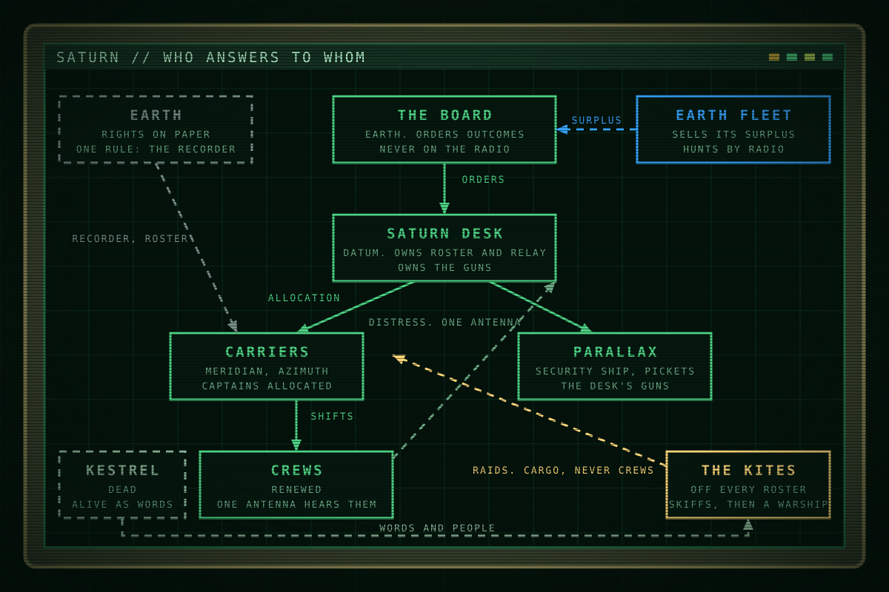

This page is about who can do what to whom at Saturn. It repeats facts from the other pages on purpose, in one place.

# How power works at Saturn

<table class="infobox">
<caption>Power at Saturn</caption>
<tr><td colspan="2" class="image">
Who answers to whom. Solid lines are orders. Dashed lines are the ways around them.
</td></tr>
<tr><th>Decides</th><td>The Board, through the desk</td></tr>
<tr><th>Enforces</th><td>Parallax, its pickets, and Datum's turrets</td></tr>
<tr><th>Instruments</th><td>The roster, the contract, the relay, the recorder, the press</td></tr>
<tr><th>Watches</th><td>Nobody, and then a recorder</td></tr>
</table>

Everyone at Saturn knows how it works, and nobody does anything about it,
because the way it works is designed so that nobody can. This page lays the
design out: the chain of command, the instruments it runs on, what each actor
can and cannot do, and the one crack in it.

## The chain

The Board on Earth orders outcomes in text. The Saturn desk at Datum turns
outcomes into allocations: which carrier goes where, what is recovered, what is
written off. Captains carry out allocations and run their ships. Crews fly the
shifts. Each link down the chain has less discretion and more exposure, and the
language warms at every step, so that the Board says consolidate and a crew
hears hold your posts.

Beside the chain stand three bodies that are not in it. Earth, whose law reaches
Saturn as three duties and one device. Fleet, which sells the company its
surplus and hunts by radio from far away. And the Kites, who are on no roster
and so, on paper, do not exist.

## The instruments

- **The roster.** To exist at Saturn is to be on a roster, and the desk keeps
  it. Off the roster is dead, written off or gone to the Kites, and the three
  are the same on paper. A closed roster is the Nova Protocol. An open roster
  is a set of valid codes, and the desk closes rosters as late as it can,
  because a closed one is a cost on its books.
- **The contract.** Nine sections, and the ninth is the one that matters:
  renewal at the company's option and, under it, the write-off. Costs against
  remaining term make a rescue a cost to the rescued.
- **The relay.** Datum's antenna is the only way out of the plate. Small ships
  reach what they can see and the desk. The desk reaches the system and Earth.
  Whoever holds the relay decides what Saturn says.
- **The recorder.** Earth's one rule with teeth: a certified, append-only,
  signing device on every crewed hull, which the desk must keep and cannot
  purge, which beacons when unseated, and whose signed entries any other
  recorder accepts and keeps when they are relayed. It is evidence and nothing
  else. It opens no doors.
- **The guns.** Parallax, a Fleet-surplus security ship, its pickets, and
  Datum's turrets, which are the only fixed guns at Saturn and answer to the
  desk. Until seven weeks before Season 1, these were the only guns at Saturn.
- **The press.** On Earth. It is the only thing the Board and Fleet both fear,
  and it is ninety light-minutes away and reads what the relay sends.

## What each actor can do

| Actor | Can | Cannot |
| --- | --- | --- |
| The Board | Order any outcome. Reward a desk. Name a scapegoat. | Be heard. Be at Saturn. Read a recorder before Earth does. |
| The desk | Allocate ships and people. Close a roster. Refuse a recovery kindly. Decide what the relay carries. Turn the guns on anyone, including its own. | Purge a recorder. Stop a beacon. Hear a small ship its antenna is not pointed at. |
| A captain | Run the ship. Refuse an order, at the price of the roster. | Reach anyone but the desk with a complaint. |
| A crew | Fly the shift. Call the desk. Joke. Walk off at the junk. | Be heard by anyone else. Go home on their own terms. |
| Earth | Write the Act. Read the record afterwards. Print the story. | Be there. |
| Fleet | Challenge on guard. Sell surplus. Arrive late and write the account. | Be at Saturn in time. Keep a loss quiet forever. |
| The Kites | Take cargo. Hide where nobody registered anything. Fly a warship, if sixty agree to. | Be heard past their own radios. Be counted. |

## Why nobody does anything

Because the way home is the company's, and the debt is real, and the desk is
kind. Because a complaint reaches the desk and nobody else. Because everyone has
seen what a hero gets: a line in a file and a plaque beside the banner. Because
the jokes work, and anger costs. Everyone at Saturn knows, and the knowing is
what the design produces instead of action.

## The crack

The design has one seam, and Earth put it there without meaning to. The recorder
is the only object at Saturn that the desk must keep, cannot alter, and does not
read. Everything the chain says to itself in a warm voice is on one, signed, and
a relay that carries a signed record hands a copy to every recorder that hears
it, where it verifies on its own. The institutions can absorb a hero, a strike,
a lost ship and a scapegoat. They cannot absorb a record they did not write,
once it has left the desk's antenna. Season 1 is the story of a record leaving.

## Hooks

- Every scene of company power can be staged as one of the instruments in use:
  a roster on a screen, a contract clause spoken, the relay refused, a
  recorder beeping.
- The desk's kindness is its power. Never let it raise its voice.
- The Kites' invisibility and the crew's inaudibility are the same rule seen
  from two sides.
- "It opens no doors" keeps the recorder from becoming a magic key. What gets
  the crew through doors is being on an open roster.

## Open questions

- Whether Datum's turrets have ever fired. The book assumes not.
- How much the captains know. Vance's page should decide whether he knew what
  Meridian carried in Y-4.
- The exact form of a relay's record exchange, if a scene ever needs to show
  it.
