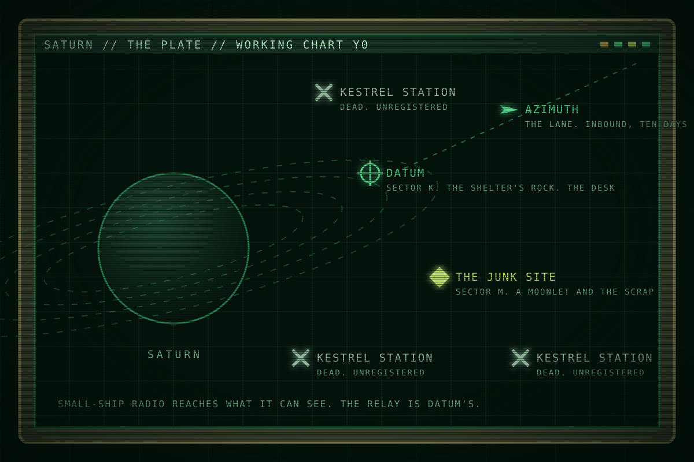

This page is about the place. For who answers to whom there, see <a href="politics.html">How power works at Saturn</a>.

# Saturn and the rings

<table class="infobox">
<caption>Saturn</caption>
<tr><td colspan="2" class="image">
The working chart, Y0: Datum, the junk site, three dead Kestrel stations, Azimuth on the lane.
</td></tr>
<tr><th>What it is</th><td>The outer system's water</td></tr>
<tr><th>Worked since</th><td>Y-22</td></tr>
<tr><th>Owner in practice</th><td>EarthWorks Industrial</td></tr>
<tr><th>Law</th><td>Earth's, on paper</td></tr>
<tr><th>People, Y0</th><td>About 1,750 under EWI contract. About 300 Kites.</td></tr>
<tr><th>Radio</th><td>Local for small ships. System-wide from Datum.</td></tr>
<tr><th>Light lag to Earth</th><td>70 to 90 minutes</td></tr>
</table>

Saturn is where the outer system gets its water. The rings are ice, loose and
shallow, and a cutter can take a slab out of them with a saw and a tug. Twenty-
two years of that work have made the rings the busiest and least governed place
beyond the Belt: one company, its two carriers, a headquarters on a dead
competitor's rock, the wrecks of fourteen small companies, and, in a dozen
unregistered stations nobody can find, the people who fell off every roster.

The campaign never leaves the rings. Everyone who works there calls the ring
plane the plate.

## The plate

The rings are a flat field of ice and rock a few tens of metres thick and
hundreds of thousands of kilometres across. From inside, the plate is a floor
that goes on to the horizon in every direction, lit from one side, and the sky
above and below it is empty. Ice is the product. Rock is what stations stand on.
Scrap is what twenty years of small companies left, and it collects in the slow
eddies around the moonlets, where the ice does not clear it.

EWI's survey letters the working ring sectors. Sector K held Kestrel's Shelter
and holds Datum today. The junk site is in sector M, at the plate's outer
working edge, where the small companies went when the inner sectors were
claimed.

Working on the plate means working in two dimensions. Everything is in the same
plane at the same distance from the light, so a hull is visible for a long way
and its shadow for longer. Off-plate, above or below the rings, there is nothing
to hide behind and nothing to mine. Ships go off-plate to be alone.

## Shadows

The shepherd moonlets are the plate's only cover. Each is a lump of rock a few
kilometres across with a shadow side as black as the sky, and a hull parked in
that shadow is dark to everything except a ship on the same side. Radio behaves
the same way: the rock blocks it. The moonlets are where ships wait, where
skiffs hide, and where anything that comes from nowhere comes from.

Every working site has a moonlet, because the moonlets are where the scrap
collects and the ice is thickest. Meridian works the junk site under one.

## Gravity

Down is where the drive pushes. A ship under way has weight along its thrust
line, with its decks stacked toward the engines, and a ship that is coasting,
holding station or docked has none. A work boat burns for minutes and drifts
for hours, so its crew works in free fall and straps in for the burns. A
carrier working a site holds station and is weightless until it moves. Its
people live in free fall for the weeks of a job and get their weight back on
the lane. Stations spin: the Shelter's ring turned, the Roost's ring turns, and
Datum turns its habitat ring on the rock. Nothing at Saturn has weight for
free, and everyone aboard knows what the ship is doing by which way is down.

## Distances and time

Nothing on the plate is close. A work boat crosses a sector in hours and the
plate in weeks. The numbers the story uses:

| From | To | Time | In what |
| --- | --- | --- | --- |
| The junk site | Datum | About thirty hours | A small boat under way |
| The junk site | A dead Kestrel station off the sectors | Two days | Behind a skiff |
| The outer transit stations | Datum | Ten days | A carrier on the approach lane |
| Datum | Earth | 70 to 90 minutes | Radio, one way |

Everyone keeps Earth's day. Carriers run two twelve-hour watches. Work boats fly
twelve-hour shifts and come home to the carrier between them. A job is counted
in shifts from the day the carrier arrives, so a boat can be on shift three of a
site and its crew on their four-hundredth shift together.

## Radio

Radio is the second rule of the place, after ice. A small ship talks to what it
can see: on the open plate about two thousand kilometres, in junk much less, and
never through a rock. A carrier carries a relay antenna and talks to the whole
system. Datum's relay talks to Earth.

The consequence is simple, and the whole story lives inside it. A small ship in
trouble is heard by an antenna pointed at it and by nothing else. Datum's
antenna is pointed at everything on EWI's roster all the time; that is what a
desk is. So a crew can always reach the desk, the desk can reach everyone, and
nobody else hears the crew at all.

Channels have habits:

- The **guard channel** is the open emergency channel. Every hull keeps it on
  speaker by regulation and turns it down by habit. Fleet's traffic arrives on
  it in fragments from very far away.
- A **work channel** joins a boat to its carrier's Control.
- The **deck channel** joins a boat to the boat deck that fits it.
- The **certified channel** is the recorders'. A recorder that leaves its seat
  beacons on it, and the desk must monitor it. Nobody talks on it.
- **In the clear** means unencoded. Skiffs talk in the clear because they have
  nothing else.

## Who is at Saturn

| Who | Where | How many, Y0 |
| --- | --- | --- |
| EWI: the desk and the yards | Datum | About 1,100 |
| EWI: the carrier Meridian | The junk site | 412 |
| EWI: the carrier Azimuth | The approach lane, inbound | About 430 crew and 400 workers |
| EWI: the security ship Parallax | Datum | About 60 |
| EWI: pickets and tugs | With the carriers and Datum | About 180 |
| The Kites | The Roost | About 300. Sixty of them crew Severance. |
| Earth Fleet | Nothing stationed | Vigilant is weeks away |
| Kestrel | Dead as a company | About 400 former hands under EWI contract |

## How Saturn talks

Words everyone on the plate uses, whatever their group. Kestrel's own words are
on the [Kestrel](kestrel.html) page.

| Word | Meaning |
| --- | --- |
| the plate | The ring plane, where the work is |
| off-plate | Above or below the rings, where nothing is |
| a shadow | A moonlet's dark side, where things hide |
| the lane | The approach lane from the outer transit stations |
| the desk | Datum's management, and the voice that speaks for it |
| the roster | The list of everyone a company carries. To exist at Saturn is to be on one |
| off the roster | Dead, written off, or gone to the Kites. The three are the same on paper |
| renewed | A worker whose term the company extended at its own option |
| bottles | Stored air. A short-shift boat lives on bottles |
| a plaque | What is left of a company, or of a hero |
| a tag | The transponder a boat sticks on a hull for the tugs, and the number the hull becomes |
| on guard | On the guard channel |

## Hooks

- The shadow gives any scene a place for something to appear from nowhere.
- The one antenna makes every distress call a call to the desk, and only the
  desk.
- Numbered shifts make time legible on the page without a clock.
- Twenty years of scrap make a place where a company's whole life is a tag
  number.
- Two dimensions: everything is visible for a long way, so hiding is done in
  junk and behind rocks, never in open space.
- Weight is a signal. A cup that falls means a burn. A cabin where nothing
  falls is a ship pretending to be dead.

## Open questions

- None at present. The calendar, gravity and the sector list are decided.
