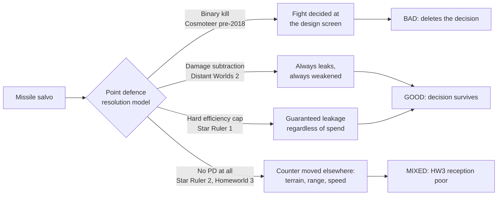

# Prior work: point defence versus missiles across shipped games

**This is not my research.** A separate lane surveyed point-defence-versus-missile
balance across shipped games and handed the findings over for the record. It is
reproduced here because it is exactly the "reference material from other games"
half of this task's brief, and because a finding with no home gets lost.

Credit for everything in the "Findings as handed over" section belongs to that
lane. My own contribution is the "Building on it" section at the end, which is
marked as such.

## Verification status - read this first

I could NOT independently re-verify any figure below with the tools available in
this session:

- The Cosmoteer devlog (`walternaterealities.itch.io/cosmoteer/devlog/28003/`)
  returns HTTP 404 through the fetch tool, with and without the trailing slash.
- Starsector's Fandom wiki returns HTTP 402 to automated fetches.
- The session's web-search budget was already exhausted, so no substitute
  sources could be located.

So: treat the quotations as accurate to the originating lane's reading, not as
double-sourced. The confidence caveats at the end are that lane's own, and they
are the honest part of the record - keep them attached to the numbers.

## The framing finding

Cosmoteer's developer named the design problem in a 2018 devlog. Missiles were
an "extremely BINARY weapon", meaning they were "either over-powered if the enemy
didn't have enough point defenses, or near-useless if the enemy had a decent
amount of point defenses". The stated consequence is the important half: it "made
ship design less interesting and many battles won-or-lost before the battle even
began".

That is the whole problem in one sentence. A binary counter does not just
unbalance a fight, it deletes the decision that the fight was supposed to be
about.

His fix nerfed both sides toward the middle:

| Change | From | To |
| --- | --- | --- |
| Missile damage | - | -50% |
| PD rate of fire | 10/s | 5/s |
| PD power per shot | - | +100% |
| PD range | 80 | 70 |
| Delay before another tube in the same launcher fires | - | 0.5 s |

Acknowledged cost, in his words: it "likely makes kiters significantly stronger."

## Three shipped answers to the binary problem

1. **Distant Worlds 2 - subtract, do not kill.** Point defences attack seeking
   projectiles "reducing their damage by the intercept damage"
   ([forum](https://www.matrixgames.com/forums/viewtopic.php?t=382200)). A
   partially intercepted missile still lands, weaker. A binary outcome is
   arithmetically impossible. DW2's PD is also SELF-DEFENCE ONLY - it cannot
   protect another ship.
2. **Star Ruler 1 - cap the interception.** A hard efficiency ceiling around 80%,
   so leakage is guaranteed regardless of investment. Secondary sources only.
3. **Cosmoteer - nerf both sides toward the middle.** As above.

## The structural pattern worth generalising

Every game that makes point defence a real decision SPLITS the weapon or the
resource, so that PD is never strictly better or strictly worse than offence:

- **Homeworld Remastered** - `tai_defenselaser` has default penetration 0 and
  default accuracy 0. It physically cannot shoot a ship. 67.8% interception,
  2575 m, 45 degree cone, ~1 shot per 6 s, 135 HP, 130 RU.
- **Cosmoteer** - PD is power-fed; Flak needs crew and ammo and has a narrow arc.
  Neither is strictly better.
- **Nebulous: Fleet Command** - PD turrets are separate mounts competing for the
  same hull points.
- **FTL** - each drone deployment costs a drone part, and another on every
  redeploy.
- **Distant Worlds 2** - self-defence only, so the cost lands on every hull.

## The PD overkill bug - shipped twice, patched once

**Sins of a Solar Empire II**: "Point defense has an ugly tendency to overkill a
few missiles rather than spreading their fire to stop more of them" - they "all
open on it massively overkilling it and letting the ones in the back go through".
Confirmed a bug, fixed 27 Aug 2024. The pre-fix meta was "spam missile frigates
and pretty much ignore upgrading from that point on", with roughly 50 flak
frigates failing to counter a missile-frigate mass.

**FTL** has the same shape: "If you launch more than one defense drone, both may
shoot at the same shot."

**Nebulous** solves it explicitly: "PD turrets will try to target different
missiles to split their fire."

This is a target-assignment bug, not a balance problem. Two shipped games got it
wrong. It is cheap to get right if you decide to at the start.

## Reference numbers collected

**Starsector** - an unguided torpedo surviving PD on hit points alone:

| Weapon | Damage | HP | Ammo | Guidance | Range / speed | OP |
| --- | --- | --- | --- | --- | --- | --- |
| Reaper-class Torpedo | 4000 | 500 | 1 | none | 1200 / 400 | 2 |
| Harpoon MRM | 750 | 150 | 3 | medium, 30 deg/s | 2500 / 300 | 4 |

The Reaper "can withstand light point defense fire"; the Harpoon is "easily
intercepted". Interceptors: Vulcan Cannon 500 DPS / 250 range; Flak Cannon 200
DPS area of effect / 500 range.

**Homeworld Remastered** speed classes, which look deliberately placed:

| Class | Speed |
| --- | --- |
| Interceptors | 348 |
| Bombers | 279 |
| Torpedoes | 220-250 |
| Corvettes | 231 |
| Frigates | 176 |
| Capitals | 120 |

Strike craft escape torpedoes by running; capitals cannot. Torpedo endurance is
bounded: 20 s x 250 m/s is about 5000 m of powered flight against a 4500 m launch
range, so running for 20 seconds makes it expire. Speed is the counter, and it is
distributed by hull class rather than bought.

**Nebulous "wall thickness"** - a durability model better than flat hit points:
"If the AP of the incoming attack is less than the wall thickness, it will only
deal half damage to the missile." SGT-300 Pilum, 160 HP behind 2.5 cm walls; S1
Balestra, 10 HP / 0.5 cm. This makes WHICH point-defence gun you fitted matter
rather than HOW MANY.

**Nebulous priced PD-defeat catalogue**: Hardened Skin 5 pt, Decoy Launcher 12
pt, Cluster Decoy 30 pt, Radar Absorbent Coating 4 pt, Weave 1 pt, Corkscrew 3
pt. Note that the counter-to-the-counter is itself priced and optional.

## Negative results, which are useful

- **Star Ruler 2 ships NO point defence at all** - a deliberate developer
  decision. Community reasoning: it "would push missile ships and usage further
  down".
- **Homeworld 3 has no anti-missile interception whatsoever.** Its "Point Defence
  Cannon" is anti-strikecraft. It substitutes terrain occlusion, and community
  reception is poor.
- **Cosmoteer's spatial ammo logistics** - a weapon 5 corridor tiles from a
  reactor gets 10 shots; adjacent, 25 - is elegant but needs a crew simulation to
  work at all.

## Confidence caveats (the originating lane's own)

- Homeworld Remastered raw file values differ from HW2-Classic wiki values.
- Star Ruler 1's 80% cap is secondary-source only.
- DW2 publishes no per-component PD stats.
- The Nebulous fan wiki self-labels as stale at v0.5.2.2.
- Cosmoteer's 0.13.7 figures are the 2018 classic build, not current.
- Starsector fragmentation-versus-missile-HP multipliers are unverified.

---

# Building on it - Nova-specific reading

Everything from here is my analysis, not the originating lane's.

## Nova already has the structure the good answers need

The handoff's central pattern is "split the weapon or the resource". Nova gets
that for free and in a stronger form than any game listed, because a turret and a
torpedo bay are already SEMANTIC SECTIONS placed at authored link points.

The competition is therefore SPATIAL and VISIBLE, not an abstract point budget:

- Nebulous makes PD compete for hull points. An abstract number on a fitting
  screen.
- Nova makes PD compete for LINK POINTS AND MASS. A player can see, from outside
  the ship, that a hull traded a torpedo bay for a PD turret - it changed
  silhouette.

That is the readability win the visual-identity half of this research keeps
finding (see `RESEARCH.md`): loadout you can read off the silhouette. Point
defence is the mechanic where it pays off twice, because the counter-play depends
on the attacker knowing what they are attacking.

## The binary problem has a structural answer here that no listed game uses

Nova's sections are DESTRUCTIBLE, and `20260815-225748` extends that to
decorative fixtures. So PD turrets can be shot off.

That converts the binary into a two-stage exchange with no arithmetic hack at
all:

- Salvo one strips PD turrets, or is spent doing so.
- Salvo two lands on a hull with degraded interception.

Neither "PD wins" nor "missiles win" is stable, because the PD is itself a
target, and its loss is permanent within an engagement. Distant Worlds 2 needed
damage subtraction to escape the binary; Nova can escape it through attrition of
the defence, which is more legible to a player - you can SEE the turret go.

## Distant Worlds 2's subtraction is nearly free in this codebase

DW2 reduces a missile's damage by the intercept damage rather than killing it.
That requires missiles to have a damage pool that PD can chip.

Nova already has both halves as concepts:

- Skin plates carry `Health` (task `20260815-190741`). Giving a torpedo `Health`
  is the same object model, not a special case.
- PIERCE damage - leftover damage carries through a destroyed plate into the
  section behind - is already specified in that task.

"A partially intercepted missile still lands, weaker" is pierce damage pointed at
a different target. Prefer that to a bespoke interception-roll system.

## Nebulous's wall thickness is the same shape as Nova's armour question

"AP below the wall thickness deals half damage" makes WHICH gun matter rather
than HOW MANY. Nova faces the identical question when it decides how pierce
interacts with plate thickness - and the quarter-cell plate alphabet means plates
already have a natural thickness value to threshold against.

Mirroring the mechanic keeps one damage rule for hulls, plates and missiles
instead of three.

## Fix the overkill bug at the start, because it is free then

Two shipped games (Sins II, FTL) let multiple PD emplacements fire at the same
incoming round while others leak past. Sins II needed a patch. Nebulous simply
assigns different targets.

Do it Nebulous's way from the first commit: a claim or reservation set over
incoming projectiles, so a PD turret picks an unclaimed target. Retrofitting this
into a shipped targeting system is what cost Sins II a patch cycle and a degenerate
meta; doing it up front is a dozen lines.

## What NOT to copy

- **Cosmoteer's spatial ammo logistics.** Elegant, and it presumes a crew
  simulation Nova does not have and should not grow for this.
- **Homeworld 3's answer** - remove interception, substitute terrain occlusion.
  Reception was poor, and Nova's open-space combat has no terrain to substitute.
- **Star Ruler 2's answer** - ship no point defence at all. Defensible for a 4X
  where fleets are abstractions; wrong for a game whose whole pitch is that you
  built the ship out of visible parts.
