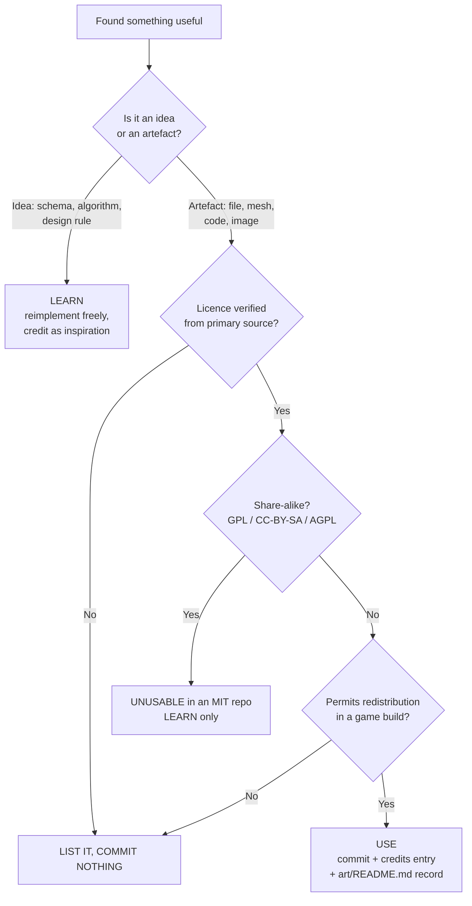
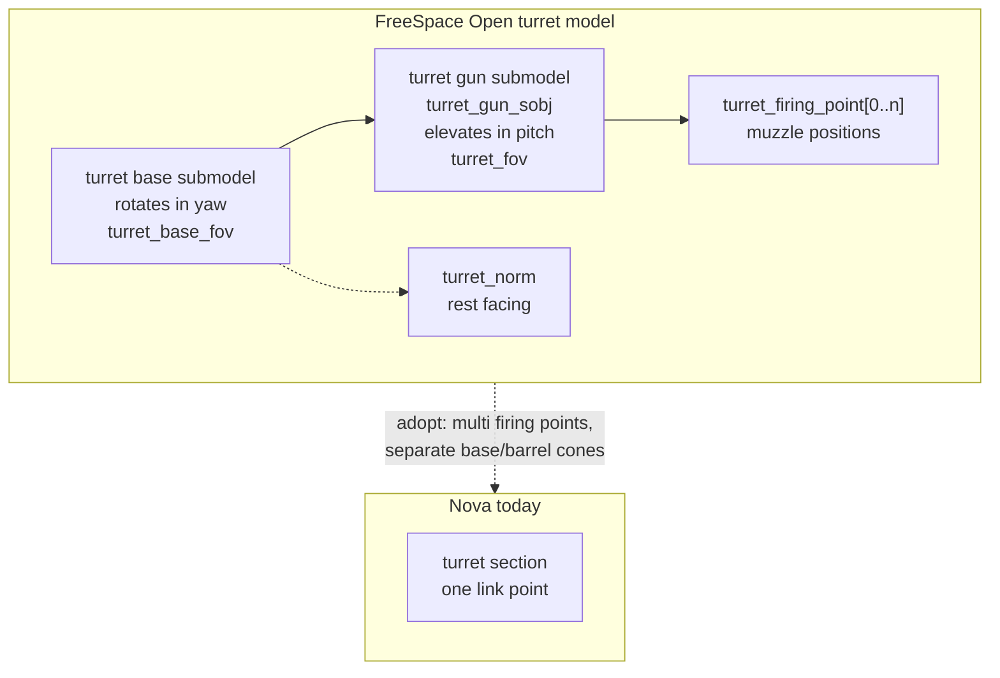
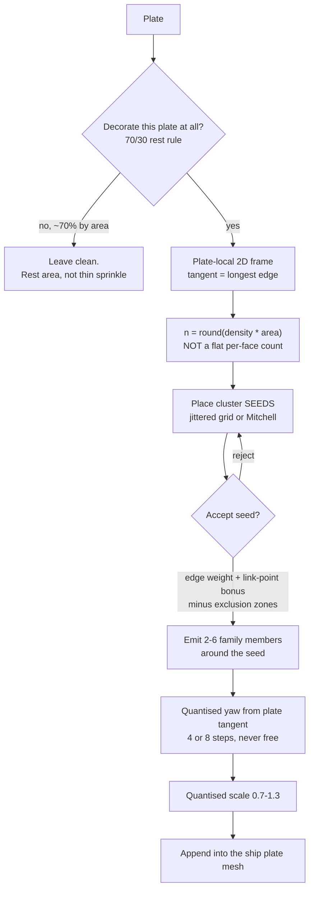
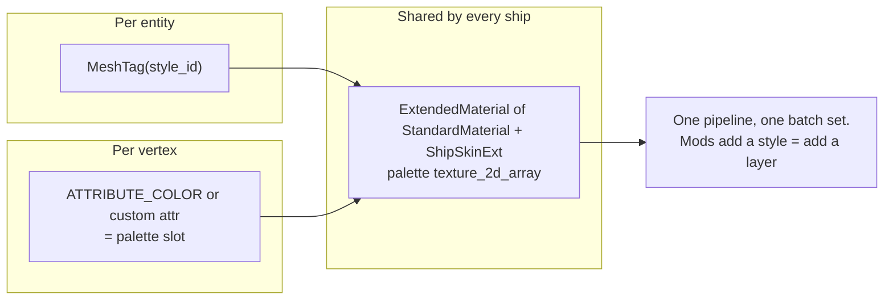
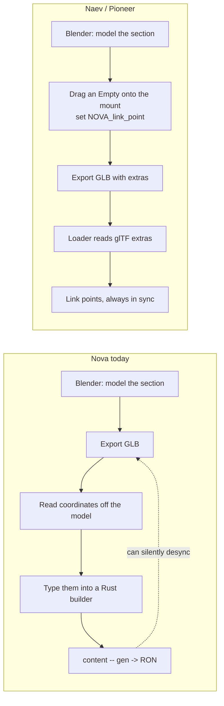
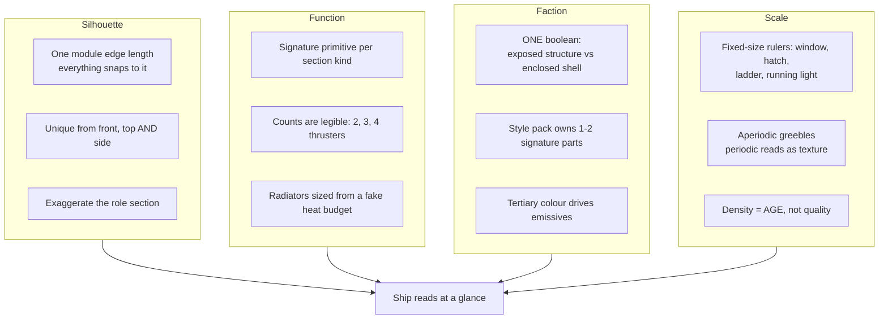

# Market research: open-source prior art, technique, and licence positions

Survey date: 2026-08-15. Reference record, not scheduled work.

Nova Protocol is MIT (`LICENSE`, (c) Alexandru Jercan). That single fact decides
most of this document. Almost every open-source space game is GPL code with
CC-BY-SA art, and both are share-alike. So the useful output is rarely "copy
this file" and usually "copy this idea" - which is legal, because facts, data
schemas and algorithms are not copyrightable, only their expression is.

**Read the [Recommendations](#recommendations) first if you only read one
section.** The six items at the top of it are the whole document's payload.

## How to read the licence verdicts

Every entry carries one of four verdicts. They mean exactly this:

| Verdict | Meaning |
| --- | --- |
| **USE** | Licence permits redistribution in an MIT game. Copy the file, record attribution. |
| **LEARN** | Licence forbids reuse here (GPL / CC-BY-SA / unclear), but the DESIGN is free to study and reimplement. Take the idea, write the code. |
| **LINK** | Copyrighted commercial material. Link and analyse in prose. Commit nothing. |
| **AVOID** | Actively misleading, unmaintained, or a licence trap. |



The trap worth naming: CC-BY-SA art is NOT compatible with a permissive game
just because the game is free. Share-alike propagates to the combined work in
the way most people find out about too late. Treat every CC-BY-SA asset as
radioactive here, however good it looks.

## 1. Open-source space games

### The licence picture, which is bleak and worth knowing up front

| Project | Code licence | Art / data licence | Verdict |
| --- | --- | --- | --- |
| **Star Ruler 2** | **MIT** | CC-BY-NC 2.0 | **USE (code)** / art unusable |
| Endless Sky | GPL-3+ | CC-BY-SA-4.0 mostly, some CC0 + public domain | LEARN |
| Naev | GPL-3 (or later for post-2021 work) | per-asset YAML; CC-BY-SA-4.0 default for other files | LEARN |
| Pioneer | GPL-3 | CC-BY-SA-3.0 present in `licenses/` | LEARN |
| Oolite | GPL-2+ | **CC BY-NC-SA 3.0** - share-alike AND non-commercial | LEARN |
| FreeSpace Open | **hybrid, non-commercial core** - see below | retail media is Volition copyright | LEARN |
| Vega Strike | GPL-3 (engine) | **GPL-2** (separate assets repo) | LEARN |
| Thetawave (Bevy) | **MIT** | third-party packs, per-pack | **USE (code)**, but stale |

Verified first-hand on 2026-08-15 from primary sources; URLs in each subsection.

Only two entries are permissively licensed, and one of them has not been touched
since December 2024. That is the honest state of the field.

### Star Ruler 2 - the one you can actually copy from

- Repo: <https://github.com/BlindMindStudios/StarRuler2-Source>
- Licence, quoted from its README: "Star Ruler 2 source code is licensed as MIT,
  art assets are licensed as CC-BY-NC 2.0."
- Status: archived in effect, last push 2023-11-18. Blind Mind Studios open
  sourced the whole game when the studio went inactive.

**CC-BY-NC on the art means the art is unusable here.** Non-commercial is not a
free licence, and Nova should not take on a clause that forbids ever selling the
game. Take nothing from `data/models` or `data/images`.

**The MIT code and the data FORMAT are the prize.** Its subsystem definition
language (`data/subsystems/weapon_base.txt`, read first-hand) is the most
directly applicable thing I found in any open-source space game:

```
Template: tag/WeaponBase
	Defaults:
		Range := 100.0
		Damage := 1.0
		Reload := 1.0
		SupplyCost := 0.0
		out DPS := Damage / Reload
		out SupplyDrain := SupplyCost
		out SupplyFireCost := SupplyCost * Reload

	Modifier: RangeFactor(factor)
		Range := Range * factor
	Modifier: DamageFactor(factor)
		Damage := Damage * factor
```

Three ideas in that snippet are worth stealing outright:

1. **`out` marks a DERIVED stat, and its formula lives in data.** DPS is not a
   number an author types and keeps in sync; it is `Damage / Reload`, evaluated.
   Authors cannot desynchronise a derived value because they cannot write one.
2. **`Modifier: Name(arg)` is a named, parameterised, composable mutation.** Not
   a pre-baked variant. A mod adds `RangeFactor(1.2)` rather than duplicating the
   whole weapon with one number changed. This is exactly what a mod system needs
   in order to LAYER over base content instead of forking it.
3. **`Template: tag/Base` gives inheritance by tag.** Shared defaults live once.

Nova authors content through Rust builders into RON. The lesson transfers without
the text format: separate BASE fields from DERIVED fields, make derivation a
function rather than a stored number, and give mods named composable modifiers
rather than whole-record overrides.

Also worth a look, though I did not read the code: SR2's ship designer, where a
player paints subsystems onto a hex grid and the design's stats fall out of the
layout. That is the same problem Nova's editor solves in 3D with link points.

### FreeSpace Open - the licence trap, and the best hardpoint data model

- Repo: <https://github.com/scp-fs2open/fs2open.github.com>
- GitHub reports `NOASSERTION`, which is correct, because the licence is a
  hybrid of two.

**Read this before anyone gets excited about FSO's code.** `Copying.md` says, of
the original Volition source:

> Copyright (C) Volition, Inc. 1999. All rights reserved.
> All source code herein is the property of Volition, Inc. You may not sell or
> otherwise commercially exploit the source or things you created based on the
> source.

and then, critically: "the above notice continues to apply to all fs2_open code."

Modifications made on or after 1 November 2020 are released under the Unlicense
(`Unlicense.md`, public domain), and pre-2020 contributors could opt in. But the
Volition notice still blankets the codebase. **FSO code is NON-COMMERCIAL in
practice. Do not copy code from it into Nova.** The retail FreeSpace 2 media
(`.vp` files) is straight Volition copyright and was never freely licensed at
all - the open part is the engine, never the game.

Verdict: LEARN only. And it is worth learning from, because FSO's model format
solves precisely Nova's problem - a mesh that declares where its turrets,
thrusters and gun points are.

Verified first-hand by reading `code/model/modelread.cpp`:

- **Semantics come from the SUBMODEL NAME.** `strstr(lcdname, "turret")` sets
  `SUBSYSTEM_TURRET`; `in(sm->name, "thruster")` sets `Is_thruster` and forces
  the submodel's movement type. Name your mesh `turret01` and it is a turret.
- **Per-submodel properties are a free-text string** parsed by substring search
  for `$`-prefixed keys, e.g. `$glow_texture=`.
- **A turret is multipart**: `turret_gun_sobj` points at the gun submodel, with a
  separate base submodel; plus `turret_norm` (facing), `turret_fov`,
  `turret_base_fov`, `turret_max_fov` (three separate cone limits), and
  `turret_num_firing_points` with a `turret_firing_point[]` array.

The data model is excellent and the encoding is terrible. A submodel innocently
named `thruster_housing` becomes a thruster. Nova's typed sections with authored
link points are strictly better than name-substring inference, and should stay
that way.

What to take: **a turret is a base plus a gun plus N named firing points plus a
facing normal plus separate base/barrel/max FOV cones.**

Grounding that against what Nova actually has
(`crates/nova_ship/src/sections/link_points.rs:31`):

```rust
pub struct LinkPoint {
    pub id: String,      // "used by diagnostics and UI, not compatibility"
    pub position: Vec3,
    pub normal: Vec3,
}
```

Two gaps follow, and they are different in kind:

1. **Nova's link points are STRUCTURAL, not FUNCTIONAL.** They say how sections
   attach - position, outward normal, mate when positions coincide and normals
   oppose. There is no equivalent of "where the muzzle is" or "how far the barrel
   traverses". A turret section is geometry plus behaviour, with its firing
   geometry implicit. FSO's model makes it explicit and authorable, which is what
   lets its ships have believable weapon coverage and dead zones. Adding
   `firing_points` and a traverse cone to a turret section is a small change with
   a large payoff for combat readability - and it feeds the point-defence design
   in `PRIOR-POINT-DEFENCE.md`, where arc and coverage are exactly what makes
   point defence a decision rather than a stat.
2. **Link point ids are explicitly NOT compatibility.** So any socket mates with
   any socket, geometry permitting. Most comparable games TYPE their mounts -
   Starsector by size and category, Endless Sky by outfit category. Typed sockets
   are what stop a player bolting a capital torpedo bay onto a fighter wingtip,
   and they let a ship's silhouette advertise what it can carry. Worth
   considering before the mod ecosystem starts depending on untyped sockets.



### Endless Sky - GPL-3+ code, CC-BY-SA-4.0 art, superb data design

- Repo: <https://github.com/endless-sky/endless-sky>
- Licence, verified from the repo's `copyright` file: `Files: *` is **GPL-3+**.
  Art is predominantly **CC-BY-SA-4.0** (ship images, thumbnails, outfit and
  hardpoint graphics), with pockets of genuine public domain (NASA, US Army,
  Library of Congress, pre-June-2017 Unsplash) and some CC0 (Pixabay-derived
  `images/land/*`), plus CC-BY-SA-3.0 on Wikimedia-derived images and some sound.

**Both the code licence and the dominant art licence are share-alike, so neither
is usable in an MIT game.** The pockets of public-domain NASA imagery are
technically usable but are photographs, not low-poly ship art, so they are
irrelevant to Nova.

Its plaintext content DSL is the reason to study it anyway. It is famous for
being editable by players with no tools, which is the property Nova wants from
its webmod system. Detail is with the open-source-survey findings below; the
transferable point is that **a mod-friendly format is one a human can write in a
text editor and diff in git**, which RON satisfies and binary formats do not.

### Naev, Pioneer, Oolite, Vega Strike - all share-alike, all LEARN

- **Naev** <https://github.com/naev/naev> - `LICENSE` verified: GPL-3 for source
  (post-2021 contributions "under any later version"), `gfx/` per
  `ARTWORK_LICENSE.yaml`, `fonts/` and `snd/` likewise, and **"All other files
  (XML, etc.): Creative Commons Attribution-ShareAlike License, version 4.0 or
  later"**. Art now lives in a separate submodule
  (`codeberg.org/naev/naev-assets-lossy`). Share-alike on the DATA as well as the
  art is unusually aggressive - even the content files are infectious.
- **Pioneer** <https://github.com/pioneerspacesim/pioneer> - GPLv3 code (README
  badge). Its `licenses/` directory carries `GPL-3.txt` and `CC-BY-SA-3.0.txt`
  among others, so art is share-alike. Also notable: the README states that
  AI-generated code contributions "do not comply with and cannot be licensed
  under Pioneer's GPLv3 license" - a contribution policy worth being aware of
  before anyone opens a PR there.
- **Oolite** <https://github.com/OoliteProject/oolite> - the WORST case found.
  `LICENSE.md` puts code under GPLv2+ and states that "all artwork - 3D models,
  images and sounds - included in the work, as well as configuration files, are
  also licensed under the Commons Creative Attribution-Non Commercial-Share Alike
  License version 3.0". **CC BY-NC-SA 3.0 is share-alike AND non-commercial - two
  independent disqualifiers.** Its OXP ecosystem is a further minefield of
  third-party authors with inconsistent or absent licence declarations.
- **Vega Strike** <https://github.com/vegastrike/Vega-Strike-Engine-Source> -
  engine GPLv3; assets live in a separate repo
  (<https://github.com/vegastrike/Assets-Production>) under **GPLv2**. GPL on ART
  means every greeble derived from it, and every mod built on that, must also be
  GPL. Note that Vega Strike is the upstream source of Naev's GPLv2+ ship models,
  so the contamination travels.

For all four: **take ideas, take nothing else.**

### The pattern, stated plainly

Of the eight open-source space games surveyed, **only one offers any
permissively-licensed 3D ship art, and it is a narrow slice.** An earlier draft
of this document said "exactly zero"; that was wrong, and the correction is worth
more than the tidier claim.

Naev's per-file manifest
(<https://codeberg.org/naev/naev-assets-lossy/src/branch/main/gfx/ARTWORK_LICENSE.yaml>)
records roughly 22 **GLTF ship models under attribution-only licences**:

| Licence | Author | Models |
| --- | --- | --- |
| **CC-BY-4.0** | Viktor Hahn | apparition, archimedes, arsenal, copia, dalton, gauss, hippocrates, mammon, providence, pythagoras, rainmaker, retribution, starbridge, watson, zebra, drone (16) |
| **CC-BY-3.0** | Josiah Schwartfeger | peacemaker; kestrel (retextured by Areze) |
| **CC-BY-3.0** | Enigmatic | divinity, dogma, fidelity, preacher, shaman (5) |

Attribution-only means **no share-alike**, so an MIT game may ship them with
credit. They are production-quality low-poly hard-surface GLTF with baked
ambient occlusion.

**Three loud caveats.** The same manifest lists Vega-Strike-derived models under
**GPLv2+** and many contributor models under **CC-BY-SA 3.0/4.0**, both unusable,
so **per-file verification against the YAML is mandatory** and a mistake here is
expensive to unwind. The `naev-assets-production` repo was archived 2025-08-29.
And these are WHOLE SHIPS - the right licence at the wrong granularity for
greebles.

Everything else is share-alike or worse, and that is structural rather than bad
luck: these projects are GPL, so they licensed their art to match. **For GREEBLES
specifically the open-source-games avenue is a dead end.** It is a rich seam for
DESIGN, which is why this section is long anyway.

Also genuinely usable and easy to overlook: **Endless Sky's sound library.** Its
`copyright` file carries 72 `public-domain` stanzas covering most of `sounds/*` -
launch effects, afterburners, beams, missile hits, drills. Public domain, no
restriction at all. Nova ships generated placeholder sounds today
(`scripts/gen-placeholder-sounds.py`), so this is a real upgrade path that costs
only a per-file check.

Two further licence traps worth naming, because both are widely misread:

- "Star Ruler 2 is MIT" is the most common error. The MIT covers the source. The
  art is CC-BY-NC 2.0 and the `COPYING` file says so explicitly.
- "FreeSpace Open is open source" is the second. The engine is open; the Volition
  non-commercial notice still blankets it, and the game media was never licensed
  at all.

### Thetawave - the Bevy one

- Repo: <https://github.com/thetawavegame/thetawave>
- **MIT code**, verified from the README. Assets are third-party packs credited
  individually (Space Ultimate Megapack, Kadith's icons, Space Madness font),
  each needing its own check - the MIT statement covers the codebase, not them.
- **Last pushed 2024-12-20.** That is roughly twenty months stale against Bevy
  0.19, across many breaking releases. Its Bevy code is a historical artefact.

Verdict: USE the licence, but expect to port everything. Read it for structure,
not for code you can paste.

## 2. Asset sources

### Read this first: the owner has already decided not to source greeble art

Task `20260815-225748` records the decision: "The base mod GENERATES ITS OWN ART,
with Python... taking the existing kits as inspiration rather than as source."

That decision is correct and this survey supports it, for a reason that only
becomes obvious once you look: **every clean CC0 kit is authored at whole-prop
scale, not at greeble scale, and every source with true greeble-scale detail is
either too dense, too photoreal, or share-alike.** Generating a vent from a recipe
is less work than finding, retopologising, licensing and crediting one.

So the ranked list below is a REFERENCE and INSPIRATION list, plus a fallback for
the specific props generation is bad at. It is not a shopping list.

### The one architectural fact that drives every licence decision

Nova's pipeline produces derivative works by construction. The cutter slices
source meshes; the skin embeds and scatters; mods build on top. So:

- **CC0** - free and clear. Ideal.
- **CC-BY** - fine, no share-alike. Costs a NOTICE entry, and CC-BY 4.0 requires
  disclosing that you MODIFIED the work, which the cutter always does.
- **CC-BY-SA / GPL art** - **poison for this pipeline.** Every derived greeble,
  every generated plate embedding one, and **every third-party mod built on it**
  inherits the copyleft. It contaminates the modders, not just the repo.
- **CC-BY-NC** - hard no. Not free, not commercially shippable.
- **Commercial EULA (Synty et al.)** - shippable in a compiled build, but cannot
  be committed to a public repo, which also makes it useless to a mod ecosystem
  that ships source meshes.

GPL art and CC-BY-SA art are also **mutually incompatible with each other**. You
cannot merge a GPLv2 ship part and a CC-BY-SA 3.0 ship part into one derived
mesh. Naev's asset manifest contains exactly that mix.

### Ranked shortlist

1. **KayKit Space Base Bits** - CC0 1.0, 48+ station and mining models, ships
   OBJ + FBX + **GLTF**. Uses a single 1024px gradient atlas that downsamples to
   128px, which is functionally flat colour - the closest style match found to
   what Nova already does. GitHub-mirrored with a `LICENSE.txt`, so provenance is
   trivial. <https://github.com/KayKit-Game-Assets/KayKit-Space-Base-Bits-1.0>
   The sibling "Bits" packs (Resource, Block, City Builder, Furniture) are the
   same CC0 terms and hold crates and machinery at greeble scale.
2. **Kenney's industrial kits**, which the project already trusts but has barely
   mined. Confirmed CC0 with optional attribution. Beyond the Space Kit already
   vendored: **Factory Kit**, **City Kit (Industrial)**, **Space Station Kit**
   (90 files), **Modular Space Kit** (40 files, explicitly interlocking), and
   **Space Kit (remade)** (150+ objects, adds GLTF). Pipes, tanks, vents and
   machinery at exactly greeble scale. Best inspiration source in the survey.
3. **greyoxide "Shipyard v0.4"** on OpenGameArt - CC0, a `.blend` organised into
   layers where **layer 5 is explicitly "greeble details"**, authored for modular
   ship assembly. The single most on-target artefact found anywhere.
   <https://opengameart.org/content/shipyard-v04-customizable-spaceships>
4. **Quaternius Modular Sci-Fi MegaKit** - CC0, 270+ grid-aligned separable
   components (190 in the free tier). Grid alignment matches the existing
   cutter's assumptions.
5. **Poly Pizza, CC0 filter only** - for one-off props no kit covers (antennae,
   dishes, beacons). Per-model licences, badge shown on each model page.
   Fall back to the CC-BY Google Poly mirror only with a NOTICE entry.

### What was rejected, and why

- **ambientCG** - CC0 and excellent, but it is a PBR material and HDRI library.
  Its actual 3D models are bread and pears. No greeble value at all.
- **Poly Haven** - CC0 with an unusually explicit redistribution grant, and it
  does have industrial props. But they are 4K photoscanned PBR assets with baked
  weathering. Decimating them to flat-shaded low-poly destroys the only thing
  that makes them good. **Modelling reference, not shipped geometry.**
- **Sketchfab** - per-model CC badges are real, but greeble packs there are
  authored for renders. A representative "Greeble Tiles" model is 57,000 tris
  with no UVs. Wrong budget by two orders of magnitude for scattered instances.
- **NASA 3D Resources** - "free to download and use" is qualified by brand
  guidelines stating the NASA insignia and imagery are **not** public domain,
  plus no-endorsement rules and third-party copyright in some images. Photoreal
  high-poly real hardware. Reference only. Same reasoning kills ESA, which uses
  CC BY-SA IGO - share-alike.
- **Printables / Thangs** - 3D-printing sources skew hard to CC-BY-NC and
  CC-BY-NC-SA, and are STL-only: manifold, no UVs, high poly. Bad fit twice.
- **Synty** - EULA verified: "You must not share the source files of any Assets
  outside your team" and no redistribution "for re-use by third parties".
  Shipping in a compiled build is allowed. **Fatal for a public repo and fatal
  for a mod ecosystem.**
- **TurboSquid, Free3D, Blend Swap, Pixel Lab, Superhive** - terms could not be
  reached from a primary source this session (403/404). **Nothing asserted,
  nothing committed.** Blend Swap is worth a manual visit: it hosts greyoxide's
  newer Shipyard v0.6 and a "More Greebles pack" reported CC0 by secondary
  sources only - open the blend and read its licence field before trusting it.

### Comparison table

Share-alike and non-commercial columns are the ones that decide.

| Source | Contents | Format | Licence | Share-alike / NC? | Attribution | Commit here? | Style fit | Greeble scale |
| --- | --- | --- | --- | --- | --- | --- | --- | --- |
| KayKit Space Base Bits | 48+ station/mining | OBJ, FBX, GLTF | CC0 1.0 | No | none | **YES** | Excellent | **Yes** |
| Kenney (Space/Station/Modular/Factory/Industrial) | 40-150+ per pack | FBX, OBJ, DAE, GLTF, STL | CC0 | No | optional | **YES** | Excellent | **Yes** |
| Quaternius (MegaKit, Modular Sci-Fi, Space Kit) | 92-270+ per pack | FBX, OBJ, glTF, blend | CC0 | No | none | **YES** | Excellent | **Yes** |
| greyoxide Shipyard v0.4 | hulls + components + greeble layer | .blend | CC0 | No | none | **YES** | Good | **Yes, labelled** |
| Fertile Soil Spaceship Blocks | modular ship blocks | zip (Assetforge) | CC0 1.0 | No | none | **YES** (already in repo) | Good | Medium |
| Poly Pizza, CC0 subset | one-off props | FBX, GLTF | CC0 per model | No | none | **YES** | Varies | Yes |
| Poly Pizza, Google Poly mirror | 2,292 models | OBJ, GLTF | CC-BY 3.0 per model | No | **required** | Yes, + NOTICE | Varies | Yes |
| Majadroid LowPoly Spaceships | ships, components | blend, FBX, OBJ | CC0 claimed; page grants free commercial use | No | none | Yes, record page text | Good | Medium |
| ambientCG | PBR materials, HDRIs | many | CC0 1.0 | No | optional | YES | N/A | **No** |
| Poly Haven | ~150 photoscans | many | CC0 | No | none | YES | **Poor** | Reference only |
| Sketchfab CC subset | unstructured | glTF, USDZ | per model | depends | CC-BY: required | per-model check | Poor (57k tris) | If decimated |
| NASA 3D | real spacecraft | blend, fbx, glb, stl | "free to use" + brand restrictions | No | credit, no endorsement | **Reference only** | Poor | No |
| **Naev** | 2D sprites from .blend | blend, PNG | per asset: GPLv2+ / CC-BY-SA 3.0 / CC-BY 3.0 / CC-BY 4.0 / PD | **MOSTLY YES** | varies | only the CC-BY + PD slice | whole-ship | No |
| **Endless Sky** | 2D PNG sprites | PNG | most art CC-BY-SA-4.0 | **YES** | required | **NO** | N/A (2D) | No |
| **Oolite** | ship models, OXPs | .dat/.obj | **CC BY-NC-SA 3.0** | **YES + NC** | required | **ABSOLUTELY NOT** | would fit | No |
| **Pioneer** | 3D ships | .dae, OBJ | CC-BY-SA 3.0 | **YES** | required | **NO** | would fit | No |
| **Vega Strike** | meshes, units | proprietary mesh | **GPLv2** | **YES** | required | **NO** | dated | No |
| **FreeSpace Open** | media VPs | POF/VP | **Volition proprietary, non-commercial** | not free at all | N/A | **ABSOLUTELY NOT** | N/A | No |
| **Star Ruler 2** | 3D ship models | varies | **CC-BY-NC 2.0** | **NC** | required | **NO** | would fit | No |
| Synty POLYGON Sci-Fi Space | 660 assets | FBX | commercial EULA | No | no | **NO** (build only) | Excellent | Yes |

### The recommendation that turns this survey into an invariant

Task `20260815-225748` gives styles a manifest. **Put an SPDX licence field on
every greeble mesh in it, and have the content build REJECT `CC-BY-SA-*`,
`GPL-*` and any `*-NC-*` identifier.**

That converts this whole document from tribal knowledge into an enforced rule,
and - the part that matters more - it protects third-party modders from
contaminating their own work by dropping in a CC-BY-SA mesh they found.

Naev's `gfx/ARTWORK_LICENSE.yaml` is the right design for the manifest even
though almost none of Naev's art is usable here. Mirror the pattern: title,
author, source URL, SPDX id, licence URL, and `modified: yes` - because the
cutter modifies everything, and CC-BY 4.0 makes modification disclosure a real
obligation rather than a courtesy.


## 3. Greebling and detail technique

This is the section that matters most for `20260815-225748`.

### The finding I would act on first

From ILM's own practice, and it is not a stylistic slogan: **greebles were
originally used to hide the seams where model halves separated** for internal
lighting and power cables. "Greeble the seams" is the functional origin of the
technique.

Nova computes plate boundaries and section link points already. So the highest-
payoff placement rule in the whole survey - weight decoration toward plate
borders, and weight it higher still near section link points - is **free**. It
is a distance value the derivation has in hand.

That also makes decoration reinforce the thing the visual-identity research keeps
finding: the seam IS the module boundary, so decorating the seam decorates the
gameplay structure.

### Stated artist rules, with numbers

From <https://www.pixelsanctuary.com/tutorials/scifi-architecture-greebles>:

- **The 70/30 rest rule.** "Keep 70% of surfaces clean or low-detail. Put the
  majority of greebles and panel breaks in 30% of space."
- **"Small greebles should cluster - don't evenly sprinkle."** This directly
  contradicts a naive uniform Poisson scatter, which is the obvious first
  implementation. Worth knowing before writing it.
- **Big-Medium-Small hierarchy.** Which maps onto Nova with no translation:
  sections = big, plates = medium, doodads = small. The architecture is already
  right.
- **Scale indicators at fixed real-world sizes** - railings ~1 m, doors 2.0-2.2 m,
  stair steps 0.18-0.22 m. Familiar-size objects are the strongest scale cue
  available, and they only work if the randomiser never rescales them.
- Break repetition with **3-5 variants**, distributed randomly. A style needs
  about 5-8 doodads, not 50. That matches the cap already written into
  `20260815-225748` ("six to eight pieces").

From <https://mahannahsscifiuniverse.com/blogs/model-lighting-academy/the-art-of-greebling-how-tiny-details-bring-sci-fi-models-to-life>:

- **"Real machinery isn't perfectly mirrored."** Mirror the structure, not the
  greebles. Seed the decoration RNG differently per side.

And Fon Davis, quoted in Den of Geek: "You want to put all your creative energies
into making really unique designs and shapes, and spend less time on all the
greebly details." Which is an argument for the generated-art decision already
taken, from the people who invented the technique.



### Discombobulator, the canonical generator, and its four defects

Blender's `add_mesh_discombobulator` is the reference face-extrude-and-scatter
greeble generator, and its doodad model is almost 1:1 with what Nova needs:
authored small meshes, catalogue pick, count per surface, random surface point,
align to normal, random scale in range. Source read directly at
<https://github.com/blender/blender-addons/blob/main/add_mesh_discombobulator/mesh_discombobulator.py>.

Port it, but fix four real defects in it:

1. **Count is per-face, not per-area.** `random.randint(dmin, dmax)` gives a huge
   plate and a tiny plate the same expected count. Use
   `round(density * plate_area)`.
2. **No minimum spacing.** Placement is white noise, so doodads clump and
   overlap arbitrarily.
3. **No edge awareness.** Which throws away the single best rule (above).
4. **Undefined yaw, and an outright bug.** It builds a quaternion rotating
   `(0,0,1)` onto the face normal, which leaves roll undetermined - and **when
   the normals are anti-parallel it applies zero rotation, which is wrong.**
   Handle the 180-degree case explicitly with any perpendicular axis.

Defect 4 is the important one aesthetically. **Undefined yaw is the difference
between "machinery" and "confetti".** Derive the tangent from a real structural
direction - the plate's longest edge, or the ship forward axis projected into the
plate plane - then snap yaw to 4 or 8 discrete steps. Discrete yaw is what makes
scattered boxes read as bolted-on hardware.

### Sampling algorithms, all standard-library implementable

Ranked by value per line of code for this specific problem:

1. **Jittered / stratified grid.** Split the plate into sub-cells, one random
   point per cell. About five lines, deterministic count (so budget control is
   exact), no clustering, no rejection loop. **The right default.**
2. **Mitchell's best-candidate** for small counts (tens). Place each new sample
   by generating `existing * m + 1` candidates and keeping the one farthest from
   its nearest neighbour. Roughly 15 lines, no grid, fixed count. Critically:
   **the candidate count must scale with the existing sample count** - a fixed
   candidate count "failed dramatically". Even `m = 1` works.
   <https://blog.demofox.org/2017/10/20/generating-blue-noise-sample-points-with-mitchells-best-candidate-algorithm/>
3. **Bridson Poisson-disk** when you want fixed SPACING rather than fixed count.
   O(N), grid cell size `r/sqrt(2)` in 2D, k=30 candidates per active sample.
   One correctness trap: sample the annulus by AREA -
   `rad = sqrt(uniform(r*r, 4*r*r))`, not `uniform(r, 2r)`.
   <https://www.cs.ubc.ca/~rbridson/docs/bridson-siggraph07-poissondisk.pdf>
4. **Weighted sample elimination** (Yuksel) for budget enforcement and LOD:
   generate a large candidate set once, then greedily eliminate down to the
   target count. Needs no radius up front, and gives every LOD tier from ONE
   candidate set with spacing preserved at each tier - which also avoids pop-in
   ordering artefacts. <http://www.cemyuksel.com/research/sampleelimination/>

For non-rectangular plates, pick a triangle by area-weighted CDF
(`bisect.bisect`), then a uniform barycentric point: draw `a1, a2 ~ U(0,1)`, and
if `a1 + a2 > 1` fold with `a1 = 1-a1, a2 = 1-a2`.

### Plate layout: recursive subdivision variants worth knowing

Boris the Brave's catalogue is the best single source
(<https://www.boristhebrave.com/2021/08/14/recursive-subdivision-variants/>).
Three variants improve the read of a plate generator directly:

- **Non-division** - deliberately skip subdivision at some depths so large clean
  areas survive. **This is the geometric implementation of the 70/30 rest rule.**
  Do not subdivide uniformly to a fixed depth.
- **Bent subdivision** - put exactly one kink in each cut so long straight cuts
  do not run the whole span. Kills the sliced-cake look.
- **Whirl** - split into a central rectangle plus four surrounding pieces.
  Asymmetric, plausible, avoids long cuts. Good for hull plating.

Add an aspect-ratio guard: reject a cut whose child exceeds a max side ratio and
retry on the other axis.

Voronoi plates are viable but read as fractured/organic rather than hard-surface.
Offer it as a STYLE, not the default.

### What does NOT transfer, and why

This half is as useful as the other. All four of these are the obvious things to
reach for, and all four are wrong here:

- **Trim sheets.** Every benefit is denominated in TEXELS. A flat-shaded
  untextured renderer has none. Trim detail is also carried by normal-mapped
  micro-bevels, which per-face normals defeat, and trim needs authored UVs
  aligned to strips - but Nova's plates are generated at runtime, so there is no
  author. Keep only the transferable idea: a small shared catalogue reused
  everywhere, with variation from PLACEMENT rather than from unique assets.
- **Decals**, of every kind. Deferred decals bind to a G-buffer and Unreal states
  they "only work on static objects" - Nova's ships move. Box projection onto
  coarse low-poly stretches badly on angled faces, and low-poly means few, large,
  angled faces, which is the worst case. A forward decal is a quad plus alpha
  blend plus another material, i.e. more draw state than just emitting 12 more
  triangles of real greeble. **And the deeper point: Nova's plate gaps ARE the
  panel lines.** They are real geometry that self-shades under flat shading. Do
  not build a second panel-line mechanism.
- **Normal maps and baked high-to-low.** No tangents, and the art direction
  rejects fake bevels.
- **Full Wave Function Collapse at runtime.** Contradiction handling and
  backtracking are unbounded work, and the general problem is NP-hard - hostile
  to a frame budget. Get ~90% of the benefit from a per-doodad **compatibility
  mask** checked against already-placed neighbours within radius R, with bounded
  retries and a guaranteed fallback doodad. That is greedy constraint
  satisfaction: it cannot fail, and it is O(n).

### Panel lines communicate SCALE, which is the lever Nova is not yet pulling

Panel size implies a fabrication and handling size, which sets the ship's
perceived size. Uniform small panels read as a large ship; few huge panels read
as a small one. Since Nova's plate sizing is a generator parameter, **plate size
distribution is a scale dial**, and it is probably the cheapest one available.

### Where to put the geometry

Two strategies, and the choice is clear here:

1. **Bake doodads into the ship's generated plate mesh at generation time.** One
   mesh, one draw call, no per-entity overhead, no transform hierarchy.
2. Instance from a shared catalogue: N entities per doodad type sharing one mesh
   and one material handle.

**Strategy 1 is the better default**, because Nova rebuilds the plate mesh anyway
- the decoration pass collapses into work already being done, adding no draw
calls and no entity churn. Keep instancing in reserve for fleet-scale scenarios
where many ships share a style.

Budget sanity: a flat-shaded box doodad is 12 triangles. 200 doodads per ship is
2400 triangles, which is nothing. **The binding constraint is visual noise, not
triangles** - which is exactly why the 70/30 rule and clustering matter more than
any optimisation here.

Caveat on strategy 1: `20260815-225748` requires decorations to be
DESTRUCTIBLE fixtures with their own health and colliders. A single baked mesh
cannot lose one antenna. So the real answer is likely **baked geometry for the
non-destructible majority, separate entities only for the pieces that are meant
to be shot off** - and the style data should say which is which. That tension is
not resolved by the research; it is a design decision for that task.

### Silhouette, the one inviolable rule

Model whatever changes the outline; fake or drop whatever does not.

Practical policy: keep the bulk of doodads inside a **detail band** whose height
is bounded relative to plate size (~0.25 of the plate's smaller dimension), so
removing them never changes the outline. Then allow a small, explicitly flagged
set of **silhouette breakers** - antennae, fins, sensor masts - placed only on
plates on a section's outer boundary, with a hard per-ship cap.

That buys a readable outline plus surface richness, and it makes LOD safe:
because greebles are sub-silhouette by construction, tier transitions are nearly
invisible. Cull and LOD **per ship, never per greeble** - the greebles are
rigidly attached to a moving ship, so per-instance culling is wasted work.

## 4. Materials and shading in Bevy 0.19

Verified against the pinned crate sources on disk (`bevy_pbr-0.19.0`,
`bevy_mesh-0.19.0`, `bevy_camera-0.19.0`, `bevy_post_process-0.19.0`), not from
memory. Line references are to those crates.

### A defect this research found in the current tree

`crates/nova_hud/src/target_inset.rs:248-258` builds the target-highlight shell
material with **both** `emissive: LinearRgba::rgb(3.0, 0.7, 0.4)` and
`unlit: true`.

`bevy_pbr-0.19.0/src/render/pbr.wgsl:81` branches on the unlit flag and, when
set, returns `pbr_input.material.base_color` directly. **The emissive term is
never added.** So that emissive value does nothing, and the function's own doc
comment - "an unlit, additive-looking translucent red that BLOOMS in both the
main view and the inset" - describes behaviour the material cannot produce.

The fix, if the glow is wanted, is to put the HDR value in `base_color` instead
of `emissive`, since the unlit branch passes `base_color` through unchanged.

I did not change it - this task is not touching engine code. Reported for the
owner. `beacon.rs` sets `unlit: false` and is fine; `salvage.rs` sets no unlit
flag and is fine; `holo_instruments.rs` is unlit with no emissive and is fine.

### Flat shading: use duplicated vertices, not the derivative trick

```rust
let mesh = Mesh::new(PrimitiveTopology::TriangleList, RenderAssetUsages::default())
    .with_inserted_attribute(Mesh::ATTRIBUTE_POSITION, positions)
    .with_inserted_indices(Indices::U32(indices))
    .with_duplicated_vertices()      // drops indices, expands to 3N verts
    .with_computed_flat_normals();
```

**The two research lanes disagreed here and I am siding with the Bevy one.** The
technique lane suggested computing normals in the fragment shader from screen-
space derivatives (`normalize(cross(dpdx(P), dpdy(P)))`), which is a real
technique and saves the vertex expansion. The Bevy lane checked what it breaks:

- **The normal prepass writes the INTERPOLATED normal.** Override only the
  forward fragment shader and SSAO, SSR, TAA and the deferred path all see smooth
  normals while the lit pass sees faceted ones. You would have to override
  `prepass_fragment_shader()` and `deferred_fragment_shader()` as well.
- **The sign is not portable.** `cross(dpdx, dpdy)` versus `cross(dpdy, dpdx)`
  flips with framebuffer handedness. It must be checked in a live run.
- Bevy itself uses **zero** `dpdx`/`dpdy` in `bevy_pbr/src/render/*.wgsl`. No
  engine precedent to copy.

The vertex expansion is 3x on a low-poly ship, which is noise, and it makes every
downstream feature correct for free. Take the simple road.

One runtime trap: `compute_flat_normals` panics if the mesh has already been
extracted to the render world (`MESH_EXTRACTED_ERROR`). For a skin that
regenerates on editor edits, prefer `try_compute_flat_normals`.

### Vertex colours are LINEAR, and this is the bug everyone hits

`bevy_pbr-0.19.0/src/render/pbr_fragment.wgsl` multiplies the raw
`Mesh::ATTRIBUTE_COLOR` attribute against `material.base_color` with **no colour
space conversion**, and `base_color` was already converted via
`LinearRgba::from(...)`. So:

```rust
// CORRECT
let c: [f32; 4] = LinearRgba::from(color).to_f32_array();
// WRONG - visibly washed out
let c = Color::srgb(r, g, b).to_srgba().to_f32_array();
```

Other facts worth having, all verified:

- The blend is a **multiply chain**: `vertex_color * material.base_color *
  base_color_texture`. It is not an override, so you do NOT need to null out
  `base_color_texture` - but you DO want `base_color: Color::WHITE`.
- The `VERTEX_COLORS` shader def comes from the **mesh vertex layout**, not the
  material (`bevy_pbr-0.19.0/src/render/mesh.rs:3324`).
- There is **no `@interpolate(flat)` on the colour varying**, so colours
  interpolate across a triangle. For flat colour, all three corners of a face
  need the same value - which is automatic once you have duplicated vertices for
  flat normals. **Flat shading and flat colour share the same vertex expansion.**
- Vertex alpha multiplies into `base_color.a` and thence into emissive. Keep it
  at 1.0 unless you mean it.

### Correction: vertex colours and `damage_tint` do NOT conflict

`20260815-190741` records a decision with a stated reason:

> One mesh per surface role, never vertex colours: bevy's PBR fragment ASSIGNS
> `base_color` from vertex colour and `damage_tint` writes that same field.

**The stated reason is not what the shader does.** `pbr_fragment.wgsl` reads:

```wgsl
#ifdef VERTEX_COLORS
    pbr_input.material.base_color = in.color;
#endif
    let base_color = pbr_bindings::material.base_color;
    pbr_input.material.base_color *= base_color;      // <- two lines later
```

The assignment is followed by a MULTIPLY against the material uniform. And
`crates/nova_ship/src/sections/damage_tint.rs:288` writes exactly that uniform
(`material.base_color = base_color`). So the two **compose multiplicatively**
rather than clobbering each other: a plate's palette colour comes from the
vertex, the damage reddening comes from the material, and the fragment gets the
product. That is the behaviour you would want if you were designing it
deliberately.

So the single-mesh, vertex-coloured skin - one draw call per ship - is back on
the table, and it was ruled out on a misreading.

**There is still a real constraint, just a different one.** `damage_tint` clones
a material per section, which is how tinting is scoped to one section. Merge the
whole skin into one mesh with one material and you lose that granularity - the
whole skin would redden at once. Options, in increasing order of work:

1. Keep one mesh per SECTION (rather than per surface role). Plates within a
   section share a mesh and a material; tint granularity stays as it is today.
2. Move the tint into the vertex colours and rewrite that attribute on damage.
   The skin is regenerated on edits already, so the machinery exists.
3. Carry a per-section id in `MeshTag` and look the tint up in the shader, which
   keeps one material for everything.

Option 1 is the smallest change and preserves current behaviour. Worth raising on
`20260815-190741` before "never vertex colours" hardens into a rule that later
work designs around.

### The style-system finding I would act on: MeshTag plus a palette array

This is the best engineering answer in the survey for a modded style system.

`MeshTag(pub u32)` (`bevy_mesh-0.19.0/src/components.rs:156`) is a per-ENTITY u32
that rides in the per-instance mesh uniform and is read in WGSL via
`mesh_functions::get_tag(in.instance_index)`. Because it lives in `MeshUniform`
and **not** in the material bind group, **it does not fragment batching at all**.

So:

- One `ExtendedMaterial<StandardMaterial, ShipSkinExt>` shared by every ship.
- `ShipSkinExt` holds a palette `texture_2d_array`: **layer = style**, texel =
  palette slot.
- `MeshTag(style_id)` on each ship entity selects the style.
- Per-plate palette slot comes from a vertex attribute.

Result: every ship of every style shares one material, one pipeline, one batch
set. **A webmod adds a style by adding an array layer** - and
`ImageLoaderSettings { array_layout: Some(ImageArrayLayout::RowCount { rows: N }) }`
turns a vertically stacked PNG into a `2d_array`, which is about as mod-friendly
an authoring format as exists: one PNG, one row per style.



**The trap that would silently undo it**: `StandardMaterial` is declared
`#[bindless(index_table(range(0..31)))]`. `ExtendedMaterial` enables bindless
only if BOTH halves are bindless (`extended_material.rs:178`). If the extension
is not marked `#[bindless]`, the whole material drops to non-bindless, giving one
bind group per material instance and fragmenting every batch set. Mark it, using
the constraints from `examples/shader/extended_material_bindless.rs`: extension
BINDINGS start at 100, extension bindless INDICES start at 50.

### Batching in Bevy 0.19: the old folk wisdom is out of date

"One material equals one draw call" is no longer true. With bindless, materials
are packed into slabs and the batch-set key holds the **slab** index, not the
material - so distinct `StandardMaterial` assets do **not** split the batch set.
The real cost drivers now are distinct pipelines, distinct slabs, and distinct
**meshes**.

Given that, the simplest good answer for the skin is still: **merge the whole
generated skin into one mesh, bake linear palette colours into
`ATTRIBUTE_COLOR`, plain `StandardMaterial` with `base_color: WHITE`.** One draw
call per ship, zero custom shader code, and it composes with the vertex
duplication flat normals already require. Move to the `MeshTag` scheme when
styles actually need runtime swapping without a mesh rebuild.

### Emissive: two pitfalls, both live in this repo's problem space

1. **`unlit: true` kills emissive entirely.** See the defect above.
2. **Emissive bypasses camera exposure by default.** `emissive_exposure_weight`
   defaults to 0.0, and the default `Exposure::BLENDER` multiplies lit surfaces
   by about 0.00098. So emissive numbers live on a completely different scale to
   base colours - which is why Bevy's own `bloom_3d` example uses values like
   `LinearRgba::rgb(0.0, 0.0, 150.0)`. **Start engine glow around 20-200, not
   1.0.**

Setup in 0.19: `Bloom` moved from `bevy_core_pipeline` to `bevy_post_process`,
and carries `#[require(Hdr)]`, so adding `Bloom` auto-inserts `Hdr`. `Hdr` is now
a unit-struct component on the camera - **the old `Camera { hdr: true }` bool is
gone.** Bevy's own guidance: "To make a mesh glow brighter, rather than increase
the bloom intensity, you should increase the mesh's emissive value."
`Bloom::ANAMORPHIC` suits horizontal engine flare.

**0.19 changed bloom luma to linear space.** Any glow tuned before 0.19 will read
differently and needs re-tuning.

### Triplanar: no crate exists, write the shader

For the carved-asteroid roadmap item. There is **no maintained triplanar crate
for Bevy 0.19** - `bevy_triplanar_splatting` is on Bevy 0.14.1. Plan on WGSL in a
`MaterialExtension`.

The canonical algorithm (Ben Golus,
<https://bgolus.medium.com/normal-mapping-for-a-triplanar-shader-10bf39dca05a>):

- UVs per axis: `uvX = pos.zy`, `uvY = pos.xz`, `uvZ = pos.xy`.
- Sign-flip to stop mirroring: multiply each `.x` by `sign(normal)` on its axis,
  negating the Z one.
- Weights: `blend = pow(abs(n), 4.0)` then `blend /= dot(blend, 1)`. Golus
  recommends k=4 and notes the power form costs no more than the older
  subtraction form.
- Offset the Y-plane UVs by +0.33 and Z by +0.67 to break visible mirroring where
  projections meet.

**Project in OBJECT space for asteroids that tumble**, or the texture swims as
the rock rotates. World space is only correct for static geometry.

Inigo Quilez's biplanar variant (<https://iquilezles.org/articles/biplanar/>)
drops to 2 fetches by discarding the minor axis, at visually near-identical
quality. Worth knowing, but budget real porting time: it indexes `vec3`
components with an `ivec3`, which is **not legal in WGSL** and has to be expanded
to explicit selects.

### Outlines

`bevy_mod_outline` 0.13.0 (2026-07-09) supports Bevy ^0.19.

The relevant fact for a faceted game: **vertex extrusion is sensitive to mesh
fidelity and needs smooth outline normals.** Hard-edged meshes with duplicated
vertices have discontinuous normals, so extrusion tears at every crease - and
Nova's meshes are duplicated-vertex by construction. The crate ships the fix
(`generate_outline_normals()`, `AutoGenerateOutlineNormalsPlugin`), but
`OutlineMode::FloodFlat` (jump flood) works from the rendered silhouette and
sidesteps outline normals entirely, so it is the lower-friction choice here.

Cheaper alternative worth considering: **rim lighting is nearly free inside the
`MaterialExtension` you already want for triplanar** -
`pow(1.0 - saturate(dot(N, V)), k)` added after `apply_pbr_lighting`. It reads
well on flat facets precisely because the term is constant per face.

## 5. Tools for a standard-library Python pipeline

### The good news: nothing new is needed

`scripts/cut-obj-into-hulls.py` imports exactly `argparse`, `json`, `math`, `os`,
`struct`, `sys` and `collections.defaultdict`. Its `write_glb` already
"serialize[s] a triangle soup to a glTF-binary blob", groups triangles into one
primitive per material, and emits "a flat-shaded NORMAL and an explicit index
buffer" per primitive.

That is the whole foundation. Every algorithm recommended in section 3 needs only
`random`, `math` and `bisect`:

| Need | Algorithm | Stdlib modules |
| --- | --- | --- |
| Default scatter | Jittered / stratified grid | `random` |
| Small-count blue noise | Mitchell's best-candidate | `random`, `math` |
| Fixed-spacing blue noise | Bridson Poisson-disk | `random`, `math` |
| Budget / LOD thinning | Weighted sample elimination | `heapq` |
| Non-quad plate sampling | Area-weighted CDF + barycentric | `bisect`, `math`, `random` |
| Plate layout | Recursive subdivision (whirl, bent, non-division) | `random` |
| Determinism | Structure hash, not RNG state | `hashlib` or a hand-rolled integer hash |

**No third-party dependency is justified by anything in this survey.** No numpy,
no trimesh, no bpy, no nix change. That is a strong result and it should be
stated as a constraint the design has already met, not a limitation.

### Determinism, which is the one thing to get right up front

`20260815-225748` requires scatter to be "a pure function of structure, hashed off
cell position rather than RNG state". Python's `hash()` on strings is **salted
per process** by default (`PYTHONHASHSEED`), so it is NOT reproducible across
runs. Use `hashlib` (or an explicit integer mix) and seed
`random.Random(seed)` instances locally rather than touching the module-global
RNG - otherwise generation order changes results.

Suggested key, matching the task's own framing:
`seed = hash(ship_id, section_id, plate_id, style_id, side)`, with `side`
included so the two halves of a symmetric hull get different greebles.

### Open-source generators worth reading, and their licences

- **`a1studmuffin/SpaceshipGenerator`** - the Blender procedural spaceship
  generator. **Code is MIT** (verified: `LICENSE`, copyright Michael Davies,
  2016). Note the split its README makes: the SOFTWARE is MIT, but the author
  asks that CONTENT generated with it be treated as CC-BY-3.0 and not resold as
  models. Since Nova needs its own pure-Python generator anyway rather than a bpy
  addon, what transfers is the algorithm - hull extruded from a cube, then named
  greeble operations applied to faces - and algorithms are not copyrightable
  regardless. **USE (as reference), reimplement.**
- **Blender's `add_mesh_discombobulator`** - **GPL**, like all Blender addons. Do
  not copy the code. The algorithm, described in section 3, is free to
  reimplement, and its four defects are documented there so the reimplementation
  can be better than the original.
- **Random Flow / Hard Ops / Boxcutter** - commercial Blender addons. Not
  inspectable, not reusable. Their workflow is boolean-driven inset panelling,
  i.e. the interactive version of recursive subdivision.

The GPL point is worth stating precisely, because it comes up every time someone
reads a Blender addon: **an algorithm is not copyrightable, only its expression
is.** Reading Discombobulator's Python and then writing your own generator from
the described algorithm is fine. Copying its functions is not.

## 6. Content schemas and modding architecture

Every game below is share-alike or worse, so nothing here is a code reuse. But
**data schemas and file formats are not copyrightable** (see section 8), so these
designs can be adopted directly.

### Naev's slot grammar - the best of them, and the closest fit

`dat/ships/empire/empire_lancelot.xml`, condensed:

```xml
<slots>
 <weapon    y="0" h="-2" size="medium" x="-3"/>
 <utility   prop="systems" name="systems" size="small">Unicorp PT-16 Core System</utility>
 <structure prop="engines" name="engines" size="small">Unicorp Hawk 160 Engine</structure>
 <structure size="small"/>
</slots>
```

Four ideas, and together they beat every other scheme surveyed:

1. **Three slot CLASSES** (`weapon`, `utility`, `structure`) - Nova's semantic
   section kinds.
2. **A two-axis fit gate: `size` (small/medium/large) x `prop` (a required role
   tag such as `systems`, `engines`, `hull`, `accessory`).** A slot with a `prop`
   accepts only outfits carrying that property; a slot without one is generic.
   This is far cleaner than FSO's name-substring inference or Vega Strike's
   single size token, and it is exactly the typing Nova's link points lack.
3. **The element's TEXT CONTENT is the default fitted outfit.** One field
   expresses both "ships with X" and "empty slot".
4. **`base_type` groups variants into a hull family**, which is how faction
   reskins avoid duplicating stats. Directly relevant to mod-definable styles.

They also already ship glTF (`<gfx>lancelot_empire.gltf</gfx>`).

### Endless Sky - budgets decoupled from geometry

```
	engine 15 97
	gun -12 -78 "Sidewinder Missile Launcher"
	turret 0 1.5 "Heavy Anti-Missile Turret"
	bay "Fighter" -43.5 2
```

`<kind> <x> <y> [default outfit]`, with four hardpoint kinds plus cosmetic ones
(`leak`, `explode`). The structural lesson: capacity is enforced by **abstract
budgets** (`outfit space`, `weapon capacity`, `engine capacity`), NOT by
geometry. **Link points decide WHERE; budgets decide WHETHER.** Nova currently
has only the geometric half.

### Star Ruler 2's shipset - prior art for "styles" specifically

`data/shipsets/<faction>/` holds `shipset.txt` plus `hulls.txt` plus models. A
shipset lists `Hull:` entries and named `Skin:` overrides
(`Skin: Miner -> Model: BrommaMiner, Material: BrommaGenericPBR`). Each hull
declares a `Material:`, a `Model:`, `Tags:`, and:

```
    Shape: data/shipsets/bromma/flagship_large.shape.png
```

**`Shape:` is a PNG mask defining which grid cells are buildable.** A mod adds a
faction art style by dropping in a directory with models, a material and a bitmap
silhouette. No code. That is a very cheap and very moddable way to say "this
style occupies this footprint", and it is worth remembering when
`20260815-225748` designs its style manifest.

SR2's design DSL also carries two things Nova should want:

- **`Assert:` with `Message: #LOCALISED_KEY` in the data file.** Validation rules
  live WITH the content, so a mod that adds a section can add its own legality
  rule and its own error string. Nova's `content lint` currently owns that
  knowledge in Rust.
- **Scoping prefixes** - `Sum.X` across all subsystems, `Ship.X` ship-wide,
  `Hex.X` per-hex, `out X :=` derived. A tiny vocabulary that makes cross-section
  aggregation declarative.

### Modding: layer, do not fork

Three shipped answers to the same problem, and they agree:

| Game | Mechanism |
| --- | --- |
| FreeSpace Open | `ships.tbl` then `*-shp.tbm` modular tables parsed ON TOP. `+nocreate` means "patch an existing class, do not define a new one". `+Use Template:` gives prototype inheritance. |
| OpenXcom | Rulesets merge into the base **by `type:` key**; a mod names only the fields it changes. `master:` declares which base dataset the mod targets, so the loader rejects incompatible mods up front. |
| Oolite | `like_ship = "adder"` prototype inheritance with selective override, plus `is_template = true` for non-spawnable entries. |

**The shared shape: sparse, key-addressed overrides with an explicit "patch, do
not create" flag, plus a declared base-version target.** Nova's webmods should
land here rather than on whole-record replacement.

One schema warning from Oolite, learned the hard way: their
`weapon_position_forward` was a scalar vector and became an ARRAY of vectors in
1.83 when split mounts arrived. **Make Nova's per-section firing points a list
from day one**, even when every current section has exactly one.

### Oolite's typed subentities, which are Nova's semantic sections

A subentity is a full ship entry referenced by key, placed by `position` plus an
`orientation` quaternion - recursive composition. And they are TYPED:
`type = "standard" | "ball_turret" | "flasher"`, each carrying its own extra
payload (`ball_turret` gets `fire_rate`, `weapon_range`, `weapon_energy`;
`flasher` gets `color`, `frequency`, `phase`, `size`). **One placement grammar,
per-kind payload** - precisely Nova's architecture, arrived at independently.

### Vega Strike - the fields, not the format

`Sub_Units` is `{filename; x;y;z; forex,forey,forez; upx,upy,upz; restricted}` -
a named child unit, a position, a FULL orientation frame, and an arc restriction
in degrees. `Mounts` carries a `SIZE` class token gating what fits.

The anti-lesson is louder than the lesson: it is a 120-column CSV with structs
encoded as strings inside cells. **Cite Vega Strike for what fields you need,
never for how to store them.** Nova's RON is strictly better.

## 7. Procedural generators worth reading

### The plate-layout answer: recursive longest-axis bisection

Two independent implementations converge on the same algorithm, which is good
evidence it is the standard solution:

- **`alpha5-sys/bulkhead`** (<https://github.com/alpha5-sys/bulkhead>) -
  **GPL-3.0-or-later. LOUD. Do not vendor.** Blender add-on, new in 2026.
- **`smcameron/groovygreebler`**
  (<https://github.com/smcameron/groovygreebler>) - **GPL-2.0. LOUD.** C, raster
  space, by the author of Space Nerds in Flight, roughly a decade earlier.

Bulkhead's README names exactly why the grid-and-extrude approach that
SpaceshipGenerator uses reads as noise, and it is worth quoting because it is the
critique of the obvious implementation:

> Most of them subdivide a surface into a grid and randomly extrude cells. The
> result reads as noise, because four things are missing: **Hierarchy** - grid:
> every plate the same size; **Seams** - grid: jitter, stopping and starting;
> **Proportion** - grid: slivers and needles wherever the noise lands;
> **Height** - grid: a random height per cell, a skyline.

The algorithm, described so it can be reimplemented without touching GPL source:

1. State is a rect plus a depth. **Bisect the LONGER side.**
2. **Compute the legal split interval in CLOSED FORM** rather than
   rejection-sampling. Splitting a span at fraction `t` must leave neither a
   sliver nor a needle, so with `span` the long extent and `other` the short one:

   ```
   lo = max(min_size / span, other / (max_aspect * span))
   hi = 1 - lo
   a legal split exists iff lo < hi
   ```

   If the long side admits no split, retry the short side; if that fails too,
   emit a leaf. **This is the whole trick** - it makes "no degenerate plates" a
   guarantee rather than a hope, and it guarantees termination.
3. **Early stop for hierarchy**: past a minimum depth, stop with some
   probability. A per-depth stopping chance is what produces "a few large, more
   medium, many small". **A uniform grid cannot produce that distribution at
   all.**
4. `t = clamp(0.5 + jitter, lo, hi)`, recurse.
5. **Heights are discrete levels assigned after layout**, with a strong flush
   bias (most plates flush) and a power-law skew toward low steps. Not a random
   height per cell. This is the difference between hull plating and a skyline.

Groovygreebler adds one idea bulkhead does not: **draw the panel line AT the
split, before recursing**, so seam continuity is explicit rather than emergent.

Nova's skin derives plates from structure rather than by subdividing a surface,
so this is not a drop-in replacement. It is the right reference for **how big
plates should be relative to each other** - the hierarchy and proportion
guarantees are exactly what a derived skin needs so it does not read as uniform
tiling, and step 2 is worth lifting verbatim as a sizing constraint.

### Cross-cutting planes, for seams BETWEEN sections

`Decstar77/Sci-fi-Panels` (<https://github.com/Decstar77/Sci-fi-Panels>) is
**MIT**, and its README documents two algorithms in plain English. The relevant
one, "Square", takes the mesh bounds and generates a series of planes to cut the
whole mesh; the intersections become panel lines.

This solves a problem per-plate bisection cannot: **panel lines that run ACROSS
several sections.** Per-section subdivision visibly stops dead at a section
boundary, which is the "bolted together" look that section 9's visual-identity
findings warn about. A few ship-wide cutting planes stitch the sections into one
object. Worth having both passes.

### SpaceshipGenerator's face dispatcher, which is MIT and free to take

`a1studmuffin/SpaceshipGenerator` (7.8k stars) is **MIT** for the code. Note its
`LICENSE` has a SECOND section asserting CC-BY-3.0 over generated CONTENT - a
claim that sits oddly beside the MIT grant, and which section 8 addresses. Since
Nova reimplements rather than ships his meshes, it does not bite.

Two mechanisms worth taking:

- **Bucket faces by NORMAL DIRECTION, then roll once per face.** Rear faces get
  engines or cylinders or grids; front and top faces get antennae; bottom faces
  get discs or weapons; side faces get weapons or spheres. Detail follows
  orientation, which is why the ships read as designed rather than encrusted.
- **The guarantee guard.** The rear-face rule fires an engine if
  `val > 0.75` **or the engine list is still empty**; the side-face rule does the
  same for weapons. **A pure probability table produces engineless ships.**
  Nova's style scatter needs the same guarantee clause for anything functional.

Also: it is a **two-pass** design - collect faces into lists first, then apply -
because detail operations subdivide and invalidate faces mid-iteration.

And a colour finding worth more than it looks. Hull colour is drawn as
`hls_to_rgb(random(), lightness 0.05-0.5, saturation 0-0.25)`; glow colour as
`hls_to_rgb(random(), lightness 0.5-1.0, saturation 1.0)`, **shared between
exhaust and discs**. **A desaturated dark hull plus ONE saturated accent shared
by every emissive feature** is why those ships never look like toys, and it is a
two-line rule for Nova's style palettes.

### The port that already solved Nova's constraint

`mkmarek/unity-spaceship-generator`
(<https://github.com/mkmarek/unity-spaceship-generator>) is **MIT**, correctly
dual-attributed to both authors, and it is a C# port of the above **with no
bmesh**. It carries its own mesh layer (`GenMesh`, `GenMeshFace`,
`GenMeshSquareFace`, ...) plus a **Bowyer-Watson Delaunay triangulator standing
in for Blender's `use_grid_fill`**.

That is precisely the gap Nova has to fill in pure Python, and it is MIT, so it
is legally readable and adaptable. **The best available spec for "extrude, scale
and grid-fill a face without a DCC".**

### Adjudicating a conflict: blue noise is the WRONG scatter here

Section 3 recommends jittered grid, Mitchell's best-candidate and Bridson
Poisson-disk. A second lane pushed back, and it is right:

**Blue noise is the correct answer for organic scatter and the wrong answer for
machined hardware.** Poisson-disk deliberately destroys alignment, and alignment
is the thing that makes greebles read as bolted-on equipment rather than
confetti. Two cheaper patterns beat it for hard-surface work:

1. **Sparse draw over a dense grid** (SpaceshipGenerator's antenna op): lay a
   `randint(4,10)` x `randint(4,10)` grid over the face and fire each cell at
   ~10%. Aligned, trivially cheap, no rejection loop.
2. **Grid-occupancy claiming** (bulkhead's fitting placement): inset the plate by
   a margin so fittings never straddle an edge; grid the inset region; make a
   BOUNDED number of attempts, `int(nu*nv*density) + 1`, never a
   place-until-it-fits loop; each attempt picks a cell and a footprint from a
   weighted list like `((1,1),(1,1),(1,1),(2,1),(1,2),(2,2),(3,1),(1,3))` -
   weighted toward 1x1 by repetition - and claims those cells only if all are
   free. **Overlap becomes impossible by construction rather than by retrying.**
   Then shrink each fitting slightly inside its claimed cells so neighbours read
   as separate objects instead of one welded mass.

**Revised recommendation: use grid-occupancy claiming as the default.** It keeps
the alignment, bounds the work, guarantees no overlap, and gives footprint
variety for free. Keep Mitchell's best-candidate only for genuinely scattered
organic decoration, if any style wants it.

Two implementation notes from bulkhead worth having in advance: they deliberately
do NOT recalculate face normals ("these prisms are open shells, and its
heuristics flip them") - emit correct winding by construction; and they dropped
recessed fittings because faces-with-holes were not representable, using height
variation between plates to supply recessed channels instead. **Nova's
flat-shaded plates have the same constraint.**

### Discombobulator's doodad model is a blueprint for moddable styles

Beyond the algorithm already covered in section 3, one design detail matters:
its doodads are **user-selected scene objects registered as a kitbash palette**.
"A style is a named set of meshes the user registers, placed on faces and aligned
by quaternion rotation-difference from +Z to the face normal" is a direct
description of what `20260815-225748` wants, and it confirms the shape of the
style manifest. GPL-2.0-or-later, so algorithm only.

### Pure-Python building blocks that fit the no-dependency rule

| Library | Licence | Deps | Verdict |
| --- | --- | --- | --- |
| **`timknip/pycsg`** | **MIT** | **NONE** - verified: imports only `math`, `sys`, `operator`, `functools.reduce` | **Take it.** Two files, ~34 KB, BSP-tree CSG (union/subtract/intersect) with correct coplanar-overlap handling. A port of `evanw/csg.js`. Vent recesses and boundary trims will need booleans, and this is the only option that fits. |
| **`KhronosGroup/glTF-Blender-IO`** | **Apache-2.0** | bpy | **The legally-clean glTF reference.** When the hand-rolled GLB writer hits a spec ambiguity on buffer/accessor packing, component types or byte-stride alignment, this is a permissively-licensed implementation you may read closely and adapt. Note the NOTICE requirement. |
| `pygfx/gltflib` | MIT | none stated | A round-trip ORACLE for tests: push Nova's GLB through it to prove the binary layout is spec-correct. |
| `trimesh` | MIT | numpy | Out for tooling, good as a CI validator (watertightness, winding, volume). |
| `fogleman/sdf` | MIT | numpy | Explicitly ruled out - marching cubes gives soft high-poly output, the opposite of the look. |

**`pycsg` is the actionable one.** It is the single dependency-free capability
the current pipeline lacks.

## 8. Licence discipline: patterns to adopt before webmods land

Nova already does this better than most of the projects surveyed - `art/README.md`
records URL, licence, verification date and what was NOT imported, and
`credits/CREDITS.md` is a real single source of truth. The gaps below are the
ones that only bite once third-party content arrives.

**File formats and document structures are not copyrightable, so all four of
these can be adopted verbatim.**

### The two legal facts this whole document rests on

1. **Copyright protects expression, not ideas.** US: 17 U.S.C. 102(b) excludes
   "any idea, procedure, process, system, method of operation, concept,
   principle, or discovery, regardless of the form in which it is described".
   EU: Software Directive 2009/24/EC Art. 1(2), reinforced by *SAS Institute v
   World Programming* (CJEU C-406/10, 2012), which held that a program's
   functionality, its programming language and its **data file formats** are not
   protected by copyright.

   So reimplementing bulkhead's bisection or Discombobulator's scatter from a
   description is lawful. **The line not to cross**: copying source, translating
   it line by line (a mechanical translation is a derivative work), or copying
   non-functional expressive choices - comment text, identifier schemes, the
   exact set of tuned default constants presented as a set.

   Practical protocol: write the algorithm into a design note in your own words,
   then implement from the note with the original closed. Tune your own defaults
   against your own renders.

2. **Output of a GPL tool is NOT GPL.** The Blender Foundation states both halves
   plainly (<https://www.blender.org/about/license/>): published add-ons must be
   GPL-compatible because they link Blender's Python API - "You are free to sell
   such scripts, but the sales then is restricted to the download service itself"
   - and separately, "**What you create with Blender is your sole property.** All
   your artwork ... including the .blend files and other data files Blender can
   write, is free for you to use as you like."

   Two consequences. **Meshes baked by running Discombobulator or bulkhead as an
   offline authoring tool are Nova's, under whatever licence Nova chooses.** Only
   vendoring their code contaminates. And it is the strongest argument against
   `SpaceshipGenerator`'s CC-BY-3.0-on-output clause: the platform vendor's
   stated position is that tool output belongs to the user, so that clause reads
   as a request rather than a clear legal claim. (Credit him anyway if you ever
   ship geometry from it. Cheap insurance.)

### Four patterns worth copying

**1. Per-asset licence metadata living beside the technical metadata.** Space
Station 14 (MIT code, mixed assets) puts licence and provenance in the same
`meta.json` as the sprite dimensions:

```json
{ "version": 1,
  "license": "CC-BY-SA-3.0",
  "copyright": "Taken from tgstation at <commit url>, cover edited by Ubaser.",
  "size": { "x": 32, "y": 32 }, "states": [ ... ] }
```

Licence cannot drift from the asset because it is in the asset's own file, and CI
can audit it. **This is the single most practical pattern here for a project
planning to accept webmods**, and it is what makes section 2's recommendation -
reject `CC-BY-SA-*`, `GPL-*` and `*-NC-*` at content-build time - implementable.

**2. Glob-keyed attribution with derivation chains.** Endless Sky ships a
machine-readable Debian-format `copyright` file:

```
Files: images/ship/hai?violin?spider*
  Copyright: Maximilian Korber   License: CC-BY-SA-4.0
  Comment: Derived from works by Christian Rhodes (under the same license).
```

The `Comment:` field recording WHERE a derived asset came from is the part most
projects skip and later need.

**3. An unambiguous conflict-resolution rule.** 0 A.D.'s `license.txt` states it
in one sentence: **"For any file, see the longest path name below which is a
prefix of the file's path."** Longest-prefix-wins is implementable in three lines
and removes every argument about which notice governs a file.

**4. Scope and contribution clauses, written before you need them.** Xonotic's
`COPYING` opens with a Scope section naming exactly which branches and releases
it covers, and explicitly disclaims user branches and auto-downloaded content.
It then has a Contributions clause: committing warrants that you hold the rights,
and "any submission which does not fulfill this condition may lead to legal
action". **Nova should have both before taking webmod submissions.**

### The anti-patterns, named

- **SuperTuxKart** describes its art as "a mixture of licenses **including, but
  not limited to** GPL, CC-BY, CC-BY-SA, public domain". That phrase means they
  lost track. It is what happens without pattern 1.
- **FreeOrion** declares no licence in its repository metadata at all. "Open
  source" in a README is worth nothing without a licence file. **No declared
  licence means all rights reserved** - and that verdict applies to several
  greeble tools found in this survey (`alexxbb/hreeble`,
  `oscnord/greeble-houdini`, `DanielAskerov/Greeble-Tool`,
  `ryan874/GreebleGenerator`). Do not use any of them.
- **Cataclysm: DDA** puts the whole GAME under CC-BY-SA-3.0 rather than a code
  licence. Unusual, and a reminder to read the licence rather than assume the
  genre norm.

### Consolidated verdicts on everything surveyed

| Project / tool | Code | Art / data | Share-alike or NC? | Nova may take |
| --- | --- | --- | --- | --- |
| **Star Ruler 2** | **MIT** | CC-BY-NC 2.0 | art NC | **Code + schema.** Not art. |
| **SpaceshipGenerator** | **MIT** | output claimed CC-BY-3.0 | no | **Code + algorithm** |
| **unity-spaceship-generator** | **MIT** | - | no | **Code + algorithm.** The bpy-free reference. |
| **Sci-fi-Panels** | **MIT** (bpy add-on, see above) | - | no | **Algorithm** (documented in its README) |
| **pycsg** | **MIT** | - | no | **Code. Pure stdlib. Use it.** |
| **glTF-Blender-IO** | **Apache-2.0** | - | no | **Code.** Legal glTF reference. |
| **Space Station 14** | **MIT** | CC-BY-SA-3.0 + some CC-BY-NC-SA | mixed | The `meta.json` pattern |
| ddunbar/PDSample | Unlicense | - | no | Anything |
| Thetawave | MIT | per-pack | no | Code, but ~20 months stale |
| **bulkhead** | **GPL-3.0+** | - | **YES** | **Algorithm only** |
| **groovygreebler** | **GPL-2.0** | - | **YES** | **Algorithm only** |
| Discombobulator | GPL-2.0+ | - | **YES** | Algorithm only; baked output is yours |
| Naev | GPL-3+ | CC-BY-SA + per-asset | **YES** | Schema only - but take the slot design |
| Endless Sky | GPL-3+ | CC-BY-SA-4.0 | **YES** | Schema; adopt the `copyright` format |
| Pioneer | GPL-3 | CC-BY-SA-3.0 | **YES** | Ideas only |
| Vega Strike | GPL-3 | **GPL-2 art** | **YES** | Fields, not format |
| Oolite | GPL-2 | **CC-BY-NC-SA 3.0** | **YES + NC** | Design pattern only |
| OpenXcom | GPL-3 | needs retail data | **YES** | Modding architecture |
| 0 A.D. | GPL-2+ | CC-BY-SA-3.0 | **YES** | The longest-path rule |
| Xonotic | GPL-3+/GPL-2+ | mixed | **YES** | Scope + Contributions clauses |
| Cataclysm: DDA | CC-BY-SA-3.0 throughout | same | **YES** | JSON-merge-by-id modding |
| **FreeSpace Open** | **Volition non-commercial** | **retail, buy on GOG** | worse than share-alike | **Conventions only** |
| **FreeOrion** | **none declared** | - | - | **Nothing** |
| hreeble, greeble-houdini, Greeble-Tool, GreebleGenerator | **none declared** | - | - | **Nothing** |
| Random Flow | **unverified** (store 403s); must be GPL-compatible per BF policy | - | presumed yes | Nothing without verifying |

## 9. The single best idea found: author link points in Blender, not in data

Naev solved a problem Nova has, and the solution is a convention rather than
code, so it is completely unencumbered.

Naev authors mount points **inside the model**, as Blender `Empty` objects
carrying custom string properties, and extracts them automatically on export.
Source: <https://github.com/naev/naev/blob/main/docs/manual/src/ships/graphics/3d.md>

- Three scenes per ship: `base` (the hull, pointing along -Y, scale irrelevant),
  `engine` (linked mesh plus emissive glow meshes), and **`meta` - metadata only,
  holding the `Empty` objects that mark mount points.**
- Each empty carries a custom property: `NAEV_weapon_mount` (a consecutive index
  from 0) or `NAEV_trail_generator` (a named trail). **Only the empty's
  TRANSLATION matters** - shape, scale and rotation are ignored.
- Export as glTF with **`Include -> Custom Properties` enabled** (their docs warn
  "blender is sometimes bad at that" - verify the `.gltf`), which maps to
  `export_extras=True`.

Pioneer reached the same conclusion by a different route - naming convention
instead of custom properties - with `tag_gunmount_[#]`, `tag_camera_front`,
`thruster_` (**where the empty's SCALE defines the plume size**), `navlight_red`,
`collision_`, and per-slot `tag` names referenced from the ship JSON. Two
independent projects converging is the signal.

Why this matters for Nova. Link points today are authored as data
(`LinkPoint { id, position, normal }` in RON, via Rust builders). That means
somebody types coordinates that must agree with a mesh they cannot see while
typing.



The artist positions a turret mount by dragging an empty in the viewport, in
context, against the real geometry. **The data cannot desync from the mesh
because it ships inside the same file.**

Adopting it would mean defining `NOVA_link_point` (and possibly
`NOVA_section_kind`) as glTF extras, authoring them as Blender empties, and
reading node `extras` in the loader.

**Verified against the pinned `bevy_gltf-0.19.0` source: the path is short and
the API already exists.**

- `GltfExtras { pub value: String }` is a **`Component`**
  (`src/assets.rs:266-271`), carrying the raw JSON of the node's `extras` object.
  Siblings exist for the other levels: `GltfSceneExtras`, `GltfMeshExtras`,
  `GltfMaterialExtras`.
- `GltfNode` carries `extras: Option<GltfExtras>` (`src/assets.rs:115`).
- **The loader inserts it onto spawned entities.** `src/loader/mod.rs` calls
  `node.insert(GltfExtras { ... })` at line 1564 and `entity.insert(GltfExtras {
  ... })` at 1771, 1794 and 1822, sourced from `node.extras()` at line 996.

So a Blender empty with a custom property becomes a `GltfExtras` component on a
child entity of the spawned scene, and reading it is a query plus a
`serde_json` parse of `value`. No loader fork, no custom importer.

**Do not copy `export2gltf.py` itself** - Naev's code is GPL-3 and
`naev-assets-sources` carries no licence file at all. But its hard-won knowledge
is worth restating, because it is the kind of thing you otherwise learn by losing
a day: their script pipes the export through `gltf-transform` with `dedup`,
`palette`, `resample`, `prune`, `sparse`, `resize` and `webp` - and it has
`flatten`, `join`, `weld` and `simplify` **commented out with the note that they
break special nodes**, i.e. those passes destroy the empties carrying the mount
metadata.

### Two more authoring-tool findings in the same vein

- **Endless Sky ships a click-to-place hardpoint tool as a single HTML page**
  (<https://endless-sky.github.io/ship_builder.html>). Load a sprite, click a
  pixel, press `gun`/`turret`/`engine`, and it emits the data lines to paste. It
  also renders the generated collision outline so stray pixels show up. Nova
  wants the 3D equivalent: a link-point picker in the editor that emits RON.
- **Pioneer computes ship stats FROM the model.** `scripts/ShipPlanner015.py` is
  a Blender addon (GPL-2+) that sums masses, derives acceleration in g and thrust
  ratios, and exports the result beside the `.blend`. Nova derives content from
  Rust builders; Pioneer derives it from the artefact the artist is already
  looking at. Same principle, different single source of truth.

## 10. Bevy ecosystem and the WASM constraints that will actually bite

All versions and licences below were verified against the crates.io dependency
graph or each repo's own manifest, not from memory. Bevy 0.19.1 is current
(published 2026-08-13).

### WASM constraints, which change the architecture

Nova ships a web build, so these are not footnotes. Ordered by impact:

1. **On WebGL2 every mesh gets its own vertex buffer.** From
   `bevy_render/src/mesh/allocator.rs`: WebGL2 lacks `DownlevelFlags::BASE_VERTEX`,
   "so we must give each vertex array its own buffer". Because `MeshSlabs` is
   part of the batch-set key, **distinct meshes can NEVER share a batch set on
   WebGL2.** A ship of many uniquely generated section meshes costs one draw call
   per distinct mesh.

   **This is the strongest argument in the whole document for merging the
   generated skin into as few meshes as possible** - it is not an optimisation,
   it is the difference between one draw call and hundreds on the web build.
2. **No GPU preprocessing and no GPU culling on WebGL2** (no compute shaders).
   The headline 0.19 GPU-driven speedups do not apply to the web build at all.
3. **Decals are effectively unavailable on the web.** Clustered decals "presently
   can't be used on WebGL 2 or WebGPU" because they need bindless textures.
   Forward decals need WebGPU **and** MSAA off **and** a depth prepass.
   **Independent confirmation of section 3's conclusion: bake greebles into
   geometry, do not project them.**
4. **The built-in atmosphere silently does not load on WebGL2** - it checks for
   compute shaders and warns rather than failing loudly. The web build needs a
   fallback skybox.
5. **Meshlets are Vulkan and Metal only**, so no WASM and no DX12. Rule them out.
6. `webgpu` **overrides** `webgl2` - one binary cannot serve both. Two builds.
7. Everything is single-threaded in the browser, so any async mesh generation
   must be chunked across frames rather than handed to a thread pool.

### A 0.19 change that costs performance silently

`Assets::get_mut` now returns `AssetMut<A>` and only fires `AssetEvent::Modified`
on an actual mutation. An unguarded write to a generated mesh or material still
triggers a GPU re-upload, so compare before assigning.

Nova's `damage_tint` already does this correctly
(`crates/nova_ship/src/sections/damage_tint.rs:281` returns early when neither
`base_color` nor `emissive` changed). Worth keeping that pattern as the house
style when the skin and decoration systems start mutating assets per frame.

### Crates worth knowing, with verified Bevy compatibility

| Crate | Version | Bevy | Licence | Verdict |
| --- | --- | --- | --- | --- |
| `bevy_mod_outline` | 0.13.0 | **0.19** | MIT/Apache-2.0 | **Adopt.** Has a purpose-built answer for faceted meshes - see below. |
| `bevy_mod_mesh_tools` | git only | **0.19** | Apache-2.0 | **Probably unnecessary - see below.** Typed `Vec3`/`Vec2` iterators over mesh attributes plus `mesh_append`. Useful ergonomics, but Bevy 0.19 already ships the merge primitive. Not on crates.io; git dependency. |
| `map_scatter` | 0.4.1 | **none** | MIT/Apache-2.0 | **Strong fit for a mod-definable style system.** Rule-based scattering with field-graph evaluation, and **zero Bevy dependency**, so no version-churn risk. A field graph driving placement rules is exactly a "style" a mod could author as data. |
| `csgrs` | 0.20.1 (git main 0.23) | 0.18 on main | **MIT** | Best Rust CSG candidate. Has `bevymesh` and `wasm` features. Crates.io lags main by three minors, so expect a git dependency and a manual bump. |
| `uvgen` | 0.5.0 | none | MIT | **Triplanar UVs at BAKE time.** Generate triplanar-quality UVs once when building the mesh, ship a normally UV-mapped mesh, pay one texture lookup at runtime instead of three. On a WASM target this beats a runtime triplanar shader. |
| `bevy_common_assets` | 0.17.0 | **0.19** | MIT/Apache-2.0 | RON/TOML/JSON asset loaders. Relevant to webmods. |
| `bevy_hanabi` | 0.19.0 | **0.19** | MIT/Apache-2.0 | Native fine; **WASM is WebGPU only**. |
| `earcutr` | 0.5.0 | none | **ISC** | Ear-clipping triangulation. ISC is BSD-equivalent and MIT-compatible - harmless, but note it in the audit since it breaks the MIT/Apache pattern. |
| `fast_poisson` | 1.0.2 | none | MIT/Apache-2.0 | Bridson sampling, if a style ever wants organic scatter. |
| `baby_shark` | 0.3.12 | none | MIT | Pure-Rust simplification and remeshing. Best candidate for offline LOD generation, no C toolchain. |

**Flagged as unusable or superseded:** `bevy_atmosphere` is on Bevy 0.16, three
majors behind, and is **superseded** by Bevy 0.19's built-in
`bevy_pbr::atmosphere`. `bevy_mod_raycast` is deprecated in favour of upstream
`MeshRayCast`. `bevy_mod_billboard` (0.14) and `bevy_meshem` (0.13) are
unmaintained. `fornjot` is stalled since 2024. **There is still no triplanar
crate for Bevy 0.19**, confirming section 4.

**Licence flags worth an audit note:** `parry3d`, `nalgebra` and `manifold-rust`
are **Apache-2.0 only**, no MIT option - fine for a permissive project, but they
carry patent-grant and NOTICE obligations MIT does not. `boolmesh` is
**MPL-2.0**, file-level weak copyleft: usable unmodified, awkward to patch.
**No GPL or AGPL crate appears in any recommendation above.**

### Correction: Bevy 0.19 already has the mesh primitives this needs

I recommended `bevy_mod_mesh_tools` for its `mesh_append`. Checking
`bevy_mesh-0.19.0/src/mesh.rs` on disk, the whole set is already in the engine
and every one of them is fallible or has a fallible twin:

| Method | Line | Note |
| --- | --- | --- |
| `merge(&mut self, other: &Mesh)` | 1796 | Returns `Result<(), MeshMergeError>`. **This is the skin-baking primitive.** |
| `duplicate_vertices` / `with_duplicated_vertices` | 998 / 1088 | De-index before flat normals |
| `compute_flat_normals` / `with_computed_flat_normals` | 1322 / 1666 | Panics if indexed or already extracted |
| `try_compute_flat_normals` | 1337 | Returns `Result<(), MeshAccessError>` - **use this in runtime paths** |
| `merge_duplicate_vertices` | 1112 | The inverse, re-indexes |

**So no external crate is needed to merge the generated skin into one mesh.**
Take `bevy_mod_mesh_tools` only if its typed attribute iterators are worth a git
dependency on their own; the merge argument for it does not hold.

### Outlines on faceted meshes, resolved

Section 4 flagged that vertex extrusion tears on duplicated-vertex meshes.
`bevy_mod_outline`'s docs name the exact problem and ship the fix:
`OutlineMeshExt::generate_outline_normals` with
`GenerateOutlineNormalsFrom::{FaceNormal, Bisector}` groups vertices by POSITION
and averages their normals, inserting the result as a **separate vertex
attribute so the real normals stay untouched**. There is an
`AutoGenerateOutlineNormalsPlugin` for prototyping. Requires `TriangleList`.

That is a cleaner answer than the `FloodFlat` workaround section 4 suggested, and
it keeps the flat shading intact.

### Webmods: the scripting crate everyone reaches for does not work here

**`bevy_mod_scripting` does not support WASM.** Its README says so plainly.
That disqualifies it for browser webmods, which is Nova's whole delivery model.

Viable alternatives:

- **`rhai`** (MIT/Apache-2.0) - pure Rust, WASM-safe, usable directly or through
  `bevy_scriptum`.
- **`wasmi`** (MIT/Apache-2.0) - a pure-Rust WASM interpreter that itself
  compiles to wasm32. The serious option for genuinely sandboxed mods that behave
  identically native and in-browser.

### Two open-source Bevy games worth reading

- **Thetawave** (**MIT** code) - stale at Bevy 0.14.2 and 2D, but
  `assets/data/mob_segments.ron` plus `src/spawnable/mob/mod.rs` is a
  **data-driven modular assembly system with authored link points**: each segment
  declares an `anchor_point`, mobs declare a list of anchor points naming a target
  segment and a joint type, and a recursive spawner walks the tree. That is
  Nova's architecture, arrived at independently, and it is MIT.
- **Cosmos** (<https://github.com/AnthonyTornetta/Cosmos>) - **GPL-3.0, LOUD,
  architecture only.** Active on Bevy 0.18. The closest open-source thing to
  "player-assembled ships whose mesh is generated at runtime". Two patterns worth
  stealing: **neighbour-aware face culling** (emit only faces whose neighbour is
  absent - the direct analogue of only cladding exposed surfaces), and a
  **`mesh_delayer`** staging buffer that holds finished meshes and swaps
  `Mesh3d` handles at a controlled point rather than the instant a task finishes,
  which avoids frame spikes from many simultaneous asset inserts and gives one
  place to throttle.

**A licence trap in this ecosystem too:** Jumpy is MIT/Apache code with
**CC BY-NC** assets. `bevy_starfield` and `Powerock38/astras` have **no licence
file at all**, which means all rights reserved. Foxtrot is the good citizen -
MIT OR Apache-2.0 OR CC0-1.0 across the board.

## 11. Damage models, and where Nova is already ahead

Relevant to `PRIOR-POINT-DEFENCE.md` and to the combat-balance work generally.

### Where Nova is ahead, stated plainly

**Only one of the four major open-source space games has per-component
destruction.** Endless Sky and Naev both model a ship as pooled hull and shields
with no destructible parts at all. Pioneer wants it - its hardpoint design doc
specifies per-slot colliders for "physicalized damage" - but has not shipped it.
Only Oolite has it, through `frangible` subentities, and its damage model is
otherwise the weakest of the four.

Nova's semantic sections make subsystem damage natural rather than bolted on.
That is a genuine architectural advantage and it is worth knowing that the field
has largely not solved this.

### Endless Sky's damage taxonomy - the richest, and free to study

Instant types: shield, hull, disabled, minable, heat, fuel and energy damage.
Each has a `relative <type> damage` twin scaling to a fraction of the target's
MAXIMUM of that stat, so a hazard hurts a fighter and a dreadnought
proportionally.

Damage-over-time types, all decaying at 1% per frame so total effect is 100x the
initial value: **ion** (drains energy), **scrambling** (jams weapons, jam chance
`1 - 2^(-scrambling/70)`), **disruption** (shields only block
`1/(1 + .01*disruption)`, the rest pierces), **slowing** (turn and acceleration
multiplied by `1/(1 + .05*slowing)`), **discharge** (drains shields),
**corrosion** (drains hull), **leak** (drains fuel), **burn** (raises heat).

**The clever part is one asymmetric table.** With shields up:

| Damage type | Shields up |
| --- | --- |
| ion, scrambling, disruption, slowing, burn, heat, fuel, energy | **halved** |
| corrosion, leak | **completely blocked** |
| discharge | **not reduced at all** |

That single table gives every weapon a distinct tactical window with no extra
machinery. And **it maps onto Nova's sections better than onto Endless Sky's own
single hull pool** - corrosion eats a hull plate, ion kills a controller,
scrambling jams a turret. Endless Sky cannot express what Nova could.

Also worth stealing: the **disable threshold is a curve, not a constant** -
`hull * max(.15, min(.45, 10/sqrt(hull)))`, so small ships surrender at ~45% hull
and capitals at ~15%.

### Naev's balance rule, which turns an argument into arithmetic

Naev's damage types are just a 2-vector: a shield multiplier and an armour
multiplier. `kinetic` is 0.8/1.15; `armourbreaker` is 0.3/1.5.

`dat/damagetype/Readme.md` ties the two together with an explicit **Lp norm at
p = 1.5**, and publishes the Python to compute the partner value:

```python
other = lambda x, p: math.pow((1**p + 1**p) - x**p, 1/p)
other(1.5, 1.5)  # 0.298 -> 150% armour damage pairs with 30% shield damage
other(0.0, 1.5)  # 1.587 -> 0% armour damage pairs with 159% shield damage
```

**This is the single most transferable balance idea in the survey.** One
auditable rule keeps an arbitrary number of damage types on the same power curve,
and it converts "is this weapon balanced?" from an argument into a check. Nova's
Rust content builders could assert it at generation time, which is strictly
better than Naev's README doing it by convention.

Pioneer reaches the same place differently, by **publishing geometric size
ratios**: weapons scale ~2.75x volume and ~1.4x linear per size step, with
effectiveness at 1.6x and power draw deliberately sub-linear (an S3 draws ~2.4x
an S1, not 2.56x) as a documented incentive to go big. Missiles scale on a
different curve on purpose, so volume of fire beats one big missile against agile
targets.

Both projects independently concluded that **balance should be a published
formula rather than a table of hand-tuned numbers.**

### Smaller mechanisms worth having

- **Oolite's `weapon_mount_mode`**: `split` divides one weapon's damage across N
  muzzles for a single energy cost (cosmetic spread), while `multiply` fires full
  damage from each at N times the cost. One weapon, N visible barrels, with an
  explicit choice between "looks like N guns" and "is N guns". Nova's multi-barrel
  turret sections need exactly this distinction, and section 1's FreeSpace Open
  finding (`turret_firing_point[]`) supplies the geometry for it.
- **Oolite's ball turrets** carry a **157-degree fire cone** centred on the
  authored facing, with the designer responsible for clear fields of fire and no
  friendly-fire prevention. Combined with Endless Sky's per-hardpoint `arc` and
  repeatable `blindspot`, that is a complete authored firing-envelope model - and
  it is what makes point-defence coverage a design decision rather than a stat.
- **Oolite's `damage_probability`** per equipment item: taking hits can break
  individual installed equipment probabilistically. Nova can do better because it
  knows which section was hit, but this is a useful fallback for damage with no
  clear section, such as splash.
- **Pioneer gives shields their own MESH** (`"shield_model": "coronatrix_shield"`,
  a separate `.model` file). Shield hits therefore have real geometry rather than
  decrementing a scalar. Combined with Nova's sections, that would let shield
  coverage vary by region - and it gives correct impact positions for free.

## 12. Modding architecture: the two best answers in the field

Section 6 covered the shared shape. These two go further and are worth detail,
because Nova's webmod system is the thing most likely to outlive any single
feature in it.

### Naev's plugin layering - the best mechanism found

Mechanism: a **PhysFS virtual-filesystem union**. Plugins and base data mount
into one combined VFS, so the engine sees plugin files as core files. A plugin is
a directory or zip with a `plugin.toml`.

Required: `identifier` (ASCII alphanumeric, <= 25 chars, unique - a collision
means the plugins overwrite each other), `name`, `author`, `version` (semver),
`abstract`, and **`naev_version` as a semver RANGE** (e.g. `">= 0.13, < 0.14"`).

The four ideas worth taking, in order:

1. **`priority`, an integer, default 5, LOWER WINS.** If two plugins both provide
   the same path, the lower number takes precedence. Explicit, deterministic, and
   **user-visible**. This is exactly what Endless Sky lacks - its wiki admits
   load order is not user-controllable and dependencies are declared but not
   enforced.
2. **`blacklist`, a list of REGEXES matching base-game files to hide.** For
   example `blacklist = [ "^ssys/.*\.xml" ]` hides every star system. Their docs
   make the forward-compatibility argument explicitly: **a regex keeps working
   when upstream adds new files, whereas an enumerated list of disables does
   not.** There is a `whitelist` to punch holes back through it. This is strictly
   better than Endless Sky's per-item `disable` verb, which only supports three
   content kinds.
3. **`total_conversion = true`** applies a large canned blacklist removing all
   content; the plugin must then supply at least one system, one spob and one
   flyable ship. A preset rather than a special case.
4. **`utils/gen_plugin.sh` builds a plugin from a git diff.** It diffs the working
   tree against `origin/main`, copies added and modified files into a zip, and
   **converts DELETED files into `blacklist` entries automatically**. It stamps
   the result mainline-safe or mainline-UNSAFE depending on whether you touched
   only data. Edit the base game directly, then mechanically extract a mod. That
   is the best modder ergonomics in the survey.

Namespacing is convention rather than enforcement - content directories are
scanned recursively, so `ships/my_plugin/stardragon.xml` works and is
recommended. Free, because the recursive scan was needed anyway.

### Oolite's `like_ship` - the answer to "my mod broke on update"

`shipdata.plist` opens with a 40-line comment that is really a mod-compatibility
design document. The mechanism:

- `oolite_template_adder` is marked `is_template = 1` and holds the real data.
- `adder`, the spawnable entry, is a thin record that `like_ship`s the template.
- A **replacement** mod (a retexture) overrides `adder`.
- An **addition** mod (a variant) creates `myoxp-adder` that `like_ship`s **the
  template**, not `adder`.

Because the variant inherits from the template rather than from the base entry,
**the two mods compose instead of fighting**, and neither breaks when upstream
changes `adder`. Their own words: "This will mean that the OXP works as expected
even in the presence of a replacement OXP."

**If Nova's base content publishes explicit `*_template` section and ship
definitions that the base entries themselves inherit from, webmods get a stable
inheritance target that survives base-content churn.** It converts "mod broke on
update" from the common case into the exception, and it costs one indirection.

Oolite also has `MERGE_SMART` - a second-order dictionary merge, so two mods can
each change different fields of the same ship - plus dedicated `*-overrides.plist`
files for patching third-party data, and dependency resolution implemented as
**search-path filtering**: a plugin whose requirements fail is removed from the
path entirely rather than half-loaded.

### Grounding this against Nova's actual bundle format

Read `webmods/the-ledger/the-ledger.bundle.ron` rather than assuming. Nova
already has:

```ron
(
    content: [ "ledger_ch1.content.ron", ... ],
    resources: [ "thumbnails/ledger_ch1_dead_weight.png", ... ],
    meta: (
        name: "The Ledger",
        description: "...",
        author: "Nova Protocol",
        version: "1.22.0",
        dependencies: ["base"],
    ),
)
```

That is a real manifest with identity, version, and declared dependencies, plus
a **namespaced reference scheme** (`dep://base/textures/asteroid.png`) that
Endless Sky conspicuously lacks. Nova is already ahead of Endless Sky and far
ahead of Pioneer.

The gaps against Naev are specific and small:

| Naev has | Nova's bundle | Cost to add |
| --- | --- | --- |
| `priority` integer, lower wins, user-visible | no load-order control | one field plus a sort |
| regex `blacklist` / `whitelist` over base paths | no way to hide base content | one field plus a filter |
| `naev_version` as a semver RANGE | `dependencies: ["base"]` names the dep but pins no range | widen the dependency entry |
| `total_conversion` preset | none | a preset blacklist |
| template inheritance (Oolite's `like_ship`) | none | one indirection in the builders |

**The version range is the one to add first**, because it is the cheapest and it
is the one that silently rots: a mod written against today's base content has no
way to say which base versions it works with, so the loader cannot reject an
incompatible mod up front - it can only fail somewhere in the middle of loading.

### And the cautionary tale

**Pioneer has the best-designed equipment system in the survey and essentially no
modding story.** Its entire mod system is two hardcoded directory layers in
`FileSystem.cpp` - user data shadows application data. No manifest, no discovery,
no enable/disable, no load order, no dependencies, no namespacing, and no way to
install two mods touching the same file. The developer docs have a "Mod creation"
heading with **nothing under it**.

The lesson: excellent internal architecture does not produce a modding story for
free. The manifest, the ordering and the arbitration have to be designed
deliberately, as Naev and Oolite did. Nova's webmod system is already ahead of
Pioneer's; the question is whether it reaches Naev's.

## 13. What was looked for and NOT found

Negative results, because they save the next person the search.

### Things that do not exist

- **No CC0 greeble-scale kitbash set purpose-built for scattering.** Every clean
  CC0 kit is authored at whole-prop scale. Every source with true greeble-scale
  detail is too dense (Sketchfab: 57,000 triangles for a greeble tile), too
  photoreal (Poly Haven), or share-alike. This is the finding that most strongly
  supports the owner's decision to generate the art.
- **No maintained triplanar crate for Bevy 0.19.** `bevy_triplanar_splatting` is
  on 0.14.1. Confirmed independently by two lanes. The shader has to be written.
- **No `bevy_mod_lod` crate.** Bevy's built-in `VisibilityRange` is the answer.
- **No Three.js, Godot or Rust port of `SpaceshipGenerator`.** A code search for
  its distinctive `ribbed_extrude_face` symbol returns only vendored copies of
  the same Python file. The C# Unity port is the only real derivative.
- **No well-maintained pure-standard-library Python Bridson implementation**
  worth depending on. It has to be written, which is an afternoon.
- **No open-source Bevy repositories** for several named starting points -
  Tunnet, Hextreme, Cargo Space, Sandfall, Wordfall, Spellbound, Cyber Rider.
  Tunnet appears to be a closed-source commercial Bevy game; the others could not
  be identified at all. `TheBevyFlock/bevy_new_3d` does not exist (404).

### Things that could not be verified, and are therefore not asserted

- **Every figure in `PRIOR-POINT-DEFENCE.md`.** The Cosmoteer devlog 404s and the
  Starsector wiki returns 402 to automated fetch. Recorded as the originating
  lane's reading, not double-sourced.
- **Sketchfab's site-wide CC licence taxonomy.** `sketchfab.com/licenses` serves
  only the stock agreement and the help-centre articles 404. Per-model badges
  were verified on live pages; the site-wide reference was not.
- **Blend Swap, TurboSquid, Free3D, Printables, Thangs terms** - all 403 or 404
  to automated fetch. Nothing asserted, nothing committed. Blend Swap is worth a
  manual visit: it hosts greyoxide's newer Shipyard v0.6 and a "More Greebles
  pack" reported CC0 by secondary sources only.
- **Random Flow's licence** - the storefront 403s. It must be GPL-compatible
  under Blender Foundation policy, but that is inference, not a reading.
- **`csgrs` on Bevy 0.19** - git main targets `bevy_mesh` 0.18. The bump is
  presumably trivial and is not done.
- **The exact Bevy release** that introduced `compute_smooth_normals`,
  `compute_area_weighted_normals` and the `try_*` mesh family. Verified present
  in 0.19.0 only.
- **The sign convention** for `cross(dpdx(P), dpdy(P))` in Bevy's framebuffer.
  Framebuffer-handedness dependent; must be checked in a live run. Moot if the
  duplicated-vertex route is taken, which is the recommendation anyway.
- ~~Whether Bevy's glTF loader exposes node `extras`.~~ **Resolved during this
  survey** by reading `bevy_gltf-0.19.0` on disk. `GltfExtras` is a `Component`
  and the loader inserts it on spawned entities. Detail in section 9.

### Sources confirmed to exist but unreachable

Worth a manual visit by a human with a browser; all defeated automated fetching:

- **ArtStation's "Blackbird Interactive Hardspace: Shipbreaker Art Blast"** -
  Cloudflare-blocked to every route tried. Likely the richest per-artist
  breakdown of the ship art that exists.
- **Richard Harrison, "How to Dissect an Exploding Spaceship in Hardspace:
  Shipbreaker"** (GDC Summer 2020). Abstract only, video paywalled. It covers
  "the content pipeline developed to procedurally create cuttable ships", which
  is the most on-point talk found anywhere in this survey.
- **Outrage's `Descent 3` Gamasutra postmortem** - the on-point six-degrees-of-
  freedom postmortem. The URL is confirmed live in the Wayback CDX index but page
  retrieval 503'd persistently.
- **Nebulous's official wiki** (403) and its art rationale, which lives mostly in
  untranscribable video devlogs.
- Reddit, Rock Paper Shotgun, the Frontier forums, the Kerbal forums and wiki
  (bot challenge), Polycount (Cloudflare) and the Hard Light wiki (403).

**Void Destroyer 1 and 2 yielded essentially nothing** - no Steam news items at
all and a developer site with a broken certificate. Named in the brief, and
honestly a dead end.

### Structural limits on this survey

The session's **web-search budget (200 queries) was exhausted partway through**.
Later work ran on direct fetches against primary sources - repository licence
files, crate manifests, the crates.io and GitHub APIs, and pinned crate sources
on disk. That is stronger evidence than search results, so the licence and
version claims are unusually well grounded. But **open-ended discovery stopped
early**, so there may be relevant projects that neither the GitHub search API,
the crates.io API, nor the curated `bevyengine/bevy-assets` list surfaces.

Polycount is Cloudflare-gated and the Hard Light wiki returns 403 to automated
fetch, so a few technique claims are cited from search-index text or from reading
FreeSpace Open's source directly rather than from a full page read. Where that
happened it is stated inline.

## 14. What was committed to `art/`, and why nothing was

**Nothing.** That is a decision, not an omission, and here is the reasoning so it
can be overturned deliberately.

### The candidates that PASSED the licence test

Three sources are licence-clear enough to commit, verified first-hand:

- **greyoxide "Shipyard v0.4"** on OpenGameArt - CC0, verified on the page
  2026-08-15. A 7.8 MB `.blend` whose layer 5 is explicitly "some greeble type
  things". The most on-target artefact found anywhere.
- **KayKit Space Base Bits** - CC0 1.0, GitHub-mirrored with a `LICENSE.txt`.
- **Kenney's Factory / Industrial / Space Station kits** - CC0, verified on the
  asset pages and on the support page ("all game assets on the asset pages are
  public domain licensed (CC0)").

### Why they were still not committed

1. **The owner has already decided to GENERATE the greeble art.**
   `20260815-225748` states it: the base mod "GENERATES ITS OWN ART, with
   Python... taking the existing kits as inspiration rather than as source."
   Committing source kits would work against a decision already taken, and this
   survey found nothing that should change it - see section 13's first negative
   result.
2. **The brief asked for SMALL licence-clear reference art.** A 7.8 MB `.blend`
   is not small, and it needs Blender, which the repository's
   standard-library-Python pipeline deliberately does not use. It fails on both
   counts.
3. **I cannot inspect a `.blend`.** Committing an uninspected binary blob on the
   strength of a licence badge is not a practice worth starting - especially
   given that OpenGameArt has had to pull at least one pack for IP infringement
   after upload. The licence being clean does not make the CONTENTS verified.
4. **Nothing else needed art.** The valuable findings in this document are
   algorithms, schemas, licence positions and a Bevy architecture. None of them
   is illustrated better by a mesh than by prose and a diagram.

### What to do instead, if the decision is revisited

Fetch `Shipyard v0.4` from
<https://opengameart.org/content/shipyard-v04-customizable-spaceships>, open
layer 5, and use it as MODELLING REFERENCE while writing greeble recipes. If any
of it is ever imported, it goes under `art/` with an `art/README.md` entry in the
existing format - creator, URL, licence, verification date, and what was NOT
imported - exactly as the Kenney and Quaternius entries already do.

Commercial game material - screenshots, review text, marketing images - was
neither committed nor reproduced at length anywhere in this record. It is
copyrighted regardless of how freely it circulates. Links and analysis only.

## 15. How comparable games make a ship read as a ship

Concrete mechanisms only. `[DEV]` marks a developer statement, `[FACT]` a
documented game behaviour, `[ME]` my own reading.

### Hardspace: Shipbreaker - the gameplay unit came FIRST

The banked notes on `20260815-190741` already record that Hardspace makes panel
lines be module boundaries. The interview behind it explains HOW, and the how is
the transferable part. Associate creative director Elliott Hudson, in
<https://www.rockpapershotgun.com/how-hardspace-shipbreakers-devs-made-spaceships-you-can-cut-anywere>:

`[DEV]` They started with 40-metre meshes "textured to look like they were made
of many different panels and blocks", and it failed, because the cutting tool
"will cut all 40 metres in one go. That's how the game initially played and
players were like, 'Why is this happening? This is ridiculous.'"

So they rebuilt the art pipeline around a **four-metre module**, with eight
metres as the permitted double: "Beyond that, when players cut above eight
metres, it feels ridiculous."

`[DEV]` And the in-fiction reason standardised modules look right at all: "If you
go close to a cargo ship, you can see all the weld points for the panels and it
is very standardised. Of course it is. It's mass-scale production."

**The second mechanism is the one worth stealing.** Their physics required every
destructible piece to be a "simple, convex shape"
(<https://news.xbox.com/en-us/2022/08/23/how-blackbird-interactive-crafted-an-immersive-future-for-hardspace-shipbreaker/>).

`[ME]` That constraint is what actually enforces the famous property. Because
every visible piece must be its own convex hull, **there is no way to draw a seam
that is not real, and no way to have a real seam that is not drawn. The
constraint makes the lie impossible.** It is not art discipline, it is a pipeline
invariant.

Nova is already in this position and may not have noticed: skin plates are
separate entities with their own colliders and health. **The panel-line property
comes for free, and the thing to protect is the invariant** - never add a
decorative seam that is not a plate boundary.

`[DEV]` **The two-layer hull.** Full cuttability destroyed the sense of flow, so
they added "a cavity between the outer hull and the pressurised interior, inside
which the hull and interior are connected by **yellow-chevroned joints**". Hudson:
"adding an exterior hull that you can't cut but maintaining complete cut-ability
of the interior allowed us to balance those two things."

`[ME]` The connector collar is the answer to "how do you make modularity look
intentional rather than bolted together". A hazard-striped joint is a DESIGNED
junction; a butt seam is an accident. Nova's plates meet section boundaries
everywhere, and a distinct collar fixture at those boundaries would read as
engineering rather than as tiling.

`[FACT]` **Colour coding is per-view-mode and orthogonal.** The scanner has three
modes: Structural (parts coloured **by mass**), Systems (colours assigned per
ship system so fuel, cryo and electrical each read as a whole), Objects (bespoke
salvage). `[ME]` The lesson is precise: do not build one "highlight the important
stuff" mode. **Each mode is a different PARTITION of the same part graph.** Nova
has an obvious set - by section kind, by integrity-graph component, by health.

`[FACT]` **Class is a proportion rule; variant is a swapped mid-section plus
clamped-on payload.** The Javelin is "long, thin and built with modular
sections"; the Stargazer variant is recognisable because it is "long and thin, in
contrast to the usually wide Gecko profile" and its reactor "sits in the middle".
Variants carry external kit rather than repaints: fuel pods on clamps, shipping
crates on mounts, solar batteries on the hull sides, utility arms.

`[FACT]` **Manufacturer is a style pack that owns a signature part.** Starleap
Heavy Industries fits proprietary "Quasar Thrusters ... so massive that
Shipbreakers have to crawl inside them", and Atlas variants are told apart by
thruster COUNT: Scout 2, Nomad 3, Roustabout 4.

`[ME]` That is exactly the shape `20260815-225748` wants from a style: a named
pack that owns one or two signature primitives appearing on every part
regardless of section semantics. And **counts are a legible numeric channel** -
do not average four small thrusters into one big one.

### Homeworld - the flat-lighting finding, which validates Nova's whole look

Art director Rob Cunningham
(<https://www.gog.com/forum/general/interview_homeworlds_rob_cunningham_18367>):

- `[DEV]` **Silhouette must be unique from EVERY angle.** Ships were "the
  'characters' of the game" and each had to keep "an easily identifiable
  silhouette from every angle for clarity of gameplay." **Test top and front, not
  just side.**
- `[DEV]` **Two objects are the world's up-vector.** The two motherships were "a
  giant tall tower and a huge flat slab to always show the player 'this is
  up/down and this is flat' at a glance."
- `[DEV]` **Aperiodic detail is the scale trick.** They used "fine detailing that
  did not simply repeat over and over down the hulls" to create the illusion of
  scale. `[ME]` **A tiling greeble strip reads as texture and destroys scale.
  Aperiodicity is not a nicety, it is the mechanism.** This is an independent
  argument for section 7's cluster-and-rest-area scatter over uniform density.
- `[DEV]` Scale also comes from "heavy use of painted decals and tight industrial
  functional details".

`[PRESS]` From the art-book review
(<http://www.fistsofheaven.com/the-art-of-homeworld-review/>): ships carry "sharp
and crunchy decals and little symbols, numbers and serials", and are "contrasted
heavily with the backgrounds and space art, which are mostly ... large gradients
and objectless areas."

`[ME]` **The figure-ground rule: all high-frequency detail belongs on the ship,
and the background stays low-frequency.** That spatial-frequency contrast is what
makes a low-poly ship pop against a nebula, and it is free.

**And the finding that matters most for Nova.** Blackbird's own Homeworld 3 dev
update, describing what the earlier games did
(<https://store.steampowered.com/news/app/1840080>):

> `[DEV]` earlier Homeworld games ... meant the surface of your ships didn't
> actually respond to any kind of light source. They were **just flatly lit from
> all angles**, making them feel a bit disconnected from the scene around them.

`[ME]` They frame it as a flaw they fixed. Read the other way, **Homeworld 1 and
2's legibility at any zoom came FROM the angle-independent flat lighting**: a
unit read as the same shape in every orientation, always. Homeworld 3 traded that
for PBR, gained fidelity, and gave up the guaranteed constant read.

Nova is flat-shaded by choice. The historically validated combination is **flat
shading plus a single fixed key direction**, so a hull's top, side and bottom
faces always land in the same three brightness bands. That gives a reliable
three-tone read of any silhouette - the flat-shaded equivalent of a rim light.

### EVE Online - faction language as one boolean

CCP's artist writeup on the Minmatar Rupture redesign
(<https://www.eveonline.com/news/view/iconic-ships-reimagined-the-minmatar-rupture>):

- `[DEV]` For Minmatar "everything should be on display", with exposed
  scaffolding and "dark gaps in armor exposing structural beams" and "chunky
  plating". Caldari are the inverse: "enclosed into a sleek and uniform shell,
  with very few exposed electronics."
- `[DEV]` **Role by exaggerated proportion.** The Muninn takes a "pistol-like"
  silhouette with an enlarged front barrel for its artillery role; the Broadsword
  has "eccentric generators dominating the front" for its warp disruption field.
- `[DEV]` **Windows are the scale ruler.** They use "orange glow and dark spaces"
  implying warm interiors and crew density.
- `[DEV]` "Oversized engines communicate speed despite bulk."

`[ME]` **The faction finding is the cheapest high-value item in this whole
document.** Exposed structure versus enclosed shell is ONE BOOLEAN plus a
plate-gap width on the cladding generator, and it produces two unmistakable
factions from one parts library. Nova's skin already computes plate boundaries
and gaps; the "industrial versus armoured" pair in `20260815-225748`'s Phase B is
this axis, and it can be one parameter rather than two hand-authored kits.

### Everspace 2 - the same five slots Nova already has

`[DEV]` ROCKFISH, in their own devlog
(<https://store.steampowered.com/news/app/396750>):

> all player ships in EVERSPACE 2 are based on a **modular component system** ...
> **hulls, wings, sterns / rear engines, cockpits, and attachments**. To prevent
> having just a bunch of generic-looking player ships, we spent a lot of time and
> effort in **defining distinctive design rules for main and sub ship classes, as
> well as for all the ship components**, so you can easily tell which sub-class a
> certain ship model belongs to.

`[ME]` That taxonomy is Nova's, near enough exactly. The transferable discipline
is the ordering: **write the per-class design rules FIRST, then author parts to
satisfy them.** A heavy stern and a light stern must be obviously the same family
and obviously different weight classes. Authoring parts first and hoping a family
emerges is what produces the generic look they were guarding against.

`[DEV]` Two more: they customise by "primary, secondary and tertiary colors,
which will impact the color of your ship's glowy bits, too", and they use
"floaters, decals, and emissive materials" for surface detail.

`[ME]` **A three-colour scheme where the third channel drives emissives** is
worth adopting directly. Emissive colour is the only faction signal that survives
every lighting condition in a flat-shaded renderer - and section 4 already
establishes that emissive lives on its own exposure scale, so it stays readable
when the hull is in shadow. "Floaters" - small detached meshes hovering just off
the surface - are also precisely Nova's decoration fixtures.

### Nebulous: Fleet Command - type the sockets, and reuse the silhouette as the icon

`[FACT]` A hull is an empty frame with slots of differing number and size for
**mounts** (exterior, grant capabilities), **compartments** and **modules**
(interior). `[DEV]` They abandoned an earlier freeform blocky-hull builder
because it was "overly complex and not fun, taking hours to build one ship", and
moved to fixed hulls with typed sockets.

`[FACT]` Update 0.5.2.9 added "static sockets" to small craft - **Avionics,
Fuselage, Engine, Countermeasures** - and, tellingly, "added craft static socket
configuration to the tooltip for **craft silhouettes** on the info bar".

`[ME]` Two rules. **Type the link points, do not merely position them** - which
is the same conclusion section 6 reached from Naev, now independently confirmed
from the readability side rather than the data side. And **make the silhouette
the UI icon**: if the fleet icon and the 3D unit are the same shape, players
learn the shape language for free.

`[ME]` Their faction split is also worth noting because it is nearly free:
Protectorate fields converted civilian hulls (container liners, tugs) against
purpose-built Alliance warships. **Provenance is a strong faction language from
one parts library and a different base hull family** - and Nova's ship cast
already has the civilian/armed split to hang it on.

### Stellaris - role and tier as two orthogonal visual axes

`[DEV]` Art manager Anton Wittberg Letoff and art director Scott Austin, Dev
Diary #426 (<https://store.steampowered.com/news/app/281990>):

> **When you give three different roles their own visual identity, you get ships
> that actually say something.** ... genuinely different design philosophies
> **wearing the same nomadic DNA** ... **A tier one Arkship should feel like a
> beginning. A tier three should feel like a civilization that has been moving
> through the galaxy for generations and shows it.**

`[ME]` Two axes, both visual, both cheap for a generator: **role** (Nova's
semantic sections) and **tier or age**, expressed as accumulated greeble density
and accreted attachments. Same style pack, same silhouette family, but a
weathered ship is visibly encrusted with its own history.

That reframes greeble density usefully. **Density is an AGE axis, not a quality
axis** - which also means the LOD thinning in section 3 must not accidentally
read as "this ship got younger".

### Children of a Dead Earth - radiators, and derived proportion

`[DEV]` Developer qswitched
(<https://childrenofadeadearth.wordpress.com/2016/09/03/go-small-or-go-home/>):
thrust scales with thruster AREA while mass scales with VOLUME, so bigger ships
are inevitably slower; and weapon and engine minimum sizes are set by **heat
dissipation**, not power - "larger dimensions allow systems to dissipate heat
without melting". Net visual: "compact warships versus sprawling civilian
infrastructure."

`[ME]` Two rules fall out.

**Radiators are the most under-used function signal in space games.** A radiator
array says "this ship makes a lot of heat", i.e. big guns or a big drive. It is
flat quads, so it is nearly free geometry, it reads perfectly under flat shading,
and it gives asymmetry for free. Nova has no radiator vocabulary at all.

**Warship compact, civilian sprawling** is a single density parameter driving
both section spacing and greeble spacing - and it maps onto the cast that already
exists.

### The low-poly craft rules, condensed

From practitioner guides rather than named developers, so weigh accordingly:

- **Poly density proportional to size.** Halve the polygon count when halving the
  object size; mixing subdivision levels at different scales "creates visual
  discord". `[ME]` As a hard constraint for a generator: **a greeble must never
  carry more triangles than the plate it sits on.**
- **Silhouette is the whole budget.** Detail that does not change the outline is
  nearly free and nearly worthless. Independently the same conclusion as
  section 3.
- **Build from primitives** - cubes, cylinders, spheres - with complexity from
  composition rather than surface. Which is what a recipe-driven generator does
  natively.
- **Restricted palette**, and colour blocking to signal interactivity.
- **Introduce subtle specularity** to break surface monotony and desaturate
  highlights. Over-saturated flat colour is the classic low-poly failure.
- **Vary colour temperature between lit and shadowed faces.** With flat shading
  this is what stops a faceted hull reading as a paper model.

### The mechanisms, as generator rules



**Ranked by value per unit of work for Nova specifically:**

1. **Faction as one boolean** - exposed structure versus enclosed shell, plus a
   plate-gap width. Two unmistakable factions from one parts library.
2. **Fixed-size scale rulers** - window, hatch, ladder rung, running-light
   spacing - never scaled by the randomiser. The strongest scale cue available
   and it costs a flag on a few fixtures.
3. **Connector collars at section boundaries** - a designed joint is what makes
   modularity read as intentional instead of bolted together.
4. **Aperiodic greeble placement** - already the recommendation in section 7, now
   independently supported from the art-direction side.
5. **A single fixed key light direction** so every hull reads in three consistent
   brightness bands. Homeworld's legibility came from exactly this and Homeworld 3
   gave it up.
6. **Greeble density as an age axis**, not a quality axis.
7. **Radiators**, which Nova entirely lacks and which are cheap flat geometry.

### What could not be reached

The ArtStation "Hardspace: Shipbreaker Art Blast" is Cloudflare-blocked to every
automated route tried and is likely the richest per-artist breakdown - worth a
manual visit. Richard Harrison's GDC talk "How to Dissect an Exploding Spaceship
in Hardspace: Shipbreaker" (GDC Summer 2020), which covers "the content pipeline
developed to procedurally create cuttable ships", is abstract-only with the video
paywalled. Nebulous's official wiki returns 403 and its art rationale lives
mostly in untranscribable video devlogs, so that section is the weakest here.
**Void Destroyer 1 and 2 yielded essentially nothing** - no Steam news items at
all, and the developer's site has a broken certificate.


## 16. Design critique: what players and critics say works

Reviews, postmortems and dev blogs. The payload is the argument, not the score.

### The canonical text on procedural sameness

Kate Compton, "So you want to build a generator..."
(<https://galaxykate0.tumblr.com/post/139774965871/so-you-want-to-build-a-generator>):

> I can easily generate 10,000 bowls of plain oatmeal, with each oat being in a
> different position and different orientation, and mathematically speaking they
> will all be completely unique.

Her distinction is the useful part: **perceptual differentiation** (the player
registers this is not the last one) versus **perceptual uniqueness** (it has
character and is memorable). Her three fixes map straight onto greeble
generation:

1. **Evidence of process** - visible forces and wear, so the artefact looks like
   something happened to it. `[ME]` This is the same lever as section 15's
   tier/age axis: an old ship should carry accreted patches and mismatched
   plating, and that is what "salvage" as a style means.
2. **Readable meaning** - structure a human detects as intentional. `[ME]` Which
   is why aligned yaw and edge-weighted placement matter more than spacing
   quality.
3. **Selective memorability** - do not try to make everything unique. Allow
   generic background variation and spend the uniqueness budget on a few
   characterful pieces. `[ME]` **This is the strongest argument against a
   uniform-density scatter that this document has found**, and it arrives from a
   completely different direction than the 70/30 rest rule in section 3.

Jake Swearingen's line on No Man's Sky is the compressed version: you can
procedurally generate 18.6 quintillion planets, but not 18.6 quintillion unique
things to do. And a top Steam review makes the combinatorial point precisely:
"if you took 11 things and come up with 50 variations for each, that is close to
18 quintillion combinations" - but most planets read the same. **The shipped fix
was a bigger variety budget of artist-made assets, not a better algorithm.**

### The cost accounting on procedural, from a developer who reversed the decision

ROCKFISH dropped procedural generation between Everspace 1 and 2 and published
their reasons (<https://store.steampowered.com/news/app/1128920>):

- `[DEV]` They concede the case for it: where exploration for hundreds of hours
  is the main pillar, "there is no way around procedural world generation."
- `[DEV]` "working with high-quality, pre-baked global illumination solutions in
  procedurally-generated environments is not possible".
- `[DEV]` The load-bearing reason: "game designers have much less control over
  gameplay and environmental design in procedurally-generated game worlds, which
  only gets worse when trying to implement a proper story campaign, featuring
  cutscenes and scripted events."

They are equally candid about the costs of the reversal - handcrafted locations
are memory-heavy, they projected a ~75 GB install, and every map needs
boundaries. And crucially **they did not abandon procedural entirely**: they kept
it for replay-loop pockets (Ancient Rifts, procedurally generated interiors)
inside an authored world.

`[ME]` **Authored spine, procedural pockets, with procedural reserved for the
replay loop rather than the first run.** Nova's scenario system is the authored
spine and its skin/greeble derivation is the procedural pocket, so it is already
in the right shape.

The reverse critique is also on the record. Hardspace moved FROM handcrafted TO
"pseudo-procedurally generated" ships for early-access replayability, and a top
Steam review names the failure: "they all start repeating... It's really the same
3-4 repeating patterns", with upgrades that are all "+10% to range, +10% to
durability". `[ME]` **Procedural variation of LAYOUT over a fixed PROCEDURE does
not read as variety. Vary the verb, not just the geometry.**

### The ship-editor UX spec, written as patch notes and as complaints

Nebulous's fleet-editor devlogs are the closest thing to a specification for a
semantic-socket ship editor (<https://store.steampowered.com/news/app/887570>):

- `[DEV]` "Given how core a part of Nebulous fleet building is, it's about time
  the place where a lot of players spend most of their time got the love it
  deserves."
- **Undo/redo with Ctrl+Z / Ctrl+Y**, and they state honestly that it only covers
  one sub-mode.
- **Copy/paste with bindable hotkeys.**
- **Full ammo statistics including firing time per ammo type**, so "you no longer
  have to guess how much 20mm to bring." Validity feedback as numbers the player
  can act on rather than a red outline.
- **Coarse and fine adjustment modes, plus the ability to lock one side** when
  tuning continuous parameters.
- **A quick testing range** loadable from the editor's escape menu - explicitly
  not a battle, just static dummies.
- Editing from inside the multiplayer lobby.

The complaint side gives the same list in negative. Highfleet, top negative
review: "there is no step by step undo, the undo button clears all the changes
you have made since it was last saved. Second there is no symmetry mode. Third
the keybinds aren't listed at all." Another: "The game fails to communicate
underlying mechanics or rules and provide suitable tools for solving problems,
which is the main reason for the apparent difficulty." `[ME]` **Difficulty
attributed to missing tooling, not to depth.**

And one that speaks directly to authored link points - Reassembly, negative
review: "All the parts don't fit together correctly... the connection is just
slightly off... small slight single pixel splits in your ships." `[ME]`
**Sub-unit misalignment reads as a bug even when the simulation does not care.**
Nova's `LINK_POINT_POSITION_EPSILON` of 1e-3 and `LINK_POINT_NORMAL_MIN_DOT` of
0.999 are doing real work for perceived quality, not just for correctness.

### Why derived-from-layout stats are the satisfying thing

Reassembly, top positive review, and the best single argument for Nova's whole
architecture:

> In most games like this, you might upgrade to Engine IV, which makes you move
> at speed 8. In Reassembly, your ship's behavior is instead calculated as a
> consequence of your design.

Speed from thrust over mass; manoeuvrability from where thrusters sit and how
they are angled; centre of gravity shown in the editor. Elite Dangerous gets
praised on the same axis - a top review notes handling varies by **the physical
position of the thrusters** and weapon arcs by **their physical position on the
hull**.

`[ME]` The corollary is a requirement, not a nicety: **if handling is derived
from where sections attach, the editor must SHOW the derivation** - centre of
gravity, thrust vectors, turn rate - or players cannot form a mental model and
the depth is invisible.

### The two failure modes of a builder, both well documented

**The degenerate optimum.** Reassembly, negative review with 362 upvotes: "Your
design slowly moves away from what you'd call an actual spaceship and more
towards a geometric shape with internal engines. A basic square filled with as
many weapons and shields as possible is simply better than trying to create
anything that's actually interesting."

Two shipped responses, opposite in kind. Nebulous **deleted the offending part** -
berthing compartments went entirely, because under-crewing did not degrade
performance as intended. Cosmoteer did the reverse and players noticed: balance
proposals get rejected because they would break existing designs, so the
metagame ossifies. `[ME]` **Decide early whether you will break saved designs to
kill a degenerate optimum. Both choices have named costs in the record.**

**Churn destroys investment.** From the Depths, with over a thousand upvotes:
"Every update breaks what I was working on for the past week." Avorion 2.0 drew
the same reaction for removing loopable fleet orders. `[ME]` In a builder, patch
notes are a content-deletion policy. **Version the ship format and provide
migration** - which matters for Nova because the skin and section work is
actively changing what a ship is.

### The warning that applies most directly to Nova

Cosmoteer, negative review: "I enjoy the ship building. It's simplistic, but
polished. But the campaign is empty and dull. I think this is a lesson all of
these voxel vehicle games need to learn. **The building part can't exist in a
bubble.**"

And sharper still, because it is about a game with a scenario layer: **all three
top negative reviews of Nebulous are from people who love the tactical game and
are reviewing negatively purely because the promised singleplayer/strategy layer
slipped.** `[ME]` For a game that ships a scenario system, **the scenario layer
is what people buy on, and deferring it is punished specifically.**

### Starsector's fitting screen: one budget makes the decisions

<https://starsector.wiki.gg/wiki/Refit_screen>

- **Ordnance Points are a single global budget.** "Everything that can be added
  to a ship, except d-mods, will cost some amount of OP" - weapons, hullmods,
  flux capacitors, vents, fighter wings. `[ME]` **Defence trades against offence
  in the same currency, which is exactly why the screen produces decisions rather
  than shopping.** This is the same structural point as `PRIOR-POINT-DEFENCE.md`:
  point defence is only interesting when it competes for something.
- **Mount class is a real trade**: "Turrets have much greater arcs and
  flexibility, whereas hardpoints are twice as durable with a fixed firing
  direction", and hardpoints halve recoil at arcs of 20 degrees or less.
- The weapon-group readout shows flux per second generated against total
  dissipation. **The screen tells you whether a build is sustainable before you
  fly it.**
- Autofit exists, and the wiki advises against two of its options because they
  make poor decisions. `[ME]` **Automation that produces bad builds costs you
  trust in the whole screen** - relevant if Nova ever auto-completes a hull.

### Two GDC talks worth the time

- **Chad Jenkins (Squad), "Sandbox Lessons: Modular Design in Kerbal Space
  Program"** (GDC 2014, <https://gdcvault.com/play/1020529/Sandbox-Lessons-Modular-Design-in>).
  The stated conclusion is the one Nova should internalise: the modular
  architecture is what **facilitated player modding** and made frequent content
  updates affordable on an indie budget. **The part system and the mod system are
  the same system.**
- **Matthew Davis and Justin Ma (Subset), "Designing Without a Pitch - FTL
  Postmortem"** (GDC 2013, <https://gdcvault.com/play/1018034/Designing-Without-a-Pitch-FTL>).
  They started not from mechanics but from a single experience goal - what it
  feels like to be the captain of a starship - and holding that loosely over the
  systems let them abandon large parts of the design without losing the thread.

### Flat shading, endorsed as a readability asset

Kotaku on House of the Dying Sun
(<https://kotaku.com/house-of-the-dying-sun-the-kotaku-review-1788547277>): "The
chunky, almost cell-shaded art style makes it easy to tell what's going on even
in a crowded fracas, and the game's overall visual simplicity keeps it from being
overwhelming."

`[ME]` Together with the Homeworld flat-lighting finding in section 15, that is
two independent endorsements of exactly the look Nova already has. **Sell it as a
readability choice, not as a budget choice.**

The counterpart warning, from a Chorus review: the area-of-effect damage effect
"distorts the screen and desaturates it to near black-and-white, when all damage
telegraphs, your charge beam visual cue and enemy hit zones are colour coded."
`[ME]` **Never let a full-screen damage effect eat the colour channel you use for
threat coding.** Nova's `damage_tint` reddens sections; a screen-space damage
effect layered on top could collide with it.

### Modding, and one honest admission worth copying

FreeSpace Open's modular-table load order is documented down to a historical bug:
the highest-priority base table loads first, then **all** related `.tbm` files
load even from lower-priority locations, applied in reverse priority order so the
highest-priority patch wins. Starsector re-reads `.json` and `.csv` on **F8 in
the simulator**, so iteration needs no restart - `[ME]` hot reload is a modding
feature, not a developer convenience.

And the admission to learn from, from Oolite's documentation: later add-ons
override earlier ones, alphabetically on Mac and Windows, and **"Linux is
unpredictable"**. `[ME]` **Do not let filesystem enumeration order be your
conflict-resolution policy.** That is the strongest argument for the explicit
numeric `priority` recommended in section 12.


## Recommendations

Ranked. Each says what to do, why, and what it costs.

### The top six

**1. Author link points in Blender as glTF extras, not as typed coordinates.**
Two independent projects (Naev, Pioneer) converged on this, and Bevy 0.19 already
supports it: `GltfExtras` is a component the loader inserts on spawned entities.
The artist drags an empty onto the mount, in context, against real geometry, and
the data cannot desync from the mesh because it ships in the same file. Today
somebody types coordinates into a Rust builder that must agree with a mesh they
cannot see. **Cost: a naming convention, a query, and a `serde_json` parse.**
Detail in section 9.

**2. For the greeble scatter, use grid-occupancy claiming, not blue noise.**
Poisson-disk deliberately destroys alignment, and alignment is what makes
greebles read as bolted-on hardware rather than confetti. Inset the plate by a
margin, grid the inset region, make a BOUNDED number of attempts, claim
footprints from a weighted list, and shrink each fitting slightly inside its
claimed cells. Overlap becomes impossible by construction rather than by
retrying. **Cost: fewer lines than Bridson.** Detail in section 7.

**3. Weight decoration toward plate borders and section link points.** This is
the single highest-payoff placement rule available and it is nearly free, because
the skin derivation already computes both distances. It is also the functional
origin of greebling: ILM used greebles to hide the seams where model halves
separated for internal wiring. It makes decoration reinforce the module
boundaries, which is the mechanism the banked Hardspace finding is about.
**Cost: one distance term in the acceptance test.** Detail in section 3.

**4. Merge the generated skin into as few meshes as possible.** On WebGL2 there
is no `BASE_VERTEX`, so every mesh gets its own vertex buffer and distinct meshes
can NEVER share a batch set. For the web build this is the difference between one
draw call per ship and hundreds. `Mesh::merge` is in the engine already.
**Cost: none beyond the merge call** - and it composes with the vertex
duplication flat normals require anyway. Detail in section 10.

**5. Make faction a PARAMETER, not two hand-authored kits.** CCP states the
Minmatar/Caldari difference as a binary: everything on display, with "dark gaps
in armor exposing structural beams", versus "enclosed into a sleek and uniform
shell". **That is one boolean plus a plate-gap width on the cladding generator,
and it produces two unmistakable factions from one parts library.** The
"industrial" and "armoured" candidates in `20260815-225748`'s Phase B are the two
ends of this axis - which means they may be one parameter rather than two kits,
and the four candidate looks may collapse into a smaller parameter space.
**Cost: one parameter.** Detail in section 15.

**6. Reject share-alike and non-commercial licences at content-build time.** Put
an SPDX field on every asset in the style manifest, beside the technical
metadata, the way Space Station 14 does. Have the build reject `CC-BY-SA-*`,
`GPL-*` and any `*-NC-*`. This converts the whole of sections 1, 2 and 8 from
tribal knowledge into an enforced invariant - and, more importantly, it protects
third-party modders from contaminating their own work with a mesh they found.
**Cost: one field and one check.** Detail in section 8.

### Worth doing, lower urgency

**7. Add fixed-size scale rulers, and never let the randomiser scale them.**
Window, hatch, ladder rung, running-light spacing. Familiar-size objects are the
strongest scale cue available, and they only work if their size is absolute.
Homeworld got scale from "heavy use of painted decals and tight industrial
functional details"; EVE gets it from lit windows implying crew density. Nova has
no fixed-size vocabulary at all. Cheap, and it is what makes a hull feel like it
has people in it.

**8. Give link points a type, and turrets a firing envelope.** Nova's
`LinkPoint { id, position, normal }` has an id the doc comment says is explicitly
not for compatibility, so any socket mates with any socket. Naev's two-axis gate -
size class times role tag - is the best formulation found. Separately, FreeSpace
Open, Endless Sky and Oolite all carry an authored firing envelope (multiple
firing points, separate base and barrel cones, arcs, blindspots) that Nova has no
equivalent of. That is what makes weapon coverage a design decision, and it feeds
directly into the point-defence problem in `PRIOR-POINT-DEFENCE.md`.

**9. Make balance a published formula rather than a table.** Naev ties each
damage type's shield and armour multipliers with an Lp norm at p=1.5 and publishes
the Python; Pioneer publishes geometric size ratios. Both turn "is this balanced?"
into arithmetic. Nova's Rust builders could assert it at generation time, which is
better than either, because theirs is convention and Nova's would be enforced.

**10. Add a semver range to the webmod bundle.** Nova's manifest already has
identity, version, declared dependencies and a `dep://` namespace - ahead of
Endless Sky, far ahead of Pioneer. The cheapest missing piece is a version RANGE
on the base dependency, because without it the loader cannot reject an
incompatible mod up front, only fail somewhere mid-load. Then `priority` (lower
wins) and regex blacklists, in that order.

**11. Publish `*_template` content entries for mods to inherit from.** Oolite's
`like_ship` convention is the field's answer to "my mod broke on update":
replacement mods override the base entry, addition mods inherit from the
template, and the two compose instead of fighting. One indirection.

**12. Version the ship format and ship a migration.** In a builder, patch notes
are a content-deletion policy. From the Depths drew four-figure upvote counts on
"every update breaks what I was working on"; Avorion 2.0 drew the same for
removing loopable orders. Nova is actively changing what a ship IS - sections,
derived skin, destructible plates - so saved ships and webmod ships will break.
Decide deliberately whether to migrate or to break, rather than discovering it.

**13. Take `pycsg` when booleans are needed.** MIT, two files, ~34 KB, imports
only `math`, `sys`, `operator` and `functools`. It is the only mesh-boolean
library that fits the standard-library-only rule, and vent recesses and boundary
trims will want it.

### Explicitly do NOT do these

- **Do not use decals for greebles.** Clustered decals cannot be used on WebGL2
  or WebGPU; forward decals need WebGPU plus MSAA off plus a depth prepass.
  Independently, the plate gaps ARE the panel lines already. Bake geometry.
- **Do not build a second panel-line mechanism.** Same reason.
- **Do not chase trim sheets or normal maps.** Every benefit is denominated in
  texels, and a flat-shaded renderer has none.
- **Do not use screen-space-derivative flat normals.** It breaks the normal
  prepass, so SSAO, TAA and outlines see smooth normals while the lit pass sees
  facets. Duplicated vertices cost 3x on a low-poly ship, which is noise.
- **Do not run full Wave Function Collapse at runtime.** Backtracking is unbounded
  work. Bounded greedy constraint satisfaction with a fallback gets ~90% of it.
- **Do not plan on `bevy_mod_scripting` for webmods.** It does not support WASM.
- **Do not copy code from Endless Sky, Naev, Pioneer, Oolite, Vega Strike,
  bulkhead, groovygreebler, Discombobulator or FreeSpace Open.** All are GPL or
  worse; FreeSpace Open additionally carries a non-commercial clause across the
  whole engine. Take the ideas, which is lawful and is where the value is anyway.
- **Do not ship Star Ruler 2, Oolite, Pioneer or Vega Strike art.** NC or
  share-alike.

### Two things to revisit that were decided on incomplete information

- **The "never vertex colours" rule** on `20260815-190741` rests on a misreading
  of `pbr_fragment.wgsl` - the vertex colour is multiplied by the material
  uniform two lines after the assignment, so it composes with `damage_tint`
  rather than fighting it. The real constraint is different and smaller. Section 4.
- **`bevy_mod_outline` extrusion on faceted meshes** has a purpose-built fix
  (`generate_outline_normals`) that keeps the flat shading intact, which is
  cleaner than the `FloodFlat` workaround. Section 10.

### One defect found in passing

`crates/nova_hud/src/target_inset.rs:248-258` sets both `emissive` and
`unlit: true`. The unlit branch of `pbr.wgsl` returns `base_color` and never adds
emissive, so the highlight shell cannot bloom the way its own doc comment says it
does. Not fixed here - this branch is not touching engine code.
