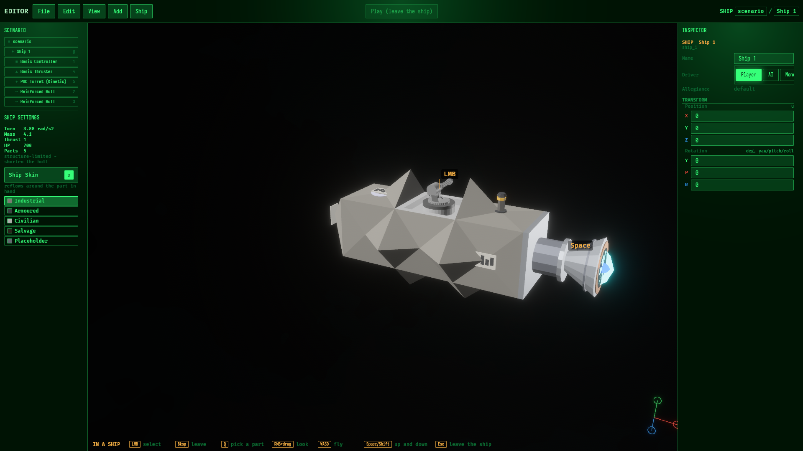

# Promote the thruster shells: check the candidates, ship the picks

- STATUS: CLOSED
- PRIORITY: 60
- TAGS: v0.12.0,art,ship,content

Rewritten 2026-08-24 for v0.12.0. Audit:
`tasks/20260815-231945/CONTENT-AND-ART.md` section 1. The multi-cell
question this task used to defer is now OPEN as `20260824-120531`; this task
stays 1x1-only and lands early - it is mechanical and independent. Owner
decision 2026-08-25: ship `shell_bell` as the 1x1x1 basic thruster. Promote
`shell_vector` to a 3x3x2 upgrade in the multi-cell task and keep
`shell_capital` there at 5x5x3. Drop the other shell candidates.

## Goal

Promote `shell_bell` from `art/part-candidates/shells/` as the real look for
the existing 1x1x1 basic thruster. Check it before promotion. Close the
determinism-gate CI gap while touching the generator.

## The candidates

The owner picked `shell_bell` at 1x1x1. `shell_gimbal`, `shell_twin`, and
`shell_paddle` are rejected. The original 1x1x1 `shell_vector` is replaced by
a 3x3x2 version in `20260824-120531`. `shell_bank` is rejected.
`shell_capital` stays in that multi-cell task at 5x5x3.

## Owner pick evidence

The selected-family capture is stored with the linked multi-cell task at
[`thruster-shell-picks.png`](../20260824-120531/thruster-shell-picks.png).
The bell recipe now declares `[1, 1, 1]` and its measured mesh bounds are
exactly 1.000x1.000x1.000.

## The checks (per candidate, before any promotion)

- Exhaust geometry agrees with the thrust convention: thrust -Z, bell opens
  +Z (clearance.rs:64-66 `exit_normal`); the exit_pocket / exhaust lane
  clearance fits the mesh silhouette (shell_skin.rs:321).
- Triangle budget and material sanity at ship render distance; the gallery
  render is the judging view.
- Recipe determinism stays under `gen-thruster-shells.py --check`
  (lines 145-167 rebuild and byte-compare).

## The promotion path (audited, mechanical)

1. Move `shell_bell.glb` to `assets/base/gltf/` (the greeble pattern -
   assets/base/gltf/greebles/README.md), recipe stays the source, --check
   points at the new path.
2. Register an `AssetRef<WorldAsset>` in
   crates/nova_authoring/src/base_content/assets.rs (pattern at lines 22-26).
3. Set `render_mesh` + `render_mesh_transform` on `basic_thruster_section`
   (base_content/sections/standard.rs:320-360; `render_mesh: None` today at
   :355). The exhaust cone spawns for every thruster either way
   (thruster_section.rs:734-745), so the plume comes free.
4. `cargo run content gen`; commit the regenerated RON (never hand-edit).
5. Verify: gallery row plus a wfc_ships / wfc_arena render - both inherit
   the look through the prototype automatically.

If promotion replaces the primitive look, no id changes; new prototypes get
new builder ids (content lint guards duplicates). The one-socket test
(standard.rs:695) only breaks if link points change - promotion alone does
not touch them.

## The CI gap (fold in here)

`gen-thruster-shells.py --check` and the greeble twin run in NO CI step
(.github/workflows/ci.yaml has no python step; recorded unfixed in
`20260817-013639`). Add the check line so the byte-reproducibility gate
actually gates.

## Promotion evidence

The basic thruster catalog entry now references
`self://gltf/shell_bell.glb#Scene0`; the base bundle ships that resource. Its
round exhaust starts just beyond the bell lip (`Z = 0.51`) with outer radius 0.24 and
inner radius 0.07. The editor build path loaded it through generated content
and rendered it on a real five-section ship with the existing socket and
plume. Verification:

- `cargo run content lint`: 0 errors, 0 warnings, 0 findings.
- focused `nova_authoring` thruster socket and exhaust-fit tests: pass.
- greeble and thruster-shell deterministic checks: pass; shell self-test: pass.
- `screenshot_editor` capture: clean completion; promoted bell visible on ship.
- web `npm run ci`: format, lint, tests, and production build pass.

Owner playtest remains before closure.

## Done when

- `shell_bell` flies on real ships in a render; its checks are recorded here.
- The determinism gates run in CI.
- Large formats live in `20260824-120531`, explicitly not here.
