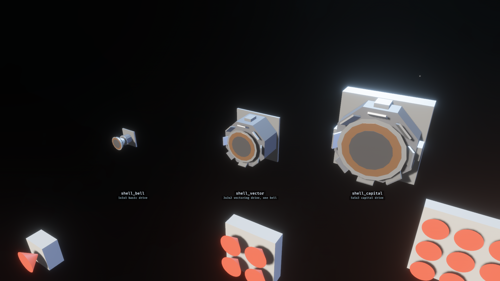
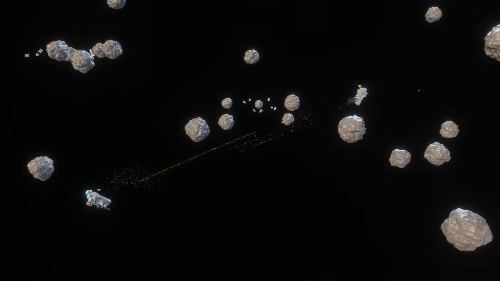

# Multi-cell sections: spike the design, then ship the large thrusters

- STATUS: CLOSED
- PRIORITY: 55
- TAGS: v0.12.0,ship,content,editor,spike

v0.12.0. Opens the multi-cell section question that `20260817-090834`
explicitly defers (THRUSTERS.md follow-up 3). Owner decision 2026-08-24:
multi-cell is a v0.12.0 deliverable, run SPIKE-FIRST inside the release -
the audit found real design forks, not just work. Owner decision 2026-08-25:
ship `shell_vector` at 3x3x2 and `shell_capital` at 5x5x3; reject
`shell_bank`. The vector drive keeps one large vectoring bell rather than a
3x3 bank of small nozzles. Research:
`tasks/20260815-231945/CONTENT-AND-ART.md` section 2.

## Goal

One section spanning WxHxL cells, with two large thruster shells shipped as
placeable drives: `shell_vector` (3x3x2) as the upgrade for larger ships and
`shell_capital` (5x5x3) as the capital drive. Redesign the existing 1x1x1
`shell_vector` candidate for its new footprint. Both remain recipe-generated
art candidates until the spike gate passes. Owner decision 2026-08-28: ship
both as real editor/sandbox thrusters now; do not make the arena WFC PoC a
permanent architecture constraint.

## Owner pick evidence

The gallery capture shows the selected size ladder at its actual 1, 3, and 5
cell widths. The bell declares a 1x1x1 cell box and measures exactly
1.000x1.000x1.000. The 3x3x2 vector recipe has one large bell, 356 triangles,
and measured bounds 2.850x2.940x1.876 inside its declared cell box. The
capital mesh now measures exactly 5.000x5.000x3.000. The selected family is
the gallery's first row; the other studies remain in mocked and proposed rows.
`gen-thruster-shells.py --check` rebuilt all
seven candidate files byte for byte. The rendered gallery probe completed
with clean logs and all six measured correctness checks passing.

## The question as written (tasks/20260816-200255/THRUSTERS.md:304-307)

> Multi-cell sections (L) - one section spanning WxHxL cells: reading
> (`PlacedPart` grows a footprint), wfc tiles, clearance (one lane per
> exhaust column), integrity, collider, editor placement. Designed
> separately; this spike only fixes its requirement.

## Phase 1 - the spike (the gate)

Settle the four forks with throwaway prototypes and record the verdict here:

1. **WFC strategy** - the hardest. `tile()` REJECTS any part whose rotated
   collider leaves the unit cell (examples/playable/shared/wfc.rs:272-279);
   the grid is one-tile-per-cell (:416-466). Options: meta-tile
   decomposition (large state-space change) vs stamp-big-drives-then-collapse
   -around-them (much cheaper, fits "capital stern with a 3x3x1"). Prototype
   the cheap one first.
2. **Per-cell exits.** `SectionExit` is one Vec3 per section entity
   (nova_ship/src/sections/clearance.rs:80-90); a 5x5 exhaust face needs 25
   `ShipExit` columns. Price the consumer set: clearance.rs:160-230, skin
   exit_pocket, editor refusal, wfc erode.
3. **PlacedPart footprint.** One position today (shell_skin.rs:798-810),
   bucketed once by `read_cells` (:830-845). Fix the shape (footprint field
   or cells iterator); all six constructor sites change together (live
   spawner, editor ghost x2, probe snapshot, clearance tests).
4. **Flank sockets** (THRUSTERS.md follow-up 1) - decide it HERE. It is
   independent of multi-cell and pays off on 1x1 immediately, but it changes
   wfc adjacency legality and replaces the one-socket test; big shells may
   need it to look right.

## Phase 1 verdict

- **WFC:** no multi-cell tiles. `wfc_arena` remains a PoC, then applies a
  seeded post-collapse stern stamp: one capital or two to three vectors on an
  eight-cell support beam. A future game generator will learn from it but own
  a better ship grammar; this stamp is explicitly not permanent architecture.
- **Footprint:** derive `SectionFootprint` from exact integral cuboid collider
  dimensions. One authored box is physics, mass, overlap, and occupied cells,
  so two size fields cannot disagree. Non-integral and non-cuboid colliders
  remain one cell.
- **Per-cell exits:** expand one section exit across every boundary cell on its
  exhaust face. Vector gets nine lanes; capital gets 25. Each still renders one
  central cone because each visual has one bell.
- **Flank sockets:** none. Both drives expose one socket per cell on the forward
  mounting face only. The centre socket is the editor's natural first choice.
- **Balance baseline:** mass remains collider volume at density 1. Owner
  follow-up after sandbox and arena playtests: volume-linear thrust and health
  make the capital too fast and durable. Thrust now scales with exhaust-face
  area; health uses a surface-area-like compressed curve. Vector is mass 18,
  health 480, magnitude 9; capital is mass 75, health 1250, magnitude 25.

## Already free (do not redesign)

- Mass: collider volume IS mass at density 1
  (nova_ship/src/sections/base_section.rs:45-49) - a 3x3x1 collider gets
  mass 9 with zero new code.
- Skin reading: `SkinStructure::insert_section` already adds into per-cell
  buckets (shell_skin.rs:180) - call it once per footprint cell.
- Editor mating: link-point snapping, collider-AABB overlap refusal and lane
  clearance all work PER LINK POINT (nova_editor/src/snap.rs) - a multi-cell
  prototype with correct link points and collider mostly snaps today.
- Exhaust render: one bell per exhaust cell vs one sheet is already
  authorable (`ThrusterExhaustShape::Rect`,
  thruster_section.rs:153-162).
- Integrity: one entity dying removes the whole block - accept it (a drive
  block is one machine) unless the spike finds a reason not to.

## Phase 2 - implement (after the spike verdict)

Two to three lanes: reading + clearance; wfc; content + editor polish.
Author footprints on the prototypes, link points on exposed cell faces, and
promote `shell_vector` and `shell_capital`.

The editor/sandbox lane ships first. The arena gets only the explicit PoC stern
stamp above; a permanent WFC design stays deferred to the future game generator.

## Implementation evidence

The generated base catalog now ships `vector_thruster_section` and
`capital_thruster_section`; both appear in the editor palette. The selected
GLBs moved under `assets/base/gltf/` and remain byte-derived from their recipes.

- Multi-cell clearance tests: 6 pass, including 75 occupied cells and 25 exits
  for the capital footprint.
- Editor snap tests pass, including central-socket placement of a 3x3x2 drive
  and the regression where one hull separates two X-mounted capital drives.
- Base-content section tests: 10 pass, including large-drive collider, health,
  thrust, mesh, and mounting-face assertions.
- `content lint`: 0 errors, warnings, or findings.
- `screenshot_editor`, `screenshot_thruster_gallery`, and `wfc_arena`
  correctness probes: clean, six measured checks each.
- Arena stamp test passes for one capital, two vectors, and three vectors. A
  rendered seed-7 arena run completes cleanly with the stamped drives flying.
- Recipe determinism and shell self-test: pass. Web CI: pass. Dev book builds;
  it reports the existing mdbook-mermaid 0.5.0 vs mdbook 0.5.2 version warning.
- Affected Clippy reached an unrelated existing `nova_scenario` lazy doc-list
  continuation under `-D warnings`; no changed-file Clippy finding was emitted
  before that dependency stopped the run.

Owner playtest accepted editor/sandbox placement and all three seeded arena
layouts on 2026-08-28, then requested lower large-drive thrust and health. The
revised magnitude 9/25 and health 480/1250 values were accepted on 2026-08-28.
Sandbox follow-up also found rotated 5x5x3 colliders were tested with unrotated
AABB extents, falsely refusing a one-hull capital sandwich. The shared collider
now supplies rotated ship-space extents to both editor placement and scenario
lint; regressions cover the edit and Play paths. Owner confirmed the exact
one-hull capital sandwich edits and enters Play successfully on 2026-08-28.
The first arena retest then exposed quaternion roundoff widening rotated unit
cubes by about 2e-7, so scenario lint now applies the editor's 1e-3 contact
slack. A flush-grid regression and clean arena probe cover that path. A later
seed-20260829 reroll exposed incidental flush contacts between an outer vector
face and random stern tiles. The PoC checker now exempts only those contacts;
the drives still have to mate to their stamped beam. Exact generated-stern tests
cover seeds 6, 7, 8, and 20260829.

## Done when

- Spike verdict recorded: wfc strategy chosen with evidence, footprint shape
  fixed, per-cell exits priced, flank-socket call made.
- Big drives place in the editor with correct refusals and lanes; gallery,
  sandbox, and arena renders prove the look. The arena uses only the PoC stamp.
- `content lint` and the determinism gates stay green.
