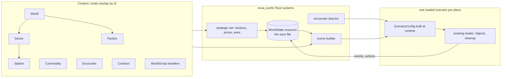

# RESEARCH: how an open-world mode fits the engine, the mods, and a save file

Survey date: 2026-09-06, tree at `2c2e0624` (Add tutorial). Reference record,
not scheduled work. Every claim about the code is read from the tree; every
design line is a proposal. The owner agreed with the direction in sections 2
to 4, the procedural world, and gates with a chart on 2026-09-06. Nothing is
scheduled; the decisions at the end stay open until each is stated.

**Read the [Recommendations](#recommendations) first if you only read one
section.**

## 1. What exists today

### Everything is a scenario

- The only game-mode abstraction is `GameMode` (`crates/nova_gameplay/src/lib.rs:199`):
  `Sandbox` | `NewGame`. A resource, written in three places, read in two.
- New Game loads the scenario named by `new_game_scenario` in
  `assets/base/base.bundle.ron` (`tutorial` since `2c2e0624`). Only the base
  bundle may set it; a mod's value is warned and ignored
  (`crates/nova_assets/src/merge.rs:242-277`).
- The story campaign is a mod (`assets/mods/nova_protocol/`), reachable from
  the Scenarios picker. A `Campaign` is an ordered list of scenario ids the
  picker groups by; the runtime never reads it. Chapter-to-chapter continuity
  is the `NextScenario` action, forward-only, cleared at teardown.
- Ships fly only while `CurrentScenario` is `Some`: `configure_scenario_gating`
  (`crates/nova_scenario/src/loader/lifecycle.rs:23`) gates the input and
  section system sets on `scenario_is_live`. An open world must keep a scenario
  loaded or add a second liveness source to that gate.

### The scenario vocabulary is mostly mode-neutral

Counted from the macro tables (`events.rs:75-150`, `actions/mod.rs:51-378`,
`filters.rs:27`, `actions/spawn.rs:128`):

| Surface | Total | Mission-shaped | Mode-neutral |
| --- | ---: | ---: | ---: |
| Events | 26 | 2 (cinematic endings) | 24 |
| Actions | 46 | 10 (objectives, cues, readouts, hints, `Outcome`, `NextScenario`) | 36 |
| Filters | 6 | 0 | 6 |
| Object kinds | 7 | 0 | 7 |

The narrowest part is the query surface (`queries.rs`): `scenario.elapsed`,
`entity("id").speed`, exact-id entity lookup only. An open world presses here
first.

### Mods are data plus a closed scripting vocabulary, never code

- `Content` (`crates/nova_modding/src/lib.rs:76-114`) is a closed enum of eight
  kinds: `Section`, `Ship`, `Style`, `Grammar`, `Scenario`, `Campaign`,
  `Impact`, `Channel`. All eight overlay by id, last enabled mod wins, in
  place (`merge.rs:479-533`, pinned by tests).
- No scripting or dynamic-loading dependency exists anywhere. The plugin set
  is fixed at compile time in `AppBuilder` (`crates/nova_core/src/lib.rs:328-408`).
  The creator docs say so: a new event, filter, action, object kind or section
  kind is a game-code change (`web/src/create/index.md:66-70`).
- Adding a ninth content kind is a bounded, documented change: one enum
  variant, `kind()`/`id()` arms, one `merge_content_item` arm, one registry
  resource, one lint function, one line in the offline walk
  (`nova_modding/src/lib.rs:71-74`). The merge, overlay, dependency order,
  `self://` and `dep://` resolution, portal publish and install, enable and
  disable, and both lint stages are kind-agnostic and come for free.
- Lint runs twice on one pure core: offline `content lint` over the repo
  trees, and at merge over the enabled set, then `on_load_scenario` refuses a
  scenario with Error-level issues before teardown. A save format gets the
  same three-stage treatment for free if it references content by id.

### Nothing at runtime persists or serializes

- The storage layer is clean and reusable: `Storage` trait
  (`crates/nova_assets/src/storage.rs:36`), RON codec (`persist.rs`), native
  `<config_dir>/nova-protocol/<key>.ron` or `window.localStorage`, atomic
  writes, corrupt reads as `None`. It has no `remove`. The mod cache adds the
  bulk half: `<data_dir>/nova-protocol/...` on native and IndexedDB on the web,
  with a small sync index beside it (`mod_cache.rs:1-45`).
- Persisted keys today: `settings`, `enabled_mods`, the installed-mods index,
  the portal catalog. No profile, progress, unlocks, campaign position, or
  save game. Grepping `SaveGame`, `PlayerProfile`, `savegame` finds nothing.
- Not one `Component` in `nova_ship`, `nova_gameplay` or `nova_scenario`
  derives `Serialize`. Every serde type there is authored config.
  `NovaEventWorld` (`world.rs:163`) holds the live mission state and derives
  `Resource, Default` only; it carries a queue of boxed closures that cannot
  serialize. `DynamicScene` and `SceneSerializer` are unused in the workspace.
- Two things were designed for reload already: an asteroid's silhouette seed
  is derived from its id "which is what a re-run capture and a reloaded save
  both want" (`objects/asteroid.rs:135-141`), and a WFC hull is a `ShipHull`
  of catalog prototypes, ordinary content. Seed in, same shape out.
- `SectionModification` (`objects/modification.rs:34`: `SetHealth`, `SetAmmo`,
  `Rename`, `DisableVerb`) is a ready-made delta-over-authored-hull format.
- The global RNG seed is `NOVA_SEED` from the environment only, never stored,
  always OS-seeded on the web (`nova_gameplay/src/settings.rs:106`).

### The economy and survival nouns do not exist

`fuel`, `oxygen`, `inventory`, `cargo`, `credits`, `reputation`, `standing`:
zero runtime hits. `faction` exists only as `Allegiance`
(`Player` | `Enemy` | `Neutral`, `relations.rs:26`), whose module header
says a fuller faction system is deliberately out of scope. A `SalvageCrate` is
a sensor volume; "collected" is a scenario variable, not an item
(`objects/salvage.rs:5`). `lore/TECHNICAL_SPEC.md` section 6 lists the same
gaps for the story writer.

## 2. Proposal: the open world is a layer above scenarios

Three parts, one new crate (`nova_world`), added to `AppBuilder` after
`NovaScenarioPlugin` and before the menu.

### 2.1 World state lives above the scenario

`WorldState` is a resource `nova_world` owns. It is never scenario-scoped, so a
scene load or unload does not touch it. It holds the player (credits, standing
per faction, cargo, the ship as `ShipSource` plus `SectionModification` deltas,
current sector, docked station, active contracts), the factions (relations, war
state, controlled sectors), sector deltas (what changed from the authored
default), world variables, the world clock, and the world seed. This resource
IS the save file (section 4).

### 2.2 Every place is a scenario built at runtime

When the player travels, `nova_world` builds a `ScenarioConfig` for the target
sector from the `Sector` item, the sector's deltas, the encounter director's
picks, the world scripts in scope, and a seed derived from the world seed and
the sector id. Then it triggers `LoadScenario` like the picker does.

This keeps `CurrentScenario` populated, so the liveness gate, the cleanup
contract, the glTF warm-up, the settle logic, and the two lint stages all
apply unchanged. `nova_authoring` already proves that a Rust builder can write
a whole scenario; this is the same builder, online. It is the Mount and Blade
shape: a map that is not simulated space, and one scene per fight or visit.
`lore/TECHNICAL_SPEC.md` already states that scene transitions can represent
travel.

Rejected alternative: one persistent scene for the whole world. It fights the
loader, the teardown contract, and `LOAD_LIMIT`, and it would make a save a
world dump (section 4 says why that is the wrong save).

### 2.3 The mission-shaped actions get world-shaped siblings

`Outcome` and `NextScenario` end a mission. The open world needs `Travel`
(`sector_id`, optional arrival mark) and `ReturnToWorld` (used by a mission
scenario launched from the world). Both are ordinary actions in the registry
table. Nothing is removed.

### 2.4 Procedural world and scale (owner question, 2026-09-06)

The owner wants a big, procedurally generated world with fast travel into a
sector, not a fixed authored map. That fits the layer model with one change:
the `Sector` is generated, not authored. Nobody writes sector RON. The scene
builder emits the `ScenarioConfig` in memory, the way the editor registers its
sandbox scenario and the WFC generator draws a hull from a grammar.

Two layers, three seeds:

- **Map layer, not simulated.** The world seed generates the sector graph:
  positions on the map, lanes between neighbours, a biome per sector, which
  faction holds which, where the stations are. Fast travel is a lane jump
  from a gate (or from a dock), which is a scene transition with the LOADING
  panel already in the tree. The strategic sim ticks on this layer.
- **Scene layer, one sector at a time.** `sector_seed = hash(world_seed,
  sector_id)` generates the sector's contents through the biome's tables:
  `Planet` objects with a seeded type (`planet_type.rs` has the palette),
  rock fields as `ScatterObjects` with a seed (already deterministic and
  capped at 4096 per action), stations as WFC hulls drawn from a station
  grammar, lights, sky.
- **Encounter seed** = `hash(sector_seed, visit_count, world_day)`, so what
  is flying there changes between visits while the place does not.

**Materialise on first visit.** Unvisited sectors exist only as the seed.
When the player first enters a sector, the generated description (object
kinds, positions, types, seeds, station ids) is written into `WorldState`,
a few kilobytes per sector, not entities. From then on the sim and the
player mutate that description, and the save carries it. This is the
Minecraft and Starsector rule, and it is what keeps a save alive across a
game update: a generator or content change only changes space nobody has
seen. Wrecks and carve state stay per visit, as the technical spec already
states for scenarios.

Determinism rules: hash with a fixed function (the FNV pattern in
`asteroid.rs:141`), never `std` `HashMap` hashing; keep generator inputs to
seed plus content ids; version the generator and record it in the save.

**Scale inside a sector.** Flight is physical, so a sector must cross in
minutes. Rest-to-rest time is `2 * sqrt(D / a)`; at the 5 g RCS figure:

| Sector crossing | Time | Peak speed | f32 precision at the edge |
| ---: | ---: | ---: | ---: |
| 100 km | 90 s | 2.2 km/s | 1 cm |
| 300 km | 156 s | 3.8 km/s | 4 cm |
| 1,000 km | 286 s | 7.0 km/s | 8 cm |

Recommendation: sectors of 100 to 300 km across, points of interest
clustered so most trips are shorter, and the 200 km acquisition gate the
targeting code already uses as the design radius. Distances bigger than that
belong on the map layer. A floating origin is the escape hatch if sectors
must grow later; it is not needed to start.

**Gaps the generator exposes.** No station object exists (a WFC hull from a
station grammar plus a docking `CreateScenarioArea` covers it). The sky is one
authored cubemap per scenario; a generated world needs a palette of cubemaps
chosen by seed or a parameterised skybox. Both are engine work, both are
small next to the world itself.

**Authored places still fit.** A `World` may pin authored sectors at fixed
map positions (a home station, a story hub), and a mission scenario may ask
the director for a sector "of biome X near faction Y" and get a generated
one. Procedural and authored content share one container.

### 2.5 Gates, the sector graph, and the chart (owner direction, 2026-09-06)

The owner wants physical gates, a graph of sectors, and a map that shows
them. Three pieces.

**The graph is made once, whole.** At New Game the world seed places N
sectors on a 2D chart (N in the low hundreds at most, so the strategic sim
stays cheap), joins them with a proximity graph (nearest neighbours, then a
spanning tree to guarantee one connected component), assigns a biome per
node, seeds faction capitals and grows territories over graph distance, and
puts stations where the biome and the owner say. The whole graph goes into
`WorldState` at creation, because the chart must be able to show every
sector. Only the CONTENTS of a sector stay lazy (section 2.4). A lane has an
owner at each end, so its danger and traffic follow from the graph, not from
a table.

**A gate is a beacon with a handler.** `BeaconConfig` already carries an
optional trigger area that fires `OnEnter`/`OnExit` with the beacon's id
(`objects/beacon.rs:50`). The generator places one gate per lane at the
sector's edge, in the chart direction of the neighbour, so the local map and
the chart agree on where a lane leaves. The handler is one world script:
`OnEnter(gate) -> Travel(neighbour)`, optionally gated on a confirm key or a
dwell timer. A gate can also be an objective marker, a GOTO target, and a
chokepoint the encounter director spawns at. One new action (`Travel`), no
new object kind, though a gate-shaped mesh would earn its own kind later.

**The chart is a second NOVA OS app.** The `map` app is a schematic 3D
minimap of local space with pickable contacts and a `G` key that sets a
flight GOTO (`nova_os_ui/src/map/mod.rs:1-19`). A `chart` app beside it
draws the graph: nodes coloured by owner, lanes, the current sector, known
versus unknown (a sector becomes known when visited or when a chart is bought
at a station; unknown nodes draw as unlabelled marks or not at all), station
and biome glyphs, and a readout for the selected node. Plot route is a
shortest path over the graph, drawn as highlighted lanes; confirming it sets
a GOTO on the gate for the next hop, the same handoff the `map` app already
makes. The chart reads `WorldState` only, so a mod's pinned sectors and
factions appear without UI code. The same model backs a `chart` CLI
built-in, as `map view` backs the map app.

Knowledge state (`known_sectors`, bought charts, route) lives in
`WorldState` and rides in the save.

## 3. Extensibility: how a mod contributes to the open world

Same rule as today, stated once: **the engine owns kinds, mods own instances.**
Three doors.

### Door A: instances of new content kinds

New `Content` variants, each a closed schema in Rust, authored in RON, overlaid
by id, linted offline and at merge:

| Kind | What it declares | Read by |
| --- | --- | --- |
| `World` | generation parameters (sector count, map size, biome weights, faction list, starting ship and credits) and any pinned authored sectors. Base ships one. A total conversion overlays `base`'s by id; a second world appears under New Game as a choice. Mirrors `Campaign`. | world generator, New Game |
| `Biome` | what a sector of this kind is made of: planet type weights and counts, rock field density and kinds, station chance, sky choice, danger. The `Grammar` pattern: the mod ships the taste, the engine draws. | sector generator |
| `StationTemplate` | a station grammar or hull id, faction filter, services list (`Market`, `Shipyard`, `ContractBoard`, `Comms`), what it sells (section ids, ship ids, commodity ids) | sector generator, dock screen |
| `Faction` | name, style id, ships and grammars for patrols, default relations, default standing to the player | strategic sim, spawner, `Allegiance` |
| `Commodity` | name, base price, volume per unit | market, cargo |
| `Encounter` | a weighted, conditioned spawn recipe: where it may fire, filters on world state, the handlers it injects | encounter director |
| `Contract` | a mission template: kind, parameters drawn from world state, reward, optional scenario id (door C) | contract board |

Base content for these goes through the same builders and `content -- gen`
path as every other base file. A mod adds a faction the way it adds a hull
section today, and a `dep://` reference to another mod's sector works
unchanged.

### Door B: world scripts, the same handlers at world scope

A `WorldScript` content kind (or a `scripts` field on `World`, `Sector` and
`Faction`) is a list of `ScenarioEventConfig` handlers. The scene builder
appends the ones in scope to every scene it emits. Same events, filters,
actions, editor EVENTS mode, lint, and `once` latch. This is the "mix of
scenario events and Rust code" the task describes, with a clean split: Rust
runs the simulation and fires events; RON reacts.

The vocabulary grows in three places, all through the existing registries:

- Events: `OnSectorEnter`, `OnSectorLeave`, `OnDocked`, `OnUndocked`,
  `OnStandingChanged`, `OnContractAccepted`, `OnContractResolved`, `OnTrade`,
  `OnWorldDay`.
- Queries and filters: `world.credits`, `world.standing("id")`,
  `world.sector`, `world.docked`, `world.cargo("id")`, plus a world-scope
  variable namespace (`world.*`) that persists in the save.
- Actions: `AdjustStanding`, `SetFactionRelation`, `GrantCredits`,
  `GiveCargo`, `TakeCargo`, `OfferContract`, `ResolveContract`,
  `SpawnEncounter`, `WorldVariableSet`, `Travel`, `ReturnToWorld`.

A mod that wants "when the player docks at my station with 10 units of ore,
pay them and raise standing" writes one handler and ships no code.

### Door C: authored scenarios as missions

A `Contract` or `Encounter` may name a scenario id. The world launches it as a
scene with the persistent player ship injected, and the scenario reports back
through door B's actions before `ReturnToWorld`. Existing mod scenarios need
two edits to become world-capable:

- The player object's hull becomes `ShipSource::Persistent` (the world's ship,
  with its damage and ammo deltas applied). Lint refuses a world launch of a
  scenario that spawns its own player.
- The ending is `ReturnToWorld`, not `NextScenario` or a menu exit.

A scenario can stay picker-only; nothing forces the edit. This is the
Freelancer and Mount and Blade quest model, and it is how the story mod could
one day be played from inside the world.

### What a mod still cannot do, and the mitigation

A mod cannot add a UI screen, a simulation rule, or a content kind. That is
the contract today for actions and section kinds, and it should stay the
contract: a closed vocabulary is what makes lint, the editor, and the portal
gate possible. Mitigation: make every open-world screen data-driven. A dock
screen renders the station's declared services with generic widgets; a
contract board renders `Contract` text and rewards; comms use the existing
cue and portrait path. That covers the usual "custom menu" ask.

Embedded scripting (Lua, Rhai, wasm) is the alternative. Recommend against it
for now: it doubles the API surface to keep stable, it bypasses lint, and it
breaks the "author it explicitly, fail at lint" rule. Revisit only if a
concrete mod cannot be expressed through doors A to C.

### Ship resources: fuel, oxygen, cargo

One rule keeps them available to scenarios and to the world alike: a ship
resource is a component in `nova_ship`, fed by content fields on sections (a
tank section holds fuel; a cargo hull holds volume; `cargo_hull_section` and
`tank_hull_section` already exist as art), consumed by a system, and exposed
through the vocabulary (event `OnFuelLow`, query `entity("x").fuel`, actions
`SetFuel`, `RefillFuel`). The world adds persistence of the level in the ship
deltas, nothing else. No resource is open-world-only.

## 4. Save and load

### What a save is

The `WorldState` resource, serialized as RON through `persist.rs`. Never the
ECS world. Contents:

- `schema` (integer) and the game version string.
- The enabled mod set with each mod's `meta.version`.
- The world seed and the world clock.
- The player: sector, docked station, credits, standing map, cargo map, active
  and completed contracts, the ship as `ShipSource` plus per-section
  `SectionModification` deltas (health, ammo, renamed or disabled sections).
- Factions: relations, war state, controlled sectors.
- Sector deltas: destroyed or captured stations, cleared fields, anything that
  differs from the authored `Sector`.
- World variables (`world.*`), namespaced by mod id.
- The `RunCheats` mark, so a cheated run stays marked (`cheats.rs:50` is the
  precedent).

The player's hull is stored as a catalog id when unmodified and as an inline
`ShipHull` after a shipyard edit; the editor already round-trips that format
through a mod bundle (`nova_editor/src/bundle.rs`).

### When a save happens

Save points, not anywhere-saves:

- Autosave on sector arrival and on dock and undock.
- Manual save from the pause menu while docked or out of combat (no hostile
  combat lock and no damage in the last few seconds). Refused, with a line,
  mid-fight.

Reason: a live scene is avian bodies, carved rock fields, projectiles in
flight, and third-party components with no serializer. The loader is the only
restore path in the tree. Because a scene is a deterministic function of the
`Sector`, its deltas, and its seed, load rebuilds the place the player saved
in. Mount and Blade saves on the map for the same reason.

### Where it lives

Data root, not config root (the mod cache's own rule, `mod_cache.rs:17`):

- Native: `<data_dir>/nova-protocol/saves/<slot>.ron`, plus `saves.index.ron`
  (slot name, timestamp, sector, playtime, mod set) for the load menu.
- Web: the index in `localStorage`, the bodies in IndexedDB. This is exactly
  the split the mod cache already implements, and an inline capital hull in
  RON is too large for the 5 MB localStorage budget.
- `Storage` gets `remove` for slot deletion.
- A `SaveAccess` guard like `SettingsStoreAccess` (`Inert` | `Read` |
  `ReadWrite`), so a probe or channel run can never overwrite a player's slot.

### Load

Read the slot, refuse on error, insert `WorldState`, set `GameMode::World`,
build the scene for the saved sector, trigger `LoadScenario`, spawn the player
from the saved hull and deltas. Continue = the newest autosave.

### Mods and the save

- The save names the mods it was written with. A missing mod at load is an
  error with a clear message, never a silent drop. A version mismatch warns.
- A content id the save references that no longer resolves is a load error,
  the same stance as an unknown id in a scenario.
- A mod's world variables and standing rows are keyed by mod id, so disabling
  a mod later leaves the rest of the save readable.

### Format evolution

Follow `PersistedSettings`: every field has a serde default, values clamp on
load, tests pin that an older file still reads. A format break bumps `schema`
and refuses older saves with a message. Recommended promise until 1.0: a save
reads within one release line only. The changelog marks a break with
`**(breaking)**` as it does for content.

### Randomness

Store the world seed. Derive scene seeds from it and the sector id with the
FNV pattern asteroids use. Do not try to restore the global `WyRand` stream;
byte-exact replay is the probe harness's job, not the save's.

## 5. Menu

Cheap, and out of scope for this note by the owner's word:

- New Game: `GameMode::World`, the base `World`.
- Tutorial: the `tutorial` scenario, replacing today's `new_game_scenario`
  routing.
- Scenarios: the picker with campaigns, unchanged.
- Load Game and Continue: the slot index.

## Recommendations

1. Build the open world as a layer above scenarios: `WorldState` plus Rust
   systems in a `nova_world` crate, one runtime-built scenario per place.
   Do not build one persistent scene.
2. Keep the modding contract: kinds in the engine, instances in RON. Add
   `World`, `Sector`, `Station`, `Faction`, `Commodity`, `Encounter`,
   `Contract`, `WorldScript`. No embedded scripting.
3. Let mods react through the existing handler vocabulary at world scope,
   grown with world events, queries and actions. Let authored scenarios run
   as missions through `ShipSource::Persistent` and `ReturnToWorld`.
4. Save `WorldState` as RON at save points, in the data root, with the mod
   set recorded and a missing mod refused at load. Rebuild the scene from
   seed and deltas on load. Never serialize the ECS.
5. Add ship resources (fuel, cargo) as `nova_ship` components with content
   fields, systems, and vocabulary, so scenarios and the world share them.
6. Order the work so each step ships value alone:
   1. `nova_world` with `WorldState`, save and load, slots, Load Game, and a
      player hull that survives `NextScenario`. The story mod and the
      portal campaigns benefit at once.
   2. `Sector`, the scene builder, `Travel`, the map app in NOVA OS.
   3. `Faction`, standing, `Allegiance` derived from standing, patrols.
   4. `Station`, docking, the dock screen, `Commodity`, cargo, credits, the
      shipyard as the editor with a budget.
   5. `Contract`, `Encounter`, the director, `ReturnToWorld`.
   6. The strategic layer: faction conflict simulated between visits.

## Open decisions for the owner

- Agreed 2026-09-06: scene per sector, generated and materialised on first
  visit; physical gates on a sector graph; a chart app in NOVA OS.
- Closed vocabulary (recommended) or embedded scripting.
- Save points (recommended) or anywhere-saves.
- The save compatibility promise before 1.0.
- Base open-world content in the base bundle as a `World` item (recommended)
  or as a separate always-on shipped mod.
