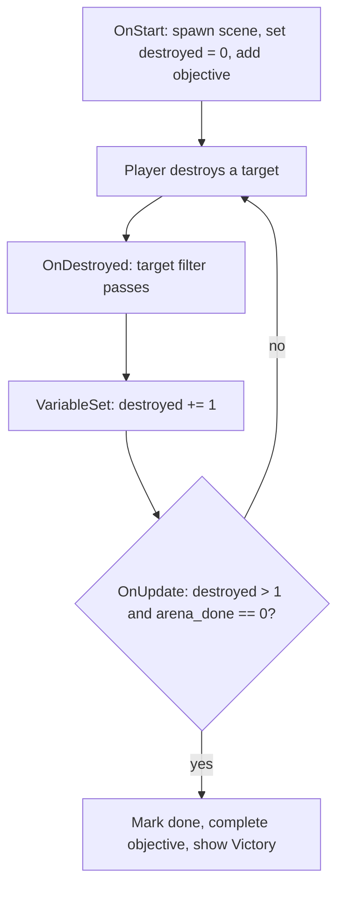

# Create your first scenario

This tutorial builds a small shooting-range scenario in RON. You will start
with the working Example Mod, follow one objective from start to victory, make
it your own, and run it in the game. No code changes are required.

This page teaches one happy path. Use the
[modding reference](../reference/) when you need the complete list of events,
filters, actions, objects, and expression nodes.

## 1. Start with the working example

The repository includes a playable starter at `assets/mods/example/`. It
already contains the long but routine scene setup: lights, a player ship, and
two asteroid targets. This tutorial focuses on the mission script around that
setup.

From the repository root, first confirm that the starter is valid:

```sh
nix develop --command cargo run content lint --target example
```

The two files you will use are:

```text
assets/mods/example/
|- example.bundle.ron    # lists the mod's content and resources
`- example.content.ron   # sections and scenarios
```

Open `example.content.ron` and find `id: "example_arena"`. That `Scenario`
item is the shooting range used below.

## 2. Understand the scenario file

A content file is a list. Each scenario is one `Scenario((...))` item:

```ron
[
    Scenario((
        id: "example_arena",
        name: "Example Arena",
        description: "Destroy two drifting rocks under a mod-shipped skybox.",
        cubemap: "self://textures/nebula.png",
        events: [
            // The mission handlers go here.
        ],
    )),
]
```

For this tutorial, each field has one job:

- `id` is the stable name used by the game and other scenarios.
- `name` and `description` appear in the Scenarios menu.
- `cubemap` sets the background image.
- `events` contains the mission logic.

The complete field table, including thumbnails, hidden scenarios, and menu
backdrops, is in [Scenario files](../scenarios/).

## 3. Plan one short story

Keep a first scenario small. Write three beats before you write RON:

1. Setup: Range Control welcomes the player.
2. Goal: Destroy two derelict rocks.
3. Payoff: Complete the objective and show victory.

One line of story text per beat is enough. Objectives tell the player what to
do. Story messages provide voice and context. Add more dialogue only after the
playable flow works.

The finished scenario follows this path:



## 4. Events, filters, and actions

A handler has three parts:

- The event says when to check, such as `OnStart` or `OnDestroyed`.
- Every filter must pass.
- The actions then run in order.

This handler reacts only when the first target is destroyed:

```ron
(
    name: OnDestroyed,
    filters: [
        Entity((
            id: Some("example_target_1"),
        )),
    ],
    actions: [
        VariableSet((
            key: "destroyed",
            expression: Add(
                Factor(Name("destroyed")),
                Term(Factor(Literal(Number(1.0)))),
            ),
        )),
    ],
),
```

Read it as: "When an object is destroyed, continue only if it is
`example_target_1`, then add one to `destroyed`."

The example has a matching handler for `example_target_2`. Separate filters
make sure unrelated asteroids do not count.

See [Events](../events/), [Filters](../filters/), and [Actions](../actions/)
for every available construct.

## 5. Start the objective

`OnStart` runs once when the scenario loads. The example uses it to spawn the
scene and initialize the mission. Near the end of its action list, it sets the
counter and adds a HUD objective:

```ron
VariableSet((
    key: "destroyed",
    expression: Term(Factor(Literal(Number(0.0)))),
)),
VariableSet((
    key: "arena_done",
    expression: Term(Factor(Literal(Number(0.0)))),
)),
Objective((
    id: "clear_range",
    message: "Destroy the two derelict rocks. Aim with the mouse, [Left Mouse] fires.",
)),
```

This introduces two useful actions:

- `VariableSet` stores mission state.
- `Objective` adds a goal to the HUD.

Variables must be initialized before a filter reads them. The full expression
grammar is in [Variables and expressions](../expressions/).

## 6. Finish the objective

The victory handler checks the counter every frame. It runs only after both
rocks are gone and only once:

```ron
(
    name: OnUpdate,
    filters: [
        Expression((GreaterThan(
            Term(Factor(Name("destroyed"))),
            Term(Factor(Literal(Number(1.0)))),
        ))),
        Expression((Equal(
            Term(Factor(Name("arena_done"))),
            Term(Factor(Literal(Number(0.0)))),
        ))),
    ],
    actions: [
        VariableSet((
            key: "arena_done",
            expression: Term(Factor(Literal(Number(1.0)))),
        )),
        ObjectiveComplete((
            id: "clear_range",
        )),
        Outcome((
            outcome: Victory,
            message: Some("Range cleared. Nice shooting."),
        )),
    ],
),
```

`destroyed > 1` means two or more targets are gone. `arena_done == 0` is the
one-shot guard. The first action changes it to `1`, so this repeating
`OnUpdate` event cannot show victory again.

The remaining actions complete the HUD objective and show the victory screen.
This is enough for a complete first scenario.

## 7. Make it yours

Edit the existing `example_arena` before adding new mechanics:

1. Change the scenario `name` and `description`.
2. Change the `StoryMessage` speaker and text in `OnStart`.
3. Change the `Objective` message.
4. Change the two asteroid names, positions, or radii.
5. Change the `Outcome` message.

For example:

```ron
StoryMessage((
    speaker: "Harbor Master",
    text: "Two wrecks block the lane. Clear them before the convoy arrives.",
)),
```

Keep the setup, goal, and payoff connected. If you add a third required
target, add its `OnDestroyed` handler and change the win check from
`destroyed > 1` to `destroyed > 2`.

Do not try to learn every action here. Useful next steps include markers,
beacons, dialogue, enemy ships, and scenario transitions. Browse them in the
[Actions reference](../actions/) after this version runs.

## 8. Load and play it

The Example Mod is already listed in `assets/mods.catalog.ron`. Use this exact
iteration loop from the repository root.

1. Check the mod:

```sh
nix develop --command cargo run content lint --target example
```

2. Start the game:

```sh
nix develop --command cargo run --features dev
```

3. In the main menu, open **Mods**.
4. Select **Example Mod** and enable it.
5. Return to the main menu and open **Scenarios**.
6. Select your renamed scenario and press **Play**.
7. Destroy both targets. Confirm that the objective completes and the Victory
   screen appears.
8. Stop the game, edit the RON, and repeat the two commands.

<div class="figure">
    <div class="figure__placeholder">
        <span class="figure__placeholder-tag">Image needed</span>
        <span class="figure__placeholder-name">assets/wiki-first-scenario-picker.png</span>
        <span class="figure__placeholder-note">The Scenarios menu with the enabled Example Mod scenario selected and its Play button visible.</span>
    </div>
    <figcaption class="figure__caption">Enable the mod first, then launch its visible scenario from the Scenarios menu.</figcaption>
</div>

When the scenario works, give it its own folder and id with
[Mod files](../mod-files/), then follow [Publish a mod](../publish-a-mod/) to
make it installable by other players. Keep `hidden` unset so players can find
it in the Scenarios menu.

## 9. Common mistakes

- RON is strict. A misspelled field stops the file from loading.
- Keep double parentheses around action and object variants, such as
  `Objective((...))`.
- Write optional values as `Some(value)`, not as a bare value.
- Initialize a variable before a filter reads it.
- Spawn an object before an action targets its id.
- Give every visible scene lights. Copy the light setup from the Example Mod.
- Use unique ids for scenarios, objectives, objects, and variables.

For syntax and field details, use the [modding reference](../reference/).
