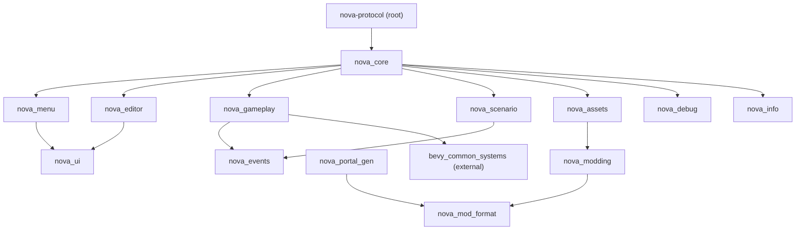
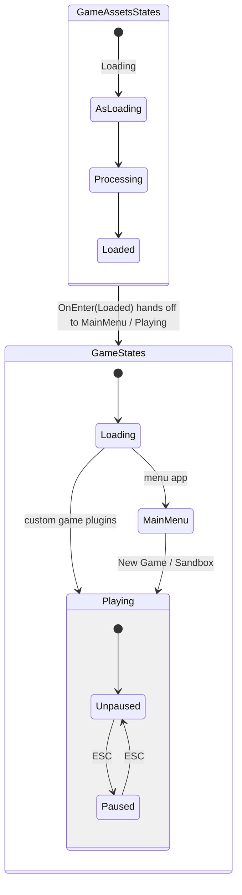
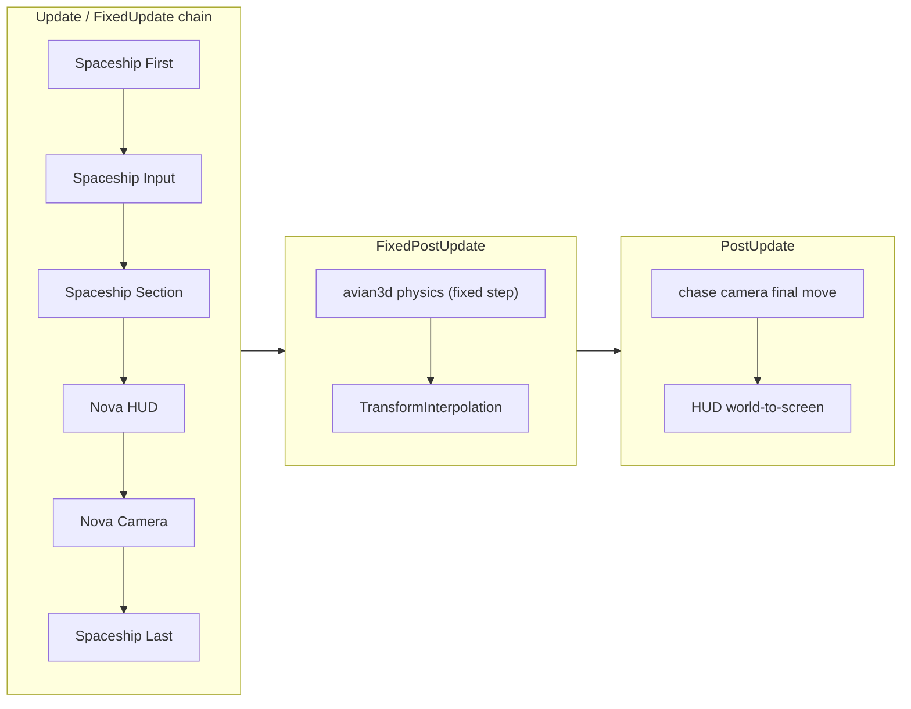

# Architecture

> New to the codebase? Start with the [Project tour](../project-tour/) for a
> faster orientation, then come back here for the detail.

Nova Protocol is a 3D space shooter built on **Bevy 0.19** with **avian3d** physics.
It is a Cargo workspace: the root `nova-protocol` crate is a thin shell and all the
real code lives under `crates/`.

## Crate map

| Crate           | Responsibility |
|-----------------|----------------|
| `nova-protocol` (root) | `src/main.rs` = clap CLI + entrypoint. `src/lib.rs` re-exports `nova_core`. Runnable examples in `examples/`. |
| `nova_core`     | Thin wiring only: `AppBuilder` assembles every plugin (window/log/asset setup, status UI). No gameplay logic. |
| `nova_menu`     | Main menu (owns the `MainMenu` state UI: New Game / Sandbox / Settings / Exit) and the ESC pause overlay. Buttons write `GameMode` and hand off to `Playing`. The Settings modal (audio volume, graphics preset, read-only keybind reference) is shared by both entry points and persisted cross-platform in `settings_store` (RON file / localStorage). |
| `nova_editor`   | The ship editor scene (`NovaEditorPlugin`). Comes up on entering `Playing`, only in `GameMode::Sandbox`. |
| `nova_gameplay` | Gameplay umbrella: `sections/`, `integrity/`, `damage`, `flight`, `gravity` (gravity wells), `input/` (player, ai, radar targeting with deliberate lock-on, `reference` keybind table), `hud/` (many widgets: crosshairs, target inset, ammo, flight status, markers, ...), `camera_controller`, `audio`, `juice`, `settings` (`MasterVolume`/`GraphicsQuality` + apply systems), `relations`, `beacon`, `objective_marker`, `plugin`. Also owns `GameStates`, `PauseStates`, and the `GameMode` resource. |
| `nova_scenario` | Scenario/modding engine: `events`, `filters`, `actions`, `variables`, `world`, `loader`, `objects/`. See [Scenario engine](../scenario-system/). |
| `nova_events`   | Game event kinds and entity identity components, shared between gameplay and scenario. |
| `nova_assets`   | `bevy_asset_loader` setup. Loads glb/textures/shaders/sounds, then registers the built-in sections and scenarios. Owns the mod merge (`register_bundles`, `EnabledMods`, `ModCatalog`) and prefs persistence. |
| `nova_modding`  | Bundle/content/catalog ASSET LOADERS and the `Content` routing enum. See [Modding data format (RON)](../modding-ron/). |
| `nova_mod_format` | Pure serde types for the mod formats (bundle manifests, catalog declarations, the portal wire schema). Engine-free; re-exported by `nova_modding`. |
| `nova_portal_gen` | Binary: generates the static mod portal (catalog.json + hashed file copies) from `webmods/`. Engine-free. See [Mod portal](../mod-portal/). |
| `nova_ui`       | Shared UI: the theme palette/metrics (`theme::*`) and the themed widgets (`widget`: button, selection machinery, panel header) the menu and editor draw from. |
| `nova_debug`    | Debug-only plugin (inspector, overlays). Compiled only under the `debug` feature. |
| `nova_info`     | Exposes `APP_VERSION`, injected by `build.rs`. |

The dependency layering the table describes, from top-level shell down to leaf crates:



Every crate exposes a `pub mod prelude`. Import from the prelude
(`use nova_gameplay::prelude::*`), not from inner modules. `nova_core::prelude`
re-exports all sub-crate preludes, so top-level code and examples usually just do
`use nova_protocol::prelude::*`.

### External shared crate: `bevy-common-systems`

Generic, non-Nova Bevy helpers (WASD/chase cameras, skybox, post-processing, mesh
explode, PD controller, health, status bar, the generic game-event queue
`GameEventsPlugin`/`EventWorld`) live in a separate repo, `bevy-common-systems`,
pinned as a git dependency (rev in `crates/nova_gameplay/Cargo.toml`) and re-exported
through `nova_gameplay::prelude`. If a helper feels "generic", it lives there.

The generic `HealthDisplay` bar stays here (still available for other games and
for non-player entities), but Nova's player-ship health readout is no longer that
bar: it is diegetic, grading each ship section's own mesh material by integrity
(`nova_gameplay::sections::damage_tint`, task 20260717-003613). Because that
readout keys on Nova's section graph and materials it is game-specific and is NOT
a promotion candidate - the generic bar and the diegetic readout are different
things at different layers.

Boundary policy, from most game-agnostic to most game-specific:

1. `bevy_common_systems` (external) - fully reusable Bevy primitives.
2. `nova_gameplay` - Nova gameplay, plus generic-leaning helpers not yet ready for
   promotion (promotion is a deliberate cross-repo change, not automatic).
3. `nova_core` - wiring only.

## App assembly

`AppBuilder` (in `crates/nova_core/src/lib.rs`) is the single place the app is wired:

```rust
AppBuilder::new()                 // Bevy DefaultPlugins + window/log/asset setup
    .with_game_plugins(my_plugin) // optional: your own systems/observers
    .with_rendering(true)         // debug-only toggle for headless runs
    .build()                      // adds the plugin stack, returns App
```

`build()` inits `GameStates` + `PauseStates`, then adds, in order:
`EnhancedInputPlugin`, `GameAssetsPlugin`, `NovaGameplayPlugin`,
`NovaScenarioPlugin`, then `NovaEditorPlugin` and `NovaMenuPlugin` (both only when
no custom game plugins were supplied; `with_main_menu(bool)` overrides the menu
default), and finally `DebugPlugin` under the `debug` feature. On
`OnEnter(GameAssetsStates::Loaded)` it hands off to `MainMenu` (or straight to
`Playing` when the menu is off) and spawns the status UI.

`NovaGameplayPlugin` pulls in avian3d `PhysicsPlugins` (zero gravity, projectile
collision hooks), `bevy_rand`, `bevy_hanabi` particles (on wasm via the WebGPU
backend), the
`bevy_common_systems` helper plugins, and the Nova sub-plugins: input, sections,
hud, camera controller, integrity, damage, flight, gravity, relations, audio, juice.

## States

- `GameStates { Loading, MainMenu, Playing }` (`nova_gameplay`) - top-level
  lifecycle. `MainMenu` only occurs when `NovaMenuPlugin` fronts the app (the
  default editor app); examples with custom game plugins go straight
  `Loading -> Playing`. The `GameMode` resource (`Sandbox` default | `NewGame`)
  records what the menu handed off to.
- `PauseStates { Unpaused, Paused }` - the ESC pause overlay. `nova_gameplay` owns
  the enum and gates the spaceship sets; `nova_menu` owns the toggle, the overlay
  UI, and the clock freeze (`Time<Virtual>` + `Time<Physics>`). Only meaningful
  inside `Playing`; leaving `Playing` resets it.
- `GameAssetsStates { Loading, Processing, Loaded }` (`nova_assets`) - asset
  pipeline. Scenario setup hooks `OnEnter(GameAssetsStates::Loaded)` - see
  `examples/08_scenario.rs`.

The top-level lifecycle, the pause overlay nested inside `Playing`, and the asset
pipeline that gates entry:



Leaving `Playing` resets `PauseStates` back to `Unpaused`.

## Frame flow

Gameplay systems run in an explicit chain, configured identically in `Update` and
`FixedUpdate` (`nova_gameplay::plugin`):

```
SpaceshipSystems::First -> SpaceshipInputSystems -> SpaceshipSectionSystems
    -> NovaHudSystems -> NovaCameraSystems -> SpaceshipSystems::Last
```

- Physics (avian3d) runs in `FixedPostUpdate` on a fixed timestep. Rigid bodies get
  `TransformInterpolation` so rendering stays smooth between physics ticks.
- `PostUpdate` hosts the chase camera's final move and the HUD's world-to-screen
  projection, ordered after it.
- While `Paused`, the input and section sets are gated off and the clocks freeze.

The render-rate chain (run in both `Update` and `FixedUpdate`) versus the
fixed-timestep physics step and the interpolation that smooths rendering between
ticks:



### Update vs FixedUpdate - which schedule does my system go in?

The chain above is configured IDENTICALLY in `Update` and `FixedUpdate`
(`nova_gameplay::plugin`, two `configure_sets` calls with the same set order),
so a gameplay set can host systems in either schedule. The split is not
cosmetic: since every dynamic body opted into avian's `TransformInterpolation`,
the game carries two pose representations on two clocks (see the two-clocks
record, `tasks/20260711-103527/SPIKE.md`):

- **Raw physics pose** -- avian `Position`/`Rotation`, advanced on the 64 Hz
  `FixedUpdate` tick. This is the truth the simulation integrates.
- **Render pose** -- `Transform`, eased between the previous and current physics
  states, with `GlobalTransform` propagated from it in `PostUpdate`.

Which schedule:

- Put a system in **FixedUpdate** when it feeds the physics sim -- forces and
  impulses, spawns whose motion physics integrates (projectiles), guidance. It
  MUST read the raw `Position`/`Rotation` (or compose the root's raw pose with a
  local mount offset). During `FixedUpdate` of frame N, `GlobalTransform` still
  holds the eased pose propagated in frame N-1's `PostUpdate`, so it is stale
  render state here; the avian child-collider pose is one tick stale too.
- Put a system in **Update** (or `PostUpdate`) when it consumes the rendered
  frame -- camera, HUD world-to-screen projection, effects. It reads the eased
  `Transform`/`GlobalTransform`, and every pose in one on-screen computation must
  come from the same frame. A consumer of `PostUpdate`-written state must be
  ordered after its producer.

Why gameplay is split across both: the chain runs in `Update` for
render-rate work and in `FixedUpdate` for sim-rate work; the same set order in
both keeps ordering consistent wherever a system lands.

What breaks if a system lands in the wrong schedule -- worked example: a
`FixedUpdate` system reading `GlobalTransform`. `thruster_impulse_system` used to
apply its impulse at the thruster child's `GlobalTransform`, i.e. the previous
frame's eased pose, up to ~2 ticks of ship motion behind the raw physics it was
pushing, while taking thrust DIRECTION from the raw `Rotation` -- mixing both
clocks in one impulse. The application-point error is proportional to velocity;
at speed a COM-centered engine developed an uncompensated lever arm the throttle
balancer could not see, and the measured failure was a zero-true-torque lateral
engine spinning the hull to 7.1 rad/s in 15 frames (0 rad/s after reading the raw
pose). The fix (`thruster_section.rs`, see the comment above `apply_linear_impulse_at_point`)
composes both application point and thrust direction from the root's raw
`Position`/`Rotation`. The same footgun produced the bullet-spew, HUD-jitter and
crosshair-twitch bugs in that family; all were error proportional to velocity,
which is why they only showed at high speed.

Cross-system communication goes through events and observers (Bevy `On<...>`
observers, e.g. the integrity/destruction chain) rather than direct calls. Prefer
adding an event/observer over coupling two systems.

## Assets

`assets/` is **runtime-only** - everything the game actually loads: exported
`gltf/` models (`.glb`), `textures/`, `shaders/` (`.wgsl`), `sounds/` (`.wav`),
`icons/`, and the `base/`/`mods/` data (`.ron`). It is the whole directory the
web (Trunk `copy-dir`) and native (`release.yaml`) builds ship, so non-runtime
files must not live here. The Blender SOURCES the `gltf/` models are exported
from live OUT of the shipped tree, in top-level `art/blender/` (they are
2.7M that was never loaded at runtime). The built-in sections and scenarios are
defined in Rust (`crates/nova_assets/src/sections.rs`, `scenario.rs`,
`scenario/`); moving them to data files is a known future direction.
