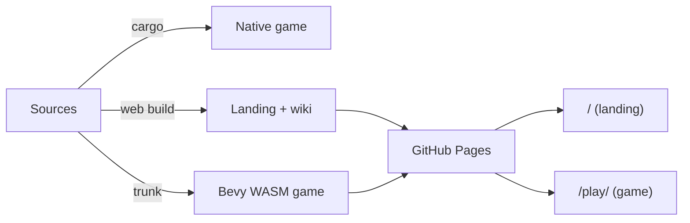

# Development

## Toolchain

- **Rust nightly**, pinned by `rust-toolchain.toml` (with rustfmt + clippy).
- **NixOS**: `nix develop` gives the toolchain, the `wasm32-unknown-unknown`
  target, all system libs Bevy needs (udev, alsa, vulkan, X11/wayland), and
  `trunk`. Without Nix, install those yourself.

## Everyday commands

```sh
cargo run                         # the game (boots into the main menu)
cargo run --features dev          # + debug tooling (inspector, wireframe)
cargo run --example 08_scenario   # run an example
cargo build --release             # release profile: opt=s, lto, stripped
cargo check && cargo fmt          # before committing
cargo test --workspace            # full suite (CI runs this; skip locally unless asked)
```

Notes that keep the suite honest and fast:

- Use `cargo test --workspace`, never bare `cargo test`: unit tests live in the
  member crates, so the bare form runs almost nothing and gives false comfort.
- `cargo test` takes ONE filter and one `-p` per invocation; separate runs for
  separate filters or packages.
- For a timed headless example run, build first, then time only the run
  (`cargo build --example X --features debug`, then `BCS_AUTOPILOT=1 timeout N
  cargo run --example X ...`). A cold build inside the timeout burns the window.
- Struct-field changes: `cargo check --workspace --all-targets`, or examples and
  tests stay silently broken.

The dev profile uses `opt-level = 1` for our code, `3` for dependencies: slow
first build, fast iteration. `split-debuginfo = "unpacked"` +
`debug = "line-tables-only"` keep link-time RAM around 20 GB instead of 40
(one Bevy-sized binary per test/example target); set `debug = true` temporarily
if you need a debugger.

**Worktree builds**: a fresh sprout worktree has an empty `target/`, so the
first build is a cold Bevy compile. Do NOT point `CARGO_TARGET_DIR` at the main
checkout's cache: both checkouts hold the same crates at the same versions, so
their artifacts overwrite each other and a worktree binary can silently link
the main checkout's code. Accept the cold build.

## Features

- `debug` - the whole `nova_debug` plugin (inspector, wireframe, overlays) plus
  `bevy/track_location`.
- `dev` - alias for `debug`.

### Debug tooling

`cargo run --features dev` compiles in `nova_debug`'s `DebugPlugin`
(`crates/nova_debug/src/lib.rs`), which adds the inspector, the wireframe
toggle, and the section/gravity debug overlays. The overlays are gated on a
`DebugEnabled` resource toggled at runtime with **F11**
(`DEBUG_TOGGLE_KEYCODE`), so they can be flipped off without a rebuild. Note the
feature is spelled `debug`, with `dev` as an alias for it (root `Cargo.toml`);
`--features dev` and `--features debug` are interchangeable.

Two debug-only CLI flags exist, both parsed in `src/main.rs` and both compiled
in only under the `debug` feature:

- `--norender` - build the app with rendering off (`editor_app(false)`), for
  headless runs.
- `--debugdump` - print the system schedule graph (via `bevy_mod_debugdump`)
  and exit. It dumps the `Update` schedule (`debugdump` in
  `crates/nova_debug/src/lib.rs`).

## Examples

`examples/` exercises one subsystem each, end to end; this repo prefers
runnable examples over isolated unit tests. The set reads as a curriculum in
four blocks:

- Sections: `01_controller_section` (PD attitude), `02_thruster_section`
  (burn -> thrust + plume shader), `03_hull_section` (damage -> destroy ->
  ship survives), `04_turret_section` and `05_torpedo_section` (the weapon
  test ranges), `06_torpedo_guidance` (PN deep-dive), `07_com_range` (mass
  properties under section destruction).
- Scenario: `08_scenario` (the scenario language - variables, events,
  filters, actions - built in code and asserted live).
- Editor: `09_editor` (the shipped editor flow).
- Playable: `10_playable` (a scenario played through the real input
  pipeline: lock, kill, GOTO, arrive - watched by its own handlers),
  `11_hud_range` (screen-projected HUD indicators, velocity sphere
  included), `12_menu_newgame` (the shipped boot flow).
- Screenshots: `13_screenshot_reel`, `14_screenshot_ui`,
  `15_screenshot_combat`, `16_screenshot_sections`, `17_screenshot_juice`,
  `18_screenshot_orbit` (drive the shipped scenes headless to capture the
  wiki and marketing frames).

When adding a substantial feature, add or extend the example that drives it.
(Consolidated over time: 01_scene/03_scenario merged into 08_scenario;
02_thruster_shader into 02_thruster_section; 05_directional into
11_hud_range; 10_gameplay into 03_hull_section + 10_playable; 07b_slicer's
subject lives in bevy-common-systems; 04_asteroids' slider tuning tool was
dropped.)

Every example is HARNESSED: it drives itself under `BCS_AUTOPILOT=1`, and
`tests/examples_smoke.rs` (the `HARNESSED_EXAMPLES` list) runs all eighteen
headless as a regression suite - each must reach `Playing` and exit without
panic. The gameplay examples (01-12) additionally carry panic-on-failure
behavior assertions with completion backstops (a stalled script fails instead
of passing vacuously), except `06_torpedo_guidance` and `09_editor`, which
assert at the scenario-load / reach-gameplay level; the screenshot examples
(13-18) drive the shipped scenes to capture frames. Keep list and disk in
sync: a new example joins the list with a harness, or it does not merge.

### Examples as bug pins

When a bug is fixed, prefer pinning it where it lives: a unit/App test for a
system-level mechanism, an example assertion when the bug only manifests in a
composed scene (for example, `12_menu_newgame` runs the shipped boot flow with
the ECS fallback error handler swapped to panic, so unhandled command errors on
those transitions fail CI). An example pin is an autopilot-script assertion
(`.input(...)` closure, staged by elapsed time - see `07_com_range`/`11_hud_range`
for the style); the smoke suite runs it on every push. Caveat: the handler swap
does NOT catch `remove`/`despawn` command warns (they bake in the WARN handler
at queue time).

## Web build

WASM via **Trunk** (`Trunk.toml`, `index.html`):

```sh
trunk serve            # serve on http://localhost:8080
trunk build --release
```

`.cargo/config.toml` sets `--cfg=web_sys_unstable_apis` for wasm; `bevy_rand`
uses its `wasm_js` feature there. Trunk only supports the `release` profile.
The GitHub Pages deploy (`.github/workflows/deploy-page.yaml`) builds the
landing site (`web/`) at the root and the game under `/play/`.

The same sources fan out into three build targets that combine into one
published site:



### Regenerating the web screenshots

The site's `.figure` blocks ship as placeholders; the real screenshots are
captured in-engine and packaged into `web/src/assets/` by
`scripts/gen-web-screenshots.py`. Each figure auto-upgrades to its image at
runtime once the asset exists (progressive enhancement in `web/src/site.ts`), so
no HTML edit is needed - just drop the file in.

Capture (needs a display + GPU; headless CI-style is Xvfb + lavapipe) into a
staging dir, then package into `web/src/assets/`:

```sh
export NOVA_SHOT_DIR=target/reel
BCS_REEL=1                cargo run --example 13_screenshot_reel   --features debug
BCS_AUTOPILOT=1 BCS_REEL=1 cargo run --example 14_screenshot_ui     --features debug
BCS_AUTOPILOT=1 BCS_REEL=1 cargo run --example 15_screenshot_combat --features debug
python3 scripts/gen-web-screenshots.py   # validate + copy; build composites; write the 44x44 icons
```

The example examples run headless under `BCS_AUTOPILOT`; the reel poses a
free-fly camera per beat and captures 1920x1080 PNGs. The Python step validates
each shot is 16:9, copies it in, builds the composite shots a single capture
cannot make (e.g. `devlog5-radar-stance-slots`, two lock stances side by side)
with a stdlib PNG codec, generates the section icons, and reports which shots
have no capture example yet. Commit the resulting PNGs (they are content, like
`banner.png`). Run `python3 scripts/gen-web-screenshots.py --self-test` to check
the PNG codec (decode/resize/compose) in isolation.

## Versioning and release

- Version: `workspace.package.version` in root `Cargo.toml`; crates inherit it.
- `nova_info::APP_VERSION` comes from the `APP_VERSION` env var via `build.rs`.
- Packaging assets (icons, installer, .app) live under `build/`.

### Cutting a release

Pushing a tag `v[0-9]+.[0-9]+.[0-9]+*` triggers `release-flow`
(`.github/workflows/release.yaml`). Steps, on `master`:

1. Bump `workspace.package.version` in root `Cargo.toml`.
2. Refresh `Cargo.lock`: `cargo metadata --format-version 1 >/dev/null`.
3. Update `CHANGELOG.md` (Keep a Changelog, one concise line per entry):
   promote `[Unreleased]` to `[<version>] - <YYYY-MM-DD>`, leave a fresh empty
   `## [Unreleased]` on top, merge any duplicate section headings that grew
   during the cycle, and update the compare links at the bottom (repoint
   `[unreleased]`, add the new `[<version>]` line).
4. Commit exactly those three files:
   `git add Cargo.toml Cargo.lock CHANGELOG.md && git commit -m "chore(release): vX.Y.Z"`.
5. `git tag vX.Y.Z` (CI reads the tag for the release name).
6. `git push origin master && git push origin vX.Y.Z`.
7. Watch the run (`gh run watch`), then check the GitHub release page and
   consider adding summarized release notes (`gh release edit vX.Y.Z --notes-file ...`).
8. Write a devblog for the release cycle (see below) and land it in `web/`.

The workflow uploads four assets to a release named after the tag: macOS
universal `.dmg`, Linux `.tar.gz`, Windows `.zip`, and a wasm-opt'd web zip.
It can also be re-run via `workflow_dispatch` with a `version` input.

### Writing the release devblog

Every release cycle also gets a devblog on the site, in `web/`. The devlogs
are numbered (`#1`..`#N`) and track the minor versions: one devlog per minor
release (`v0.4.0` -> Devlog #4, `v0.5.0` -> Devlog #5), with the cycle's patch
releases folded into that same post as a short closing note rather than getting
their own devlog. Source the content straight from the `CHANGELOG.md` sections
for the versions in the cycle.

The devlogs follow the spirit of Factorio's Friday Facts: a running numbered
series, each issue broken into a handful of distinct topic sections, written
candidly in the first person (the reasoning, the dead-ends, the "the piece I am
proudest of"), leaning on screenshots and diagrams, and closing with a prompt to
discuss. Match that tone; do not write terse release notes (the `CHANGELOG.md`
already is those).

Adding a devblog touches four places (mirror an existing post such as
`devlog-4-guided-torpedoes-targeting-and-enemy-ai`):

1. Write the post at `web/src/posts/<slug>.html`. Copy an existing devlog for
   the structure:
   - the `prose__meta` line carries `<date> // v<X.Y.0>`, and the
     `<title>`/`<meta name="description">` summarize the release;
   - a `<!-- Devlog video ... -->` placeholder for the recorded footage;
   - one `<h2>` per topic, in the candid FFF voice described above;
   - `.figure` blocks for screenshots/diagrams (they ship a dashed placeholder
     naming the image to capture later - see the component in `web/src/style.css`);
   - the standard `.post-footer` closer (the "discuss on GitHub Discussions"
     prompt plus the "All devlogs" link) before `</article>`.
2. Register the page in `web/webpack.config.js`: add a `page("post", ...)`
   entry in `plugins` and a matching `historyApiFallback` rewrite (keep both
   lists newest-first, above the previous devlog).
3. Add a `.post-card` to `web/src/blog.html` at the top of `.post-grid` (newest
   first): a media thumbnail plus the date/version, title, and one-line excerpt.
   For the thumbnail, use the YouTube thumbnail
   (`https://img.youtube.com/vi/<id>/hqdefault.jpg`) once the post has a video
   embed; otherwise use the `.post-card__ph` placeholder naming
   `assets/thumb-<slug>.png`.
4. Rebuild and check it: `cd web && npm run ci` (format check, lint, build).

## Contributing a change

The everyday loop for landing a change:

1. **Branch** off `master`. Work items are tracked as `tasks/` markdown (see
   [Task tracking](#task-tracking) below); check the backlog first.
2. **Build and format**: `cargo check && cargo fmt` before you commit. Do NOT
   run `cargo test` or `cargo clippy` locally unless asked - they are slow and
   CI is the source of truth; when you skip them, say so.
3. **Drive it with an example.** For a substantial feature, add or extend the
   `examples/` example that exercises it, with a harnessed autopilot assertion
   (see [Examples](#examples)) - this repo prefers a runnable example over an
   isolated unit test.
4. **Open a PR.** CI (`.github/workflows/ci.yaml`) runs on every PR and push to
   `master`: `cargo fmt --check`, `cargo clippy --workspace --all-targets
   --features debug`, `cargo test --workspace --features debug`, then the
   windowed `examples_smoke` suite under Xvfb/lavapipe, plus a dependency-license
   gate. All of it must be green to merge.

Commit messages are plain and use ASCII punctuation only. Releases are a
separate, tagged flow (see [Cutting a release](#cutting-a-release)).

## Task tracking

Work items live as markdown under `tasks/` (managed with the `tatr` CLI), so
they are versioned alongside the code. Check the backlog before starting and
close tasks when done. Each task has its own folder holding its `TASK.md` plus
any task-scoped records (`SPIKE.md`, `REVIEW.md`, `RETRO.md`, `NOTES.md`).
Multi-task plans (`docs/plans/`) and the lessons ledger (`docs/LESSONS.md`)
live under `docs/`.
