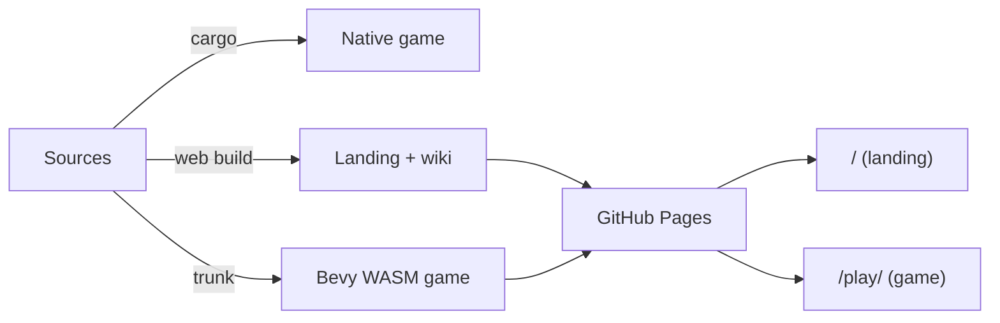

# Development

## Toolchain

- **Rust nightly**, pinned by `rust-toolchain.toml` (with rustfmt + clippy).
- **NixOS**: `nix develop` gives the toolchain, the `wasm32-unknown-unknown`
  target, all system libs Bevy needs (udev, alsa, vulkan, X11/wayland), and
  `trunk`. Without Nix, install those yourself.

## Everyday commands

```sh
cargo run                         # the game (boots into the main menu)
cargo run --features dev          # + debug tooling (inspector, wireframe)
cargo run --example scenario   # run an example
cargo build --release             # release profile: opt=s, lto, stripped
cargo check && cargo fmt          # before committing
cargo test --workspace            # full suite (CI runs this; skip locally unless asked)
```

Notes that keep the suite honest and fast:

- Use `cargo test --workspace`, never bare `cargo test`: unit tests live in the
  member crates, so the bare form runs almost nothing and gives false comfort.
- `cargo test` takes ONE filter and one `-p` per invocation; separate runs for
  separate filters or packages.
- For a timed headless example run, build first, then time only the run
  (`cargo build --example X --features debug`, then `BCS_AUTOPILOT=1 timeout N
  cargo run --example X ...`). A cold build inside the timeout burns the window.
- Struct-field changes: `cargo check --workspace --all-targets`, or examples and
  tests stay silently broken.

The dev profile uses `opt-level = 1` for our code, `3` for dependencies: slow
first build, fast iteration. `split-debuginfo = "unpacked"` +
`debug = "line-tables-only"` keep link-time RAM around 20 GB instead of 40
(one Bevy-sized binary per test/example target); set `debug = true` temporarily
if you need a debugger.

**Worktree builds**: a fresh sprout worktree has an empty `target/`, so the
first build is a cold Bevy compile. Do NOT point `CARGO_TARGET_DIR` at the main
checkout's cache: both checkouts hold the same crates at the same versions, so
their artifacts overwrite each other and a worktree binary can silently link
the main checkout's code. Accept the cold build.

## Features

- `debug` - the whole `nova_debug` plugin (inspector, wireframe, overlays) plus
  `bevy/track_location`.
- `dev` - alias for `debug`.

### Debug tooling

`cargo run --features dev` compiles in `nova_debug`'s `DebugPlugin`
(`crates/nova_debug/src/lib.rs`), which adds the inspector, the wireframe
toggle, and the section/gravity debug overlays. The overlays are gated on a
`DebugEnabled` resource toggled at runtime with **F11**
(`DEBUG_TOGGLE_KEYCODE`), so they can be flipped off without a rebuild. Note the
feature is spelled `debug`, with `dev` as an alias for it (root `Cargo.toml`);
`--features dev` and `--features debug` are interchangeable.

`DebugPlugin` also binds **F12** (`SCREENSHOT_KEYCODE`,
`crates/nova_debug/src/screenshot.rs`) to a screenshot: it captures the primary
window and saves it to your Downloads directory as `<unix-millis>.png`. The
capture is intentionally not gated on `DebugEnabled`, so it works whether or not
the overlays are shown.

Two debug-only CLI flags exist, both parsed in `src/main.rs` and both compiled
in only under the `debug` feature:

- `--norender` - build the app with rendering off (`editor_app(false)`), for
  headless runs.
- `--debugdump` - print the system schedule graph (via `bevy_mod_debugdump`)
  and exit. It dumps the `Update` schedule (`debugdump` in
  `crates/nova_debug/src/lib.rs`).

## Examples

`examples/` exercises one subsystem each, end to end; this repo prefers
runnable examples over isolated unit tests. The examples live in purpose
directories (bevy-repo style: category dirs, plain slug names), and the
`[[example]]` catalog in the root Cargo.toml (`autoexamples = false`) is the
single source of truth, listed in curriculum reading order:

- `sections/` - one test range per ship section: `controller_section` (PD
  attitude), `thruster_section` (burn -> thrust + plume shader),
  `hull_section` (damage -> destroy -> ship survives), `turret_section`
  and `torpedo_section` (the weapon test ranges), `torpedo_guidance` (PN
  deep-dive), `com_range` (mass properties under section destruction).
- `gameplay/` - full autopilot scenario runs: `scenario` (the scenario
  language - variables, events, filters, actions - built in code and
  asserted live), `playable` (a scenario played through the real input
  pipeline: lock, kill, GOTO, arrive - watched by its own handlers),
  `broadside` (the chapter-two scenario end to end through the Scenarios
  picker: defeat -> Retry reload -> the full act machine -> the Victory
  overlay, all staged on scenario state).
- `ui/` - staged UI flows: `editor` (the shipped editor flow), `hud_range`
  (screen-projected HUD indicators, velocity sphere included),
  `menu_newgame` (the shipped boot flow).
- `screenshots/` - `screenshot_reel`, `screenshot_ui`, `screenshot_combat`,
  `screenshot_sections`, `screenshot_juice`, `screenshot_orbit` (drive the
  shipped scenes headless to capture the wiki and marketing frames), and
  `render_scale_shot` (a real-GPU window capture proving the render-scale
  lever draws a correct frame).
- `perf/` - `perf_baseline` (the frame-time measurement scene the probe
  sweep runs; see [Performance and run verification](#performance-and-run-verification)).

When adding a substantial feature, add or extend the example that drives it.
(Consolidated over time: 01_scene/03_scenario merged into scenario;
02_thruster_shader into thruster_section; 05_directional into
hud_range; 10_gameplay into hull_section + playable; 07b_slicer's
subject lives in bevy-common-systems; 04_asteroids' slider tuning tool was
dropped.)

Every example outside `perf/` (plus `render_scale_shot`) is HARNESSED: it
drives itself under `BCS_AUTOPILOT=1`, and `tests/examples_smoke.rs` runs
each category headless as a regression suite, one test per category -
`cargo test --test examples_smoke sections` (or `gameplay`, `ui`,
`screenshots`) runs a single category alone. Each example must reach
`Playing` and exit without panic; the sections, gameplay and ui examples
additionally carry panic-on-failure behavior assertions with completion
backstops (a stalled script fails instead of passing vacuously), except
`torpedo_guidance` and `editor`, which assert at the scenario-load /
reach-gameplay level; the screenshot examples drive the shipped scenes to
capture frames. Disk, catalog and smoke lists cannot drift: the
display-free `catalog_matches_disk` test fails a bare `cargo test` when a
new example misses its `[[example]]` block or its category's smoke list
(`render_scale_shot` and `perf_baseline` are deliberately unsmoked; the
`NOT_SMOKED` list records why).

Harness runs are SILENT: any bcs harness env (`BCS_AUTOPILOT`, `BCS_SHOT`,
`BCS_REEL`) zeroes the audio output via `HarnessMute` - Xvfb hides the
window but not the speakers, and nobody listens to a smoke test. The
volume SETTING is untouched (persistence and the settings menu never see
the mute). `NOVA_MUTE=0` forces sound through a harness run;
`NOVA_MUTE=1` mutes a normal one.

### Examples as bug pins

When a bug is fixed, prefer pinning it where it lives: a unit/App test for a
system-level mechanism, an example assertion when the bug only manifests in a
composed scene (for example, `menu_newgame` runs the shipped boot flow with
the ECS fallback error handler swapped to panic, so unhandled command errors on
those transitions fail CI). An example pin is an autopilot-script assertion
(`.input(...)` closure, staged by elapsed time - see `com_range`/`hud_range`
for the style); the smoke suite runs it on every push. Caveat: the handler swap
does NOT catch `remove`/`despawn` command warns (they bake in the WARN handler
at queue time).

## Web build

WASM via **Trunk** (`Trunk.toml`, `index.html`):

```sh
trunk serve            # serve on http://localhost:8080
trunk build --release
```

`.cargo/config.toml` sets `--cfg=web_sys_unstable_apis` for wasm; `bevy_rand`
uses its `wasm_js` feature there. Trunk only supports the `release` profile.
The GitHub Pages deploy (`.github/workflows/deploy-page.yaml`) builds the
landing site (`web/`) at the root and the game under `/play/`.

The same sources fan out into three build targets that combine into one
published site:



### Regenerating the web screenshots

The site's `.figure` blocks ship as placeholders; the real screenshots are
captured in-engine and packaged into `web/src/assets/` by
`scripts/gen-web-screenshots.py`. Each figure auto-upgrades to its image at
runtime once the asset exists (progressive enhancement in `web/src/site.ts`), so
no HTML edit is needed - just drop the file in.

Capture (needs a display + GPU; headless CI-style is Xvfb + lavapipe) into a
staging dir, then package into `web/src/assets/`:

```sh
export NOVA_SHOT_DIR=target/reel
BCS_REEL=1                cargo run --example screenshot_reel   --features debug
BCS_AUTOPILOT=1 BCS_REEL=1 cargo run --example screenshot_ui     --features debug
BCS_AUTOPILOT=1 BCS_REEL=1 cargo run --example screenshot_combat --features debug
python3 scripts/gen-web-screenshots.py   # validate + copy; build composites; write the 44x44 icons
```

The capture examples run headless under `BCS_AUTOPILOT`; the reel poses a
free-fly camera per beat and captures 1920x1080 PNGs. The Python step validates
each shot is 16:9, copies it in, builds the composite shots a single capture
cannot make (e.g. `devlog5-radar-stance-slots`, two lock stances side by side)
with a stdlib PNG codec, generates the section icons, and reports which shots
have no capture example yet. Commit the resulting PNGs (they are content, like
`banner.png`). Run `python3 scripts/gen-web-screenshots.py --self-test` to check
the PNG codec (decode/resize/compose) in isolation.

## Performance and run verification

`nova_probe` (`crates/nova_probe/`) is the run-harness: it drives an autopilot
example, records what happened (correctness) and what it cost (performance),
and assembles one reviewable report. The POST-FEATURE CHECK - "did my change
break behavior or perf?" - is one command:

```sh
cargo run -p nova_probe -- run playable            # clean pass -> report
cargo run -p nova_probe -- run playable --profile  # + traced pass (top-N systems)
cargo run -p nova_probe -- run playable --samply   # + named flamegraph
cargo run -p nova_probe -- run playable --baseline probe-runs/before  # FPS deltas
cargo run -p nova_probe -- run playable,scenario   # comma list -> aggregate index
cargo run -p nova_probe -- run gameplay            # a whole category
cargo run -p nova_probe -- run --all               # the fleet (minus NOT_PROBED)
```

It runs the example headless (throwaway Xvfb; `--display :0` to reuse yours),
captures the run timeline + continuous invariants + the log into
`probe-runs/<example>/`, optionally adds the profiled and samply passes
(separate builds - tracing overhead never touches the clean numbers), and
renders `report.html` + `checks.json` with a provisional
OK/WARN/FAIL/NO_DATA the reviewer confirms. Every run dir carries a
`probe-run.json` manifest (identity, passes, outcomes); `probe report` only
re-renders dirs that have one. Two verbs is the whole surface - `run` and
`report`; the transitional `sweep|web|profile` aliases and the `trace`
verb retired at the v0.8.0 cut (retired commands error with a pointer to
the `run` form).

Multi specs (comma list, category dir name, `--all`) resolve against the
`[[example]]` catalog, run each example sequentially with
continue-on-failure, and write an aggregated status index above the run
dirs: `index.html` (one row per example - verdict, measured n/total, the
six check statuses, duration, a link to its report), `index.json` (the
machine mirror), and `probe-all.json` (the re-render gate). The aggregate
verdict is the WORST row; the exit code mirrors it. `--all` skips the
NOT_PROBED exclusions, which the report lists with their reasons - and a
bare `probe run` errors with the catalog rather than starting a fleet
sweep by accident. Categories take single-digit minutes warm; `--all` is
the pre-release/nightly sweep (roughly half an hour).

Under the hood: an env-gated capture plugin drives the real gameplay app to
`Playing`, warms up, records the wall-clock delta of every frame for a fixed
window, and writes percentile stats. It is inert unless `NOVA_PERF` is set,
so the whole fleet carries it permanently. `--fps` runs it as a DEDICATED
capture-only pass (the correctness recorder flushes per entry on the frame
path - measurement and correctness never share a pass), the harness
completion protocol keeps the app alive until the window closes, and
enrolled scenes (`loop_while_pending`) reload + replay so the window
measures activity - reload intervals are excluded from the stats and
reported as their own line. See the crate docs for the full knob list
(`NOVA_PERF_*`).

The perf sweep is the same front door: a scenario x preset matrix of the
frame-time capture, one labeled `frametime.csv` row per cell, release-built
(dev-profile frame numbers are not baselines):

```sh
cargo run -p nova_probe -- run perf_baseline --fps --release \
  --scenario asteroid_field --scenario broadside --preset high --preset low
cargo run -p nova_probe -- run perf_baseline --fps --release --render sw ...  # lavapipe floor
cargo run -p nova_probe -- run <scenario> --platform web   # web/WebGPU capture (scraped)
```

Every capture records run metadata (wgpu backend + GPU adapter, resolution,
graphics preset, git SHA, host and - schema v3 - the BUILD PROFILE) so a
results file names its own renderer (pre-v3 files, like the v0.7.0
baseline, still load; their profile reads `unknown`). The report badges
each row `dev` or `release`: dev numbers are NOT baselines, and since the
whole fleet now carries the capture (`--fps` works on any example), the
badge is what keeps ad-hoc dev captures from being mistaken for
comparable measurements. The web platform
builds the perf_web wasm app through Trunk, serves it from an embedded static
server, drives headless Chromium with the calibrated WebGPU flags, and
scrapes the summary line into a labeled CSV row (no fs in the browser).
Compare runs with `probe report <after> --baseline <before>` - signed deltas
per label - and `report` only accepts dirs probe itself produced
(`probe-run.json` is the gate).

### Run timeline (correctness recording)

`nova_probe` also records WHAT HAPPENED during a run: set
`NOVA_PERF_TIMELINE=<out.jsonl>` on any example that adds
`nova_probe::nova_timeline()` - since the fleet wiring (task
20260719-210443) that is EVERY cataloged example except
`render_scale_shot` - and the run appends one JSON object per line - every `GameStates`/pause transition, every fired scenario
event with its payload (kills, area enter/exit, locks), every scenario-variable
change (old/new), plus the beats the autopilot script pushes itself via
`nova_probe::probe_marker`. Entries are flushed as written, so a panicked run
keeps everything up to the panic. Compare runs by ORDER and VALUES, not
timestamps (wall-clock and frame counts vary across hosts):

```sh
NOVA_PERF_TIMELINE=/tmp/run.jsonl BCS_AUTOPILOT=1 \
  cargo run --example playable --features debug
```

The timeline is native-only (no fs in the browser) and inert without the env
var. It is the correctness half of the run-harness the perf capture is the
performance half of; the unified run report (task 20260719-112304) renders
both.

### The run report (one verdict surface)

`run_report` assembles a RUN DIRECTORY - whatever the passes above dropped
into it (`timeline.jsonl`, `frametime.csv`, `trace.json`, `run.log`, each
optional) - into a self-contained `report.html` plus a machine-readable
`checks.json`:

```sh
cargo run -p nova_probe -- report <run-dir> [--baseline <old-run-dir>]
```

Auto checks produce a provisional OK/WARN/FAIL/NO_DATA (process exit from
the run manifest, run completed, reached Playing, invariants held, FPS vs
baseline as a soft gate, log scan); missing artifacts are SKIPPED - "not
measured", never "held" - and `checks.json` pairs the verdict with a
`measured: n/total` figure plus per-check structured data. Zero evidence is
NO_DATA (nonzero exit), FPS improvements PASS (only regressions WARN -
frame numbers are host-noisy), a hung run is killed and still produces a
FAILing report, and the report ends with a reviewer checklist: the final
OK/NOT-OK is a human's or an agent's call, off `checks.json` without
parsing HTML.

### Profiled pass (where does the time go)

Per-system costs come from a SEPARATE traced run - tracing overhead inflates
frame times, so a profiled run RANKS systems while the clean capture owns the
FPS truth (never mix the two):

```sh
cargo run -p nova_probe -- run scenario --profile          # trace + report table
cargo run -p nova_probe -- run scenario --profile --samply # + flamegraph
```

The profiled pass builds with `--features debug,trace` (bevy's per-system
spans are compiled in only under `bevy/trace`), runs headless with
`TRACE_CHROME` into the run dir (plus the `RUST_LOG=bevy_ecs=info` override
that un-hides the spans from the game's log filter), and the report renders
the top-N table (`probe report <run-dir>` re-renders it). Open the raw
`trace.json` in https://ui.perfetto.dev for the full picture; `samply load`
opens the flamegraph in the Firefox Profiler (the samply run is skipped with
a note when samply is missing or blocked - sampling needs
`perf_event_paranoid <= 1` AND, on many-core hosts, enough perf ring-buffer
memory: an "mmap failed" means raising `perf_event_mlock_kb`, e.g.
`echo 16384 | sudo tee /proc/sys/kernel/perf_event_mlock_kb`). The samply
run builds with the dedicated `profiling` cargo profile (full DWARF in the
binary + frame pointers via RUSTFLAGS) so our frames symbolicate to real
names instead of raw addresses; frames inside the NVIDIA driver blob and
stripped system libraries stay hex - that is their stripping, not a build
problem. Load the profile right after recording: symbolication resolves
from the binary on disk, so a rebuild in between loses names. Expect the trace to be large (a 30 s autopilot
run produces hundreds of MB); it is a scratch artifact, not something to
commit.

Continuous INVARIANTS ride the same stream: set `NOVA_PERF_INVARIANTS=1` (or
`=strict` to panic on the first violation) on a wired example and every frame
asserts what the engine guarantees - health within `0..=max` and finite,
velocities finite (plus an absurd-speed bound at 10x a ship's soft
`FlightSpeedCap`), scenario Number variables finite, registered monotonic
variables never decreasing (opt-in per example: playable registers
`target_down`/`leg`, scenario `beat`/`rocks_destroyed`), and a total
entity-count leak bound. Violations warn, land on the timeline as
`kind: "invariant"` entries, and feed the report's `invariants held` check.

## Versioning and release

- Version: `workspace.package.version` in root `Cargo.toml`; crates inherit it.
- `nova_info::APP_VERSION` comes from the `APP_VERSION` env var via `build.rs`.
- Packaging assets (icons, installer, .app) live under `build/`.

### Cutting a release

Pushing a tag `v[0-9]+.[0-9]+.[0-9]+*` triggers `release-flow`
(`.github/workflows/release.yaml`). Steps, on `master`:

1. Bump `workspace.package.version` in root `Cargo.toml`.
2. Refresh `Cargo.lock`: `cargo metadata --format-version 1 >/dev/null`.
3. Update `CHANGELOG.md` (Keep a Changelog, one concise line per entry):
   promote `[Unreleased]` to `[<version>] - <YYYY-MM-DD>`, leave a fresh empty
   `## [Unreleased]` on top, merge any duplicate section headings that grew
   during the cycle, and update the compare links at the bottom (repoint
   `[unreleased]`, add the new `[<version>]` line).
4. Commit exactly those three files:
   `git add Cargo.toml Cargo.lock CHANGELOG.md && git commit -m "chore(release): vX.Y.Z"`.
5. `git tag vX.Y.Z` (CI reads the tag for the release name).
6. `git push origin master && git push origin vX.Y.Z`.
7. Watch the run (`gh run watch`), then check the GitHub release page and
   consider adding summarized release notes (`gh release edit vX.Y.Z --notes-file ...`).
8. Write or expand the release News post (see "Writing the release news post"
   below) and land it in `web/`; sync any wiki pages the cycle changed (see
   [Keeping docs in sync](../keeping-docs-in-sync/)).

The workflow uploads four assets to a release named after the tag: macOS
universal `.dmg`, Linux `.tar.gz`, Windows `.zip`, and a wasm-opt'd web zip.
It can also be re-run via `workflow_dispatch` with a `version` input.

### Writing the release news post

Every release cycle gets one **News** post on the site (`/news/`, markdown under
`web/src/news/`). News is the merged devlog + release notes: **one post per
FEATURE release** (`v0.1.0`, `v0.2.0`, ... `v0.6.0`). Patch releases do NOT get
their own post - they fold into the parent feature post's `## Point releases`
section (`v0.5.0`'s post covers `v0.5.1` and `v0.5.2`). The terse per-version
list stays in `CHANGELOG.md`; source the post's content from the cycle's
`CHANGELOG.md` sections.

A News post follows the spirit of Factorio's Friday Facts: a narrative lead,
then a handful of feature-by-feature `##` sections written candidly (the
reasoning, the dead-ends, the piece you are proudest of), leaning on screenshots,
and - where a devlog video exists - an optional `## Watch the devlog` companion
near the top (the written highlights must stand on their own; the video is an
extra). Do not just restate the terse `CHANGELOG.md`.

Adding a post touches three places (mirror an existing post such as
`web/src/news/0.5.0.md`):

1. Write the post at `web/src/news/<version>.md` (e.g. `0.6.0.md`). The page
   shell (`newsPostShell` in `web/markdown.js`) renders the H1, the
   `<date> // v<version>` meta line, and the footer (the Discussions prompt plus
   the `CHANGELOG.md` pointer and "All news" link), so the markdown is just the
   body: the H1 (`# vX.Y.0 - <title>`), the lead, the `##` sections, `.figure`
   placeholder blocks for screenshots to capture later, an optional
   `.video-embed` companion, a `.callout.callout--breaking` block for any format
   break, and a closing `## Point releases` section for the cycle's patches.
   Do not add a footer or a `CHANGELOG.md` link yourself - the shell adds them.
2. Register it in `web/webpack.config.js`: add an entry to `NEWS_POSTS`
   (newest-first) with `slug`/`version`/`date`/`description`. The plugin list and
   the `historyApiFallback` rewrite both derive from `NEWS_POSTS`, so no other
   wiring is needed.
3. Add a `.post-card` to `web/src/news.html` at the top of `.post-grid`
   (newest-first): a media thumbnail plus the date/version, title, and one-line
   excerpt. For the thumbnail, use the YouTube thumbnail
   (`https://img.youtube.com/vi/<id>/hqdefault.jpg`) if the release has a video,
   otherwise the `.post-card__ph` placeholder naming `assets/thumb-news-<version>.png`.
4. Rebuild and check it: `cd web && npm run ci` (format check, lint, build).

## Contributing a change

The everyday loop for landing a change:

1. **Branch** off `master`. Work items are tracked as `tasks/` markdown (see
   [Task tracking](#task-tracking) below); check the backlog first.
2. **Build and format**: `cargo check && cargo fmt` before you commit. Do NOT
   run `cargo test` or `cargo clippy` locally unless asked - they are slow and
   CI is the source of truth; when you skip them, say so.
3. **Drive it with an example.** For a substantial feature, add or extend the
   `examples/` example that exercises it, with a harnessed autopilot assertion
   (see [Examples](#examples)) - this repo prefers a runnable example over an
   isolated unit test.
4. **Open a PR.** CI (`.github/workflows/ci.yaml`) runs on every PR and push to
   `master`: `cargo fmt --check`, `cargo clippy --workspace --all-targets
   --features debug`, `cargo test --workspace --features debug`, then the
   windowed `examples_smoke` suite under Xvfb/lavapipe, plus a dependency-license
   gate. All of it must be green to merge.

Commit messages are plain and use ASCII punctuation only. Releases are a
separate, tagged flow (see [Cutting a release](#cutting-a-release)).

## Task tracking

Work items live as markdown under `tasks/` (managed with the `tatr` CLI), so
they are versioned alongside the code. Check the backlog before starting and
close tasks when done. Each task has its own folder holding its `TASK.md` plus
any task-scoped records (`SPIKE.md`, `REVIEW.md`, `RETRO.md`, `NOTES.md`).
Multi-task plans (`docs/plans/`) and the lessons ledger (`docs/LESSONS.md`)
live under `docs/`.
