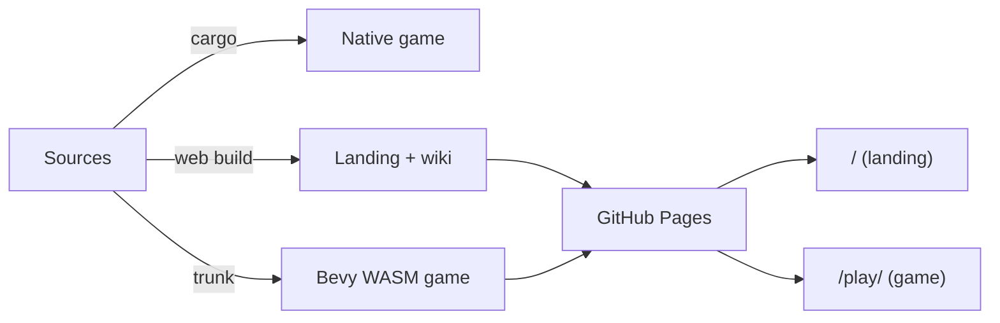
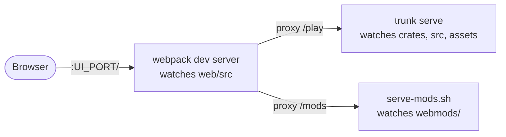

# Development

## Toolchain

- **Rust nightly**, pinned by `rust-toolchain.toml` (with rustfmt + clippy).
- **NixOS**: `nix develop` gives the toolchain, the `wasm32-unknown-unknown`
  target, all system libs Bevy needs (udev, alsa, vulkan, X11/wayland),
  `trunk`, and `sccache` (see fast worktree builds below). Without Nix, install
  those yourself. Bare `cargo` is not on PATH under Nix: run every cargo/rust
  command via `nix develop --command <cmd>` (the commands below assume you are
  inside `nix develop`).

## Everyday commands

```sh
cargo run                         # the game (boots into the main menu)
cargo run --features dev          # + debug tooling (inspector, wireframe)
cargo run --example scenario_grammar   # run an example
cargo build --release             # release profile: opt=s, lto, stripped
cargo check && cargo fmt          # before committing
cargo test --workspace            # full suite (CI runs this; skip locally unless asked)
cargo run content lint   # validate content: refs + balance + input overlaps (also: gen)
cargo run --features debug probe run player_path          # run-harness check (correctness + perf)
```

Notes that keep the suite honest and fast:

- Use `cargo test --workspace`, never bare `cargo test`: unit tests live in the
  member crates, so the bare form runs almost nothing and gives false comfort.
- `cargo test` takes ONE filter and one `-p` per invocation; separate runs for
  separate filters or packages.
- For a timed headless example run, build first, then time only the run
  (`cargo build --example X --features debug`, then `NOVA_AUTOPILOT=1 timeout N
  cargo run --example X ...`). A cold build inside the timeout burns the window.
- Struct-field changes: `cargo check --workspace --all-targets`, or examples and
  tests stay silently broken.

The dev profile uses `opt-level = 1` for our code, `3` for dependencies: slow
first build, fast iteration. `split-debuginfo = "unpacked"` +
`debug = "line-tables-only"` keep link-time RAM around 20 GB instead of 40
(one Bevy-sized binary per test/example target); set `debug = true` temporarily
if you need a debugger.

**Worktree builds (fast via sccache)**: a fresh sprout worktree starts with an
empty `target/`, but the devshell wires `sccache` as `RUSTC_WRAPPER` (with
`CARGO_INCREMENTAL=0`, which sccache requires) so it does NOT pay a full cold
build. sccache caches each rustc invocation's output keyed by a hash of the
source content plus flags plus compiler version, in a shared cache
(`~/.cache/sccache`). Unchanged deps (bevy, avian, the whole pinned tree) are
100% cache hits across worktrees; only changed `nova_*` crates recompile.

Measured on 2026-07-21 (game binary, quiet host):

| build | wall clock | sccache stats |
|-------|-----------|---------------|
| cold (empty cache) | ~6m45s (405s) | 517 misses / 0 hits |
| warm (`cargo clean`, same source) | ~38s | 517 hits / 0 misses (100%) |

The warm number is what a fresh sprout worktree gets once the shared cache is
warm. Recipe from a new worktree:

```sh
cd "$(sprout new <branch>)"
nix develop --command cargo build          # warm-cache: seconds, not minutes
nix develop --command sccache --show-stats # confirm the hit rate
```

Still do NOT point `CARGO_TARGET_DIR` at another checkout's cache: cargo keys
fingerprints on crate name + version + features + profile + rustc, NOT the
source path, so two checkouts alias each other's artifacts in a shared dir and
a worktree binary can silently link another checkout's code (the stale-binary
incident). Each worktree keeps its OWN `target/`; sccache is the SAFE way to
share compilation because its cache key IS the source content - there is no
path where a worktree links code from different source. That content-keying is
also why sccache is transparent to CI: an empty cache is just a cold build.

The devshell sets `CARGO_INCREMENTAL=0` shell-wide (sccache is incompatible
with incremental). This costs the main checkout's iterative edit-rebuild loop
its incremental speedup; the fresh-worktree-per-task agent workflow only ever
does cold-shaped builds, so it is pure win there. A sprout-scoped variant
(export the wrapper only in sprout shells, keep the main checkout on
incremental) is possible as a nix.dotfiles follow-up if the main-checkout
iteration cost bites.

## Features

- `debug` - the whole `nova_debug` plugin (inspector, wireframe, overlays) plus
  `bevy/track_location`.
- `dev` - alias for `debug`.
- `trace` - `bevy/trace` + `bevy/trace_chrome` for span traces; the probe
  harness builds `--features debug,trace` when it needs one.

### Debug tooling

`cargo run --features dev` compiles in `nova_debug`'s `DebugPlugin`
(`crates/nova_debug/src/lib.rs`), which adds the inspector, the wireframe
toggle, and the section/gravity debug overlays. The overlays are gated on a
`DebugEnabled` resource toggled at runtime with **F11**
(`DEBUG_TOGGLE_KEYCODE`), so they can be flipped off without a rebuild. Note the
feature is spelled `debug`, with `dev` as an alias for it (root `Cargo.toml`);
`--features dev` and `--features debug` are interchangeable.

`DebugPlugin` also binds **F12** (`SCREENSHOT_KEYCODE`,
`crates/nova_debug/src/screenshot.rs`) to a screenshot: it captures the primary
window and saves it to your Downloads directory as `<unix-millis>.png`. The
capture is intentionally not gated on `DebugEnabled`, so it works whether or not
the overlays are shown.

Two debug-only CLI flags exist, both parsed in `src/main.rs` and both compiled
in only under the `debug` feature:

- `--norender` - build the app with rendering off (`editor_app(false)`), for
  headless runs.
- `--debugdump` - print the system schedule graph (via `bevy_mod_debugdump`)
  and exit. It dumps the `Update` schedule (`debugdump` in
  `crates/nova_debug/src/lib.rs`).

## Examples

`examples/` exercises one subsystem each, end to end; this repo prefers
runnable examples over isolated unit tests. The examples live in purpose
directories (bevy-repo style: category dirs, plain slug names), and the
`[[example]]` catalog in the root Cargo.toml (`autoexamples = false`) is the
single source of truth, listed in curriculum reading order.

### The category contract

A category is not a folder - it is a promise about what its examples prove
and what the probe harness does with them. Pick the category by what your
example PROVES, not by what it happens to spawn.

| Category | What it proves | What probe does with it | Disqualifies an example |
|-|-|-|-|
| `sections/` | one ship section's behavior, end to end | runtime contract decides; native trace is automatic | spans two sections |
| `systems/` | a whole system's behavior on a code-built fixture | runtime contract decides; native trace is automatic | needs shipped content to stand up, or measures instead of asserting |
| `stress/` | a frame-time claim: a steady-state scene built to be measured | runtime contract decides; native trace is automatic | ends on a script instead of holding a load (it cannot fill a capture window) |
| `ui/` | a staged UI flow - layout, navigation, real text measure | runtime contract decides; native trace is automatic | its subject is the simulation, not the interface over it |
| `screenshots/` | frames for the website and the wiki | runtime contract decides; native trace is automatic | asserts instead of capturing |

The run-policy half of that table is no longer a table. What an example can
be judged on is DECLARED by the example, at runtime, through the probe
plugins it wires (`nova_probe::contract`), and probe reads it back from
`probe-contract.json`. Nothing is left on the launch side: every cataloged
example is spawned, `--all` is the catalog with nothing subtracted, and an
example that declares no capability grades UNPROBEABLE rather than being
listed away. That verdict is the sanctioned opt-out from claim grading: not
wiring a probe plugin is the signal (no skip list exists), the run passes the
gate on its smoke checks alone (clean exit within the deadline, clean log),
and the banner still names it. The prose half - what each
category proves - is the table above and the per-block comments in the root
`Cargo.toml`; review enforces it, because judging whether an example asserts
enough is a reading task, not a test.

`gameplay/` is gone: it was never a contract (it described how the examples
ran, not what they proved). Its system coverage became `systems/`
(`scenario_grammar`, `player_path`, `outcomes`), and the two story-scenario
runs that outlived that move were retired rather than rehomed - story is
tested by players, examples test systems.

### The catalog and the harness

What is on disk today, in curriculum reading order:

- `sections/` - one test range per ship section: `controller_section` (PD
  attitude), `thruster_section` (burn -> thrust + plume shader),
  `hull_section` (damage -> destroy -> ship survives, and the mass properties
  the losses move), `turret_section` and `torpedo_section` (the weapon test
  ranges, the latter also the PN lead-a-crosser deep-dive). One range per
  section family, each walking a named roster of invariants across several
  rounds, and across as many scenes or rig layouts as its invariants need.
- `systems/` - code-built fixtures for the cross-cutting systems, every one a
  `ScenarioConfig` written in Rust and loaded with `LoadScenario`:
  `scenario_grammar` (the scenario language - variables, events, filters,
  actions - over repeated rounds, each gated on the scenario's own
  variables), `player_path` (a scenario played through the real input
  pipeline: lock, kill, travel-lock, GOTO - watched by its own handlers, and
  repeated through the loop point) and `outcomes` (the composed outcome arc
  in one live run: die -> the Defeat overlay -> Retry -> a clean reload ->
  kill -> the objective and the CHECKPOINT -> Continue -> the chained
  scenario). Nothing here reads `assets/base/scenarios`.
- `ui/` - staged UI flows, five runs. Four of the five DRIVE the interface with
  synthesized pointer input rather than asserting around it: `widget_zoo` (the
  nova_ui widget set - hover, press, reskin, segmented select, check/toggle
  flips and a slider drag, then the LIVE TREE checked after each rebuild),
  `editor` (build a ship and inspect it: cards, placement clicks on the ship
  itself, select and delete), `menu_newgame` (the shipped boot flow, and
  nothing about the scenario it boots) and `menu_scenarios` (drives the
  Scenarios picker and logs its laid-out pane widths per selection, so a
  layout regression that only real text measure can show is caught). The fifth,
  `hud_range` (screen-projected HUD indicators, velocity sphere included),
  stays predicate-driven: it clicks no widget, because its subject is where an
  indicator lands on screen, not what a pointer does to it.
  The idiom: a beat NAMES its target (`click_named` / `hover_named` /
  `ui_node_centre` / `ui_node_rect` in `nova_autopilot::input`) so a layout move
  is survivable and only a rename breaks a run; nothing reaches a widget by
  triggering its observer or inserting its state component. A driven run that
  cannot reach a target says so and states its COVERAGE in the verdict -
  `menu_scenarios` names the rows it skipped past the picker's fold and fails
  outright below two measurements, since its property is a comparison across
  selections. `systems/` deliberately does the opposite - its subject is the
  outcome chain, so pixel coordinates would only add layout coupling.
- `screenshots/` - `screenshot_scene` (the "Drydock drift" beauty set),
  `screenshot_combat` (the "Rock hollow" set: a real GOTO leg into an `OnEnter`
  ambush and a torpedo salvo, so it carries the travel, combat, HUD and ordnance
  frames and absorbed the old `screenshot_juice`), `screenshot_ui`, `screenshot_sections`,
  `screenshot_flight` (the "The ring" set: the ORBIT verb flown around a real
  well, with the holo ring and radius spoke up - it replaced `screenshot_orbit`)
  (drive the scenes headless to capture the wiki and marketing frames),
  `screenshot_nova_os` (the Tab ship-computer, captured for HTML fidelity
  work against `web/design/nova_os_terminal_poc.html`), and
  `render_scale_shot` (a real-GPU window capture proving the render-scale
  lever draws a correct frame, including after a LIVE preset switch).
- `stress/` - the only category that carries frame-time windows:
  `scene_baseline` (the release-over-release measurement scene the probe sweep
  runs), plus the scale sweeps `many_bodies` (N asteroids under physics +
  gravity + render), `many_sections` (one ship with N sections: mass/COM
  aggregation and the integrity graph at scale) and `many_projectiles`
  (turret + torpedo saturation: collision, particles, despawn churn). Each
  sweep takes a count knob (`NOVA_STRESS_COUNT`) and loops spawn -> hold ->
  teardown so the capture window is filled by activity, and each asserts that
  entity counts return to baseline after teardown. See
  [Performance and run verification](#performance-and-run-verification).

When adding a substantial feature, add or extend the example that drives it.
(Consolidated over time: 01_scene/03_scenario merged into scenario;
02_thruster_shader into thruster_section; 05_directional into
hud_range; 10_gameplay into hull_section + player_path; 07b_slicer's
subject is the mesh toolkit's own tests; 04_asteroids' slider tuning tool was
dropped.)

Every example except `scene_baseline` is HARNESSED: it
drives itself under `NOVA_AUTOPILOT=1`, and probe is the regression suite over
all of them - `cargo run --features debug probe run sections` (or `systems`, `ui`,
`stress`, `screenshots`) runs a single category alone, and `--all` is the whole
catalog, which is what CI runs. Each
example must reach
`Playing` and exit without panic; the sections, systems, ui and stress examples
additionally carry panic-on-failure behavior assertions with completion
backstops (a stalled script fails instead of passing vacuously), except
`editor`, which asserts at the reach-gameplay level. The `sections/` rosters
are pinned by the display-free `sections_assert_their_invariant_roster`, so an
invariant cannot be deleted into a still-green run. The screenshot examples
carry no behavior assertions of their own - they drive the shipped scenes to
capture frames - but every one walks an `AutopilotPlugin` step timeline, so a
beat that never resolves is an error exit naming that step, and every one
wires `nova_probe::nova_timeline()` + `nova_probe::nova_invariants()`, so a
probe run grades the walk on the engine invariants. Disk and catalog cannot
drift: the display-free `catalog_matches_disk` test
(`crates/nova_probe_cli/tests/catalog_drift.rs`) fails
`cargo test --workspace` when a new example misses its `[[example]]` block. That is
the case nothing else catches - with auto-discovery off, an uncataloged example
file does not build at all and no other tool says so.

The drivers themselves - `AutopilotPlugin`, the screenshot capture,
the completion protocol, and the full `NOVA_*` environment contract - live in
the `nova_autopilot` crate and are documented on
[The automation harness](../automation-harness/). This page only shows the run
recipes; that page is the contract.

Harness runs are SILENT: any harness env (`NOVA_AUTOPILOT`, `NOVA_SHOT`,
`NOVA_CAPTURE`) zeroes the audio output via `HarnessMute` - Xvfb hides the
window but not the speakers, and nobody listens to a scripted run. The
volume SETTING is untouched (persistence and the settings menu never see
the mute). `NOVA_MUTE=0` forces sound through a harness run;
`NOVA_MUTE=1` mutes a normal one.

### Examples as bug pins

When a bug is fixed, prefer pinning it where it lives: a unit/App test for a
system-level mechanism, an example assertion when the bug only manifests in a
composed scene (for example, `menu_newgame` runs the shipped boot flow with
the ECS fallback error handler swapped to panic, so unhandled command errors on
those transitions fail CI). An example pin is an autopilot-script assertion
(a named step whose `on_enter` asserts, reached only once the steps before it
have waited on the world - see `hull_section`/`hud_range` for the style); CI's
probe sweep runs it on every push. Caveat: the handler swap
does NOT catch `remove`/`despawn` command warns (they bake in the WARN handler
at queue time).

## Content CLI

`content` (`crates/nova_authoring/src/bin/content/main.rs`) authors and validates the
game's content. One bin, two subcommands, run from the repo root:

```sh
cargo run content gen                                   # regenerate the base *.content.ron
cargo run content lint                                  # lint the whole content tree
cargo run content lint --target <mod>                   # lint one mod (dir, id, or `base`)
cargo run content lint --target <mod> --report r.md     # + write a per-mod report (md|html)
```

- `gen` serializes the code-built base content into the committed
  `assets/base/**/*.content.ron`. The base RON is GENERATED from Rust builders
  (`nova_authoring::generation`, backed by private `base_content`) - edit the builder and regenerate, never
  hand-edit the RON, or the `content_ron_parity` test goes red.
- `lint` runs EVERY content check in one pass (the `audit` subcommand was folded
  in here - balance is a kind of lint):
  - the identifier + geometry + resource checks the load/publish gates cannot
    (dangling `NextScenario` targets, unspawnable filter targets, duplicate ids,
    scenarios with no terminal `Outcome`, resource-ref membership, ...);
  - the combat balance/fairness audit - every combat scenario's derived sheet,
    graded for spawned-dead (ERROR) and close-spawn (WARN) hostiles; deliberate
    imbalances are acknowledged in `crates/nova_authoring/balance_acks.ron` (a
    stale ack that matches no live finding is an ERROR, so the list stays
    pruned);
  - the flight-rig input-overlap check - a content `input_mapping` section
    bound to a key the always-on flight rig also binds (W/Space/RightTrigger
    burn, autopilot, ...) silently double-drives flight and is flagged (WARN).
  - `--target` lints a single mod by directory or in-repo id
    (`webmods/<id>`, `assets/mods/<id>`, or `base`); `--report <path>` writes a
    per-mod document (Markdown, or HTML for a `.html` path / `--format html`)
    that names, for each finding, the file + element + explanation + suggested
    fix. Exits non-zero on any ERROR. The `content_lint_gate`,
    `balance_audit_gate` and `content_report_gate` tests run these walks in CI.

## Web build

WASM via **Trunk** (`Trunk.toml`, `index.html`):

```sh
trunk serve            # serve the game alone on http://localhost:8080
trunk build --release
```

For the full site (game at `/play/`, mod portal at `/mods/`) with everything
watched, use `scripts/serve-web.sh` - see [Local web preview](#local-web-preview)
below.

`.cargo/config.toml` sets `--cfg=web_sys_unstable_apis` for wasm; `bevy_rand`
uses its `wasm_js` feature there. Trunk only supports the `release` profile.
The GitHub Pages deploy (`.github/workflows/deploy-page.yaml`) builds the
landing site (`web/`) at the root, the game under `/play/`, and the generated
mod portal (`scripts/gen-portal.py`) under `/mods/`.

The same sources fan out into three build targets that combine into one
published site:


```mermaid
flowchart LR
  src[Sources]
  src -->|cargo| native[Native game]
  src -->|web build| landing[Landing + wiki]
  src -->|trunk| wasm[Bevy WASM game]
  landing --> pages[GitHub Pages]
  wasm --> pages
  pages --> root["/ (landing)"]
  pages --> play["/play/ (game)"]
```

### Local web preview

The published site is three builds stitched together - the content site at `/`,
the WASM game at `/play/`, the generated mod portal at `/mods/`. Serving only
one of them locally is what makes **Play** fall back to the landing page and the
in-game Explore tab come up empty. Two scripts cover the two things you actually
want:

```sh
nix develop -c scripts/serve-web.sh      # live dev: all three, watched
nix develop -c scripts/preview-web.sh    # one-shot static build of the deploy
```

`serve-web.sh` starts all three servers and proxies the other two onto the
site's origin, so a single URL has the deployed shape:


```mermaid
flowchart LR
  you([Browser])
  you -->|":UI_PORT/"| site["webpack dev server<br/>watches web/src"]
  site -->|proxy /play| game["trunk serve<br/>watches crates, src, assets"]
  site -->|proxy /mods| mods["serve-mods.sh<br/>watches webmods/"]
```

Everything rebuilds on save: edit a wiki page and the tab reloads, edit a crate
and Trunk rebuilds the wasm, edit a mod and the portal is regenerated in place.
`--release` switches the game to an optimized build. Ctrl-C stops all three.

Each server takes a **random free port in 7000-7999**, so several worktrees can
serve at once - the banner prints the URLs. Pin any of them, or point the site
at servers you started yourself:

| Variable | Read by | Effect |
| --- | --- | --- |
| `NOVA_UI_PORT` | `web/webpack.config.js` | Fixes the site's port. |
| `NOVA_GAME_PORT` | `scripts/serve-web.sh` | Fixes the game's port (exported as `TRUNK_SERVE_PORT`). |
| `NOVA_MODS_PORT` | `scripts/serve-mods.sh` | Fixes the portal's port. |
| `GAME_DEV_URL` | `web/webpack.config.js` | Where `/play` is proxied. Default `http://localhost:8080` (Trunk's own default). |
| `MODS_DEV_URL` | `web/webpack.config.js` | Where `/mods` is proxied. Default `http://localhost:9000`. |

Two things are worth knowing before you go off-script:

- **Trunk needs explicit watch paths here.** Its default ("the build target's
  parent folder", i.e. the repo root) never fires in this repo, so a bare
  `trunk serve` keeps serving the first build no matter what you edit.
  `serve-web.sh` passes `--watch` for each real input (`crates`, `src`,
  `assets`, `credits`, `build`, `index.html`, `Cargo.toml`, `Cargo.lock`).
- **The portal must be same-origin with the game.** The wasm build derives its
  portal base from `window.location`, so under `/play/` it fetches
  `<origin>/mods`. That is why the *site* server proxies `/mods`, and why a
  cross-origin `?portal=` override fails on CORS. See
  [Publish a mod](../../modding/publish-a-mod/#preview-the-repository-portal).

`preview-web.sh` is the other half: no dev servers and no proxies, just
`trunk build` + `npm run build` + `gen-portal.py` assembled into `web/dist` and
served statically on `:8090`. It does not watch anything, but it is the only
local check of the real deploy layout - run it before a release.

### Regenerating the web screenshots

The site's `.figure` blocks ship as placeholders; the real screenshots are
captured in-engine and packaged into `web/src/assets/` by
`scripts/gen-web-screenshots.py`. Each figure auto-upgrades to its image at
runtime once the asset exists (progressive enhancement in `web/src/site.ts`), so
no HTML edit is needed - just drop the file in.

Capture (needs a display + GPU; headless CI-style is Xvfb + lavapipe) into a
staging dir, then package into `web/src/assets/`:

```sh
export NOVA_SHOT_DIR=target/shots
NOVA_AUTOPILOT=1 NOVA_CAPTURE=1 cargo run --example screenshot_scene  --features debug
NOVA_AUTOPILOT=1 NOVA_CAPTURE=1 cargo run --example screenshot_ui     --features debug
NOVA_AUTOPILOT=1 NOVA_CAPTURE=1 cargo run --example screenshot_combat --features debug
python3 scripts/gen-web-screenshots.py   # validate + copy; build composites; write the 44x44 icons
```

The capture examples run headless under `NOVA_AUTOPILOT`: each is one autopilot
script whose steps pose the camera and shoot, and `NOVA_CAPTURE` is what makes
those shot steps write 1920x1080 PNGs rather than drive straight through. The Python step validates
each shot is 16:9, copies it in, builds the composite shots a single capture
cannot make (e.g. `devlog5-radar-stance-slots`, two lock stances side by side)
with a stdlib PNG codec, generates the section icons, and reports which shots
have no capture example yet. Commit the resulting PNGs (they are content, like
`banner.png`). Run `python3 scripts/gen-web-screenshots.py --self-test` to check
the PNG codec (decode/resize/compose) and the report's classification rules in
isolation.

#### What is still missing

```sh
python3 scripts/gen-web-screenshots.py --report
```

Scans `web/src/**` for referenced `assets/<name>` images, diffs them against the
manifest and the shipped assets, and prints each gap with an owner class:

| Class | Meaning |
| --- | --- |
| `capturable` | A game render an `examples/screenshots/` producer can make. |
| `manual` | Authored art (post-card thumbnails, icons, diagrams) - no automation produces it. |
| `historical` | A figure for an older shipped version; the current build can only approximate it. |

Wrong-shaped and unreadable assets, assets the site never references, and staged
PNGs the manifest does not declare print the same way. The report is ADVISORY:
it copies nothing and always exits 0, so it is a worklist (for the owner: what
art to draw; for automation: what a producer could capture), never a gate.

It closes with the GAME's half of the same worklist: every Scenarios-picker
thumbnail still on generated placeholder art, classed `manual`.

### Scenario picker thumbnails

Every picker-visible scenario shows its own image in the details pane. Real
per-scenario art is authored, not captured, so until it exists each scenario
carries a deterministic placeholder - a 320x180 phosphor plate of its own title:

```sh
python3 scripts/gen-scenario-thumbnails.py           # write every PNG
python3 scripts/gen-scenario-thumbnails.py --check   # verify, write nothing
```

The PNG lands in the OWNING mod's tree (`assets/base/thumbnails/<id>.png`,
`webmods/<mod>/thumbnails/<id>.png`) and is referenced as
`self://thumbnails/<id>.png` - never `dep://` another mod's art. Drop real art
at the same path and nothing else changes; the report stops listing it, because
the file no longer matches a fresh render. A new scenario adds one row to
`SCENARIOS` in the script and one entry to its bundle's `resources`; a scenario
with no art of its own is what the coverage report lists.

### Eyeballing the site

`npm run ci` proves the bundle compiles and the theme tokens are in sync; it
proves nothing about how a page LOOKS. For any styling, layout or readability
change, capture the pages and look at them:

```sh
nix develop -c scripts/shoot-web-pages.sh target/web-shots
```

It builds `web/`, serves `web/dist` on a free port and drives headless chromium
over the six page kinds (landing, news index, a news post, tutorial, wiki index,
a wiki dev page with code + a table + mermaid) at desktop and mobile widths,
writing `<kind>-<width>.png` plus a `manifest.txt` naming the commit. For a
before/after, run it once per commit into two dirs and compare the matching
pairs at identical crop and scale - a comparison at two different zooms shows
you the resize, not the change.

### The theme is shared with the game

`web/src/style.css` and `crates/nova_ui/src/theme.rs` both mirror the `:root`
block of `web/design/nova_ui_rework_poc.html` - the NOVA OS palette and its
control vocabulary. That PoC is the single source: change it first, then both
consumers.

The PoC ships two skins and the site wears only one. Everything the site draws
comes from the PHOSPHOR skin (the PoC's `body[data-skin="phosphor"]` widget
zoo): flat translucent green fills, 1px phosphor hairlines, 2px corners on
controls, glow instead of bevel, and a solid `--phosphor` inversion for the
primary state. The light-3D HARDWARE vocabulary (`--face`, `--rim`,
`--undercut`, `--well`) stays in `:root` only to keep the mirror exact - it must
be consumed nowhere.

`web/tests/theme.test.ts` (part of `npm test`, and so of `npm run ci`) parses
the PoC and `style.css` and fails if the site's tokens go missing or drift in
value, if the phosphor vocabulary stops being consumed, or if any hardware
material token is read outside `:root`.

## Performance and run verification

The run-harness is two crates split at the process boundary: `nova_probe`
(`crates/nova_probe/`) links into the example and collects the evidence, and
`nova_probe_cli` (`crates/nova_probe_cli/`) is the host side. Together they drive an autopilot
example, records what happened (correctness) and what it cost (performance),
and assembles one reviewable report. The POST-FEATURE CHECK - "did my change
break behavior or perf?" - is one command:

```sh
cargo run --features debug probe run player_path            # clean + frame time + trace -> report
cargo run --features debug probe run player_path --correctness-only # clean behavioral evidence only
cargo run --features debug probe run player_path --samply   # + named flamegraph
cargo run --features debug probe run player_path --baseline probe-runs  # FPS deltas vs nearest prior commit
cargo run --features debug probe run player_path,scenario_grammar   # comma list -> aggregate index
cargo run --features debug probe run systems            # a whole category
cargo run --features debug probe run --all               # the whole fleet
```

It runs the example headless (throwaway Xvfb; `--display :0` to reuse yours),
captures the run timeline + continuous invariants + the log into
`probe-runs/<short-commit>/<example>/` by default (or
`<out-base>/<short-commit>/<example>/` with `--out <out-base>`), optionally
adds the profiled and samply passes (separate builds - tracing overhead never
touches the clean numbers), and renders `report.html` + `checks.json` with a
provisional OK/WARN/FAIL/NO_DATA/UNPROBEABLE the reviewer confirms. Every
run dir carries a `probe-run.json` manifest (identity, full git SHA, passes, outcomes); `probe
report` only re-renders dirs that have one. The commit root also gets
`index.html`, `index.json`, and `probe-all.json`, even when the spec names one
example. `--correctness-only` runs only the clean pass: timeline, invariants,
autopilot assertions, completion, reached-Playing, and log checks remain armed,
while frame-time and traced passes are omitted. CI uses this mode; release
verification uses the full run. Two verbs is the whole surface - `run` and `report`; the transitional
`sweep|web|profile` aliases and the `trace` verb retired at the v0.8.0 cut
(retired commands error with a pointer to the `run` form).

Every run spec resolves to a list. A single example is just a one-item list;
comma lists, category dir names, and `--all` expand against the `[[example]]`
catalog and run sequentially with continue-on-failure. The status index lives
above the example dirs: `index.html` (one row per example - verdict, measured
n/total, one column per check, duration, a link to its report), `index.json`
(the machine mirror), and `probe-all.json` (the re-render gate). The aggregate
verdict is the WORST row; the exit code mirrors it. `--all` runs the whole
catalog, and a bare `probe run` errors with the catalog listing rather than
starting a fleet sweep by accident.
Categories take single-digit minutes warm; `--all` is the pre-release/nightly
sweep (roughly half an hour). `--baseline <base>` searches `<base>` for the
nearest previous commit-hash directory in git history, ignoring compatibility
folders such as `before`, then each example compares against
`<base>/<previous-short-commit>/<example>/frametime.csv` when present. Without
`--baseline`, probe searches the same base used by `--out`, defaulting to
`probe-runs`.

Probe runs are **profile-sandboxed**: a run measures a commit, so it must not
depend on your desktop profile. Every native child run is pointed at an empty,
probe-owned profile under its own run dir - `profile/mods`
(`NOVA_MOD_CACHE_ROOT`, the downloaded-mod cache and its `installed.mods.ron`),
`profile/data` (`XDG_DATA_HOME`) and `profile/config` (`XDG_CONFIG_HOME`, where
`enabled_mods.ron` and `settings.ron` live) - and the tree is wiped at the start
of each run. Without it, a mod cached in a structure an older commit cannot
parse, or a saved enabled-mod set, fails or shifts a run for reasons unrelated
to the code under measurement. Shipped content is untouched: `assets/` and
`assets/mods.catalog.ron` load exactly as they do for a player, only YOUR saved
state is swapped out. To probe your real installed mods, export the variable
yourself - probe preserves any of the three it finds already set, and prints
which ones it left alone:

```sh
NOVA_MOD_CACHE_ROOT=~/.local/share/nova-protocol cargo run --features debug probe run player_path
```

`XDG_CACHE_HOME` is deliberately NOT redirected (the shader cache lives there,
and throwing it away each run would make FPS numbers incomparable). The XDG
pair is how the `dirs` crate resolves on Linux, the supported probe host;
`nova_probe_cli::native::profile_sandbox` has the details.

Under the hood: an env-gated capture plugin drives the real gameplay app to
`Playing`, warms up, records the wall-clock delta of every frame for a fixed
window, and writes percentile stats. It is inert unless `NOVA_PERF` is set,
so the whole fleet carries it permanently. Probe runs it as a DEDICATED
capture-only pass when the program declares it (the correctness recorder
flushes per entry on the frame path - measurement and correctness never share
a pass), the harness
completion protocol keeps the app alive until the window closes, and
enrolled scenes (a script `loop_from` point) reload + replay so the window
measures activity - reload intervals are excluded from the stats and
reported as their own line.

Which runs get that pass is the PROGRAM's own answer: it wired
`nova_probe::nova_frametime()`, or it did not. Probe reads the clean run's
contract and arms the separate capture only when declared. A program that
wired no capture is inert, and its contract tells the report the frame-time
section is empty because the program
makes no frame-cost claim - not because a capture went missing. Frame-time
claims still belong in `stress/`: that is what the category means, and it is
now enforced by the wiring rather than by a table.

The capture window is the capture crate's full 180/900 baseline for every run
that captures at all, so probe numbers stay comparable with the sweep's; your
own `NOVA_PERF_WARMUP` / `NOVA_PERF_FRAMES` always override it. The completion
deadline is SIZED to that window (not a flat 120s): probe sets
`NOVA_AUTOPILOT_DEADLINE` for the fps pass to `(warmup + frames) / ~2fps +
margin`, so a slow-but-progressing capture (a heavy scene in a dev build under
software rendering - `scene_baseline` is the case) completes instead of
tripping the hang detector; a genuine hang still fails at a window-appropriate
bound, and your own `NOVA_AUTOPILOT_DEADLINE` overrides it. Every example's `main`
returns `AppExit`, so a deadline expiry is a non-zero process exit the
`process_exit` check reports. See the crate docs for the full knob list
(`NOVA_PERF_*`).

The perf sweep is the same front door: a scenario x preset matrix of the
frame-time capture, one labeled `frametime.csv` row per cell, release-built
(dev-profile frame numbers are not baselines):

```sh
cargo run --features debug probe run scene_baseline --release \
  --scenario asteroid_field --scenario broadside --preset high --preset low
cargo run --features debug probe run scene_baseline --release --render sw ...  # lavapipe floor
cargo run --features debug probe run <scenario> --platform web   # web/WebGPU capture (scraped)
```

Every capture records run metadata (wgpu backend + GPU adapter, resolution,
graphics preset, git SHA, host and - schema v3 - the BUILD PROFILE) so a
results file names its own renderer (pre-v3 files, like the v0.7.0
baseline, still load; their profile reads `unknown`). The report badges
each row `dev` or `release`: dev numbers are NOT baselines, and since the
whole fleet now carries the capture capability, the
badge is what keeps ad-hoc dev captures from being mistaken for
comparable measurements. The web platform
builds the perf_web wasm app through Trunk, serves it from an embedded static
server, drives headless Chromium with the calibrated WebGPU flags, and
scrapes the summary line into a labeled CSV row (no fs in the browser).
Compare runs with `probe report <after> --baseline <before>` - signed deltas
per label - and `report` only accepts dirs probe itself produced
(`probe-run.json` is the gate).

### Run timeline (correctness recording)

`nova_probe` also records WHAT HAPPENED during a run: set
`NOVA_PERF_TIMELINE=<out.jsonl>` on any example that adds
`nova_probe::nova_timeline()` - since the fleet wiring (task
20260719-210443) that is EVERY cataloged example - and the run appends one JSON object per line - every `GameStates`/pause transition, every fired scenario
event with its payload (kills, area enter/exit, locks), every scenario-variable
change (old/new), plus the beats the autopilot script pushes itself via
`nova_probe::probe_marker`. Entries are flushed as written, so a panicked run
keeps everything up to the panic. Compare runs by ORDER and VALUES, not
timestamps (wall-clock and frame counts vary across hosts):

```sh
NOVA_PERF_TIMELINE=/tmp/run.jsonl NOVA_AUTOPILOT=1 \
  cargo run --example player_path --features debug
```

The timeline is native-only (no fs in the browser) and inert without the env
var. It is the correctness half of the run-harness the perf capture is the
performance half of; the unified run report (task 20260719-112304) renders
both.

### The run report (one verdict surface)

`run_report` assembles a RUN DIRECTORY - whatever the passes above dropped
into it (`timeline.jsonl`, `frametime.csv`, `trace.json`, `run.log`, each
optional) - into a self-contained `report.html` plus a machine-readable
`checks.json`:

```sh
cargo run --features debug probe report <run-dir>... [--baseline <old-run-dir>]
```

Auto checks produce a provisional OK/WARN/FAIL/NO_DATA/UNPROBEABLE (process
exit from the run manifest, run completed, reached Playing, invariants held,
FPS vs baseline as a soft gate, log scan, artifacts loadable); a check whose
capability the example never declared is N/A - "not claimed" - and an
unresolvable one is SKIPPED - "not measured"; neither means "held".
`checks.json` pairs the verdict with a `measured: n/total` figure plus
per-check structured data. A present-but-unloadable artifact degrades that one
artifact to absent and FAILS `artifacts_loadable` with the reason, rather than
aborting the report the failure would have been visible in.
Zero evidence is NO_DATA (nonzero exit) and a run that graded no declared
capability is UNPROBEABLE (zero exit - the sanctioned no-probe-plugin
opt-out, gated on its smoke checks alone), FPS improvements PASS (only regressions WARN -
frame numbers are host-noisy), a hung run is killed and still produces a
FAILing report, and the report ends with a reviewer checklist: the final
OK/NOT-OK is a human's or an agent's call, off `checks.json` without
parsing HTML.

### Profiled pass (where does the time go)

Per-system costs come from a SEPARATE traced run - tracing overhead inflates
frame times, so a profiled run RANKS systems while the clean capture owns the
FPS truth (never mix the two):

```sh
cargo run --features debug probe run scenario_grammar          # trace + report table
cargo run --features debug probe run scenario_grammar --samply # + flamegraph
```

The profiled pass builds with `--features debug,trace` (bevy's per-system
spans are compiled in only under `bevy/trace`), runs headless with
`TRACE_CHROME` into the run dir (plus the `RUST_LOG=bevy_ecs=info` override
that un-hides the spans from the game's log filter), and the report renders
the top-N table (`probe report <run-dir>` re-renders it). Open the raw
`trace.json` in https://ui.perfetto.dev for the full picture; `samply load`
opens the flamegraph in the Firefox Profiler (the samply run is skipped with
a note when samply is missing or blocked - sampling needs
`perf_event_paranoid <= 1` AND, on many-core hosts, enough perf ring-buffer
memory: an "mmap failed" means raising `perf_event_mlock_kb`, e.g.
`echo 16384 | sudo tee /proc/sys/kernel/perf_event_mlock_kb`). The samply
run builds with the dedicated `profiling` cargo profile (full DWARF in the
binary + frame pointers via RUSTFLAGS) so our frames symbolicate to real
names instead of raw addresses; frames inside the NVIDIA driver blob and
stripped system libraries stay hex - that is their stripping, not a build
problem. Load the profile right after recording: symbolication resolves
from the binary on disk, so a rebuild in between loses names. Expect the trace to be large (a 30 s autopilot
run produces hundreds of MB); it is a scratch artifact, not something to
commit.

Continuous INVARIANTS ride the same stream: set `NOVA_PERF_INVARIANTS=1` (or
`=strict` to panic on the first violation) on a wired example and every frame
asserts what the engine guarantees - health within `0..=max` and finite,
velocities finite (plus an absurd-speed bound at 10x a ship's soft
`FlightSpeedCap`), scenario Number variables finite, registered monotonic
variables never decreasing (opt-in per example: `player_path` registers
`target_down`/`leg`, `scenario_grammar` seven counters and latches,
`outcomes` `hostile_down`), and a total entity-count leak bound. A monotonic
is one-way within a SCENARIO LIFE, not for the process: the memory is
forgotten on `ScenarioLoaded`, so an example that replays through its loop
point re-seeds its latches without taking a false regression. Violations warn,
land on the timeline as `kind: "invariant"` entries, and feed the report's
`invariants held` check.

## Versioning and release

- Version: `workspace.package.version` in root `Cargo.toml`; crates inherit it.
- `nova_info::APP_VERSION` comes from the `APP_VERSION` env var via `build.rs`.
- Packaging assets (icons, installer, .app) live under `build/`.

### Cutting a release

Pushing a tag `v[0-9]+.[0-9]+.[0-9]+*` triggers `release-flow`
(`.github/workflows/release.yaml`). Steps, on `master`:

1. Compile-and-wipe `docs/` (the ephemeral-docs model): distil durable
   reference out of `docs/` scratch into the wiki, then clear everything under
   `docs/` except its `README.md` and commit.
2. Bump `workspace.package.version` in root `Cargo.toml`.
3. Refresh `Cargo.lock`: `cargo metadata --format-version 1 >/dev/null`.
4. Update `CHANGELOG.md` (Keep a Changelog, one concise line per entry):
   promote `[Unreleased]` to `[<version>] - <YYYY-MM-DD>`, leave a fresh empty
   `## [Unreleased]` on top, merge any duplicate section headings that grew
   during the cycle, and update the compare links at the bottom (repoint
   `[unreleased]`, add the new `[<version>]` line).
5. Commit exactly those three files:
   `git add Cargo.toml Cargo.lock CHANGELOG.md && git commit -m "chore(release): vX.Y.Z"`.
6. `git tag vX.Y.Z` (CI reads the tag for the release name).
7. `git push origin master && git push origin vX.Y.Z`.
8. Watch the run (`gh run watch`), then check the GitHub release page and
   consider adding summarized release notes (`gh release edit vX.Y.Z --notes-file ...`).
9. Write or expand the release News post (see "Writing the release news post"
   below) and land it in `web/`; sync any wiki pages the cycle changed (see
   [Keeping docs in sync](../keeping-docs-in-sync/)).

The workflow uploads four assets to a release named after the tag: macOS
universal `.dmg`, Linux `.tar.gz`, Windows `.zip`, and a wasm-opt'd web zip.
It can also be re-run via `workflow_dispatch` with a `version` input.

### Writing the release news post

Every release cycle gets one **News** post on the site (`/news/`, markdown under
`web/src/news/`). News is the merged devlog + release notes: **one post per
FEATURE release** (`v0.1.0`, `v0.2.0`, ... `v0.9.0`). Patch releases do NOT get
their own post - they fold into the parent feature post's `## Point releases`
section (`v0.5.0`'s post covers `v0.5.1` and `v0.5.2`). The terse per-version
list stays in `CHANGELOG.md`; source the post's content from the cycle's
`CHANGELOG.md` sections.

A News post follows the spirit of Factorio's Friday Facts: a narrative lead,
then a handful of feature-by-feature `##` sections written candidly (the
reasoning, the dead-ends, the piece you are proudest of), leaning on screenshots,
and - where a devlog video exists - an optional `## Watch the devlog` companion
near the top (the written highlights must stand on their own; the video is an
extra). Do not just restate the terse `CHANGELOG.md`.

Adding a post touches three places (mirror an existing post such as
`web/src/news/0.5.0.md`):

1. Write the post at `web/src/news/<version>.md` (e.g. `0.6.0.md`). The page
   shell (`newsPostShell` in `web/markdown.js`) renders the H1, the
   `<date> // v<version>` meta line, and the footer (the Discussions prompt plus
   the `CHANGELOG.md` pointer and "All news" link), so the markdown is just the
   body: the H1 (`# vX.Y.0 - <title>`), the lead, the `##` sections, `.figure`
   placeholder blocks for screenshots to capture later, an optional
   `.video-embed` companion, a `.callout.callout--breaking` block for any format
   break, and a closing `## Point releases` section for the cycle's patches.
   Do not add a footer or a `CHANGELOG.md` link yourself - the shell adds them.
2. Register it in `web/webpack.config.js`: add an entry to `NEWS_POSTS`
   (newest-first) with `slug`/`version`/`date`/`description`. The plugin list and
   the `historyApiFallback` rewrite both derive from `NEWS_POSTS`, so no other
   wiring is needed.
3. Add a `.post-card` to `web/src/news.html` at the top of `.post-grid`
   (newest-first): a media thumbnail plus the date/version, title, and one-line
   excerpt. For the thumbnail, use the YouTube thumbnail
   (`https://img.youtube.com/vi/<id>/hqdefault.jpg`) if the release has a video,
   otherwise the `.post-card__ph` placeholder naming `assets/thumb-news-<version>.png`.
4. Rebuild and check it: `cd web && npm run ci` (format check, lint, test, build).

## Contributing a change

The everyday loop for landing a change:

1. **Branch** off `master`. Work items are tracked as `tasks/` markdown (see
   [Task tracking](#task-tracking) below); check the backlog first.
2. **Build and format**: `cargo check && cargo fmt` before you commit. Do NOT
   run `cargo test` or `cargo clippy` locally unless asked - they are slow and
   CI is the source of truth; when you skip them, say so.
3. **Drive it with an example.** For a substantial feature, add or extend the
   `examples/` example that exercises it, with a harnessed autopilot assertion
   (see [Examples](#examples)) - this repo prefers a runnable example over an
   isolated unit test.
4. **Open a PR.** CI (`.github/workflows/ci.yaml`) runs on every PR and push to
   `master`: `cargo fmt --check`, `cargo clippy --workspace --all-targets
   --features debug -- -D warnings`, `cargo test --workspace --features debug`,
   then the windowed `probe run --all --correctness-only` sweep under
   Xvfb/lavapipe plus the
   `nova_autopilot` example test under Xvfb. Three more
   jobs run in parallel with that one: a default-features
   `cargo check --workspace --all-targets`, a
   `cargo check --workspace --exclude nova_probe_cli --target
   wasm32-unknown-unknown` (the host harness has no meaning in a browser), and a
   dependency-license gate. The two `check` jobs run under `RUSTFLAGS=-D
   warnings` and exist to catch dead code and unused imports that only appear
   with `debug` off or on wasm - neither configuration is otherwise built. All
   of it must be green to merge.

Rust house style is [`CONVENTIONS.md`](https://github.com/alexjercan/nova-protocol/blob/master/CONVENTIONS.md)
at the repo root. Commit messages are plain and use ASCII punctuation only.
Releases are a separate, tagged flow (see [Cutting a release](#cutting-a-release)).

## Task tracking

Work items live as markdown under `tasks/` (managed with the `tatr` CLI), so
they are versioned alongside the code. Check the backlog before starting and
close tasks when done. Each task has its own folder holding its `TASK.md` plus
any task-scoped records (`SPIKE.md`, `REVIEW.md`, `RETRO.md`, `NOTES.md`).
Multi-task plans are tatr tasks too - a release plan is a task with the strand
breakdown in its body (or a `release`/`meta` tracker task linking the per-strand
tasks). `docs/` is ephemeral scratch wiped at each release to only its own
`README.md`; see that README for the model.
