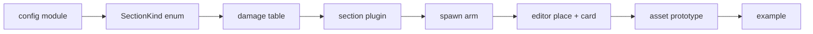

# Add a ship section

Ship-section kinds are a CLOSED enum. There is no data-driven registry for
them: `SectionKind` (`crates/nova_gameplay/src/sections/base_section.rs`) is a
Rust enum, every match on it is exhaustive, and the compiler will not let you
land a new variant until every site handles it. Adding a kind is a fixed
sequence of ~10 edits across the gameplay, scenario, editor, and assets crates,
ending at a runnable example.

## Why it is closed

Section kinds are first-class engine concepts, not content. Each kind carries
its own typed config, its own spawn bundle, its own behavior systems, and its
own row in the damage-resistance table -- none of which a RON author could
supply. What IS data-extensible is the section CATALOG: a `SectionConfig`
(base stats + one `SectionKind` instance) is authored in RON and loaded at
runtime (see the [Ship sections](../sections/) reference and
[modding](../modding-ron/)). New KINDS are code; new INSTANCES of an existing
kind are data. This guide is about the former.

The closed enum is a feature: it means "did I wire the new kind into damage /
the editor / spawning?" is a compile error, not a silent gap.



## Checklist

Do these in order. Steps 2-7 will not compile until the ones before them exist,
and the exhaustive matches force you through 3-7 once the enum has the variant.

Replace `<kind>` / `<Kind>` below with your section name (e.g. `shield` /
`Shield`).

1. **New config module.**
   Create `crates/nova_gameplay/src/sections/<kind>_section.rs`, modelled on
   `hull_section.rs` (simplest) or `turret_section.rs` (behavior + FixedUpdate
   systems). It defines: a `<Kind>SectionConfig` struct, a `<kind>_section`
   bundle fn, a `<Kind>SectionMarker` component, a `<Kind>SectionPlugin`, and a
   `prelude` re-exporting them. The bundle MUST insert the marker and the
   `SectionDamageClass` for the kind:

   ```rust
   pub fn shield_section(config: ShieldSectionConfig) -> impl Bundle {
       (
           ShieldSectionMarker,
           SectionDamageClass::Shield,
           // ... kind-specific render/behavior components
       )
   }
   ```

   Then register the module in `crates/nova_gameplay/src/sections/mod.rs`: add
   `pub mod <kind>_section;` and re-export `<kind>_section::prelude::*` in the
   module `prelude`.

2. **Add the enum variant.**
   In `crates/nova_gameplay/src/sections/base_section.rs`, add the variant to
   `SectionKind` (grep for `enum SectionKind`):

   ```rust
   pub enum SectionKind {
       Hull(HullSectionConfig),
       Thruster(ThrusterSectionConfig),
       Controller(ControllerSectionConfig),
       Turret(TurretSectionConfig),
       Torpedo(TorpedoSectionConfig),
       Shield(ShieldSectionConfig),
   }
   ```

3. **Damage class + resistance rows.**
   In `crates/nova_gameplay/src/damage.rs`:
   - Add the variant to `SectionDamageClass` (grep for `enum SectionDamageClass`).
   - Add one resistance row to EACH non-Kinetic group in `resistance()`
     (grep for `fn resistance`): the `ArmorPiercing`, `Emp`, and `Explosive`
     blocks. Kinetic
     needs nothing -- the `(_, Kinetic) => 1.0` wildcard already covers every
     class.

   ```rust
   (Shield, ArmorPiercing) => 1.0,
   // ...
   (Shield, Emp)           => 2.0,
   // ...
   (Shield, Explosive)     => 0.75,
   ```

   Because `resistance()` matches on `(class, kind)` exhaustively, a missing
   cell is a compile error -- you cannot forget one. Also add the new class to
   the `SectionDamageClass` array in this file's tests
   (`kinetic_resistance_is_one_on_every_section` iterates it).

4. **Wire the section plugin.**
   In `crates/nova_gameplay/src/sections/mod.rs`, add your plugin to the
   `add_plugins((...))` tuple in `SpaceshipSectionPlugin::build` (grep for
   `impl Plugin for SpaceshipSectionPlugin`),
   passing the `render` flag like the others:

   ```rust
   <kind>_section::ShieldSectionPlugin {
       render: self.render,
   },
   ```

5. **Spawn arm.**
   In `crates/nova_scenario/src/objects/spaceship.rs`, add a match arm to
   `insert_spaceship_sections` (grep for it, then its `match &config.kind`). At
   minimum insert the kind bundle; add input-binding / infinite-ammo handling
   only if your kind needs it (see the `Turret` / `Thruster` arms for those
   patterns):

   ```rust
   SectionKind::Shield(shield_config) => {
       section_entity.insert(shield_section(shield_config.clone()));
   }
   ```

   This is the production spawn path; see the [Scenario engine](../scenario-system/)
   for how the spaceship object and its section observer fit together.

6. **Editor placement arm.**
   In `crates/nova_editor/src/placement.rs`, add a `SectionKind::Shield(..)`
   arm to the `match &section.kind` in the placement handler (grep for
   `match &section.kind` in `placement.rs` - it is the one in the placement
   handler, not the hull/controller preview arms above it). Spawn
   a `preview_section(...) + <kind>_section(...)` child and record a
   `SpaceshipSectionConfig` in `player_config.sections`, modelling the `Hull`
   arm (no input binding) or the `Thruster` arm (rotation from surface normal +
   key/pad binding) as appropriate.

7. **Editor card tint + glyph.**
   In `crates/nova_editor/src/ui/card.rs`, add an arm to BOTH `kind_tint()`
   (grep for `fn kind_tint`) and `kind_glyph()` (grep for `fn kind_glyph`) --
   both match `SectionKind`
   exhaustively:

   ```rust
   // kind_tint
   SectionKind::Shield(_) => Color::srgb_u8(120, 200, 180),
   // kind_glyph  (pick an unused letter; H T C U B are taken)
   SectionKind::Shield(_) => "S",
   ```

8. **Asset prototype.**
   In `crates/nova_assets/src/sections.rs`, add a `SectionConfig` to the
   `build_sections()` vec (grep for `fn build_sections`) so the catalog ships a
   ready-to-place
   instance. Give it a stable snake_case `id` (this is what
   `sections.get_section("...")` and RON authors reference):

   ```rust
   SectionConfig {
       base: BaseSectionConfig {
           id: "basic_shield_section".to_string(),
           name: "Basic Shield Section".to_string(),
           description: "A basic shield section for spaceships.".to_string(),
           mass: 1.0,
           health: 100.0,
       },
       kind: SectionKind::Shield(ShieldSectionConfig { /* ... */ }),
   },
   ```

   If your config needs a render-mesh `AssetRef`, add a field to
   `SectionMeshRefs` and its `from_paths()` alongside the existing ones.

9. **Example.**
   Add `examples/NN_<kind>_section.rs`, modelled on the per-section examples
   (`01_controller_section.rs` ... `05_torpedo_section.rs`; `03_hull_section.rs`
   is the smallest). Note 01-05 are the section slots and are taken, as are
   06-18 -- use the next free number. The example builds a minimal
   `ScenarioConfig` (a controller + your section), triggers
   `LoadScenario(...)`, and under `--features debug` drives an autopilot probe
   that asserts the kind's behavior end to end. Run it:

   ```text
   BCS_AUTOPILOT=1 cargo run --example NN_<kind>_section --features debug
   ```

## Done

The compiler is your checklist enforcer for 2-7: if it builds, every
exhaustive match handles the new kind. Steps 1, 8, and 9 are the ones with no
compile-time backstop -- the module wiring, the catalog instance, and the
runnable proof -- so double-check those by hand.
