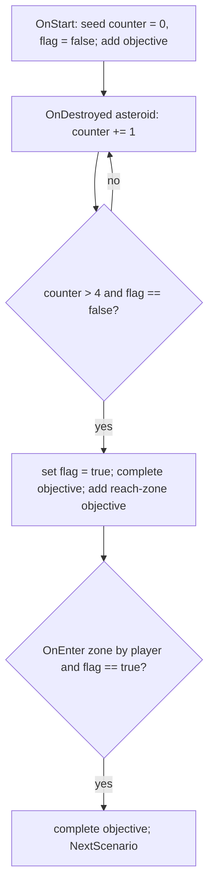

# Author a scenario (RON)

A how-to for content authors. You will build a working scenario out of
primitives that already ship - events, filters, actions, variables - writing
only RON, no Rust. If you need a NEW event/filter/action/object kind that does
not exist yet, that is a Rust change: see
[Extend the scenario engine](../guide-extend-scenarios/). For the runtime this
data feeds and the full type list, see the [Scenario engine](../scenario-system/)
reference.

Every snippet below is copied from a shipped scenario
(`assets/base/scenarios/*.content.ron`) or the code that parses it
(`crates/nova_scenario/src/`). Field names are load-bearing - the loader uses
strict RON, so a typo'd field is a load error, not a silent default.

## 1. The file shape

A scenario lives in a `*.content.ron` file. The file is a LIST of content
items; a scenario is one `Scenario((...))` item (a `Content` newtype):

```ron
[
    Scenario((
        id: "menu_ambience",
        name: "Menu Ambience",
        description: "The main menu's living backdrop.",
        cubemap: "textures/cubemap.png",
        events: [
            // one ScenarioEventConfig per handler ...
        ],
    )),
]
```

The `ScenarioConfig` fields (`loader.rs`):

- `id` - unique scenario id, the key other scenarios switch to (`NextScenario`).
- `name`, `description` - display strings.
- `cubemap` - skybox image, authored as a bare asset-path string (an
  `AssetRef`; resolved to a handle at load time).
- `thumbnail` (optional) - an image path shown in the main-menu Scenarios
  picker's details pane. Authored exactly like `cubemap` but wrapped in the
  `Option` variant (strict RON, never bare): `thumbnail: Some("banner.png")`.
  Omit it for no thumbnail. It MUST be a plain 2D image - NOT a skybox cubemap
  (a cubemap is a Cube texture the UI cannot bind; the picker skips a non-2D
  thumbnail with a warning rather than crashing). Point it at a regular
  screenshot/art PNG, not the `cubemap` path.
- `hidden` (optional, default `false`) - when `true`, the scenario is kept out
  of the Scenarios picker (the menu backdrop, mid-story continuations reached
  only via `NextScenario`). Author as `hidden: true`; omit it to be listed.
- `menu_backdrop` (optional, default `false`) - when `true`, the scenario
  joins the main menu's BACKDROP ROTATION: on every menu entry the game picks
  one flagged scenario at random, so several ambience scenes (base or
  mod-added) can share the slot. Backdrops normally also set `hidden: true`
  (the flags are orthogonal: `menu_backdrop` opts INTO the menu rotation,
  `hidden` opts OUT of the picker). For the cinematic camera framing, include
  a gravity-well object with entity id `menu_planetoid` (see the base
  `menu_ambience` scenario); without one the menu falls back to your
  scenario's own camera pose after a short grace period.
- `events` - the list of handlers. May be empty (`events: []`), but then
  nothing happens.

Lint your content before shipping it: `cargo run -p nova_assets --bin
content_lint` checks what the loaders cannot - section prototype ids,
`NextScenario` targets, filter/action target ids, duplicate object ids
(these all resolve at SPAWN time, so a typo loads green and misbehaves
in-game). CI runs the same checks; an Error fails the build.

The same checks run in-game when mods merge: a scenario with Error-level
findings REFUSES to start - the player sees a FAILED TO START report
naming each problem (instead of a silently half-spawned scene), and a
broken menu backdrop is skipped by the backdrop rotation. Fix the
findings and re-enable the mod.

One file can hold several content items (sections, more scenarios). This guide
covers the scenario item; a file that is just one scenario is fine.

## 2. Event -> filters -> actions

Each entry in `events` is a `ScenarioEventConfig`: an event `name`, an optional
`filters` list, an optional `actions` list. When the event fires, EVERY filter
must pass; then the actions run in order.

```ron
(
    name: OnDestroyed,
    filters: [
        Entity((
            type_name: Some("asteroid"),
        )),
    ],
    actions: [
        VariableSet((
            key: "asteroids_destroyed",
            expression: Add(
                Factor(Name("asteroids_destroyed")),
                Term(Factor(Literal(Number(1.0)))),
            ),
        )),
    ],
)
```

`filters` and `actions` both default to empty and can be omitted. An
`OnStart` handler with no filters just runs its actions once on load.

The event `name` is one of these kinds (`events.rs`):

| `name`         | Fires when |
|----------------|------------|
| `OnStart`      | once, right after the scenario loads |
| `OnUpdate`     | every frame while the scenario is live |
| `OnDestroyed`  | an entity is destroyed |
| `OnEnter`      | a body enters an area / zone / beacon / crate |
| `OnExit`       | a body leaves an area |
| `OnOrbit`      | a ship has held an autopilot ORBIT around a well for 5s (recurs every 5s) |
| `OnTravelLock` | the player's TRAVEL lock lands on a scenario object (recurs every 5s while held) |
| `OnCombatLock` | same, for the player's COMBAT lock |

The pair events (`OnEnter`/`OnExit`/`OnOrbit`/`OnTravelLock`/`OnCombatLock`)
carry two entities - a subject (`id`) and an other party (`other_id`); which is
which is per-event (see the table under [Entity](#entity)). The 5s recurrence on
the orbit/lock events is deliberate: gate those handlers on a variable so the
repeats are harmless no-ops (see section 6).

## 3. Filters

Three filter kinds (`filters.rs`).

### Entity

Match on the entities the event carries. An event has up to two participants: a
PRIMARY entity - the event's subject, matched by `id` / `type_name` - and an
OTHER party, matched by `other_id` / `other_type_name`. Which entity is the
subject and which is the other party depends on the event kind:

| Event | `id` / `type_name` (subject) | `other_id` / `other_type_name` (other party) |
|---|---|---|
| `OnDestroyed` | the destroyed object | (none) |
| `OnEnter` / `OnExit` | the area / zone / beacon / crate entered or left | the body that entered or left it |
| `OnOrbit` | the well being orbited | the orbiting ship |
| `OnTravelLock` / `OnCombatLock` | the locked target | the locking ship (the player) |

(`OnStart` and `OnUpdate` carry no entity, so an `Entity` filter never matches
them.) So for `OnEnter` the classic pairing is "area entered by ship": `id` is
the area, `other_id` is the ship. Not every event fills every field - `OnEnter` /
`OnExit` carry the area's `id` but not its `type_name`, and `OnDestroyed` has no
other party - and a filter on an unfilled field simply never matches, so only
constrain the fields the event actually provides.

Each of the four fields is optional; every SET field must match and omitted
fields are unconstrained. `id: Some("beacon_1")` alone means "the beacon_1
area"; adding `other_id` narrows it to a specific entrant:

```ron
Entity((
    id: Some("beacon_1"),                // the area that was entered ...
    other_id: Some("player_spaceship"),  // ... entered by the player ship
)),
```

`type_name` / `other_type_name` match the object KIND instead of a specific id
(`type_name: Some("asteroid")` is any asteroid). An `Entity(())` with no fields
set matches any event that carries entity data.

These fields only GATE the handler - they are read for filtering, never passed
to actions. An action cannot say "spawn at the entity that entered"; it acts on
its own configured target. Use `id` / `other_id` to decide WHETHER a handler
runs, then have its actions address entities by their known scenario ids.

### Expression

Evaluate a variable condition; pass when it is true. The single tuple field is
a `VariableConditionNode` (section 5):

```ron
Expression((Equal(
    Term(Factor(Name("objective_destroy_asteroids"))),
    Term(Factor(Literal(Boolean(true)))),
))),
```

### Conditional

Combine other filters: `Not`, `And`, `Or`. Each holds boxed filter(s):

```ron
Conditional(Not(Entity((
    id: Some("player_spaceship"),
)))),
```

```ron
Conditional(And(
    Entity((type_name: Some("asteroid"))),
    Expression((GreaterThan(
        Term(Factor(Name("asteroids_destroyed"))),
        Term(Factor(Literal(Number(4.0)))),
    ))),
)),
```

Note: multiple entries in the `filters` list are already ANDed together (all
must pass), so you only need `Conditional(And(...))` to nest inside another
combinator or an `Or`.

## 4. Actions

The common actions, with real RON. Every action is a newtype variant -
`Name((field: value, ...))` - even single-field ones.

### SpawnScenarioObject

Spawn an object. `base` is shared (`id`, `name`, `position` as an xyz tuple,
`rotation` as an xyzw quaternion tuple); `kind` selects the object:

```ron
SpawnScenarioObject((
    base: (
        id: "asteroid_grav",
        name: "Gravity Rock",
        position: (250.0, 0.0, 0.0),
        rotation: (0.0, 0.0, 0.0, 1.0),
    ),
    kind: Asteroid((
        radius: 20.0,
        texture: "textures/asteroid.png",
        health: 2000.0,
        surface_gravity: Some(6.0),
        invulnerable: true,
    )),
)),
```

A beacon (its own `OnEnter` trigger when `area_radius` is set; `color` is a
tagged `Srgba`):

```ron
SpawnScenarioObject((
    base: (
        id: "beacon_1",
        name: "BEACON 1",
        position: (0.0, 0.0, -350.0),
        rotation: (0.0, 0.0, 0.0, 1.0),
    ),
    kind: Beacon((
        label: "BEACON 1",
        radius: 2.0,
        color: Srgba((red: 0.3, green: 0.9, blue: 1.0, alpha: 1.0)),
        area_radius: Some(70.0),
    )),
)),
```

Object kinds also include `Spaceship` and `SalvageCrate`; ships inline a whole
section list and are verbose to hand-author (see the sharp edges in section 8,
and [Ship sections (internals)](../sections/)). A ship's side is authorable:
omit `allegiance` and the controller decides (Player ships fight for the
player, AI ships are hostile), or override it for bystanders - in strict RON
the `Option` keeps its variant, `allegiance: Some(Neutral)` (Broadside's
drifting hauler: no AI targets it, but stray blast damage still hurts it).

### ScatterObjects

Spawn `count` templated objects at deterministic random positions in a region
(`Box { min, max }` or `Ring { inner, outer, y_min, y_max }`). `seed` fixes the
layout so it is identical every load:

```ron
ScatterObjects((
    id_prefix: "asteroid_",
    count: 20,
    seed: 433757350076153856,
    region: Box(
        min: (-100.0, -20.0, -100.0),
        max: (100.0, 20.0, 100.0),
    ),
    template: (
        base: (
            id: "asteroid_",
            name: "Asteroid",
            position: (0.0, 0.0, 0.0),
            rotation: (0.0, 0.0, 0.0, 1.0),
        ),
        kind: Asteroid((
            radius: 1.0,
            texture: "textures/asteroid.png",
            health: 100.0,
            invulnerable: false,
        )),
    ),
    asteroid_radius: Some((1.0, 3.0)),
)),
```

`asteroid_radius: Some((lo, hi))` randomizes each asteroid's radius in that
range; use `None` (or omit) to keep the template radius.

### VariableSet

Evaluate an expression and store it under `key` (section 5):

```ron
VariableSet((
    key: "asteroids_destroyed",
    expression: Term(Factor(Literal(Number(0.0)))),
)),
```

### Objective / ObjectiveComplete

Add or complete a HUD objective by id:

```ron
Objective((
    id: "destroy_asteroids",
    message: "Objective: Destroy 5 asteroids!",
)),
```

```ron
ObjectiveComplete((
    id: "destroy_asteroids",
)),
```

Re-adding the same id with a new `message` updates the text in place (the
shakedown uses this for its "recovered N/3" tally).

### StoryMessage

Speaker-attributed story text, rendered by the HUD comms panel
(bottom-left) as `SPEAKER > text` for about eight seconds; a new line
replaces the previous one and rewinds the clock. This is the dialog
surface for story content - objectives state goals, comms lines carry
voice. Scenario-scoped like every event-world effect: teardown clears the
log, so lines never leak into the next scenario or the menu.

```ron
StoryMessage((
    speaker: "Foreman Okono",
    text: "Strip it clean, Kestrel. Quota's quota.",
)),
```

### ObjectiveMarkerAttach / ObjectiveMarkerDetach

Add or remove the gold marker chip (label + distance) on a scoped object by id.
A despawned target detaches implicitly.

```ron
ObjectiveMarkerAttach((
    target_id: "beacon_1",
    label: "BEACON 1",
)),
```

```ron
ObjectiveMarkerDetach((
    target_id: "beacon_1",
)),
```

### HintEmphasisSet / HintEmphasisClear

Pulse one keybind-hint row gold. `verb` is a row name (the shakedown uses
`"RADAR"`, `"GOTO"`); an unknown verb warns and does nothing.

```ron
HintEmphasisSet((
    verb: "RADAR",
)),
```

```ron
HintEmphasisClear((
    verb: "RADAR",
)),
```

### SetSpeedCap

Install (`Some(cap)`) or remove (omit / `None`) the manual speed cap on a
scoped ship by id. The shakedown spawns the player with `speed_cap: Some(25.0)`
and releases it at beacon 1:

```ron
SetSpeedCap((
    id: "player_spaceship",
)),
```

### SetControllerVerb

Enable or disable one flight verb (`Goto` / `Lock` / `Orbit`; `Stop` also
exists but is never withheld, so an engaged autopilot can always be stopped) on
a scoped ship's controller by id. The shakedown withholds verbs on the ship's controller
section (`DisableVerb(Goto)`) and re-grants them as the tutorial advances:

```ron
SetControllerVerb((
    id: "player_spaceship",
    verb: Goto,
    enabled: true,
)),
```

### CreateScenarioArea

Spawn a spherical sensor zone that drives `OnEnter`/`OnExit`:

```ron
CreateScenarioArea((
    id: "asteroid_zone",
    name: "Asteroid Zone",
    position: (0.0, 0.0, -100.0),
    rotation: (0.0, 0.0, 0.0, 1.0),
    radius: 10.0,
)),
```

### DespawnScenarioObject

Despawn the scoped object whose id matches (e.g. a salvage crate on pickup):

```ron
DespawnScenarioObject((
    id: "crate_1",
)),
```

### NextScenario

Queue a switch to another scenario by id. `linger: true` holds on the current
scene until the player confirms (Enter, or the outcome overlay's
Continue/Retry button), then switches:

```ron
NextScenario((
    scenario_id: "asteroid_next",
    linger: true,
)),
```

### Outcome

Declare the scenario's win/lose: shows the outcome overlay (gold VICTORY or
red DEFEAT banner, your optional message, and buttons). Presentation only -
compose the consequence next to it: queue a lingering `NextScenario` and the
overlay offers Continue (Victory) or Retry (Defeat); queue nothing and it
offers only Main Menu. Two authoring rules: the switch must LINGER - an
instant `NextScenario` (`linger: false`) tears the scenario down the same
frame and swallows the outcome before it can show - and note the strict-RON
`Option`: the message keeps its `Some(...)` variant, never a bare string.

```ron
// A lose beat: declare Defeat, queue the retry.
Outcome((
    outcome: Defeat,
    message: Some("Your ship broke apart in the belt."),
)),
NextScenario((
    scenario_id: "my_scenario",
    linger: true,
)),
```

### DebugMessage

Log a message (debug builds). Useful while iterating:

```ron
DebugMessage((
    message: "Objective Complete: Destroyed 5 asteroids!",
)),
```

Other actions exist for photo mode and modding hooks (`SetCamera`,
`Screenshot`, `SetSkybox`); see the reference. This guide sticks to the
mission-scripting set.

## 5. Variables and expressions

Variables are typed literals (`variables.rs`):

- `Number(f64)` - `Literal(Number(5.0))`
- `String(String)` - `Literal(String("hello"))`
- `Boolean(bool)` - `Literal(Boolean(true))`

They live in an expression tree. Reading from the leaf up:

- `VariableFactorNode`: `Literal(<literal>)`, `Name("var")` (read a variable),
  or `Parens(<expression>)`.
- `VariableTermNode`: `Factor(<factor>)`, `Multiply(<factor>, <term>)`,
  `Divide(<factor>, <term>)`.
- `VariableExpressionNode`: `Term(<term>)`, `Add(<term>, <expression>)`,
  `Subtract(<term>, <expression>)`.
- `VariableConditionNode` (for `Expression` filters, yields a bool):
  `LessThan(<expr>, <expr>)`, `GreaterThan(<expr>, <expr>)`,
  `Equal(<expr>, <expr>)`.

So the simplest "the number zero" as an EXPRESSION is the full chain down to a
literal:

```ron
Term(Factor(Literal(Number(0.0))))
```

Read a variable:

```ron
Term(Factor(Name("asteroids_destroyed")))
```

Increment (note `Add` takes a term on the left, an expression on the right):

```ron
Add(
    Factor(Name("asteroids_destroyed")),
    Term(Factor(Literal(Number(1.0)))),
)
```

A comparison, as used inside an `Expression` filter:

```ron
GreaterThan(
    Term(Factor(Name("asteroids_destroyed"))),
    Term(Factor(Literal(Number(4.0)))),
)
```

Type rules from the evaluator: `Add`/`Multiply` also act on `Boolean`
(logical OR / AND) and `Add` concatenates `String`; comparisons need matching
types (`LessThan`/`GreaterThan` are numbers only). A `Name` that was never set,
or a type mismatch, logs an error and the filter/action fails safe rather than
crashing.

## 6. Worked example: an objective loop

This mirrors `asteroid_field.content.ron`: seed a counter on start, count
destroyed asteroids, complete an objective once the count crosses a threshold,
then reach a zone to advance to the next scenario.



Handler 1 - seed the state on load:

```ron
(
    name: OnStart,
    actions: [
        VariableSet((
            key: "asteroids_destroyed",
            expression: Term(Factor(Literal(Number(0.0)))),
        )),
        VariableSet((
            key: "objective_destroy_asteroids",
            expression: Term(Factor(Literal(Boolean(false)))),
        )),
        Objective((
            id: "destroy_asteroids",
            message: "Objective: Destroy 5 asteroids!",
        )),
    ],
),
```

Handler 2 - every destroyed asteroid bumps the counter:

```ron
(
    name: OnDestroyed,
    filters: [
        Entity((
            type_name: Some("asteroid"),
        )),
    ],
    actions: [
        VariableSet((
            key: "asteroids_destroyed",
            expression: Add(
                Factor(Name("asteroids_destroyed")),
                Term(Factor(Literal(Number(1.0)))),
            ),
        )),
    ],
),
```

Handler 3 - the gate. Two expression filters: the count is past 4 AND the
objective is not yet done (so this runs exactly once):

```ron
(
    name: OnDestroyed,
    filters: [
        Entity((
            type_name: Some("asteroid"),
        )),
        Expression((GreaterThan(
            Term(Factor(Name("asteroids_destroyed"))),
            Term(Factor(Literal(Number(4.0)))),
        ))),
        Expression((Equal(
            Term(Factor(Name("objective_destroy_asteroids"))),
            Term(Factor(Literal(Boolean(false)))),
        ))),
    ],
    actions: [
        VariableSet((
            key: "objective_destroy_asteroids",
            expression: Term(Factor(Literal(Boolean(true)))),
        )),
        ObjectiveComplete((
            id: "destroy_asteroids",
        )),
        Objective((
            id: "reach_zone",
            message: "Objective: Reach the safe zone!",
        )),
    ],
),
```

The `flag == false` filter is what stops handler 3 from re-firing on the 6th,
7th, ... kill: it sets the flag true on its one run, and every later kill fails
the filter. This is the standard idiom for a one-shot gate on a recurring
event.

Handler 4 - reach the zone (spawn `asteroid_zone` with `CreateScenarioArea` on
start too) and advance. The `flag == true` filter keeps the switch from firing
before the objective is done:

```ron
(
    name: OnEnter,
    filters: [
        Entity((
            id: Some("asteroid_zone"),
            other_id: Some("player_spaceship"),
        )),
        Expression((Equal(
            Term(Factor(Name("objective_destroy_asteroids"))),
            Term(Factor(Literal(Boolean(true)))),
        ))),
    ],
    actions: [
        ObjectiveComplete((
            id: "reach_zone",
        )),
        NextScenario((
            scenario_id: "asteroid_next",
            linger: true,
        )),
    ],
),
```

For a longer chain, the shakedown uses a single numeric `beat` counter instead
of per-step booleans: every handler filters on `Equal(beat, N)` and bumps
`beat` to `N+1`, so the script is one linear state machine. That pattern scales
better than a flag per objective. Handler order within one event is not
load-bearing - gate on the variable, not on position.

### The whole file, assembled

Here is the objective loop above as one runnable `*.content.ron` file. It is
ship-free on purpose (see the ship-verbosity note in section 8), so you can read
every line: it scatters asteroids, seeds the counter, gates the objective, and
advances through a zone. Drop it at
`assets/base/scenarios/my_scenario.content.ron`, list it in the base bundle, and
load it per section 7.

```ron
[
    Scenario((
        id: "my_scenario",
        name: "My Scenario",
        description: "A starter objective loop: clear the field, reach the zone.",
        cubemap: "textures/cubemap.png",
        events: [
            // Seed the world and the objective state, once, on load.
            (
                name: OnStart,
                actions: [
                    ScatterObjects((
                        id_prefix: "asteroid_",
                        count: 20,
                        seed: 433757350076153856,
                        region: Box(
                            min: (-100.0, -20.0, -100.0),
                            max: (100.0, 20.0, 100.0),
                        ),
                        template: (
                            base: (
                                id: "asteroid_",
                                name: "Asteroid",
                                position: (0.0, 0.0, 0.0),
                                rotation: (0.0, 0.0, 0.0, 1.0),
                            ),
                            kind: Asteroid((
                                radius: 1.0,
                                texture: "textures/asteroid.png",
                                health: 100.0,
                                invulnerable: false,
                            )),
                        ),
                        asteroid_radius: Some((1.0, 3.0)),
                    )),
                    CreateScenarioArea((
                        id: "safe_zone",
                        name: "Safe Zone",
                        position: (0.0, 0.0, -100.0),
                        rotation: (0.0, 0.0, 0.0, 1.0),
                        radius: 10.0,
                    )),
                    VariableSet((
                        key: "asteroids_destroyed",
                        expression: Term(Factor(Literal(Number(0.0)))),
                    )),
                    VariableSet((
                        key: "objective_destroy_asteroids",
                        expression: Term(Factor(Literal(Boolean(false)))),
                    )),
                    Objective((
                        id: "destroy_asteroids",
                        message: "Objective: Destroy 5 asteroids!",
                    )),
                ],
            ),
            // Every destroyed asteroid bumps the counter.
            (
                name: OnDestroyed,
                filters: [
                    Entity((
                        type_name: Some("asteroid"),
                    )),
                ],
                actions: [
                    VariableSet((
                        key: "asteroids_destroyed",
                        expression: Add(
                            Factor(Name("asteroids_destroyed")),
                            Term(Factor(Literal(Number(1.0)))),
                        ),
                    )),
                ],
            ),
            // The one-shot gate: past 4 kills AND not yet done.
            (
                name: OnDestroyed,
                filters: [
                    Entity((
                        type_name: Some("asteroid"),
                    )),
                    Expression((GreaterThan(
                        Term(Factor(Name("asteroids_destroyed"))),
                        Term(Factor(Literal(Number(4.0)))),
                    ))),
                    Expression((Equal(
                        Term(Factor(Name("objective_destroy_asteroids"))),
                        Term(Factor(Literal(Boolean(false)))),
                    ))),
                ],
                actions: [
                    VariableSet((
                        key: "objective_destroy_asteroids",
                        expression: Term(Factor(Literal(Boolean(true)))),
                    )),
                    ObjectiveComplete((
                        id: "destroy_asteroids",
                    )),
                    Objective((
                        id: "reach_zone",
                        message: "Objective: Reach the safe zone!",
                    )),
                ],
            ),
            // Reach the zone once the field is cleared, then advance.
            (
                name: OnEnter,
                filters: [
                    Entity((
                        id: Some("safe_zone"),
                        other_id: Some("player_spaceship"),
                    )),
                    Expression((Equal(
                        Term(Factor(Name("objective_destroy_asteroids"))),
                        Term(Factor(Literal(Boolean(true)))),
                    ))),
                ],
                actions: [
                    ObjectiveComplete((
                        id: "reach_zone",
                    )),
                    NextScenario((
                        scenario_id: "asteroid_next",
                        linger: true,
                    )),
                ],
            ),
        ],
    )),
]
```

This scenario spawns no ship of its own, so it relies on `player_spaceship`
being the id the runtime spawns for the player. For a self-contained file that
also spawns its own ships, clone the full shipped example -
`assets/base/scenarios/asteroid_field.content.ron` - which is this same loop
plus the `Spaceship` object blocks (verbose, so copy rather than type them; see
section 8). Its `player_spaceship` block is the one to lift verbatim.

## 7. Load and test it

A scenario only reaches the game as MOD CONTENT - it has to be listed in a
bundle and merged by the loader. There is no standalone "run this file" mode, so
testing means getting it in front of the loader and playing it. Loading and
shipping a scenario is the same job as any other mod content, so this section is
the short version of [Make & publish a mod](../guide-make-a-mod/) - read that for
the full bundle/catalog/portal detail.

### Iterate locally

The base game is itself a mod (`assets/base/base.bundle.ron`) and is always
enabled, so the quickest loop is to add your file to it:

1. Drop the file at `assets/base/scenarios/my_scenario.content.ron`.
2. Add its path to the base bundle's `content` list:

```ron
(
    content: [
        // ...the shipped scenarios...
        "scenarios/my_scenario.content.ron",
    ],
    meta: (name: "Base Game", ...),
)
```

3. `cargo run`. The loader merges every enabled bundle into `GameScenarios`,
   keyed by scenario `id`, so yours is now registered.

### Launch it

There are three ways to reach a scenario you authored. The first is pure RON and
needs no Rust:

1. THE SCENARIOS PICKER (no Rust, the primary route). Every `!hidden` scenario
   in `GameScenarios` - base plus every enabled mod - is listed in the main
   menu's Scenarios picker; its Play button launches the selected id. So the
   full no-Rust chain is: author your scenario as a `Scenario((...))` item in a
   mod's `*.content.ron` (or the base bundle while iterating), enable that mod
   from the Mods menu (its scenarios merge into `GameScenarios`), open Scenarios
   from the main menu, pick your row, and hit Play. Leave `hidden` off (it
   defaults to listed) so the picker shows it; set `hidden: true` only for
   mid-story continuations reached by `NextScenario`.
2. CHAIN IN FROM ANOTHER SCENARIO. A running scenario hands off with a
   `NextScenario` action (section 4), the way `asteroid_field` chains to
   `asteroid_next`. Use this to string scenarios into a campaign, or to reach a
   `hidden` continuation the picker deliberately omits.
3. MAKE IT THE DEFAULT NEW GAME. `NEW_GAME_SCENARIO_ID` in
   `crates/nova_menu/src/lib.rs` is the scenario the New Game button plays. Point
   it at your id (one line of Rust) if you want your scenario to BE the New Game
   start, rather than one pick among many in the picker.

While iterating, sprinkle `DebugMessage` actions and run with `--features dev` to
watch each event fire as you play, then edit, re-run, repeat.

### Ship it to other players

Once it works, do NOT leave it in the base bundle - package it as its OWN mod
(its own folder, `*.bundle.ron`, and catalog entry), and optionally publish it to
the portal so others can install it. The whole flow - bundle layout, local
install, the `nova_portal_gen` publish step, and what a player sees - is
[Make & publish a mod](../guide-make-a-mod/). The two guides are two halves of
one job: THIS page is the scenario grammar; that one is how the file becomes an
installable mod.

(The `examples/08_scenario.rs` smoke test builds its `ScenarioConfig` in Rust,
not RON - it exercises the engine grammar for contributors, not an authored
file, so it is not a way to test your own scenario.)

## 8. Sharp edges

- Asset paths (`cubemap`, `texture`) are hand-typed strings with no validation
  until load; a wrong path resolves to a broken handle. There is no visual
  editor yet.
- Reaching your scenario: the main-menu Scenarios picker lists every `!hidden`
  scenario and launches the one you pick, so a mod scenario is playable with no
  Rust once its mod is enabled. A `hidden` scenario stays off the picker and is
  reached only by a `NextScenario` chain; making yours the New Game default is
  the `NEW_GAME_SCENARIO_ID` one-liner (see section 7).
- The loader uses STRICT RON: an unknown or misspelled field is a hard parse
  error, and enum variants must use the newtype form -
  `Asteroid((...))`, `DebugMessage((...))`, `Objective((...))` - double parens
  even for one field. `Color` is tagged: `Srgba((red: .., ...))`. `Quat` is a
  bare 4-tuple; `Vec3` a bare 3-tuple. `Option` fields need `Some(x)`, never a
  bare value (`icon: Some("icon.png")`, not `icon: "icon.png"`).
- Ships inline their entire section catalog, so a scenario with a couple of
  ships runs to hundreds of lines. If you are hand-authoring, copy a ship block
  from a shipped scenario rather than typing it out, or generate the file by
  serializing a code-built config (`ron::ser::to_string_pretty`). See the
  authoring-verbosity note in [RON scenario/mod format](../modding-ron/).
- Pair events (`OnEnter`, `OnOrbit`, the locks) recur every 5s while the
  condition holds. Always gate their handlers on a variable so the repeat runs
  are no-ops, or you will re-fire actions.
- Referencing an entity id before it is spawned (an `ObjectiveMarkerAttach`
  ahead of its `SpawnScenarioObject` in a different handler) warns and does
  nothing. Spawn first.
