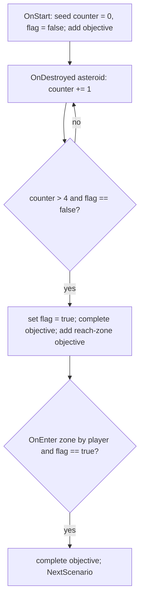

# Author a scenario (RON)

A how-to for content authors. You will build a working scenario out of
primitives that already ship - events, filters, actions, variables - writing
only RON, no Rust. If you need a NEW event/filter/action/object kind that does
not exist yet, that is a Rust change: see
[Extend the scenario engine](../guide-extend-scenarios/). For the runtime this
data feeds and the full type list, see the [Scenario engine](../scenario-system/)
reference.

Every snippet below is copied from a shipped scenario
(`assets/base/scenarios/*.content.ron`) or the code that parses it
(`crates/nova_scenario/src/`). Field names are load-bearing - the loader uses
strict RON, so a typo'd field is a load error, not a silent default.

## 1. The file shape

A scenario lives in a `*.content.ron` file. The file is a LIST of content
items; a scenario is one `Scenario((...))` item (a `Content` newtype):

```ron
[
    Scenario((
        id: "menu_ambience",
        name: "Menu Ambience",
        description: "The main menu's living backdrop.",
        cubemap: "textures/cubemap.png",
        events: [
            // one ScenarioEventConfig per handler ...
        ],
    )),
]
```

The five `ScenarioConfig` fields (`loader.rs`):

- `id` - unique scenario id, the key other scenarios switch to (`NextScenario`).
- `name`, `description` - display strings.
- `cubemap` - skybox image, authored as a bare asset-path string (an
  `AssetRef`; resolved to a handle at load time).
- `events` - the list of handlers. May be empty (`events: []`), but then
  nothing happens.

One file can hold several content items (sections, more scenarios). This guide
covers the scenario item; a file that is just one scenario is fine.

## 2. Event -> filters -> actions

Each entry in `events` is a `ScenarioEventConfig`: an event `name`, an optional
`filters` list, an optional `actions` list. When the event fires, EVERY filter
must pass; then the actions run in order.

```ron
(
    name: OnDestroyed,
    filters: [
        Entity((
            type_name: Some("asteroid"),
        )),
    ],
    actions: [
        VariableSet((
            key: "asteroids_destroyed",
            expression: Add(
                Factor(Name("asteroids_destroyed")),
                Term(Factor(Literal(Number(1.0)))),
            ),
        )),
    ],
)
```

`filters` and `actions` both default to empty and can be omitted. An
`OnStart` handler with no filters just runs its actions once on load.

The event `name` is one of these kinds (`events.rs`):

| `name`         | Fires when |
|----------------|------------|
| `OnStart`      | once, right after the scenario loads |
| `OnUpdate`     | every frame while the scenario is live |
| `OnDestroyed`  | an entity is destroyed |
| `OnEnter`      | a body enters an area / zone / beacon / crate |
| `OnExit`       | a body leaves an area |
| `OnOrbit`      | a ship has held an autopilot ORBIT around a well for 5s (recurs every 5s) |
| `OnTravelLock` | the player's TRAVEL lock lands on a scenario object (recurs every 5s while held) |
| `OnCombatLock` | same, for the player's COMBAT lock |

For the pair events (`OnEnter`/`OnExit`/`OnOrbit`/`OnTravelLock`/`OnCombatLock`)
the filter `id` is the area/well/target and `other_id` is the ship, so they all
filter identically. The 5s recurrence is deliberate: gate these handlers on a
variable so the repeats are harmless no-ops (see section 6).

## 3. Filters

Three filter kinds (`filters.rs`).

### Entity

Match the entity ids/types on the event. Each of the four fields is optional
and every SET field must match:

```ron
Entity((
    id: Some("player_spaceship"),
)),
```

```ron
Entity((
    id: Some("beacon_1"),
    other_id: Some("player_spaceship"),
)),
```

Fields: `id`, `type_name`, `other_id`, `other_type_name`. Omit a field to
leave it unconstrained. An `Entity(())` with no fields set matches any event
that carries entity data.

### Expression

Evaluate a variable condition; pass when it is true. The single tuple field is
a `VariableConditionNode` (section 5):

```ron
Expression((Equal(
    Term(Factor(Name("objective_destroy_asteroids"))),
    Term(Factor(Literal(Boolean(true)))),
))),
```

### Conditional

Combine other filters: `Not`, `And`, `Or`. Each holds boxed filter(s):

```ron
Conditional(Not(Entity((
    id: Some("player_spaceship"),
)))),
```

```ron
Conditional(And(
    Entity((type_name: Some("asteroid"))),
    Expression((GreaterThan(
        Term(Factor(Name("asteroids_destroyed"))),
        Term(Factor(Literal(Number(4.0)))),
    ))),
)),
```

Note: multiple entries in the `filters` list are already ANDed together (all
must pass), so you only need `Conditional(And(...))` to nest inside another
combinator or an `Or`.

## 4. Actions

The common actions, with real RON. Every action is a newtype variant -
`Name((field: value, ...))` - even single-field ones.

### SpawnScenarioObject

Spawn an object. `base` is shared (`id`, `name`, `position` as an xyz tuple,
`rotation` as an xyzw quaternion tuple); `kind` selects the object:

```ron
SpawnScenarioObject((
    base: (
        id: "asteroid_grav",
        name: "Gravity Rock",
        position: (250.0, 0.0, 0.0),
        rotation: (0.0, 0.0, 0.0, 1.0),
    ),
    kind: Asteroid((
        radius: 20.0,
        texture: "textures/asteroid.png",
        health: 2000.0,
        surface_gravity: Some(6.0),
        invulnerable: true,
    )),
)),
```

A beacon (its own `OnEnter` trigger when `area_radius` is set; `color` is a
tagged `Srgba`):

```ron
SpawnScenarioObject((
    base: (
        id: "beacon_1",
        name: "BEACON 1",
        position: (0.0, 0.0, -350.0),
        rotation: (0.0, 0.0, 0.0, 1.0),
    ),
    kind: Beacon((
        label: "BEACON 1",
        radius: 2.0,
        color: Srgba((red: 0.3, green: 0.9, blue: 1.0, alpha: 1.0)),
        area_radius: Some(70.0),
    )),
)),
```

Object kinds also include `Spaceship` and `SalvageCrate`; ships inline a whole
section list and are verbose to hand-author (see the sharp edges in section 8,
and [Ship sections (internals)](../sections/)).

### ScatterObjects

Spawn `count` templated objects at deterministic random positions in a region
(`Box { min, max }` or `Ring { inner, outer, y_min, y_max }`). `seed` fixes the
layout so it is identical every load:

```ron
ScatterObjects((
    id_prefix: "asteroid_",
    count: 20,
    seed: 433757350076153856,
    region: Box(
        min: (-100.0, -20.0, -100.0),
        max: (100.0, 20.0, 100.0),
    ),
    template: (
        base: (
            id: "asteroid_",
            name: "Asteroid",
            position: (0.0, 0.0, 0.0),
            rotation: (0.0, 0.0, 0.0, 1.0),
        ),
        kind: Asteroid((
            radius: 1.0,
            texture: "textures/asteroid.png",
            health: 100.0,
            invulnerable: false,
        )),
    ),
    asteroid_radius: Some((1.0, 3.0)),
)),
```

`asteroid_radius: Some((lo, hi))` randomizes each asteroid's radius in that
range; use `None` (or omit) to keep the template radius.

### VariableSet

Evaluate an expression and store it under `key` (section 5):

```ron
VariableSet((
    key: "asteroids_destroyed",
    expression: Term(Factor(Literal(Number(0.0)))),
)),
```

### Objective / ObjectiveComplete

Add or complete a HUD objective by id:

```ron
Objective((
    id: "destroy_asteroids",
    message: "Objective: Destroy 5 asteroids!",
)),
```

```ron
ObjectiveComplete((
    id: "destroy_asteroids",
)),
```

Re-adding the same id with a new `message` updates the text in place (the
shakedown uses this for its "recovered N/3" tally).

### ObjectiveMarkerAttach / ObjectiveMarkerDetach

Add or remove the gold marker chip (label + distance) on a scoped object by id.
A despawned target detaches implicitly.

```ron
ObjectiveMarkerAttach((
    target_id: "beacon_1",
    label: "BEACON 1",
)),
```

```ron
ObjectiveMarkerDetach((
    target_id: "beacon_1",
)),
```

### HintEmphasisSet / HintEmphasisClear

Pulse one keybind-hint row gold. `verb` is a row name (the shakedown uses
`"RADAR"`, `"GOTO"`); an unknown verb warns and does nothing.

```ron
HintEmphasisSet((
    verb: "RADAR",
)),
```

```ron
HintEmphasisClear((
    verb: "RADAR",
)),
```

### SetSpeedCap

Install (`Some(cap)`) or remove (omit / `None`) the manual speed cap on a
scoped ship by id. The shakedown spawns the player with `speed_cap: Some(25.0)`
and releases it at beacon 1:

```ron
SetSpeedCap((
    id: "player_spaceship",
)),
```

### SetControllerVerb

Enable or disable one flight verb (`Goto` / `Lock` / `Orbit`; `Stop` also
exists but is never withheld, so an engaged autopilot can always be stopped) on
a scoped ship's controller by id. The shakedown withholds verbs on the ship's controller
section (`DisableVerb(Goto)`) and re-grants them as the tutorial advances:

```ron
SetControllerVerb((
    id: "player_spaceship",
    verb: Goto,
    enabled: true,
)),
```

### CreateScenarioArea

Spawn a spherical sensor zone that drives `OnEnter`/`OnExit`:

```ron
CreateScenarioArea((
    id: "asteroid_zone",
    name: "Asteroid Zone",
    position: (0.0, 0.0, -100.0),
    rotation: (0.0, 0.0, 0.0, 1.0),
    radius: 10.0,
)),
```

### DespawnScenarioObject

Despawn the scoped object whose id matches (e.g. a salvage crate on pickup):

```ron
DespawnScenarioObject((
    id: "crate_1",
)),
```

### NextScenario

Queue a switch to another scenario by id. `linger: true` holds on the current
scene until the player presses Enter, then switches (used for the death /
"press to continue" beat):

```ron
NextScenario((
    scenario_id: "asteroid_next",
    linger: true,
)),
```

### DebugMessage

Log a message (debug builds). Useful while iterating:

```ron
DebugMessage((
    message: "Objective Complete: Destroyed 5 asteroids!",
)),
```

Other actions exist for photo mode and modding hooks (`SetCamera`,
`Screenshot`, `SetSkybox`); see the reference. This guide sticks to the
mission-scripting set.

## 5. Variables and expressions

Variables are typed literals (`variables.rs`):

- `Number(f64)` - `Literal(Number(5.0))`
- `String(String)` - `Literal(String("hello"))`
- `Boolean(bool)` - `Literal(Boolean(true))`

They live in an expression tree. Reading from the leaf up:

- `VariableFactorNode`: `Literal(<literal>)`, `Name("var")` (read a variable),
  or `Parens(<expression>)`.
- `VariableTermNode`: `Factor(<factor>)`, `Multiply(<factor>, <term>)`,
  `Divide(<factor>, <term>)`.
- `VariableExpressionNode`: `Term(<term>)`, `Add(<term>, <expression>)`,
  `Subtract(<term>, <expression>)`.
- `VariableConditionNode` (for `Expression` filters, yields a bool):
  `LessThan(<expr>, <expr>)`, `GreaterThan(<expr>, <expr>)`,
  `Equal(<expr>, <expr>)`.

So the simplest "the number zero" as an EXPRESSION is the full chain down to a
literal:

```ron
Term(Factor(Literal(Number(0.0))))
```

Read a variable:

```ron
Term(Factor(Name("asteroids_destroyed")))
```

Increment (note `Add` takes a term on the left, an expression on the right):

```ron
Add(
    Factor(Name("asteroids_destroyed")),
    Term(Factor(Literal(Number(1.0)))),
)
```

A comparison, as used inside an `Expression` filter:

```ron
GreaterThan(
    Term(Factor(Name("asteroids_destroyed"))),
    Term(Factor(Literal(Number(4.0)))),
)
```

Type rules from the evaluator: `Add`/`Multiply` also act on `Boolean`
(logical OR / AND) and `Add` concatenates `String`; comparisons need matching
types (`LessThan`/`GreaterThan` are numbers only). A `Name` that was never set,
or a type mismatch, logs an error and the filter/action fails safe rather than
crashing.

## 6. Worked example: an objective loop

This mirrors `asteroid_field.content.ron`: seed a counter on start, count
destroyed asteroids, complete an objective once the count crosses a threshold,
then reach a zone to advance to the next scenario.



Handler 1 - seed the state on load:

```ron
(
    name: OnStart,
    actions: [
        VariableSet((
            key: "asteroids_destroyed",
            expression: Term(Factor(Literal(Number(0.0)))),
        )),
        VariableSet((
            key: "objective_destroy_asteroids",
            expression: Term(Factor(Literal(Boolean(false)))),
        )),
        Objective((
            id: "destroy_asteroids",
            message: "Objective: Destroy 5 asteroids!",
        )),
    ],
),
```

Handler 2 - every destroyed asteroid bumps the counter:

```ron
(
    name: OnDestroyed,
    filters: [
        Entity((
            type_name: Some("asteroid"),
        )),
    ],
    actions: [
        VariableSet((
            key: "asteroids_destroyed",
            expression: Add(
                Factor(Name("asteroids_destroyed")),
                Term(Factor(Literal(Number(1.0)))),
            ),
        )),
    ],
),
```

Handler 3 - the gate. Two expression filters: the count is past 4 AND the
objective is not yet done (so this runs exactly once):

```ron
(
    name: OnDestroyed,
    filters: [
        Entity((
            type_name: Some("asteroid"),
        )),
        Expression((GreaterThan(
            Term(Factor(Name("asteroids_destroyed"))),
            Term(Factor(Literal(Number(4.0)))),
        ))),
        Expression((Equal(
            Term(Factor(Name("objective_destroy_asteroids"))),
            Term(Factor(Literal(Boolean(false)))),
        ))),
    ],
    actions: [
        VariableSet((
            key: "objective_destroy_asteroids",
            expression: Term(Factor(Literal(Boolean(true)))),
        )),
        ObjectiveComplete((
            id: "destroy_asteroids",
        )),
        Objective((
            id: "reach_zone",
            message: "Objective: Reach the safe zone!",
        )),
    ],
),
```

The `flag == false` filter is what stops handler 3 from re-firing on the 6th,
7th, ... kill: it sets the flag true on its one run, and every later kill fails
the filter. This is the standard idiom for a one-shot gate on a recurring
event.

Handler 4 - reach the zone (spawn `asteroid_zone` with `CreateScenarioArea` on
start too) and advance. The `flag == true` filter keeps the switch from firing
before the objective is done:

```ron
(
    name: OnEnter,
    filters: [
        Entity((
            id: Some("asteroid_zone"),
            other_id: Some("player_spaceship"),
        )),
        Expression((Equal(
            Term(Factor(Name("objective_destroy_asteroids"))),
            Term(Factor(Literal(Boolean(true)))),
        ))),
    ],
    actions: [
        ObjectiveComplete((
            id: "reach_zone",
        )),
        NextScenario((
            scenario_id: "asteroid_next",
            linger: true,
        )),
    ],
),
```

For a longer chain, the shakedown uses a single numeric `beat` counter instead
of per-step booleans: every handler filters on `Equal(beat, N)` and bumps
`beat` to `N+1`, so the script is one linear state machine. That pattern scales
better than a flag per objective. Handler order within one event is not
load-bearing - gate on the variable, not on position.

## 7. Load and test it

Two ways to get your file in front of the engine.

### Ship it as mod content

Put the file at `assets/base/scenarios/my_scenario.content.ron` (or in your own
mod's folder) and list it in the bundle's `content`:

```ron
(
    content: [
        "scenarios/my_scenario.content.ron",
    ],
    meta: ( name: "My Mod" ),
)
```

The loader merges every enabled bundle's content into `GameScenarios` keyed by
scenario `id`. To make a fresh mod folder, its bundle, and its catalog entry,
follow [Make & publish a mod](../guide-make-a-mod/). Once merged you can load
it by id from the New Game / scenario menu, or with
`commands.trigger(LoadScenario(cfg.clone()))` in code.

### Exercise it headless

The `examples/08_scenario.rs` harness builds a scenario, loads it, and asserts
the whole grammar ticks (variables seeded, filters gating, expressions
advancing a beat) under the autopilot smoke test. It builds its config in code,
but it is the reference for what "loaded and running" looks like and is the
fastest way to confirm an event/filter/action chain behaves. Run it (needs a
display):

```text
BCS_AUTOPILOT=1 cargo run --example 08_scenario --features debug
```

Look for `scenario probe: handlers, filters and expressions all ticked`.

## 8. Sharp edges

- Asset paths (`cubemap`, `texture`) are hand-typed strings with no validation
  until load; a wrong path resolves to a broken handle. There is no visual
  editor yet.
- The loader uses STRICT RON: an unknown or misspelled field is a hard parse
  error, and enum variants must use the newtype form -
  `Asteroid((...))`, `DebugMessage((...))`, `Objective((...))` - double parens
  even for one field. `Color` is tagged: `Srgba((red: .., ...))`. `Quat` is a
  bare 4-tuple; `Vec3` a bare 3-tuple. `Option` fields need `Some(x)`, never a
  bare value (`icon: Some("icon.png")`, not `icon: "icon.png"`).
- Ships inline their entire section catalog, so a scenario with a couple of
  ships runs to hundreds of lines. If you are hand-authoring, copy a ship block
  from a shipped scenario rather than typing it out, or generate the file by
  serializing a code-built config (`ron::ser::to_string_pretty`). See the
  authoring-verbosity note in [RON scenario/mod format](../modding-ron/).
- Pair events (`OnEnter`, `OnOrbit`, the locks) recur every 5s while the
  condition holds. Always gate their handlers on a variable so the repeat runs
  are no-ops, or you will re-fire actions.
- Referencing an entity id before it is spawned (an `ObjectiveMarkerAttach`
  ahead of its `SpawnScenarioObject` in a different handler) warns and does
  nothing. Spawn first.
