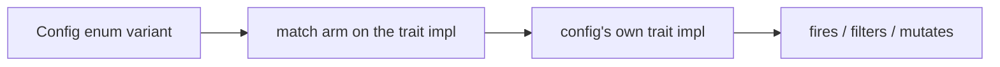

# Extend the scenario engine

The scenario engine is config-open but code-closed. Authoring a scenario in RON
from the primitives that already exist is a data change and lives in its own
guide (see [Author a scenario](../guide-author-scenario/)). Adding a NEW
primitive - a new event, filter, action, or object kind - is a Rust change, and
each of the four follows one repeated recipe: define the config, wire it into
the matching dispatch enum, add the arm on the trait impl that fans out to it,
and export it. This is the "how to add" companion to
[Scenario engine](../scenario-system/) (the "what it is" reference); read that
first for the vocabulary (`NovaEventWorld`, handlers, filters, actions, scoped
objects).

The dispatch shape is identical everywhere: an enum variant carries a config
struct, a `match` arm on the trait impl delegates to that config's own impl.



## The NovaEventWorld seam

Read this once; recipes 2 and 3 depend on it. Filters and actions never touch
the Bevy `World` directly. They see only `NovaEventWorld`
(`crates/nova_scenario/src/world.rs`), the resource that holds scenario state:
variables, objectives, `next_scenario`, and a queue of deferred command
closures. What a filter or action may touch:

- `world.get_variable(key)` / `world.insert_variable(key, VariableLiteral)` -
  the typed scenario variables.
- `world.push_objective(ObjectiveActionConfig)` /
  `world.remove_objective(id)` - HUD objectives (synced write-on-diff into
  `GameObjectives`).
- `world.next_scenario = Some(NextScenarioActionConfig { .. })` - queue a
  scenario switch.
- `world.push_command(|commands| ...)` - defer anything that needs real world
  access (spawning, querying entities, resource mutation). The closure gets a
  `&mut Commands`; for a full `&mut World` (id -> Entity lookups) queue a
  `commands.queue(move |world: &mut World| ...)` inside it, the shape
  `DespawnScenarioObjectActionConfig` uses.

Nothing runs against the world synchronously. Each frame
`NovaEventWorld::state_to_world_system` (in `world.rs`) syncs objectives into
`GameObjectives`, runs a queued non-lingering `NextScenario` switch, then drains
the command queue - so every `push_command` closure lands at frame end, in
order. The unit tests in `actions.rs` exercise exactly this: mutate a
`NovaEventWorld`, call `NovaEventWorld::state_to_world_system(&mut world)` to
drain, then assert on the world (see `despawn_action_removes_the_scoped_object_by_id`).

## Recipe 1: add an event kind

An event is fired somewhere in the engine, and scenarios react to it through a
handler. Adding one is two files: the event type (`nova_events`) and its config
variant (`nova_scenario`), plus the firing site.

1. In `crates/nova_events/src/lib.rs` define the marker event and its info
   struct with the `EventKind` derive. The info is what a handler's filters
   read; give it the pair shape (`id`, `other_id`, `other_type_name`) if it
   targets an object so the `Entity` filter composes like the others.

   ```rust
   #[derive(Debug, Clone, EventKind, Reflect)]
   #[event_name("ondocked")]
   #[event_info(OnDockedEventInfo)]
   pub struct OnDockedEvent;

   #[derive(Debug, Clone, serde::Serialize, serde::Deserialize, Default, Reflect)]
   pub struct OnDockedEventInfo {
       #[serde(rename = "id")]
       pub id: String,
       #[serde(rename = "other_id")]
       pub other_id: String,
       #[serde(rename = "other_type_name")]
       pub other_type_name: String,
   }
   ```

   Export both from the `nova_events` prelude (the `pub use super::{...}` block
   at the top of `lib.rs`).

2. In `crates/nova_scenario/src/events.rs` add the variant to `EventConfig`
   (~line 13) and the arm to `impl From<EventConfig> for EventHandler<NovaEventWorld>`
   (~line 34):

   ```rust
   pub enum EventConfig {
       // ...
       OnDocked,
   }

   // in the From match:
   EventConfig::OnDocked => EventHandler::new::<OnDockedEvent>(),
   ```

3. Fire it. Engine-driven events fire from `crates/nova_scenario/src/loader.rs`
   with `commands.fire::<OnDockedEvent>(OnDockedEventInfo { .. })` (see the
   `OnStart`/`OnUpdate`/`OnOrbit`/lock sites there); object-local events (an
   area entering/leaving) fire from the object's own observer, the way
   `objects/asteroid.rs` fires `OnDestroyedEvent` from `on_asteroid_node_destroyed`.

`EventConfig` is `Copy` and derives serde, so the new variant is authorable from
RON with no extra work.

## Recipe 2: add an event filter

A filter gates whether a handler's actions run; all filters on a handler must
pass. Everything lives in `crates/nova_scenario/src/filters.rs`.

1. Define the config struct and its `EventFilter<NovaEventWorld>` impl. `filter`
   returns a bool and may read `world` (variables) and `info` (the fired event
   data); it must not mutate.

   ```rust
   #[derive(Clone, Debug)]
   #[cfg_attr(feature = "serde", derive(serde::Serialize, serde::Deserialize))]
   pub struct VariablePresentFilterConfig {
       pub key: String,
   }

   impl EventFilter<NovaEventWorld> for VariablePresentFilterConfig {
       fn filter(&self, world: &NovaEventWorld, _: &GameEventInfo) -> bool {
           world.get_variable(&self.key).is_some()
       }
   }
   ```

2. Add the variant to `EventFilterConfig` (~line 15) and the arm to
   `impl EventFilter<NovaEventWorld> for EventFilterConfig` (~line 23):

   ```rust
   pub enum EventFilterConfig {
       Entity(EntityFilterConfig),
       Conditional(ConditionalFilterConfig),
       Expression(ExpressionFilterConfig),
       VariablePresent(VariablePresentFilterConfig),
   }

   // in the filter match:
   EventFilterConfig::VariablePresent(config) => config.filter(world, info),
   ```

3. Export the config struct from the module `prelude` (the `pub use super::{...}`
   block at the top of `filters.rs`).

## Recipe 3: add an event action

An action runs when a handler passes, in order. Everything lives in
`crates/nova_scenario/src/actions.rs`.

1. Define the config struct and its `EventAction<NovaEventWorld>` impl.
   `fn action(&self, world: &mut NovaEventWorld, info: &GameEventInfo)` mutates
   the seam and nothing else - use `world.insert_variable`, `world.push_objective`,
   `world.next_scenario`, or `world.push_command(...)` for world access. Anything
   needing an id -> Entity lookup queues a `commands.queue(move |world: &mut World| ...)`
   inside the pushed command, scoped with `With<ScenarioScopedMarker>` (a raw id
   match would also hit ship sections that carry `EntityId`).

   ```rust
   #[derive(Clone, Debug)]
   #[cfg_attr(feature = "serde", derive(serde::Serialize, serde::Deserialize))]
   pub struct VariableClearActionConfig {
       pub key: String,
   }

   impl EventAction<NovaEventWorld> for VariableClearActionConfig {
       fn action(&self, world: &mut NovaEventWorld, _: &GameEventInfo) {
           world.insert_variable(self.key.clone(), VariableLiteral::Boolean(false));
       }
   }
   ```

2. Add the variant to `EventActionConfig` (~line 27) and the arm to
   `impl EventAction<NovaEventWorld> for EventActionConfig` (~line 52):

   ```rust
   pub enum EventActionConfig {
       // ...
       VariableClear(VariableClearActionConfig),
   }

   // in the action match:
   EventActionConfig::VariableClear(config) => {
       config.action(world, info);
   }
   ```

3. Export the config struct from the `actions.rs` `prelude` block.

Templates: the tests at the bottom of `actions.rs` are the pattern to copy -
`despawn_action_removes_the_scoped_object_by_id` (queued world lookup, scoped),
`hint_emphasis_actions_drive_the_resource` (resource mutation through the drain),
`objective_marker_attach_and_detach_drive_the_component` (component insert/remove).
Each fires the action into a `NovaEventWorld`, drains with
`NovaEventWorld::state_to_world_system`, then asserts.

## Recipe 4: add a scenario object kind

A scenario object is a scoped, interpolated, dynamic body spawned by
`SpawnScenarioObject`. Model it on `crates/nova_scenario/src/objects/asteroid.rs`.

1. Create `crates/nova_scenario/src/objects/<kind>.rs`. It holds a config struct,
   a type-name const, a marker component, a `<kind>_scenario_object(config) -> impl Bundle`
   builder, and (optionally) a `Plugin` for any observers/systems the kind needs.
   The bundle carries the marker plus an `EntityTypeName`; the shared
   `base_scenario_object` (id, name, transform, `RigidBody::Dynamic`,
   `TransformInterpolation`, visibility, `ScenarioScopedMarker`) is added by the
   spawn path, not here.

   ```rust
   pub const MINE_TYPE_NAME: &str = "mine";

   #[derive(Component, Clone, Debug, Reflect)]
   pub struct MineMarker;

   #[derive(Clone, Debug)]
   #[cfg_attr(feature = "serde", derive(serde::Serialize, serde::Deserialize))]
   pub struct MineConfig {
       pub radius: f32,
       pub damage: f32,
   }

   pub fn mine_scenario_object(config: MineConfig) -> impl Bundle {
       (
           MineMarker,
           EntityTypeName::new(MINE_TYPE_NAME),
           // ... the kind's own components
       )
   }

   pub mod prelude {
       pub use super::{mine_scenario_object, MineConfig, MineMarker, MINE_TYPE_NAME};
   }
   ```

2. Register the module in `crates/nova_scenario/src/objects/mod.rs`: add
   `pub mod <kind>;`, re-export `<kind>::prelude::*` from the `mod.rs` prelude,
   and if the kind has a plugin add it in `ScenarioObjectsPlugin::build` (like
   `AsteroidPlugin`, which takes `render`).

3. In `crates/nova_scenario/src/actions.rs` add the variant to
   `ScenarioObjectKind` (~line 1667) and the spawn arm in
   `impl EventAction<NovaEventWorld> for ScenarioObjectConfig`:

   ```rust
   pub enum ScenarioObjectKind {
       Asteroid(AsteroidConfig),
       Spaceship(SpaceshipConfig),
       Beacon(BeaconConfig),
       SalvageCrate(SalvageCrateConfig),
       Mine(MineConfig),
   }

   // in the spawn match:
   ScenarioObjectKind::Mine(config) => {
       entity_commands.insert(mine_scenario_object(config.clone()));
   }
   ```

The new kind is now spawnable from any handler, in RON, as a
`SpawnScenarioObject` action:

```ron
SpawnScenarioObject(ScenarioObjectConfig(
    base: BaseScenarioObjectConfig(
        id: "mine_1",
        name: "Proximity Mine",
        position: (0.0, 0.0, -200.0),
        rotation: (0.0, 0.0, 0.0, 1.0),
    ),
    kind: Mine(MineConfig(radius: 5.0, damage: 40.0)),
))
```

## Checklist

Whichever recipe you follow, the change is done when: the config struct derives
`Clone`, `Debug`, and the serde pair; the dispatch enum has the variant; the
trait impl has the delegating arm; the type is exported from its module prelude;
and (for an event) something fires it. Then it is reachable both from code-built
scenarios and from a RON data file.
