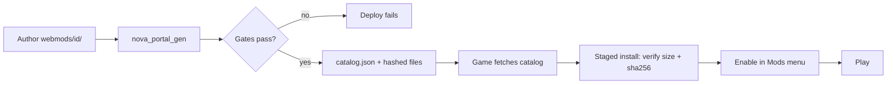

# Make and publish a mod

Task-oriented walkthrough: build a mod, test it locally, and publish it to the
static mod portal. For the data-model reference behind these steps, see
[Modding data format (RON)](../modding-ron/) and [Mod portal](../mod-portal/).

A mod is the same folder-bundle shape as the base game. The shipped demo mod
(`assets/mods/demo/`) is the copy-me example; the first portal mod
(`webmods/gauntlet/`) is the copy-me publish example.

A mod's content is `Scenario` and `Section` items. If you have not authored those
yet, write them first with the two authoring guides -
[Author a scenario](../guide-author-scenario/) for the `Scenario` grammar and
[Author a section](../guide-author-section/) for the `Section` (ship-part)
grammar - then come back here to package and ship them. The demo mod below leads
with a `Section` overlay, so the section guide is the one that explains its
`base`/`kind` shape.

## 1. Bundle anatomy

A mod is a DIRECTORY containing:

- one `<id>.bundle.ron` manifest (a `BundleManifest`: `content` list + `meta`),
- one or more `*.content.ron` files it lists (a `[Content]` list of
  `Section((..))` / `Scenario((..))` items).

Start by copying `assets/mods/demo/`. Its manifest:

```ron
(
    content: ["mod.content.ron"],
    meta: (
        name: "Demo Mod",
        description: "Example mod: up-armors a hull section and adds an arena scenario.",
        author: "Nova Protocol",
        version: "1.0.0",
    ),
)
```

`content` paths are relative to the manifest's OWN directory, so the folder is
self-contained and relocatable. Every `meta` field is optional and
serde-defaulted, so a bare `(content: [...])` manifest still loads (the menu
then falls back to the catalog id as the name) - but the portal will not
publish a mod without a non-empty `name` and `version` (step 4). `dependencies`
is a list of mod ids; `base` is an IMPLICIT dependency and is never declared.
`icon` is an `Option`, so write `icon: Some("icon.png")`, not `icon:
"icon.png"`.

Lint your mod while you work: `cargo run -p nova_assets --bin
content_lint -- --target path/to/your-mod` (or an in-repo id like
`--target the-ledger`) checks just your bundle - section prototype ids
against the base catalog and your declared dependencies, scenario chain
targets, filter/action target ids, duplicate object ids. An Error means
the game would refuse the scenario at runtime; fix it before publishing.

A manifest may also declare `new_game_scenario: Some("<scenario id>")` - the
scenario New Game launches - but it is HONORED ONLY from the base game's own
bundle: the merge warns and ignores it on any other bundle, so a mod cannot
redirect the New Game start. Mods influence the menu through the Scenarios
picker and the `menu_backdrop` scenario flag instead (see the scenario
authoring guide).

A content file is a `[Content]` list. Each item is externally tagged by kind:

```ron
[
    Section((
        base: (
            id: "reinforced_hull_section",
            name: "Reinforced Hull Section (Demo Mod)",
            description: "Base hull, up-armored by the demo mod.",
            mass: 1.0,
            health: 400.0,
        ),
        kind: Hull((
            render_mesh: Some("gltf/hull-01.glb#Scene0"),
        )),
    )),
    Scenario((
        id: "demo_mod_arena",
        name: "Demo Mod Arena",
        description: "A shooting gallery added by the demo mod: destroy the three derelict rocks.",
        cubemap: "textures/cubemap.png",
        // OnStart spawns the player ship + three destructible asteroids and a
        // `destroyed` counter; a per-target OnDestroyed increments it and a
        // one-shot OnUpdate (destroyed > 2) completes the objective. See
        // "Author a scenario" for the full event/action grammar.
        events: [ /* ... */ ],
    )),
]
```

One file may mix `Section` and `Scenario` items. For the `Section` `base`/`kind`
fields, see [Author a section](../guide-author-section/); for the scenario
event/action shapes, see [Author a scenario](../guide-author-scenario/).

### The stemmed-extension rule (load-bearing)

The manifest MUST be named `<id>.bundle.ron` (e.g. `demo.bundle.ron`), NEVER a
bare `bundle.ron`. Bevy resolves an untyped load (how `bevy_asset_loader` kicks
off collection fields) by the file's FULL extension - everything after the
FIRST dot. `bundle.ron` yields the bare `ron` extension, which no loader is
registered for, so the load fails in-game with "Could not find an asset
loader"; `demo.bundle.ron` yields `bundle.ron`, which matches. The same rule
applies to `<name>.content.ron` and `<name>.catalog.ron`.

## 2. Overlay semantics

Bundles merge in load order (base first, then mods in catalog order), by
`merge_bundles`. Content overlays by id:

- SAME id as the base (or an earlier bundle) = REPLACE. A mod `Section` /
  `Scenario` with an existing id wins (last-wins across bundles). This is how a
  mod re-skins or rebalances base content.
- NEW id = ADD, alongside everything else.
- SAME id twice WITHIN one bundle = a conflict: the FIRST item is kept, the
  duplicate is skipped, and a message is recorded and logged (not a panic).

The demo content does both: it reuses `reinforced_hull_section` (replace) and
introduces `demo_mod_arena` (add) - a small but playable shooting gallery, so
the example doubles as a worked scenario, not just an overlay demo.

## 3. Test it locally

Register the mod in the installed catalog `assets/mods.catalog.ron`, a thin
ordered pointer list (`base` first so mods overlay it):

```ron
(mods: [
    (
        id: "base",
        bundle: "base/base.bundle.ron",
        base: true,
    ),
    (
        id: "demo",
        bundle: "mods/demo/demo.bundle.ron",
    ),
])
```

Each `ModEntry` is `id` (enable key + overlay namespace), `bundle` (the
manifest path, ASSET-ROOT-relative), `base` (default false; the locked-on base
game), `hidden` (default false; a dev/tooling mod kept out of the player-facing
list but still installable by id). Run the game and enable the mod from the
main-menu Mods section (or add its id to `EnabledMods`).

For an automated rig, see the integration tests in
`crates/nova_assets/tests/`: `mod_cache_install.rs` installs the real gauntlet
mod into a temp cache and drives the production merge wiring; `portal_install.rs`
does the full fetch-verify-install-enable-uninstall loop.

## 4. Publish to the portal

Portal mods live under the repo-root `webmods/<id>/`, OUTSIDE `assets/`, so they
never ship inside the game build. The directory name IS the id. Copy the
gauntlet mod as a template:

```ron
(
    content: ["gauntlet.content.ron"],
    meta: (
        name: "Gauntlet Run",
        description: "A slalom race: fly your ship through the beacon gates in order, START to FINISH.",
        author: "Nova Protocol",
        version: "1.0.0",
    ),
)
```

Run the generator (engine-free, no bevy, builds in seconds):

```sh
cargo run --release -p nova_portal_gen -- \
    --source webmods --shipped assets/mods.catalog.ron --out site/mods
```

`--source` is the mod-sources directory, `--shipped` is the game's installed
catalog (for the no-shadow check), `--out` is where the portal tree is written.

The validation gates (any failure exits non-zero and fails the deploy):

- `id` is lowercase ascii letters, digits and `-` only (it is a directory name
  and a URL segment).
- exactly one `*.bundle.ron` at the mod root is the entry point (a nested
  `*.bundle.ron` is treated as a plain data file).
- `meta.name` and `meta.version` are non-empty (trimmed).
- every listed content file is a MEMBER of the mod directory's file set (a
  missing, escaping `../`, or non-slash-normalized path is rejected).
- no id shadows a SHIPPED catalog id (a portal mod must not shadow an installed
  one).
- every declared dependency resolves within the portal + shipped set (`base` is
  implicit and shipped, so declaring it resolves too).
- at least one mod is found (an empty portal is a broken invocation, not a
  publish).

It emits a deterministic tree (entries sorted by id, files by path):

```text
<out>/catalog.json                 # PortalCatalog (JSON, schema-versioned)
<out>/<id>/<version>/<files...>    # every file of the mod, verbatim copy
```

Each `catalog.json` entry carries per-file `size` + `sha256` (the client
verifies these on download). Whether the content actually LOADS is checked by
the `webmods_validation` integration test
(`crates/nova_assets/tests/webmods_validation.rs`), which drives every
`webmods/` bundle through the real bevy loaders to a recursive `Loaded` on CI -
the deep half of the publish gate. To publish: add `webmods/<id>/`, run
`cargo test -p nova_portal_gen` and `cargo test -p nova_assets --test
webmods_validation` (or let CI), and land on master; the next deploy publishes.

## 5. What the player sees

Briefly (the flow lives in [Mod portal](../mod-portal/)): the game fetches
`catalog.json`, the player installs a mod (files downloaded sequentially, each
verified against the catalog's `size` + `sha256`, committed files-first then
index-last only after all verify), then enables it from the Mods menu and
plays. A downloaded mod loads and merges exactly like a shipped one.

## Lifecycle



## Sharp edges (today)

- Asset references (meshes, cubemaps, textures) are hand-typed path strings; a
  typo is not caught until spawn.
- `version` is an opaque string - no semver comparison, no update detection.
- No scenario editor and no in-game schema reference: content is authored by
  hand against these examples.
- No install timeout or cancel yet: a stalled download blocks its install job.
