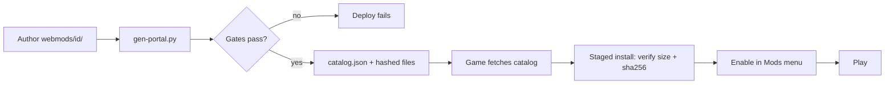

# Make and publish a mod

Task-oriented walkthrough: build a mod, test it locally, and publish it to the
static mod portal. For the data-model reference behind these steps, see
[Modding data format (RON)](../modding-ron/) and [Mod portal](../mod-portal/).

A mod is the same folder-bundle shape as the base game. The shipped example mod
(`assets/mods/example/`) is the copy-me example - one self-contained tutorial mod
that does a little of everything (a section overlay, a new section, a playable
scenario, its own skybox and texture, and a menu backdrop). The first portal mod
(`webmods/gauntlet/`) is the copy-me publish example.

A mod's content is `Scenario` and `Section` items. If you have not authored those
yet, write them first with the two authoring guides -
[Author a scenario](../guide-author-scenario/) for the `Scenario` grammar and
[Author a section](../guide-author-section/) for the `Section` (ship-part)
grammar - then come back here to package and ship them. The example mod below leads
with a `Section` overlay, so the section guide is the one that explains its
`base`/`kind` shape.

## 1. Bundle anatomy

A mod is a DIRECTORY containing:

- one `<id>.bundle.ron` manifest (a `BundleManifest`: `content` list + `meta`,
  and an optional `resources` list of binary files it ships),
- one or more `*.content.ron` files it lists (a `[Content]` list of
  `Section((..))` / `Scenario((..))` items),
- optionally, the binary assets it ships (textures, skyboxes, models, audio)
  under the folder, declared in `resources` and referenced with `self://`.

Start by copying `assets/mods/example/`. Its manifest:

```ron
(
    content: ["example.content.ron"],
    resources: [
        "textures/nebula.png",
        "textures/rock.png",
    ],
    meta: (
        name: "Example Mod",
        description: "The copy-me tutorial mod: a section overlay, a new section, a playable arena, mod-shipped art, and a menu backdrop - a little of everything.",
        author: "Nova Protocol",
        version: "1.0.0",
        dependencies: ["base"],
    ),
)
```

`content` paths are relative to the manifest's OWN directory, so the folder is
self-contained and relocatable. Every `meta` field is optional and
serde-defaulted, so a bare `(content: [...])` manifest still loads (the menu
then falls back to the catalog id as the name) - but the portal will not
publish a mod without a non-empty `name` and `version` (step 4). `dependencies`
is a list of mod ids; `base` is an IMPLICIT dependency and is never declared.
`icon` is an `Option`, so write `icon: Some("icon.png")`, not `icon:
"icon.png"`.

#### Versioning your mod

The loader accepts ANY non-empty `version` string - it is an opaque token, not
a parsed semver (there is no comparison and no update detection in code today).
The convention the shipped portal mods follow is semver-ish, so a reader can
tell a release apart at a glance:

- content rework (new/rebalanced sections or scenarios, changed dependencies) ->
  bump the MINOR, e.g. `1.1.0`;
- a reskin or bug fix that does not change what content exists -> bump the PATCH,
  e.g. `1.0.1`.

Gauntlet has walked `1.0.0 -> 1.1.0 -> 1.2.0` and The Ledger `1.0.0 -> 1.10.0`
this way.

`version` matters even though nothing parses it. The portal publishes each
release under `<id>/<version>/`, so the string is how a republish is
distinguished from the one before it (the update the player sees), and it is the
anchor a changelog entry associates with. FORGETTING to bump on a republish is
the silent failure: the new bytes land under the same `<version>` directory and
the update is indistinguishable from the old one. Because of that a mod's test
may PIN its version - `crates/nova_assets/tests/gauntlet_course.rs` asserts the
bundle `contains("version: \"1.2.0\"")` (`bundle_ships_the_bumped_version`) so a
content change that ships without a bump fails CI instead of shipping silently.

Lint your mod while you work: `cargo run -p nova_assets --bin
content -- lint --target path/to/your-mod` (or an in-repo id like
`--target the-ledger`) checks just your bundle - section prototype ids
against the base catalog and your declared dependencies, scenario chain
targets, filter/action target ids, duplicate object ids. It also runs the
combat BALANCE audit (spawned-dead / close-spawn hostiles) and the flight-rig
INPUT-OVERLAP check (a section bound to W/Space/RightTrigger or another flight
key silently double-drives the ship) in the same pass. An Error means the game
would refuse the scenario at runtime or a fight is unwinnable; fix it before
publishing.

Pre-publish check: add `--report report.md` (or a `.html` path) to write a
per-mod document that groups every finding by severity and pinpoints, for each,
the source file, the offending id/field, a short explanation and a suggested
fix - a checklist to work through before you ship a multi-file bundle instead
of reading stdout lines. A clean mod still gets a report (it says so); zero
findings is not an empty file.

A manifest may also declare `new_game_scenario: Some("<scenario id>")` - the
scenario New Game launches - but it is HONORED ONLY from the base game's own
bundle: the merge warns and ignores it on any other bundle, so a mod cannot
redirect the New Game start. Mods influence the menu through the Scenarios
picker and the `menu_backdrop` scenario flag instead (see the scenario
authoring guide).

### Referencing art (the scheme model)

Every asset path in your content carries a SCHEME - there is no bare,
scheme-less path (a bare asset ref is rejected by the gates). Three schemes
cover every case:

- `self://<path>` - a file THIS mod ships, from its own folder.
- `dep://base/<path>` - a BASE-game asset (a stock skybox, hull mesh, ...).
  `base` is the implicit universal dependency, so you never declare it.
- `dep://<id>/<path>` - a file a DECLARED dependency `<id>` ships (e.g. a shared
  art pack several mods depend on).

To ship and use your OWN textures, skyboxes, models or audio, put the files in
the mod folder, list them in `resources`, and reference them with `self://`:

```ron
(
    content: ["example.content.ron"],
    resources: [
        "textures/nebula.png",
        "textures/rock.png",
    ],
    meta: (name: "Example Mod", version: "1.0.0"),
)
```

```ron
// in example.content.ron - self:// = "this mod's own folder"
cubemap: "self://textures/nebula.png",
// ...
texture: "self://textures/rock.png",
// a model keeps its label: render_mesh: Some("self://models/hull.glb#Scene0")
```

- `resources` paths are relative to the manifest's directory (the same base as
  `content` and `meta.icon`). A `self://` ref may only name a listed resource -
  the portal generator, the static `content lint`, and the in-game content gate
  all reject a `self://` ref that is not in `resources`.
- `.meta` SIDECAR files are the ONE exception: a `<name>.png.meta` (a texture's
  import settings, e.g. a skybox's `RowCount` cube reinterpret) rides along with
  its `<name>.png` AUTOMATICALLY and is NOT listed in `resources`. This is
  deliberate, not an oversight: the example mod ships `textures/nebula.png` AND
  `textures/nebula.png.meta` yet lists only the `.png` in `resources`, and it
  publishes and loads fine. If you find a `.meta` next to a listed asset but
  absent from `resources`, that is correct - do not add it, and do not treat the
  omission as a bug to fix.
- `self://` resolves against the mod's own folder whether the mod is shipped
  (`assets/mods/<id>/`) or downloaded from the portal (`mods://<id>/`), on native
  and web alike - you never hard-code your own id.
- A skybox needs its `<name>.png.meta` sidecar (the `RowCount` cube reinterpret,
  copy `assets/base/textures/cubemap.png.meta`); sidecar `.meta` files ship
  automatically and are NOT listed in `resources`. The game reads it at load
  time on every platform - shipped or portal-downloaded, native or web - so the
  cubemap arrives as the 6-layer array the renderer needs. (Without the sidecar
  the skybox still usually renders, via a runtime fallback, but that fallback can
  crash on WebGL2-class GPUs mid-scenario-swap: ship the sidecar.)
- `assets/mods/example/` is the copy-me example (it ships this skybox and rock
  texture and renders its arena and menu backdrop from them); a `self://` ref
  that names a missing file fails the mod's gates before it ever runs.
- `self://` is a RESERVED leading token for every string in your content, not
  just asset paths: a message, objective text or variable string that STARTS
  with `self://` would be treated as a resource ref. In practice nothing legit
  does; just do not open a free-text string with it.

`self://` is your OWN folder only. To reuse another mod's shipped resources - a
shared "art pack" several mods depend on for a common look, without each copying
the bytes - reference them with `dep://<id>/<path>`, where `<id>` is a DECLARED
dependency of your mod:

```ron
// your bundle declares the dependency:
meta: (name: "My Campaign", version: "0.1.0", dependencies: ["art_pack"]),
```

```ron
// in your content - dep://<id>/ = "the file <path> that dependency <id> ships"
cubemap: "dep://art_pack/textures/nebula.png",
```

- `<id>` MUST be a mod you declare in `meta.dependencies` (enabling your mod
  auto-enables it, and it merges first, so its files are available). Reaching
  into a mod you do not depend on is rejected by all three gates.
- The `<path>` must be a DECLARED `resources` member of that dependency - the
  same membership rule `self://` follows, checked against the OTHER mod's
  manifest.
- Resolution is transparent across shipped vs downloaded, exactly like `self://`:
  `dep://art_pack/x` resolves to `mods/art_pack/x` (shipped) or `mods://art_pack/x`
  (downloaded), native and web.
- `dep://base/<path>` is the special case for the BASE game's own art (the base
  game ships its art under `assets/base/` and is referenced like any dependency -
  `dep://base/textures/cubemap.png` for the stock skybox,
  `dep://base/gltf/hull-01.glb#Scene0` for the stock hull mesh). `base` is the
  IMPLICIT universal dependency, so you do NOT list it in `meta.dependencies`.
  There is no bare/scheme-less shorthand - every asset ref is namespaced.

A content file is a `[Content]` list. Each item is externally tagged by kind:

```ron
[
    Section((
        base: (
            id: "reinforced_hull_section",
            name: "Reinforced Hull Section (Example Mod)",
            description: "Base hull, up-armored by the example mod.",
            mass: 1.0,
            health: 400.0,
        ),
        kind: Hull((
            // reuse the BASE game's hull mesh via dep://base
            render_mesh: Some("dep://base/gltf/hull-01.glb#Scene0"),
        )),
    )),
    Scenario((
        id: "example_arena",
        name: "Example Arena",
        description: "The example mod's playable scenario: destroy two drifting rocks under a mod-shipped skybox.",
        cubemap: "self://textures/nebula.png",
        // OnStart spawns the player ship + two destructible asteroids and a
        // `destroyed` counter; a per-target OnDestroyed increments it and a
        // one-shot OnUpdate (destroyed > 1) completes the objective, ending in a
        // Victory Outcome. See "Author a scenario" for the full event/action
        // grammar. The example mod's content file also adds a second, new
        // section and a `menu_backdrop` scenario.
        events: [ /* ... */ ],
    )),
]
```

One file may mix `Section` and `Scenario` items. For the `Section` `base`/`kind`
fields, see [Author a section](../guide-author-section/); for the scenario
event/action shapes, see [Author a scenario](../guide-author-scenario/).

### The stemmed-extension rule (load-bearing)

The manifest MUST be named `<id>.bundle.ron` (e.g. `example.bundle.ron`), NEVER a
bare `bundle.ron`. Bevy resolves an untyped load (how `bevy_asset_loader` kicks
off collection fields) by the file's FULL extension - everything after the
FIRST dot. `bundle.ron` yields the bare `ron` extension, which no loader is
registered for, so the load fails in-game with "Could not find an asset
loader"; `example.bundle.ron` yields `bundle.ron`, which matches. The same rule
applies to `<name>.content.ron` and `<name>.catalog.ron`.

## 2. Overlay semantics

Bundles merge in load order (base first, then mods in catalog order), by
`merge_bundles`. Content overlays by id:

- SAME id as the base (or an earlier bundle) = REPLACE. A mod `Section` /
  `Scenario` with an existing id wins (last-wins across bundles). This is how a
  mod re-skins or rebalances base content.
- NEW id = ADD, alongside everything else.
- SAME id twice WITHIN one bundle = a conflict: the FIRST item is kept, the
  duplicate is skipped, and a message is recorded and logged (not a panic).

The example content does both: it reuses `reinforced_hull_section` (replace) and
introduces both a NEW section (`example_plated_hull_section`) and a new playable
scenario (`example_arena`, a small shooting gallery), so the one mod doubles as a
worked scenario, not just an overlay demonstration.

### Dependencies and merge order

Merge order decides who wins a replace, so it is worth stating exactly.
`register_bundles` builds the enabled bundles in a fixed order:

1. installed-catalog order first (`base` is first in `mods.catalog.ron`, so it
   always merges first and everything overlays it),
2. then downloaded (portal-installed) mods, in install-index order - SHIPPED
   mods always merge before DOWNLOADED ones,
3. then that list is topologically sorted so a mod's DEPENDENCIES merge BEFORE
   it (a dependent overlays its dependency), keeping the catalog-then-download
   sequence as the stable tiebreak among mods that do not depend on each other.

The practical rule: a mod overlays `base` and everything it depends on, and last
declared in the enabled set wins among independent mods.

Adding or dropping a `dependencies` entry is a BREAKING change for players who
already have the mod installed - not just a metadata edit. A dependency is
enabled and merged alongside your mod, so:

- ADDING a dep means the resolver must fetch and enable another mod for yours to
  behave as shipped; on the second release players silently gain (and merge) it.
- DROPPING a dep removes whatever that mod was overlaying. Gauntlet's `1.0.0`
  declared `dependencies: ["base", "demo"]`; the `demo` dep was silently
  overriding `reinforced_hull_section`'s health from 200 to 400 and forcing the
  demo arena on. Dropping `demo` in the rework restored base's honest 200-health
  hull - a real gameplay change for anyone who had `1.0.0` installed, which is
  why it rode a MINOR bump, not a patch.

Treat any `dependencies` edit as content-affecting: bump the minor version and
say so in your changelog.

## 3. Test it locally

Register the mod in the installed catalog `assets/mods.catalog.ron`, a thin
ordered pointer list (`base` first so mods overlay it):

```ron
(mods: [
    (
        id: "base",
        bundle: "base/base.bundle.ron",
        base: true,
    ),
    (
        id: "example",
        bundle: "mods/example/example.bundle.ron",
    ),
])
```

Each `ModEntry` is `id` (enable key + overlay namespace), `bundle` (the
manifest path, ASSET-ROOT-relative), `base` (default false; the locked-on base
game), `hidden` (default false; a dev/tooling mod kept out of the player-facing
list but still installable by id). Run the game and enable the mod from the
main-menu Mods section (or add its id to `EnabledMods`).

For an automated rig, see the integration tests in
`crates/nova_assets/tests/`: `mod_cache_install.rs` installs the real gauntlet
mod into a temp cache and drives the production merge wiring; `portal_install.rs`
does the full fetch-verify-install-enable-uninstall loop.

## 4. Publish to the portal

Portal mods live under the repo-root `webmods/<id>/`, OUTSIDE `assets/`, so they
never ship inside the game build. The directory name IS the id. Copy the
gauntlet mod as a template:

```ron
(
    content: ["gauntlet.content.ron"],
    meta: (
        name: "Gauntlet Run",
        description: "A slalom race: fly your ship through the beacon gates in order, START to FINISH.",
        author: "Nova Protocol",
        version: "1.0.0",
    ),
)
```

Run the generator (a stdlib-only Python script, no build step):

```sh
python3 scripts/gen-portal.py \
    --source webmods --shipped assets/mods.catalog.ron --out site/mods
```

`--source` is the mod-sources directory, `--shipped` is the game's installed
catalog (for the no-shadow check), `--out` is where the portal tree is written.

The validation gates (any failure exits non-zero and fails the deploy):

- `id` is lowercase ascii letters, digits and `-` only (it is a directory name
  and a URL segment).
- exactly one `*.bundle.ron` at the mod root is the entry point (a nested
  `*.bundle.ron` is treated as a plain data file).
- `meta.name` and `meta.version` are non-empty (trimmed).
- every listed content file is a MEMBER of the mod directory's file set (a
  missing, escaping `../`, or non-slash-normalized path is rejected).
- no id shadows a SHIPPED catalog id (a portal mod must not shadow an installed
  one).
- every declared dependency resolves within the portal + shipped set (`base` is
  implicit and shipped, so declaring it resolves too).
- at least one mod is found (an empty portal is a broken invocation, not a
  publish).

It emits a deterministic tree (entries sorted by id, files by path):

```text
<out>/catalog.json                 # PortalCatalog (JSON, schema-versioned)
<out>/<id>/<version>/<files...>    # every file of the mod, verbatim copy
```

Each `catalog.json` entry carries per-file `size` + `sha256` (the client
verifies these on download). Whether the content actually LOADS is checked by
the `webmods_validation` integration test
(`crates/nova_assets/tests/webmods_validation.rs`), which drives every
`webmods/` bundle through the real bevy loaders to a recursive `Loaded` on CI -
the deep half of the publish gate. To publish: add `webmods/<id>/`, run
`python3 scripts/gen-portal.py --source webmods --shipped
assets/mods.catalog.ron --out /tmp/portal` (it runs the publish gates) and
`cargo test -p nova_assets --test webmods_validation` (or let CI), and land on
master; the next deploy publishes.

## 5. What the player sees

Briefly (the flow lives in [Mod portal](../mod-portal/)): the game fetches
`catalog.json`, the player installs a mod (files downloaded sequentially, each
verified against the catalog's `size` + `sha256`, committed files-first then
index-last only after all verify), then enables it from the Mods menu and
plays. A downloaded mod loads and merges exactly like a shipped one.

## Lifecycle



## Sharp edges (today)

- Asset references (meshes, cubemaps, textures) are hand-typed path strings; a
  typo in a BASE-relative path is not caught until spawn (a mod-relative
  `self://` ref, by contrast, is validated against `resources` at the gates).
- `version` is an opaque string - no semver comparison, no update detection.
- No scenario editor and no in-game schema reference: content is authored by
  hand against these examples.
- No install timeout or cancel yet: a stalled download blocks its install job.
