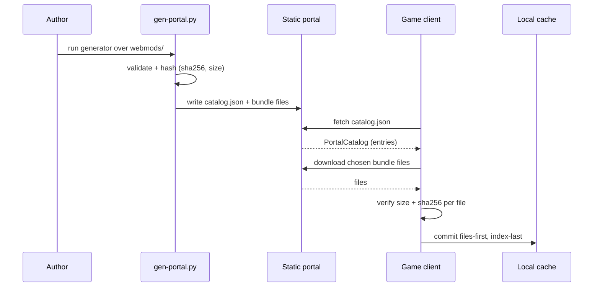

# The static mod portal

> To make and publish your own mod, follow the guide
> [Make and publish a mod](../guide-make-a-mod/).

How remote mods are published and served. The portal is STATIC files on the
existing GitHub Pages site - no server, no database - generated on every
deploy, never hand-maintained. The game consumes it through the portal client
(`nova_assets::portal`): it fetches `catalog.json`, verifies and installs mods
into the local cache, and the mods menu's "Explore online" tab is the UI on
top - players browse the portal catalog in game and install, update or
uninstall mods without leaving the menu, with the last fetched catalog cached
for offline browsing.

## Layout

Published by the deploy workflow next to the game:

```text
https://alexjercan.github.io/nova-protocol/
  play/                     the WASM game
  mods/
    catalog.json            PortalCatalog (JSON, schema-versioned)
    <id>/<version>/<files>  every file of each mod, verbatim
```

Sources live in the repo-root `webmods/` directory - OUTSIDE `assets/`, so
portal mods never ship inside the game build. Each subdirectory is one mod;
the directory name is its id (lowercase ascii, digits, `-`). A mod is the same
folder-bundle shape as an installed mod: exactly one `<name>.bundle.ron` at the
mod root (content paths relative to it, `meta` block required for publishing:
non-empty `name` and `version`). Only that root-level manifest is the entry
point; a `*.bundle.ron` nested in a subdirectory is published as a plain data
file and validated by neither gate. Declared content paths must resolve to
files INSIDE the mod directory (the generator checks membership in the set it
serves, so escaping `../` paths are rejected).

## The generator

`scripts/gen-portal.py` (Python 3, stdlib only - no toolchain, runs instantly)
turns `webmods/` into the portal tree:

```sh
python3 scripts/gen-portal.py \
    --source webmods --shipped assets/mods.catalog.ron --out site/mods
```

It is a byte-for-byte port of the (soon-to-be-removed) `nova_portal_gen` crate,
which is kept for one release as a parity oracle (see task 20260718-152247). It
validates what a manifest gate can - bundle parses, publishable meta, every
listed content file exists, well-formed unique ids that do not collide with
the SHIPPED catalog, dependencies resolve within the portal + shipped set -
computes per-file size + sha256, copies files under `<id>/<version>/`, and
writes a deterministic `catalog.json` (sorted entries and file lists; two runs
over the same source are byte-identical, test-pinned). Any validation failure
exits non-zero with a one-line reason, failing the deploy.

Whether the content actually LOADS is deliberately not the generator's job:
the `webmods_validation` integration test (crates/nova_assets/tests) drives
every webmods bundle through the real bevy loaders to recursive `Loaded` on
regular CI - the deep half of the publish gate, running where tests already
run.

### The publish-vs-load split (what "publishes clean" does NOT prove)

The generator is a MANIFEST gate. It parses the bundle, checks publishable meta,
confirms every listed file exists, rejects id collisions, resolves dependencies,
and checks that asset refs are well-formed and name declared resources - but it
NEVER deserializes or type-checks the content itself (it walks the RON only for
its string leaves; it does not construct a single game type, and stays
engine-free with no bevy). So a mod can publish CLEAN and still fail in-game: a
scenario that references a section id no bundle defines, a fight that spawns
already dead, a flight rig bound to a key the ship already drives - none of those
are manifest-level, so the generator waves them through. Publishing clean means
"the portal can serve it", not "the game can run it".

Close that gap yourself with a two-part PRE-PUBLISH check on every release,
before you land:

1. `cargo run -p nova_assets --bin content -- lint --target <mod>` - as of
   the folded-lint work this ONE command runs every check the manifest gate
   cannot: reference/geometry (prototype ids, chain targets, filter/action
   targets, duplicate object ids), the combat BALANCE audit
   (spawned-dead / close-spawn) and the flight-rig INPUT-OVERLAP check.
   `<mod>` may be a directory path or an in-repo id (`gauntlet`, `the-ledger`,
   `base`). Add `--report report.md` (or a `.html` path) to write a per-mod
   document grouping every finding by severity with source/id/fix for each - a
   checklist to work through instead of scanning stdout.
2. A LOCAL in-game load: install/enable the mod and actually play it (or, for
   the shipped `webmods/`, `cargo test -p nova_assets --test webmods_validation`,
   which is the loader half CI runs anyway). `content lint` catches the content
   errors it knows about; only a real load proves the bevy loaders accept the
   whole tree.

Do BOTH. `content lint` is fast and catches the common content errors; the load
catches whatever it does not.

## The wire schema (catalog.json)

The full publish-then-install flow ties these sections together:



Types in `crates/nova_mod_format` (shared verbatim with the game):
`PortalCatalog { schema_version, entries }`; each `PortalEntry` carries `id`,
`version`, `bundle` (the entry-point manifest within the mod dir), the full
`ModMeta`, `files: [{path, size, sha256}]` and `total_size`. JSON, not RON, so
the TypeScript site and a future server API can produce/consume the same
shape.

`schema_version` (currently 1, `PORTAL_SCHEMA_VERSION`) bumps on any breaking
wire change; the game rejects catalogs with an unknown version rather than
misparse (`RemoteCatalog::Error`, test-pinned). The per-file size + sha256 is
what the game verifies as each file downloads, before anything is committed
to the cache.

## Publishing a mod (today)

1. Add `webmods/<id>/` with a `<name>.bundle.ron` (content list + full meta,
   version non-empty) and its content files.
2. `python3 scripts/gen-portal.py --source webmods --shipped
   assets/mods.catalog.ron --out /tmp/portal/mods` (the publish gates) and
   `cargo test -p nova_assets --test webmods_validation` (does it load?) locally
   (or let CI run them).
3. Land on master; the next deploy publishes it.

## Local development

The one rule that governs all of this: **the web build fetches the portal
SAME-ORIGIN.** It derives its portal base from `window.location` by stepping out
of `/play/` and appending `/mods` as a SIBLING - so the game at
`<origin>/play/` always fetches `<origin>/mods`, exactly the production layout
(`.../play/` for the game, `.../mods/` for the portal). The browser enforces
CORS, so a cross-origin portal fails; serve the portal same-origin instead.
(Native has no such rule - ureq ignores CORS.)

### Web: full site preview (recommended)

`scripts/preview-web.sh` builds the game, assembles it under `/play/`, generates
the portal as the `/mods` sibling, and serves the whole thing same-origin - the
same layout the deploy publishes:

```sh
nix develop -c scripts/preview-web.sh            # or --release for an optimized game
# open http://localhost:8090/play/  and click Play; Explore works with NO ?portal=
```

Running it by hand instead (the script just automates this) - note the portal
goes to `<site>/mods`, a SIBLING of `<site>/play`, NOT inside it:

```sh
trunk build                                      # -> dist/ (the game)
mkdir -p site/play && cp -r dist/. site/play/    # game under /play/
python3 scripts/gen-portal.py --source webmods \
  --shipped assets/mods.catalog.ron --out site/mods   # portal as the /mods sibling
python3 -m http.server -d site 8090
# open http://localhost:8090/play/  with NO ?portal=
```

If you put the portal INSIDE the game dir (`site/play/mods`) the game still
looks at the `/mods` sibling and 404s - this was the bug in task 20260715-214540.

### Web: lighter loop (trunk serve, game at root)

For a quick iteration without assembling the full `/play/` site, run the portal
on its own server and let `trunk serve` proxy to it same-origin:

```sh
python3 scripts/gen-portal.py --source webmods --shipped assets/mods.catalog.ron --out /tmp/portal/mods
python3 -m http.server -d /tmp/portal 8000       # portal at :8000/mods/
trunk serve                                       # Trunk.toml proxies /mods -> :8000/mods
# open http://localhost:8080  (game at root) with NO ?portal=
```

The dev-only `[[proxy]]` in `Trunk.toml` applies to `trunk serve` only (never
`trunk build`), so it has no effect on the deploy.

### Native

No origin rule applies; point at any local portal with `NOVA_PORTAL_URL`:

```sh
python3 scripts/gen-portal.py --source webmods --shipped assets/mods.catalog.ron --out /tmp/portal/mods
python3 -m http.server -d /tmp/portal 8000
NOVA_PORTAL_URL=http://localhost:8000/mods cargo run
```

### A note on cross-origin `?portal=`

A cross-origin override (page on one port, portal on another, e.g.
`?portal=http://localhost:8000/mods`) is BLOCKED by the browser on the web
build - an opaque `TypeError: Failed to fetch` plus a CORS error in the console -
UNLESS the portal server itself sends an `Access-Control-Allow-Origin` header
(`python3 -m http.server` does not). The game logs a cross-origin warning naming
both origins when you do this, so prefer the same-origin options above.

## How installed mods are stored (game side)

A downloaded mod lands in the game's LOCAL MOD CACHE and is served back to the
asset server through the `mods://` source - native under
`dirs::data_dir()/nova-protocol` (files + a RON installed index), the web in
IndexedDB + localStorage. From there it loads and merges exactly like a
shipped mod. The full format and runtime flow live in the
[RON data format page](../modding-ron/), sections "Downloaded mods: the local
cache + the `mods://` source" and "The portal client" - the latter is the
fetch/verify/install flow that fills the cache from this portal: staged,
sequential downloads verified against the catalog's size + sha256 per file,
committed files-first-index-last only after everything checks out.

## The real server, later

The static portal IS the v1 API contract. A future service (the
Wesnoth-add-ons-server analog, done over plain HTTPS) serves the SAME
catalog.json shape - generated from a database instead of a folder scan - and
adds what static hosting cannot: third-party upload/publish with auth,
server-side validation (this generator's checks become the upload gate),
download counts, and search/pagination past the one-file catalog. The client's
base URL is already configurable, so switching is a config change, not a
rework.
