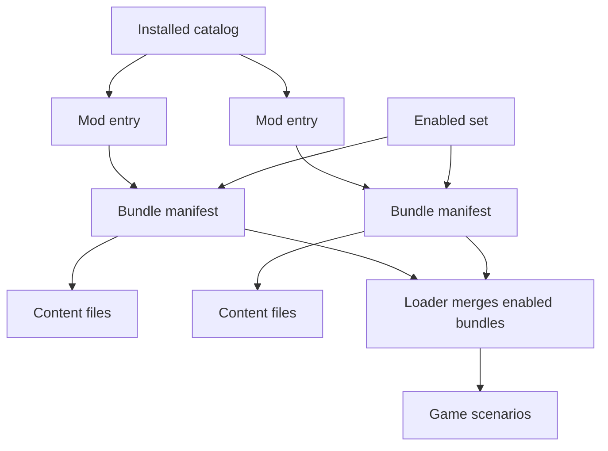

# RON scenario/mod format

> To make and publish your own mod, follow the guide
> [Make and publish a mod](../guide-make-a-mod/).

The declarative modding language for Nova Protocol: scenarios authored as
`*.scenario.ron` data files instead of Rust. Implemented on branch
`modding-language` (v0.6.0). For the runtime it feeds, see the
[scenario engine](../scenario-system/).

## What shipped

Scenarios are now serializable. A `*.scenario.ron` file deserializes into the
same `nova_scenario::ScenarioConfig` the runtime already used, and loads through
a Bevy `AssetLoader` into the `GameScenarios` resource.

- `nova_scenario` and `nova_gameplay` gained off-by-default `serde` features that
  `cfg_attr`-derive `Serialize`/`Deserialize` on the whole config tree (events,
  filters, the variables AST, actions, ship/section/object configs). Each engine
  crate is serde-free in isolation (`cargo build -p nova_scenario`). Note the
  SHIPPED game binary is not: `nova_modding` enables `nova_scenario/serde`
  unconditionally and the game depends on it (via `nova_assets`), so Cargo feature
  unification turns `bevy/serialize` on for the real build - the loader is always
  present and genuinely needs it. The cost (extra serialize/`Reflect` registrations)
  is small, but it is paid at runtime, not only in tests.
- `nova_gameplay::asset_ref::AssetRef<A>` is the authorable asset reference. In a
  data file an asset is a path string (`"textures/asteroid.png"`); `AssetRef`
  deserializes that as `Path`, and `resolve(&AssetServer)` turns it into a
  `Handle<A>` lazily at spawn. Resolution is non-mutating and idempotent, so a ref
  keeps its path and re-serializes (for editor save). Code-built configs use
  `AssetRef::from(handle)`. It replaced the 13 section-config handle fields plus
  the scenario cubemap and asteroid texture.
- `nova_modding` (new crate) owns the format: `ScenarioAsset`, the
  `ScenarioAssetLoader` for the `scenario.ron` extension, and `NovaModdingPlugin`.
  It depends on `nova_scenario` with its `serde` feature.
- `nova_assets` registers the plugin, loads `assets/scenarios/*.ron` as part of the
  `GameAssets` collection, and merges them into `GameScenarios`. See
  `assets/scenarios/demo.scenario.ron` for a worked, ship-less example.

## Architecture decisions

- **New crate + optional serde on the engine (not a parallel authoring tree).**
  The engine crates carry the serde derives behind a feature; `nova_modding` owns
  the loader and (future) authoring niceties. A full duplicate authoring type tree
  was rejected as too much drift-prone duplication.
- **`AssetRef` field type, not authoring wrappers.** One representation end to end.
  The only impedance was asset handles; wrapping just those in `AssetRef` (rather
  than mirroring every config struct) keeps duplication proportional to the actual
  mismatch. Resolution happens at the render-build observers, where an
  `AssetServer` is already in hand - behavior is identical to before.
- **Lazy resolution at spawn, not at load.** The loader is a pure RON decode; it
  does not walk the tree resolving handles. `AssetServer.load(path)` at spawn
  returns the same handle `GameAssets` holds for a matching path, so shared asset
  processing (e.g. the cubemap cube-view) is preserved.
- **Bindings via a `serde(with)` helper, runtime type unchanged.**
  `bevy_enhanced_input::Binding` has no serde impl. Rather than change
  `PlayerControllerConfig.input_mapping`'s runtime type (which would ripple into
  spawn and the editor), a small `BindingInput` authoring enum
  (`Keyboard`/`Mouse`/`Gamepad`) plus a `binding_map_serde` module (de)serialize
  the field through `BindingInput`, rejecting non-simple bindings (mod keys, mouse
  motion/wheel, axes) with an error.

## Design notes

- **The blocker set was bigger than "two handles".** Beyond the cubemap/texture
  handles, the section tree carried 13 asset handles, and three foreign non-serde
  types blocked the ship subtree: `FlightVerb`/`SectionConfig` (nova_gameplay,
  Reflect-only) and `Binding` (external). Resolved by adding serde to nova_gameplay
  and the `BindingInput` helper. This split the work into two tiers (logic/objects
  vs ships).
- **`AssetRef` generic-trait bounds.** Deriving `Clone`/`Debug`/`PartialEq` on
  `AssetRef<A>` would add an `A: Trait` bound and exclude `EffectAsset` (not
  `Debug`). The standard traits are hand-implemented without the bound.
- **`Asset` derive walks fields.** `#[derive(Asset)]` on `ScenarioAsset` would try
  to visit the wrapped `ScenarioConfig` for handle dependencies; since scenario
  refs are lazy `AssetRef` paths, `VisitAssetDependencies` is hand-implemented as a
  no-op and `Asset` implemented manually.
- **`AssetLoader` requires `TypePath`** on the loader struct in Bevy 0.19 - added.

## RON syntax notes (gotchas)

Authored shapes that are easy to get wrong by hand (generate them with
`ron::ser::to_string_pretty` on a code-built config if unsure):

- Asset ref: a bare string - `texture: "textures/asteroid.png"`.
- `Color`: externally-tagged - `color: Srgba((red: .., green: .., blue: .., alpha: ..))`.
- `Quat`: a bare 4-tuple - `rotation: (0.0, 0.0, 0.0, 1.0)`.
- Enum action/kind variants use RON newtype form - `DebugMessage((message: ..))`,
  `kind: Asteroid((..))`.

## Built-ins ported

All four built-ins are now data files under `assets/scenarios/` and load through
`nova_modding`; `register_scenario` builds none in code. The files are generated by
serializing the code configs with path-based `AssetRef`s (`SectionMeshRefs::from_paths`
+ the scenario builders taking asset refs), and a `scenario_ron_parity` test rebuilds
each and asserts it matches the committed file, so the data cannot silently drift from
the intended config. `menu_ambience`/`asteroid_field` use the seeded `ScatterObjects`
action instead of runtime RNG. Verified by the `12_menu_newgame` boot example.

## Mods: catalog + bundles + enabled set

The modding data model. Remote/published mods are served by the STATIC MOD
PORTAL - see the [mod portal](../mod-portal/) (sources, generator, catalog
schema).

The pieces fit together like this:



- A MOD is a folder BUNDLE: a `*.bundle.ron` manifest listing its `*.content.ron`
  files (`Content` items: sections, scenarios) plus a `meta` block - the mod's
  SELF-DESCRIPTION and the single source of truth for its metadata (the Factorio
  `info.json` analog). The BASE game is just a mod (`assets/base/`).
- The `meta` block (all fields optional, `ModMeta` in `nova_mod_format`,
  re-exported by nova_modding - the pure format types live in that engine-free
  crate so the portal generator shares them without bevy):
  `name`, `description`, `author`, `version` (opaque semver-ish string; base
  leaves it empty - the GAME version is authoritative there),
  `dependencies: [ids]` (schema-only for now; `base` is an IMPLICIT
  dependency and is never declared), `icon` and `screenshots: [paths]`
  (bundle-dir-relative; reserved for the mod portal and the details panel).
  NOTE: `icon` is an Option and the loader uses strict RON, so it must be
  written `icon: Some("icon.png")`, not `icon: "icon.png"`.
  A meta-less `(content: [...])` manifest stays valid; the menu falls back to
  the catalog id as the display name.
- `assets/mods.catalog.ron` is the INSTALLED-mods CATALOG - a wasm-safe manifest
  (never a directory scan), a THIN ordered pointer list: each entry is only
  `id`, `bundle` (path), `base`, `hidden` - deployment concerns; the mod's
  metadata lives in its own bundle. It loads as an `InstalledCatalog` asset
  whose dependencies are EVERY installed mod's bundle, so all installed content
  loads at startup regardless of what is enabled. The menu-facing
  `ModCatalog` (`Vec<ModInfo>`) composes each non-hidden declaration with its
  loaded bundle's meta.
- `nova_assets::EnabledMods` (a runtime resource, not an asset) is the set of enabled
  mod ids. `register_bundles` merges only the enabled cataloged bundles, in catalog
  order (base first, so mods overlay it by id). Toggling it (from the main-menu Mods
  section) re-merges live. Base is enabled by default (`base: true`).
- `hidden: true` marks a DEV/TOOLING mod: `build_mod_catalog` filters it out of the
  player-facing `ModCatalog`, so it never appears in the Mods menu - but it stays
  installed, its bundle loads, and it merges like any other mod when its id is
  enabled programmatically. A hidden mod's enablement is
  SESSION-ONLY: `seed_enabled_mods` strips hidden (non-base) ids from the restored
  prefs at startup, so a dev-tool run can never leave a hidden mod stuck-enabled
  with no menu row to disable it. No shipped mod is hidden right now - the
  screenshot-reel capture set left the mods system entirely (its scenario is
  embedded in `examples/13_screenshot_reel.rs` via `examples/data/reel.content.ron`);
  the flag is pinned by the synthetic-catalog tests in
  `crates/nova_assets/tests/demo_scenario.rs`.

## Downloaded mods: the local cache + the `mods://` source

The LOCAL foundation (the network half is the portal client below). A mod
whose files sit in the local cache loads and merges exactly like a shipped
one; nothing in THIS layer touches the network.

- The CACHE (`nova_assets::mod_cache`) stores each downloaded mod's files
  verbatim plus a small INSTALLED INDEX of DOWNLOADED mods only (the shipped
  `mods.catalog.ron` stays the other half of the installed set). The index is
  a RON `Vec<InstalledModRecord>`; each record is `(id, version, bundle)` where
  `bundle` is the mod's `*.bundle.ron` path relative to its own cache
  directory:

  ```ron
  [
      (
          id: "gauntlet",
          version: "1.0.0",
          bundle: "gauntlet.bundle.ron",
      ),
  ]
  ```

- NATIVE storage: index at `<data_root>/installed.mods.ron`, files at
  `<data_root>/mods/<id>/<path>`, with `<data_root>` =
  `dirs::data_dir()/nova-protocol` (data, not config - the config dir stays
  prefs-only). WEB storage: index in `localStorage` under
  `nova_protocol.installed_mods` (small + sync, the mod_prefs split), file
  bytes in IndexedDB (database `nova-protocol`, store `mod-files`, key
  `<id>/<path>`) via a thin hand-rolled web-sys wrapper. Both index reads are
  best-effort: missing/corrupt degrades to "no downloaded mods", never a panic.
  `NOVA_MOD_CACHE_ROOT` overrides the native data root (read by the cache
  helpers AND the source registration, so they always agree) - this is how the
  integration tests point the whole pipeline at a temp dir.
- The `mods://` ASSET SOURCE serves the cache to the asset server, registered
  by `mod_cache::register_mods_source` BEFORE `AssetPlugin` (bevy builds
  sources at AssetPlugin insertion; `AppBuilder::new` makes the call). Native
  is a `FileAssetReader` over `<data_root>/mods`; the web is a
  `MemoryAssetReader` over a shared in-memory `Dir` that a startup task
  hydrates from IndexedDB before any load is kicked. A downloaded mod's bundle
  then loads as `mods://<id>/<bundle>` through the SAME loaders as a shipped
  bundle (`BundleAssetLoader` resolves its content files bundle-relative, so
  they stay inside the `mods://` source automatically).
- RUNTIME: `DownloadedMods` (records + bundle handles) is the downloaded half
  of the installed set, read from the index at startup. `build_mod_catalog`
  appends one player-facing row per downloaded mod (bundle meta once loaded;
  decl-only name = id while in flight) and `register_bundles` merges the
  ENABLED downloaded bundles AFTER the shipped ones, in index order, under the
  same overlay rules. Both re-run when `DownloadedMods` changes;
  `mark_downloaded_bundles_loaded` flags that change when a bundle's async
  `mods://` load completes (downloaded bundles sit OUTSIDE the `GameAssets`
  collection gate). Downloaded mods install DISABLED - enabling is the normal
  `EnabledMods` toggle; they carry no `base`/`hidden` flags.
- NO SHADOWING: a downloaded record whose id matches a SHIPPED catalog entry
  (hidden ones included - one id space) is skipped with a warning by both
  `build_mod_catalog` and `register_bundles`, so one toggle can never drive
  two bundles or two rows. This re-enforces the portal generator's
  no-collision rule at the consumers, because the local index is downloaded
  input the game must not trust.
- TRUST BOUNDARY: index records and bundle manifests are downloaded input.
  Unsafe ids/paths (a `..` component, an absolute path, a nested id) are
  rejected by the public cache API on both platforms and skipped with a
  warning when the index is read; escaping ASSET paths (a malicious manifest
  can request one) are rejected by bevy's default `UnapprovedPathMode::Forbid`
  at load time AND by a sandboxing reader wrapped around the native `mods://`
  source, so containment does not depend on the bevy default staying in place.
- UNINSTALL vs ENABLEMENT: uninstalling a mod ALSO strips its id from
  `EnabledMods` (and, via the existing change-gated save system, from the
  persisted prefs), so reinstalling the same id starts DISABLED - the same
  default as any fresh install. (An earlier interim shipped the
  leave-it-enabled behavior; this is the corrected behavior.)

## The portal client: fetch + install/uninstall over the wire

Lives in `nova_assets::portal`. The game fetches the static
[mod portal](../mod-portal/) and installs into the cache above, on native and
wasm alike:

- EVENT/RESOURCE API (what the mods menu binds to): trigger
  `FetchPortalCatalog` / `InstallPortalMod { id }` / `UninstallPortalMod
  { id }`; read `RemoteCatalog` (Idle | Fetching | Ready(catalog) |
  Error(msg)) and `InstallJobs` (per-id: Fetching {done, total} | Verifying |
  Committing | Failed(msg); the entry is REMOVED on success - `DownloadedMods`
  is the truth from there, and a Failed entry stays until a retry). The
  transport is a `PortalTransport` trait object in the `PortalClient`
  resource - `ehttp` in production (one API over the native ureq thread and
  the browser fetch), mocks in tests.
- BASE URL (`PortalConfig`): native defaults to the Pages portal
  (`https://alexjercan.github.io/nova-protocol/mods`), overridable via
  `NOVA_PORTAL_URL`; wasm derives it from `window.location` (game served at
  `<root>/play/` -> sibling `<root>/mods`, so a fork's Pages deploy hits its
  own portal with zero config), overridable via a `?portal=<url>` query
  parameter.
- The fetched catalog is WIRE data: an unknown `schema_version` is rejected
  with an error that names the version (never misparsed or half-parsed), and
  every id/version/path of an entry passes the same `is_safe_*` gates as the
  cache API BEFORE the first byte of that mod is fetched.
- STAGED INSTALL: files are fetched sequentially (per-file progress), each
  verified against the catalog's size + sha256 on arrival, and held in
  memory; only after ALL files verify does the commit write the cache (files
  first, index last - natively `install_local`; on wasm one IndexedDB
  transaction awaited to its `complete` event, then the index, then the
  in-memory `mods://` Dir). Any failure - bad hash, short body, transport
  error mid-install - leaves NO files and NO index entry. Guards: an id that
  is already installed or that shadows a shipped catalog id is rejected
  before any fetch. A successful install joins `DownloadedMods` live (the
  existing load/mark/merge machinery reacts) and stays DISABLED until the
  player enables it.

## File naming (bundles, content, catalog) - load-bearing

A bundle manifest MUST be named `<pack>.bundle.ron` (e.g. `assets/base/base.bundle.ron`),
content files `<name>.content.ron`, and the catalog `<name>.catalog.ron` (e.g.
`mods.catalog.ron`) - always a STEM before the compound extension, never a bare
`bundle.ron` / `catalog.ron`.

Why: `bevy_asset_loader` kicks off every collection field with an UNTYPED
`asset_server.load_untyped(path)`, which resolves the loader by the file's FULL
extension only. Bevy's full extension is everything after the FIRST dot in the file
name, so `bundle.ron` resolves to the bare `ron` extension (no loader) and the load
fails in-game with "Could not find an asset loader"; `base.bundle.ron` resolves to
`bundle.ron` (and `mods.catalog.ron` to `catalog.ron`), which the loader registers. A
TYPED load (`asset_server.load::<T>`) would fall back to the by-asset-type loader and
mask the problem - so tests must exercise the untyped path (see the
`catalog_untyped_load_resolves_the_loader` guard).

## Known limitation: authoring verbosity

The generated files are large and repetitive - `shakedown_run.scenario.ron` is
~1480 lines because each ship inlines its whole section catalog, restating
`name`/`description`/mass/health/meshes per section. Faithful, but a poor
hand-authoring surface. Reducing this (a prototype+modifications model, sections as
their own RON, scenarios as multi-file bundles) is a known direction.
`ScatterObjects` is a first example of a declarative primitive that collapses
duplication.
