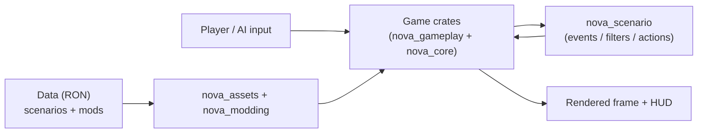

# Project tour

> **Start here.** New to the codebase? Read the dev wiki in this order:
> 1. [Project tour](../project-tour/) -- this page: the crate map and where to
>    change X.
> 2. [Architecture](../architecture/) -- the full crate graph, app assembly,
>    state machines and frame flow.
> 3. [Building & running](../development/) -- toolchain, cargo commands,
>    examples, the web build, and how to contribute a change.
> 4. Then pick the guide for your change:
>    [Add a ship section](../guide-add-section/) or
>    [Extend the scenario engine](../guide-extend-scenarios/).

The friendly 20-minute front door to the codebase. Read this first, then dive
into [Architecture](../architecture/) for the full crate graph, plugin order,
state machines and frame flow -- this page only orients you.

Nova Protocol is a 3D space game built on **Bevy 0.19** with **avian3d** physics.
You build ships out of modular sections (hull, controller, thruster, turret,
torpedo bay), fly them with real Newtonian thrust and a diegetic `GOTO`/`ORBIT`/
`STOP` autopilot, work inverse-square gravity wells, and fight with deliberate
angular radar lock-on. On top of the game sits an event-driven scenario/modding
engine (RON data) and a web site + WASM build. It is a Cargo workspace: the root
`nova-protocol` crate is a thin shell; all the real code lives under `crates/`.

## Crate map at a glance

Slugs are the workspace members. One line each -- see [Architecture](../architecture/)
for responsibilities and the dependency graph.

| Crate | Owns |
| --- | --- |
| `nova-protocol` (root) | `src/main.rs` clap CLI + entrypoint; `src/lib.rs` re-exports `nova_core`. |
| `nova_core` | Wiring only: `AppBuilder` assembles the whole plugin stack. No gameplay. |
| `nova_gameplay` | The game: sections, integrity, damage, flight, gravity, input (player/ai/radar), hud, camera, audio, juice. Owns `GameStates`/`PauseStates`/`GameMode`. |
| `nova_scenario` | Scenario engine: events, filters, actions, variables, world, loader, objects. |
| `nova_events` | Shared game-event kinds + entity identity components (gameplay <-> scenario). |
| `nova_assets` | `bevy_asset_loader` setup; loads glb/textures/shaders/sounds; owns the mod merge + prefs. |
| `nova_modding` | Bundle/content/catalog asset loaders and the `Content` routing enum. |
| `nova_mod_format` | Pure serde types for the mod formats (engine-free); re-exported by `nova_modding`. |
| `nova_portal_gen` | Binary: generates the static mod portal from `webmods/` (engine-free). |
| `nova_editor` | The ship editor scene (`NovaEditorPlugin`), shown in `GameMode::Sandbox`. |
| `nova_menu` | Main menu + the ESC pause overlay; hands off to `Playing`. |
| `nova_ui` | Shared theme palette/metrics and themed widgets the menu and editor draw from. |
| `nova_debug` | Debug-only plugin (inspector, overlays); compiled under the `debug` feature. |
| `nova_info` | Exposes `APP_VERSION`, injected by `build.rs`. |

## Want to change X? Start here

The highest-value table. Verified paths; follow the linked page for depth.

| I want to change... | Start in | Read |
| --- | --- | --- |
| A ship section behavior | `crates/nova_gameplay/src/sections/` | [Ship sections](../sections/), [Add a ship section](../guide-add-section/) |
| Damage / resistances | `crates/nova_gameplay/src/damage.rs` | [Ship sections](../sections/) |
| Integrity (disable/destroy) | `crates/nova_gameplay/src/integrity/` | [Ship sections](../sections/) |
| Flight / autopilot verbs | `crates/nova_gameplay/src/flight.rs` | -- |
| Player input / AI | `crates/nova_gameplay/src/input/{player,ai}.rs` | -- |
| Radar targeting / lock-on | `crates/nova_gameplay/src/input/targeting.rs` | -- |
| Gravity wells | `crates/nova_gameplay/src/gravity.rs` | -- |
| The HUD (widgets) | `crates/nova_gameplay/src/hud/` | -- |
| A scenario event/filter/action | `crates/nova_scenario/src/{events,filters,actions}.rs` | [Scenario engine](../scenario-system/), [Extend the scenario engine](../guide-extend-scenarios/) |
| Scenario objects / loading | `crates/nova_scenario/src/{objects,loader}.rs` | [Scenario engine](../scenario-system/) |
| Mod loading / merge | `crates/nova_assets/` + `crates/nova_modding/` | [Modding data format (RON)](../modding-ron/), [Mod portal](../mod-portal/) |
| The ship editor | `crates/nova_editor/` | -- |
| Shared UI theme / widgets | `crates/nova_ui/` | -- |
| The web site / wiki | `web/` | [Building & running](../development/) |

## The boot path in one glance

`AppBuilder` (in `crates/nova_core/src/lib.rs`) is the single place the app is
wired -- `DefaultPlugins` + window/log/asset setup, then the plugin stack
(assets, gameplay, scenario, editor, menu, debug). The state machines:

- `GameStates { Loading, MainMenu, Playing }` -- top-level lifecycle.
- `PauseStates { Unpaused, Paused }` -- the ESC overlay, nested in `Playing`.
- `GameAssetsStates { Loading, Processing, Loaded }` -- the asset pipeline that
  gates entry; on `OnEnter(Loaded)` the app hands off to `MainMenu`/`Playing`.

Gameplay systems run an explicit chain configured identically in `Update` and
`FixedUpdate`; avian3d physics runs on a fixed timestep in `FixedPostUpdate`.
The plugin order, exact sets and frame flow live in
[Architecture](../architecture/) -- start there once the shape clicks.

## Where to go next

- [Architecture](../architecture/) -- the full crate graph, app assembly, states, frame flow.
- [Building & running](../development/) -- toolchain, cargo commands, examples, the web build.
- [Ship sections (internals)](../sections/) and [Add a ship section](../guide-add-section/).
- [Scenario engine](../scenario-system/) and [Extend the scenario engine](../guide-extend-scenarios/).
- [Modding data format (RON)](../modding-ron/) and [Mod portal](../mod-portal/).
