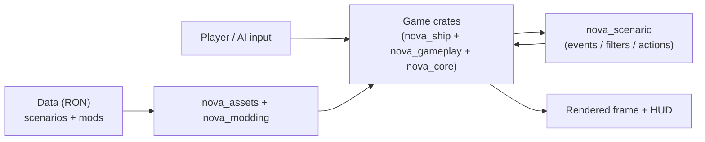

# Project tour

> **Start here.** New to the codebase? Read the dev wiki in this order:
> 1. [Project tour](../project-tour/) -- this page: the crate map and where to
>    change X.
> 2. [Architecture](../architecture/) -- the full crate graph, app assembly,
>    state machines and frame flow.
> 3. [Building & running](../development/) -- toolchain, cargo commands,
>    examples, the web build, and how to contribute a change.
> 4. Then pick the guide for your change:
>    [Add a ship section](../guide-add-section/) or
>    [Extend the scenario engine](../guide-extend-scenarios/).

The friendly 20-minute front door to the codebase. Read this first, then dive
into [Architecture](../architecture/) for the full crate graph, plugin order,
state machines and frame flow -- this page only orients you.

Nova Protocol is a 3D space game built on **Bevy 0.19** with **avian3d** physics.
You build ships out of modular sections (hull, controller, thruster, turret,
torpedo bay), fly them with real Newtonian thrust and a diegetic `GOTO`/`ORBIT`/
`STOP` autopilot, work inverse-square gravity wells, and fight with deliberate
angular radar lock-on. On top of the game sits an event-driven scenario/modding
engine (RON data) and a web site + WASM build. It is a Cargo workspace: the root
`nova-protocol` crate is a thin shell; all the real code lives under `crates/`.

## Crate map at a glance

Slugs are the workspace members. One line each -- see [Architecture](../architecture/)
for responsibilities and the dependency graph.

| Crate | Owns |
| --- | --- |
| `nova-protocol` (root) | `src/main.rs` clap CLI + entrypoint; `src/lib.rs` re-exports `nova_core`. |
| `nova_core` | Wiring only: `AppBuilder` assembles the whole plugin stack. No gameplay. |
| `nova_gameplay` | The shared gameplay layer under the ship: integrity, damage, gravity, the SFX engine, juice, objectives, mesh/transform rigs, entity markers. Owns `GameStates`/`PauseStates`/`GameMode`. |
| `nova_ship` | The ship and how it is flown: sections, input (player/ai/radar), flight and its autopilot verbs, the camera rigs, the PD controller, the ship's soundtrack. |
| `nova_hud` | The flight HUD: one module per widget (crosshairs, target inset, ammo readout, objective markers, comms panel, keybind dock). Reads the ship, never drives it. |
| `nova_os` | NOVA OS logic: the terminal model, shell grammar and app runtime. No bevy UI. |
| `nova_os_ui` | The NOVA OS cockpit monitor the player opens with Tab: CRT terminal UI, forwarded pointer, and the `map`/`ship` apps. A peer of the HUD, added by `nova_core`. |
| `nova_scenario` | Scenario engine: events, filters, actions, variables, world, loader, objects. |
| `nova_events` | Shared game-event kinds + entity identity components (gameplay <-> scenario). |
| `nova_assets` | `bevy_asset_loader` setup; loads glb/textures/shaders/sounds; owns the mod merge + prefs. |
| `nova_modding` | Bundle/content/catalog asset loaders and the `Content` routing enum. |
| `nova_mod_format` | Pure serde types for the mod formats (engine-free); re-exported by `nova_modding`. The static mod portal is built by `scripts/gen-portal.py`. |
| `nova_editor` | The ship editor scene (`NovaEditorPlugin`), shown in `GameMode::Sandbox`. |
| `nova_menu` | Main menu + the ESC pause overlay; hands off to `Playing`. |
| `nova_ui` | Shared theme, skin, themed widgets, screen composition, unit formatting. A leaf: every UI-drawing crate (`nova_gameplay`, `nova_hud`, `nova_os_ui`, `nova_menu`, `nova_editor`, `nova_assets`) draws from it. |
| `nova_debug` | Debug-only plugin (inspector, overlays); compiled under the `debug` feature. |
| `nova_info` | Exposes `APP_VERSION`, injected by `build.rs`. |
| `nova_autopilot` | Scripted automation drivers + the run-completion protocol. Bevy-only, game-agnostic. |
| `nova_probe` | Dev tool (not in the shipped game): the in-game half of the run-harness - the frame-time/timeline/invariant capability plugins an example wires. |
| `nova_probe_cli` | Dev tool: the host half - spawns runs, grades artifacts, renders reports; the `probe run`/`report` CLI. |
| `nova_perf_web` | Dev tool: the wasm app `probe run --platform web` boots and measures. |
| `nova_authoring` | Offline content pipeline: the Rust builders for built-in scenarios/sections, `content -- gen` (writes `assets/base/**/*.content.ron`), `content -- lint`. |
| `nova_meta_gen` | Binary under `tools/` (web-build tooling, not a game crate): writes default `.meta` sidecars for web assets (Trunk `post_build` hook). |

## Want to change X? Start here

The highest-value table. Verified paths; follow the linked page for depth.

| I want to change... | Start in | Read |
| --- | --- | --- |
| A ship section behavior | `crates/nova_ship/src/sections/` | [Ship sections](../sections/), [Add a ship section](../guide-add-section/) |
| Damage types / how a round travels | `crates/nova_gameplay/src/damage.rs` | [Ship sections](../sections/) |
| Integrity (disable/destroy) | `crates/nova_gameplay/src/integrity/` | [Ship sections](../sections/) |
| Flight / autopilot verbs | `crates/nova_ship/src/flight/` | -- |
| Player input / AI | `crates/nova_ship/src/input/{player,ai}/` | -- |
| Radar targeting / lock-on | `crates/nova_ship/src/input/targeting/` | -- |
| Gravity wells | `crates/nova_gameplay/src/gravity.rs` | -- |
| The HUD (widgets) | `crates/nova_hud/src/` | -- |
| The NOVA OS monitor / its apps | `crates/nova_os_ui/src/` | -- |
| A scenario event/filter/action | `crates/nova_scenario/src/{events.rs,filters.rs,actions/}` | [Scenario engine](../scenario-system/), [Extend the scenario engine](../guide-extend-scenarios/) |
| Scenario objects / loading | `crates/nova_scenario/src/{objects/,loader/}` | [Scenario engine](../scenario-system/) |
| Mod loading / merge | `crates/nova_assets/` + `crates/nova_modding/` | [Mod files](../../modding/mod-files/), [Publish a mod](../../modding/publish-a-mod/) |
| A built-in scenario or section | `crates/nova_authoring/src/` (builders), then `content -- gen` | [Create your first scenario](../../modding/author-a-scenario/) |
| The ship editor | `crates/nova_editor/` | -- |
| Shared UI theme / widgets | `crates/nova_ui/` | -- |
| The web site / wiki | `web/` | [Building & running](../development/) |

## The boot path in one glance

`AppBuilder` (in `crates/nova_core/src/lib.rs`) is the single place the app is
wired -- `DefaultPlugins` + window/log/asset/render setup, then the plugin stack
(assets, gameplay, ship, scenario, HUD + NOVA OS monitor, editor, menu, debug).
The state machines:

- `GameStates { Loading, MainMenu, Playing }` -- top-level lifecycle.
- `PauseStates { Unpaused, Paused }` -- the ESC overlay, nested in `Playing`.
- `GameAssetsStates { Loading, Processing, Loaded }` -- the asset pipeline that
  gates entry; on `OnEnter(Loaded)` the app hands off to `MainMenu`/`Playing`.

Gameplay systems run an explicit chain configured identically in `Update` and
`FixedUpdate`; avian3d physics runs on a fixed timestep in `FixedPostUpdate`.
The plugin order, exact sets and frame flow live in
[Architecture](../architecture/) -- start there once the shape clicks.

```mermaid
flowchart LR
    player["Player / AI input"] --> game["Game crates<br/>(nova_ship + nova_gameplay + nova_core)"]
    game --> scenario["nova_scenario<br/>(events / filters / actions)"]
    data["Data (RON)<br/>scenarios + mods"] --> assets["nova_assets + nova_modding"]
    assets --> game
    scenario --> game
    game --> screen["Rendered frame + HUD"]
```

## Where to go next

- [Architecture](../architecture/) -- the full crate graph, app assembly, states, frame flow.
- [Building & running](../development/) -- toolchain, cargo commands, examples, the web build.
- [Ship sections (internals)](../sections/) and [Add a ship section](../guide-add-section/).
- [Scenario engine](../scenario-system/) and [Extend the scenario engine](../guide-extend-scenarios/).
- [Mod files](../../modding/mod-files/) and [Publish a mod](../../modding/publish-a-mod/).
