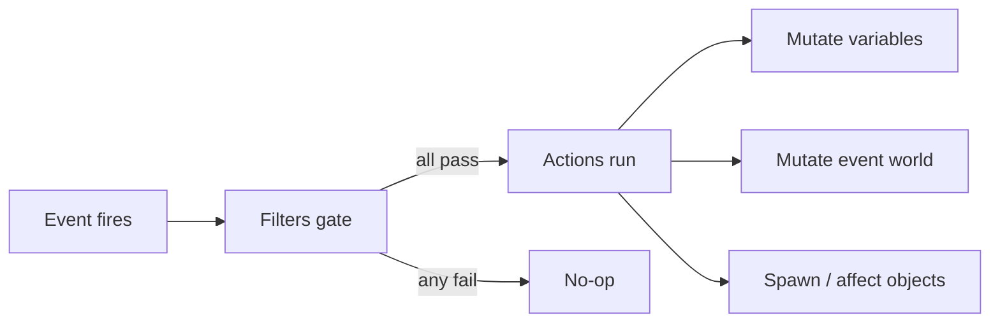

# Scenario / modding system

> How-to companions: [Author a scenario](../guide-author-scenario/) to write one
> in RON with existing primitives, or [Extend the scenario engine](../guide-extend-scenarios/)
> to add new event, filter, action, or object kinds in Rust.

`crates/nova_scenario` is the data-driven scenario engine, the layer for
missions, objectives, and reactive world behavior. A scenario is a list of
event handlers; each pairs an event with filters (all must pass) and actions
(run in order). It builds on `GameEventsPlugin`/`EventWorld` from
`bevy-common-systems`; nova provides `NovaEventWorld` and the enums below.

## Scenario structure

- `ScenarioConfig` - `id`, `name`, `description`, `cubemap` (skybox), `events`.
- `ScenarioEventConfig` - one handler: `name: EventConfig`, `filters`, `actions`.
- `GameScenarios(HashMap<ScenarioId, ScenarioConfig>)` - all known scenarios,
  populated by `nova_assets` (ready at `GameAssetsStates::Loaded`).
- `CurrentScenario(Option<ScenarioConfig>)` - the loaded scenario, if any. The
  `scenario_is_live` run condition gates the ship input/section sets on it.

## Loading / unloading (`loader.rs`)

- `LoadScenario(ScenarioConfig)` - trigger to load: look one up in
  `GameScenarios`, `commands.trigger(LoadScenario(cfg.clone()))` (see
  `examples/gameplay/scenario.rs`). Load tears down the previous scenario, spawns
  the camera, light, input context, one handler per event, fires `OnStart`.
- `ScenarioLoaded` - fired after a load; carries `scenario_id`,
  `handler_count`, `object_count` for smoke-test assertions.
- `UnloadScenario` - tears everything down and clears `CurrentScenario`.
- `ScenarioScopedMarker` - any entity carrying it is despawned (recursively)
  on load/unload. Teardown also runs `NovaEventWorld::clear()` and clears all
  HUD hint emphasis.

Cleanup contract: every entity spawned while a scenario is live must (1) carry
`ScenarioScopedMarker` (all scenario objects do), (2) carry a marker
registered with `on_add_entity_with` (`MeshFragmentMarker`,
`TurretBulletProjectileMarker`, `TorpedoProjectileMarker`), (3) be a child of
a scoped entity, (4) be a self-expiring `TempEntity`, or (5) be torn down by a
`Remove` observer (the HUDs on `PlayerSpaceshipMarker`). Anything else leaks.

## Events (`EventConfig` -> `nova_events`)

| `EventConfig`  | Fires when |
|----------------|------------|
| `OnStart`      | once, right after a scenario loads |
| `OnUpdate`     | every frame while a scenario is live and unpaused (frozen behind the pause menu / outcome frame) |
| `OnDestroyed`  | an entity is destroyed |
| `OnEnter`      | a body enters an area/zone |
| `OnExit`       | a body leaves an area/zone |
| `OnOrbit`      | a ship has held an engaged autopilot ORBIT around a well for the hold window (default 5s); re-fires every further window while the hold continues |
| `OnTravelLock` | the player's TRAVEL lock lands on a scenario object; re-fires every re-fire window (default 5s) while held |
| `OnCombatLock` | same as `OnTravelLock` for the COMBAT lock (player only; AI locks never fire it) |

Entities carry `EntityId(String)` and `EntityTypeName(String)`. Pair events all
have the same filter shape - a subject `id` and an `other_id`/`other_type_name`
- though which entity is the subject is per-event (area vs ship, well vs ship,
target vs locker; see the Filters section). The recurrence is deliberate: a
one-shot event consumed while a beat guard rejects it would soft-lock the
script; gated handlers make repeats no-ops.

Both 5s windows are the default and can be overridden per ship in RON (the
value is seconds; a non-positive/non-finite value is a `content lint` error and
is ignored at runtime):

- `OnOrbit` hold: `orbit_hold_secs: Some(8.0)` on an AI controller (only
  meaningful alongside its `orbit` directive) -
  `controller: AI((orbit: Some("planetoid"), orbit_hold_secs: Some(8.0)))`.
- `OnTravelLock`/`OnCombatLock` re-fire: `lock_refire_secs: Some(8.0)` on the
  player controller - `controller: Player((lock_refire_secs: Some(8.0)))`.

Both windows are measured against the scenario clock (below), so they freeze
under pause and reset on retry with the rest of the scenario.

The event-driven pipeline reads like this: an event fires, its filters gate
whether it proceeds, and if they all pass its actions run in order and mutate
scenario state.



## Filters (`EventFilterConfig`)

- `Entity(EntityFilterConfig)` - match the event's PRIMARY entity (`id` /
  `type_name`, the subject) and its OTHER party (`other_id` / `other_type_name`);
  which entity is which is per-event (for `OnEnter`, `id` is the area and
  `other_id` the body that entered). Each field optional, all set fields must
  match, and the fields are read for FILTERING only - never passed to actions.
  Per-event table + examples in
  [Author a scenario](../guide-author-scenario/#entity).
- `Expression(ExpressionFilterConfig)` - evaluate a `VariableConditionNode`
  against the scenario variables.
- `Conditional(ConditionalFilterConfig)` - `Not` / `And` / `Or` combinators;
  build with `ConditionalFilterConfig::not/and/or(...)`.

## Actions (`EventActionConfig`)

- `DebugMessage` - log a message.
- `VariableSet` - evaluate an expression into a scenario variable.
- `Objective` / `ObjectiveComplete` - add or complete a HUD objective by id.
- `ObjectiveMarkerAttach` / `ObjectiveMarkerDetach` - add/remove the gold
  marker chip (label + distance) on the scoped object by id; a despawned
  target detaches implicitly.
- `HintEmphasisSet` / `HintEmphasisClear` - pulse one keybind-hint row gold
  (verbs: STOP, GOTO, ORBIT, CANCEL, RADAR, COMPONENT, RCS); availability never
  changes, and teardown clears all emphasis.
- `SpawnScenarioObject(ScenarioObjectConfig)` - spawn an object (see below).
- `DespawnScenarioObject` - despawn the scoped object whose id matches
  (scoped-only lookup, so ship sections with colliding ids are safe).
- `SetSpeedCap` - install (`Some(cap)`) or remove (`None`) the manual
  `FlightSpeedCap` on a scoped ship by id.
- `SetControllerVerb` - enable/disable one flight verb (STOP/GOTO/ORBIT/LOCK/RCS)
  on a scoped ship's controller sections by id.
- `CreateScenarioArea(ScenarioAreaConfig)` - spawn a spherical sensor zone
  (id, name, position, rotation, radius) that drives `OnEnter`/`OnExit`.
- `NextScenario` - queue a switch to another scenario by id; `linger: true`
  defers the switch until something clears the flag (the Enter/DPadDown
  scenario-advance input, or the outcome overlay's Continue/Retry button).
- `Outcome { outcome, message? }` - declare the scenario's win/lose: shows the
  outcome overlay (gold VICTORY / red DEFEAT banner, the optional message, and
  buttons) and freezes the simulation behind it the same way the pause menu
  does - the app enters `PauseStates::Paused` while the outcome is set, so
  physics, AI, weapons and timers stop until it clears (the overlay's own
  buttons and the [Enter] advance stay live). Presentation only; compose what
  happens next from the existing vocabulary: pair with `NextScenario(linger:
  true)` so Continue/Retry (or Enter) rides the queued switch, or queue nothing
  and the overlay offers only Main Menu (Enter exits there too). In strict RON
  the optional message keeps its variant: `Outcome((outcome: Defeat, message:
  Some("...")))`. Cleared by scenario teardown like emphasis and objectives
  (clearing it also releases the pause).
- `SetCamera { position, look_at }` - pose the scenario camera (the
  `ScenarioCameraMarker` entity) at `position` looking at `look_at`. It drops
  `WASDCameraController` so the scripted pose holds - the free-fly controller's
  `sync_transform` would otherwise overwrite the camera `Transform` every frame
  (same swap the player-ship-spawn observer does). No-op with a warning if no
  scenario camera is present. Part of the in-engine photo-mode surface.
- `Screenshot { path }` - capture the primary window to a PNG at `path`, built
  on Bevy's `Screenshot::primary_window()` + `save_to_disk` (no capture crate).
  A relative `path` resolves under the `NOVA_SHOT_DIR` env var when set (so an
  example or a packaging script can redirect all captures to a staging folder),
  else it is relative to the working directory; the parent dir is created if
  missing. Pair `SetCamera` (pose) + settle frames + `Screenshot` (capture) to
  script a framed shot; the screenshot-reel example drives exactly this.
- `SetSkybox { cubemap, brightness? }` - swap the scenario's skybox cubemap
  mid-scenario (a modding hook). `cubemap` is authored as an asset path (the same
  `AssetRef` layer the scenario's initial `cubemap` uses); `brightness` is
  optional and keeps the current value when omitted. The install is deferred: the
  action tags the scenario camera with a `PendingSkyboxSwap`, and
  `apply_pending_skybox_swaps` inserts the real `SkyboxConfig` only once the new
  image has loaded, because the skybox setup observer reads the image immediately
  and would panic on a not-yet-loaded handle. A failed load leaves the sky
  unchanged (warned); no scenario camera present is a no-op.
- `HudReadout { slot, variable, format?, label?, visible? }` - show, update, or
  clear a named HUD readout bound to a scenario variable (the DISPLAY half of
  the scenario-variable vocabulary; `StoryMessage` is speaker text, this is a
  live number). `slot` is a stable id (update or clear just that one; run
  several side by side). `variable` names the scenario variable whose CURRENT
  value the readout shows, read live every frame - e.g. `scenario_elapsed` for a
  run clock, or any authored counter. `format` is `Number` (one decimal, the
  default), `Integer` (rounded, no decimals) or `Time` (`mm:ss.s`, e.g.
  `01:23.4`). `label` is an optional caption (e.g. `Some("TIME")`, shown
  upper-cased before the value). `visible` defaults to `true` (show/update);
  `false` clears the slot. One fire is enough for a live readout - it tracks the
  variable thereafter. The value freezes on pause and behind the outcome overlay
  because the bound variable does (`scenario_elapsed` stops ticking there), so a
  time-trial's FINAL time simply holds on the HUD through the Victory banner. It
  is an Instrument-tier widget (shown even at the Minimal HUD level) and clears
  at scenario teardown like the comms panel, so it cannot leak into the next
  scenario or the menu. RON:
  `HudReadout((slot: "run_timer", variable: "scenario_elapsed", format: Time, label: Some("TIME")))`;
  clear with `HudReadout((slot: "run_timer", variable: "scenario_elapsed", visible: false))`.

## Variables and the event world (`world.rs`, `variables.rs`)

`NovaEventWorld` holds the scenario state: variables, objectives,
`next_scenario`, and a queue of deferred command closures. Filters and actions
mutate only this resource, never the Bevy `World`; world access goes through
`world.push_command(|commands| ...)`. Each frame `state_to_world_system` syncs
objectives into `GameObjectives` (write-on-diff), runs a queued non-lingering
`NextScenario` switch, and flushes the command queue.

Variables are typed literals (`String`, `Number`, `Boolean`) with a small
expression tree: `VariableExpressionNode` (add/subtract), `VariableTermNode`
(multiply/divide), `VariableFactorNode` (literal/name/parens);
`VariableConditionNode` (less/greater/equal) yields booleans for filters.

### Transition pacing (the three gears)

A scenario switch has three speeds (task 20260717-163050):

- **Hard cut** - `NextScenario((scenario_id: "x", linger: false))`:
  instant. Never pair it with an `Outcome` in the same handler (the
  teardown swallows the overlay; content lint warns).
- **Delayed cut** - `NextScenario((scenario_id: "x", linger: false,
  delay: Some(4.0)))`: the world keeps playing for the delay (a story
  line can land and be read), then cuts. Ticks on virtual
  (pause-frozen) time, so a player pausing holds the cut. Non-positive or
  omitted = instant.
- **Modal hold** - `Outcome((...))` + `NextScenario((..., linger:
  true))`: the banner freezes the sim and Continue/Retry releases the
  chain. Add `auto_advance_secs: Some(6.0)` to the Outcome for a TIMED
  banner: it advances by itself after that many real seconds (the pause
  stops virtual time, not the wall clock) - the player can still click
  sooner.

### Story pacing (`StoryMessage` and the comms queue)

Story lines display through a PACED queue (task 20260717-163033), not
latest-wins: lines show in arrival order with a fade and a comms blip,
each holds ~8s but yields to a waiting line after 4s; at most 4 lines
wait (oldest dropped; the full log stays in the feed). Author an
optional per-line hold with strict-RON `Some`:

```ron
StoryMessage((speaker: "Foreman Okono", text: "Read this slowly.", dwell: Some(15.0))),
```

`dwell` clamps to [3, 30] seconds (content lint warns outside it). The
queue means a two-line beat is READ as two beats - but prefer one line
per beat anyway (the beat-sheet convention); the queue is the safety
net, not the style.

### The scenario clock (`scenario_elapsed`)

The engine maintains one RESERVED variable: `scenario_elapsed`, the seconds
of live, unpaused scenario time (`tick_scenario_clock` in `loader.rs`,
chained ahead of the `OnUpdate` pulse under the same live+unpaused gate, so
pausing freezes both together). It clears at teardown with the rest of the
event world - it is the current scenario's clock, and a retry restarts it.
Gate on it from any expression filter; never write it (the engine rewrites
it every tick, and `content lint` errors on an authored `VariableSet` to
it). A read before the first tick fails closed like any undefined variable.

A one-shot timed beat is the clock threshold plus your own fired-flag:

```ron
filters: [
    Expression((GreaterThan(
        Term(Factor(Name("scenario_elapsed"))),
        Term(Factor(Literal(Number(30.0)))),
    ))),
    Expression((Equal(
        Term(Factor(Name("beat_fired"))),
        Term(Factor(Literal(Number(0.0)))),
    ))),
],
actions: [
    VariableSet((key: "beat_fired", expression: Term(Factor(Literal(Number(1.0)))))),
    // ... the beat ...
],
```

Seed `beat_fired: 0` in `OnStart` (an unseeded gate fails closed forever).

A repeating wave is the same shape gating on `elapsed > next_at`, rearmed
inside its own action (seed `next_at` in `OnStart` too):

```ron
filters: [
    Expression((GreaterThan(
        Term(Factor(Name("scenario_elapsed"))),
        Term(Factor(Name("next_at"))),
    ))),
],
actions: [
    VariableSet((
        key: "next_at",
        expression: Add(Factor(Name("next_at")), Term(Factor(Literal(Number(30.0))))),
    )),
    // ... spawn the wave ...
],
```

You can also SNAPSHOT the clock into your own variable to measure a
duration since an event (`VariableSet((key: "ambush_started", expression:
Term(Factor(Name("scenario_elapsed")))))`, then gate on
`elapsed > ambush_started + grace` via an `Add` expression) - reading the
reserved key is always fine; only writing it is gated. The example mod's
arena ships a timed comms nudge and a timed bonus spawn as copyable worked
examples.

To SHOW the clock (or any variable) on the HUD, use `HudReadout` with the
`Time` format - `HudReadout((slot: "run_timer", variable: "scenario_elapsed",
format: Time, label: Some("TIME")))` in `OnStart` gives a live `mm:ss.s` run
clock that freezes at the final time behind the Victory overlay (the clock
stops ticking on pause). See `HudReadout` in the actions list. The Gauntlet
worked example wires exactly this as a time-trial with a clean-run bonus.

## Scenario patterns

The event vocabulary has no built-in "state" beyond scenario variables, so the
shipped mods build their control flow out of one numeric variable plus
`Expression` filters. Two idioms recur; both are worked end to end in the
[Gauntlet worked example](#the-gauntlet-worked-example) below. Excerpts here are
verbatim from `webmods/gauntlet/gauntlet.content.ron`.

### The gate-counter ordering pattern

A single numeric variable acts as a state machine that enforces ORDERED entry:
each stage's handler is guarded on the counter holding that stage's value, and
the last thing the handler does is bump the counter to arm the NEXT stage only.
An event that arrives out of order finds the counter on a different value and
does nothing.

Gauntlet's variable is `gate` (the index of the gate to thread next, `1..=7`).
`OnStart` seeds it:

```ron
VariableSet((
    key: "gate",
    expression: Term(Factor(Literal(Number(1.0)))),
)),
```

Each gate's `OnEnter` handler carries two filters - an `Entity` filter that
matches the area/body, and an `Expression` filter that pins the counter - so
only the in-order entry fires:

```ron
(
    name: OnEnter,
    filters: [
        Entity((
            id: Some("gauntlet_gate_1"),
            other_id: Some("player_spaceship"),
        )),
        Expression((Equal(
            Term(Factor(Name("gate"))),
            Term(Factor(Literal(Number(1.0)))),
        ))),
    ],
    actions: [
        ObjectiveComplete((id: "gate_1")),
        VariableSet((
            key: "gate",
            expression: Term(Factor(Literal(Number(2.0)))),
        )),
        // ... re-point the objective marker at gate 2 ...
    ],
),
```

Because gate 2's handler filters `Equal(gate, 2.0)`, flying through gate 3
early - or back through gate 1 again - matches no live handler and is inert. The
`gauntlet_course` rig's `gates_advance_only_in_order` test pins exactly this:
an out-of-order entry does not advance `gate`.

Use it whenever stages must be visited in sequence (a gate run, a guided tour, a
tutorial's step chain). The base `shakedown_run` starter uses the same idiom
with a `beat` counter; see [Built-in scenarios](#built-in-scenarios).

### The act-gating pattern

A post-decision event can otherwise flip an already-decided outcome: in Gauntlet
a wreck normally means Defeat, but a wreck that drifts into a rock AFTER the win
must not overwrite the earned Victory. The fix is to guard the Defeat handler on
the same counter, past a terminal value the winning handler sets.

The FINISH handler bumps `gate` one past the last real gate (to `8.0`, the
terminal done-state) as it declares Victory:

```ron
// Terminal: bump past the last gate so no OnEnter re-fires
// AND the player-death Defeat handler (gated gate < 8) can
// never flip an earned Victory to Defeat.
VariableSet((
    key: "gate",
    expression: Term(Factor(Literal(Number(8.0)))),
)),
Outcome((
    outcome: Victory,
    message: Some("You ran the gauntlet clean. ..."),
)),
```

The `OnDestroyed` Defeat handler is then guarded `gate < 8`, so a death blast
after the course is finished declares nothing:

```ron
(
    name: OnDestroyed,
    filters: [
        Entity((
            id: Some("player_spaceship"),
        )),
        Expression((LessThan(
            Term(Factor(Name("gate"))),
            Term(Factor(Literal(Number(8.0)))),
        ))),
    ],
    actions: [
        Outcome((
            outcome: Defeat,
            message: Some("You wore your hull down to nothing ..."),
        )),
        NextScenario((
            scenario_id: "gauntlet_run",
            linger: true,
        )),
    ],
),
```

The rig's `wrecking_after_the_win_declares_nothing` test seeds `gate` to `8.0`,
fires the death, and asserts no outcome and no retry. Use this whenever a lethal
event can still fire after the scenario is decided (a boss's death explosion
catching the player, a wreck sliding into a hazard): pick a terminal counter
value the winning handler sets, and guard every outcome handler against it.

### The Gauntlet worked example

`webmods/gauntlet` is the reference implementation for both patterns. Trace it
end to end:

- The content file `webmods/gauntlet/gauntlet.content.ron` - one NEW scenario,
  no base overrides; the gate-counter and act-gating idioms above live here with
  header comments explaining the two geometric invariants.
- The time-trial wiring: `OnStart` fires one `HudReadout` on `scenario_elapsed`
  (`Time` format) for a live `mm:ss.s` clock, and seeds a `crash` counter that
  hazard-zone `OnEnter` handlers bump on each graze. Crossing FINISH bumps `gate`
  to its terminal `8.0`, then TWO `crash`-gated `Outcome(Victory)` handlers fire
  in the same pulse (exactly one matches): `crash == 0` earns the CLEAN RUN
  banner, `crash > 0` the plain finish. The final time is shown by the frozen
  readout behind the banner (the clock stops on the outcome pause), so the banner
  text only has to vary the clean-run line - no message interpolation needed.
- The test rig `crates/nova_assets/tests/gauntlet_course.rs` - loads the ACTUAL
  shipped content, drives the real handlers, and pins both invariants (gate
  areas do not overlap; the racing line stays clear of every rock's worst-case
  body past `ASTEROID_GEOMETRIC_FACTOR_MAX`) plus the ordered-gate and
  act-gating behavior. Run it with
  `cargo test -p nova_assets --test gauntlet_course`.
- The [authoring guide's objective-loop worked example](../guide-author-scenario/#6-worked-example-an-objective-loop)
  is the gentler, single-counter cousin of the gate-counter pattern.

## Scenario objects (`objects/`, `ScenarioObjectKind`)

All share `BaseScenarioObjectConfig` (id, name, position, rotation) and spawn
scoped, interpolated, dynamic bodies via `base_scenario_object`.

- `Asteroid(AsteroidConfig)` - radius, texture, health, `surface_gravity`
  override, `invulnerable` (no health node, so its gravity well cannot die),
  `lock_signature` override, and optional per-spawn `impact_sound` /
  `destroy_sound` (`Some("dep://base/sounds/impact.wav")` / `explosion.wav`) so
  a scenario rock can carry its own hit and death audio, the same surface a
  section's `base` block exposes. Spawned ship sections take the same two
  fields; see [Authoring a section](../guide-author-section/).
- `Spaceship(SpaceshipConfig)` - sections plus a `SpaceshipController`:
  `None`, `Player` (input mapping, optional `speed_cap`, `infinite_ammo`,
  optional `lock_refire_secs`), or `AI` (patrol route, orbit directive,
  optional `leash` break-off radius, optional `orbit_hold_secs`, optional
  `engage_delay: Some(secs)` arrival grace - the ship flies its passive
  routine and refuses to engage until the delay elapses, going hot
  immediately and permanently if shot; pair it with a clock-spaced
  warning story beat so enemies ARRIVE instead of appearing: `elapsed >
  T` announce line -> spawn far with `engage_delay` covering the
  approach -> the fight starts when the player has read the warning).
  Section geometry is linted: overlapping unit-cube cells and a
  turret/torpedo mount whose base (local -Y under its rotation) points at
  an empty neighbor cell are `content lint` errors (see the authoring
  guide's sharp edges). See [Ship sections (internals)](../sections/).
- `Beacon(BeaconConfig)` - nav waypoint with an automatic HUD chip: label,
  radius, color, optional `lock_signature`, optional `area_radius` (the
  beacon doubles as its own `OnEnter`/`OnExit` trigger).
- `SalvageCrate(SalvageCrateConfig)` - proximity pickup (`size`,
  `area_radius`): flying through fires `OnEnter` under the crate's id; pair
  with `DespawnScenarioObject` and a counter variable.

## Built-in scenarios

`crates/nova_assets/src/scenario.rs` builds `asteroid_field`, `asteroid_next`,
and `menu_ambience` in Rust; `scenario/shakedown.rs` adds `shakedown_run`, the
New Game starter and the beat-chain reference: one `beat` counter gates every
handler, and count milestones run on `OnUpdate` handlers keyed on the counter
(handler order within one event is not load-bearing). Loading scenarios from
data files instead of Rust is still a TODO.

## Adding new pieces

- Event: event + info structs in `nova_events/src/lib.rs`, an `EventConfig`
  variant in `events.rs`, and something that fires it (engine-driven events
  live in `loader.rs`, area events in `objects/area.rs`).
- Action: config struct + `EventAction<NovaEventWorld>` impl in `actions.rs`,
  plus an `EventActionConfig` variant.
- Filter: same pattern in `filters.rs` (`EventFilterConfig`).
- Object: a module under `objects/` (config + bundle function, plugin in
  `objects/mod.rs`) plus a `ScenarioObjectKind` variant/match in `actions.rs`.
