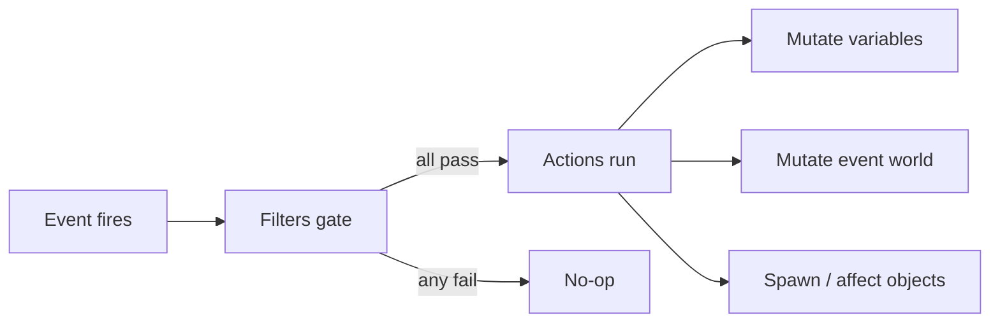

# Scenario / modding system

> How-to companions: [Author a scenario](../guide-author-scenario/) to write one
> in RON with existing primitives, or [Extend the scenario engine](../guide-extend-scenarios/)
> to add new event, filter, action, or object kinds in Rust.

`crates/nova_scenario` is the data-driven scenario engine, the layer for
missions, objectives, and reactive world behavior. A scenario is a list of
event handlers; each pairs an event with filters (all must pass) and actions
(run in order). It builds on `GameEventsPlugin`/`EventWorld` from
`bevy-common-systems`; nova provides `NovaEventWorld` and the enums below.

## Scenario structure

- `ScenarioConfig` - `id`, `name`, `description`, `cubemap` (skybox), `events`.
- `ScenarioEventConfig` - one handler: `name: EventConfig`, `filters`, `actions`.
- `GameScenarios(HashMap<ScenarioId, ScenarioConfig>)` - all known scenarios,
  populated by `nova_assets` (ready at `GameAssetsStates::Loaded`).
- `CurrentScenario(Option<ScenarioConfig>)` - the loaded scenario, if any. The
  `scenario_is_live` run condition gates the ship input/section sets on it.

## Loading / unloading (`loader.rs`)

- `LoadScenario(ScenarioConfig)` - trigger to load: look one up in
  `GameScenarios`, `commands.trigger(LoadScenario(cfg.clone()))` (see
  `examples/gameplay/scenario.rs`). Load tears down the previous scenario, spawns
  the camera, light, input context, one handler per event, fires `OnStart`.
- `ScenarioLoaded` - fired after a load; carries `scenario_id`,
  `handler_count`, `object_count` for smoke-test assertions.
- `UnloadScenario` - tears everything down and clears `CurrentScenario`.
- `ScenarioScopedMarker` - any entity carrying it is despawned (recursively)
  on load/unload. Teardown also runs `NovaEventWorld::clear()` and clears all
  HUD hint emphasis.

Cleanup contract: every entity spawned while a scenario is live must (1) carry
`ScenarioScopedMarker` (all scenario objects do), (2) carry a marker
registered with `on_add_entity_with` (`MeshFragmentMarker`,
`TurretBulletProjectileMarker`, `TorpedoProjectileMarker`), (3) be a child of
a scoped entity, (4) be a self-expiring `TempEntity`, or (5) be torn down by a
`Remove` observer (the HUDs on `PlayerSpaceshipMarker`). Anything else leaks.

## Events (`EventConfig` -> `nova_events`)

| `EventConfig`  | Fires when |
|----------------|------------|
| `OnStart`      | once, right after a scenario loads |
| `OnUpdate`     | every frame while a scenario is live and unpaused (frozen behind the pause menu / outcome frame) |
| `OnDestroyed`  | an entity is destroyed |
| `OnEnter`      | a body enters an area/zone |
| `OnExit`       | a body leaves an area/zone |
| `OnOrbit`      | a ship has held an engaged autopilot ORBIT around a well for the hold window (default 5s); re-fires every further window while the hold continues |
| `OnTravelLock` | the player's TRAVEL lock lands on a scenario object; re-fires every re-fire window (default 5s) while held |
| `OnCombatLock` | same as `OnTravelLock` for the COMBAT lock (player only; AI locks never fire it) |

Entities carry `EntityId(String)` and `EntityTypeName(String)`. Pair events all
have the same filter shape - a subject `id` and an `other_id`/`other_type_name`
- though which entity is the subject is per-event (area vs ship, well vs ship,
target vs locker; see the Filters section). The recurrence is deliberate: a
one-shot event consumed while a beat guard rejects it would soft-lock the
script; gated handlers make repeats no-ops.

Both 5s windows are the default and can be overridden per ship in RON (the
value is seconds; a non-positive/non-finite value is a `content lint` error and
is ignored at runtime):

- `OnOrbit` hold: `orbit_hold_secs: Some(8.0)` on an AI controller (only
  meaningful alongside its `orbit` directive) -
  `controller: AI((orbit: Some("planetoid"), orbit_hold_secs: Some(8.0)))`.
- `OnTravelLock`/`OnCombatLock` re-fire: `lock_refire_secs: Some(8.0)` on the
  player controller - `controller: Player((lock_refire_secs: Some(8.0)))`.

Both windows are measured against the scenario clock (below), so they freeze
under pause and reset on retry with the rest of the scenario.

The event-driven pipeline reads like this: an event fires, its filters gate
whether it proceeds, and if they all pass its actions run in order and mutate
scenario state.



## Filters (`EventFilterConfig`)

- `Entity(EntityFilterConfig)` - match the event's PRIMARY entity (`id` /
  `type_name`, the subject) and its OTHER party (`other_id` / `other_type_name`);
  which entity is which is per-event (for `OnEnter`, `id` is the area and
  `other_id` the body that entered). Each field optional, all set fields must
  match, and the fields are read for FILTERING only - never passed to actions.
  Per-event table + examples in
  [Author a scenario](../guide-author-scenario/#entity).
- `Expression(ExpressionFilterConfig)` - evaluate a `VariableConditionNode`
  against the scenario variables.
- `Conditional(ConditionalFilterConfig)` - `Not` / `And` / `Or` combinators;
  build with `ConditionalFilterConfig::not/and/or(...)`.

## Actions (`EventActionConfig`)

- `DebugMessage` - log a message.
- `VariableSet` - evaluate an expression into a scenario variable.
- `Objective` / `ObjectiveComplete` - add or complete a HUD objective by id.
- `ObjectiveMarkerAttach` / `ObjectiveMarkerDetach` - add/remove the gold
  marker chip (label + distance) on the scoped object by id; a despawned
  target detaches implicitly.
- `HintEmphasisSet` / `HintEmphasisClear` - pulse one keybind-hint row gold
  (verbs: STOP, GOTO, ORBIT, CANCEL, RADAR, COMPONENT, RCS); availability never
  changes, and teardown clears all emphasis.
- `SpawnScenarioObject(ScenarioObjectConfig)` - spawn an object (see below).
- `DespawnScenarioObject` - despawn the scoped object whose id matches
  (scoped-only lookup, so ship sections with colliding ids are safe).
- `SetSpeedCap` - install (`Some(cap)`) or remove (`None`) the manual
  `FlightSpeedCap` on a scoped ship by id.
- `SetControllerVerb` - enable/disable one flight verb (STOP/GOTO/ORBIT/LOCK/RCS)
  on a scoped ship's controller sections by id.
- `CreateScenarioArea(ScenarioAreaConfig)` - spawn a spherical sensor zone
  (id, name, position, rotation, radius) that drives `OnEnter`/`OnExit`.
- `NextScenario` - queue a switch to another scenario by id; `linger: true`
  defers the switch until something clears the flag (the Enter/DPadDown
  scenario-advance input, or the outcome overlay's Continue/Retry button).
- `Outcome { outcome, message? }` - declare the scenario's win/lose: shows the
  outcome overlay (gold VICTORY / red DEFEAT banner, the optional message, and
  buttons) and freezes the simulation behind it the same way the pause menu
  does - the app enters `PauseStates::Paused` while the outcome is set, so
  physics, AI, weapons and timers stop until it clears (the overlay's own
  buttons and the [Enter] advance stay live). Presentation only; compose what
  happens next from the existing vocabulary: pair with `NextScenario(linger:
  true)` so Continue/Retry (or Enter) rides the queued switch, or queue nothing
  and the overlay offers only Main Menu (Enter exits there too). In strict RON
  the optional message keeps its variant: `Outcome((outcome: Defeat, message:
  Some("...")))`. Cleared by scenario teardown like emphasis and objectives
  (clearing it also releases the pause).
- `SetCamera { position, look_at }` - pose the scenario camera (the
  `ScenarioCameraMarker` entity) at `position` looking at `look_at`. It drops
  `WASDCameraController` so the scripted pose holds - the free-fly controller's
  `sync_transform` would otherwise overwrite the camera `Transform` every frame
  (same swap the player-ship-spawn observer does). No-op with a warning if no
  scenario camera is present. Part of the in-engine photo-mode surface.
- `Screenshot { path }` - capture the primary window to a PNG at `path`, built
  on Bevy's `Screenshot::primary_window()` + `save_to_disk` (no capture crate).
  A relative `path` resolves under the `NOVA_SHOT_DIR` env var when set (so an
  example or a packaging script can redirect all captures to a staging folder),
  else it is relative to the working directory; the parent dir is created if
  missing. Pair `SetCamera` (pose) + settle frames + `Screenshot` (capture) to
  script a framed shot; the screenshot-reel example drives exactly this.
- `SetSkybox { cubemap, brightness? }` - swap the scenario's skybox cubemap
  mid-scenario (a modding hook). `cubemap` is authored as an asset path (the same
  `AssetRef` layer the scenario's initial `cubemap` uses); `brightness` is
  optional and keeps the current value when omitted. The install is deferred: the
  action tags the scenario camera with a `PendingSkyboxSwap`, and
  `apply_pending_skybox_swaps` inserts the real `SkyboxConfig` only once the new
  image has loaded, because the skybox setup observer reads the image immediately
  and would panic on a not-yet-loaded handle. A failed load leaves the sky
  unchanged (warned); no scenario camera present is a no-op.

## Variables and the event world (`world.rs`, `variables.rs`)

`NovaEventWorld` holds the scenario state: variables, objectives,
`next_scenario`, and a queue of deferred command closures. Filters and actions
mutate only this resource, never the Bevy `World`; world access goes through
`world.push_command(|commands| ...)`. Each frame `state_to_world_system` syncs
objectives into `GameObjectives` (write-on-diff), runs a queued non-lingering
`NextScenario` switch, and flushes the command queue.

Variables are typed literals (`String`, `Number`, `Boolean`) with a small
expression tree: `VariableExpressionNode` (add/subtract), `VariableTermNode`
(multiply/divide), `VariableFactorNode` (literal/name/parens);
`VariableConditionNode` (less/greater/equal) yields booleans for filters.

### Transition pacing (the three gears)

A scenario switch has three speeds (task 20260717-163050):

- **Hard cut** - `NextScenario((scenario_id: "x", linger: false))`:
  instant. Never pair it with an `Outcome` in the same handler (the
  teardown swallows the overlay; content lint warns).
- **Delayed cut** - `NextScenario((scenario_id: "x", linger: false,
  delay: Some(4.0)))`: the world keeps playing for the delay (a story
  line can land and be read), then cuts. Ticks on virtual
  (pause-frozen) time, so a player pausing holds the cut. Non-positive or
  omitted = instant.
- **Modal hold** - `Outcome((...))` + `NextScenario((..., linger:
  true))`: the banner freezes the sim and Continue/Retry releases the
  chain. Add `auto_advance_secs: Some(6.0)` to the Outcome for a TIMED
  banner: it advances by itself after that many real seconds (the pause
  stops virtual time, not the wall clock) - the player can still click
  sooner.

### Story pacing (`StoryMessage` and the comms queue)

Story lines display through a PACED queue (task 20260717-163033), not
latest-wins: lines show in arrival order with a fade and a comms blip,
each holds ~8s but yields to a waiting line after 4s; at most 4 lines
wait (oldest dropped; the full log stays in the feed). Author an
optional per-line hold with strict-RON `Some`:

```ron
StoryMessage((speaker: "Foreman Okono", text: "Read this slowly.", dwell: Some(15.0))),
```

`dwell` clamps to [3, 30] seconds (content lint warns outside it). The
queue means a two-line beat is READ as two beats - but prefer one line
per beat anyway (the beat-sheet convention); the queue is the safety
net, not the style.

### The scenario clock (`scenario_elapsed`)

The engine maintains one RESERVED variable: `scenario_elapsed`, the seconds
of live, unpaused scenario time (`tick_scenario_clock` in `loader.rs`,
chained ahead of the `OnUpdate` pulse under the same live+unpaused gate, so
pausing freezes both together). It clears at teardown with the rest of the
event world - it is the current scenario's clock, and a retry restarts it.
Gate on it from any expression filter; never write it (the engine rewrites
it every tick, and `content lint` errors on an authored `VariableSet` to
it). A read before the first tick fails closed like any undefined variable.

A one-shot timed beat is the clock threshold plus your own fired-flag:

```ron
filters: [
    Expression((GreaterThan(
        Term(Factor(Name("scenario_elapsed"))),
        Term(Factor(Literal(Number(30.0)))),
    ))),
    Expression((Equal(
        Term(Factor(Name("beat_fired"))),
        Term(Factor(Literal(Number(0.0)))),
    ))),
],
actions: [
    VariableSet((key: "beat_fired", expression: Term(Factor(Literal(Number(1.0)))))),
    // ... the beat ...
],
```

Seed `beat_fired: 0` in `OnStart` (an unseeded gate fails closed forever).

A repeating wave is the same shape gating on `elapsed > next_at`, rearmed
inside its own action (seed `next_at` in `OnStart` too):

```ron
filters: [
    Expression((GreaterThan(
        Term(Factor(Name("scenario_elapsed"))),
        Term(Factor(Name("next_at"))),
    ))),
],
actions: [
    VariableSet((
        key: "next_at",
        expression: Add(Factor(Name("next_at")), Term(Factor(Literal(Number(30.0))))),
    )),
    // ... spawn the wave ...
],
```

You can also SNAPSHOT the clock into your own variable to measure a
duration since an event (`VariableSet((key: "ambush_started", expression:
Term(Factor(Name("scenario_elapsed")))))`, then gate on
`elapsed > ambush_started + grace` via an `Add` expression) - reading the
reserved key is always fine; only writing it is gated. The example mod's
arena ships a timed comms nudge and a timed bonus spawn as copyable worked
examples.

## Scenario objects (`objects/`, `ScenarioObjectKind`)

All share `BaseScenarioObjectConfig` (id, name, position, rotation) and spawn
scoped, interpolated, dynamic bodies via `base_scenario_object`.

- `Asteroid(AsteroidConfig)` - radius, texture, health, `surface_gravity`
  override, `invulnerable` (no health node, so its gravity well cannot die),
  `lock_signature` override.
- `Spaceship(SpaceshipConfig)` - sections plus a `SpaceshipController`:
  `None`, `Player` (input mapping, optional `speed_cap`, `infinite_ammo`,
  optional `lock_refire_secs`), or `AI` (patrol route, orbit directive,
  optional `leash` break-off radius, optional `orbit_hold_secs`, optional
  `engage_delay: Some(secs)` arrival grace - the ship flies its passive
  routine and refuses to engage until the delay elapses, going hot
  immediately and permanently if shot; pair it with a clock-spaced
  warning story beat so enemies ARRIVE instead of appearing: `elapsed >
  T` announce line -> spawn far with `engage_delay` covering the
  approach -> the fight starts when the player has read the warning).
  Section geometry is linted: overlapping unit-cube cells and a
  turret/torpedo mount whose base (local -Y under its rotation) points at
  an empty neighbor cell are `content lint` errors (see the authoring
  guide's sharp edges). See [Ship sections (internals)](../sections/).
- `Beacon(BeaconConfig)` - nav waypoint with an automatic HUD chip: label,
  radius, color, optional `lock_signature`, optional `area_radius` (the
  beacon doubles as its own `OnEnter`/`OnExit` trigger).
- `SalvageCrate(SalvageCrateConfig)` - proximity pickup (`size`,
  `area_radius`): flying through fires `OnEnter` under the crate's id; pair
  with `DespawnScenarioObject` and a counter variable.

## Built-in scenarios

`crates/nova_assets/src/scenario.rs` builds `asteroid_field`, `asteroid_next`,
and `menu_ambience` in Rust; `scenario/shakedown.rs` adds `shakedown_run`, the
New Game starter and the beat-chain reference: one `beat` counter gates every
handler, and count milestones run on `OnUpdate` handlers keyed on the counter
(handler order within one event is not load-bearing). Loading scenarios from
data files instead of Rust is still a TODO.

## Adding new pieces

- Event: event + info structs in `nova_events/src/lib.rs`, an `EventConfig`
  variant in `events.rs`, and something that fires it (engine-driven events
  live in `loader.rs`, area events in `objects/area.rs`).
- Action: config struct + `EventAction<NovaEventWorld>` impl in `actions.rs`,
  plus an `EventActionConfig` variant.
- Filter: same pattern in `filters.rs` (`EventFilterConfig`).
- Object: a module under `objects/` (config + bundle function, plugin in
  `objects/mod.rs`) plus a `ScenarioObjectKind` variant/match in `actions.rs`.
