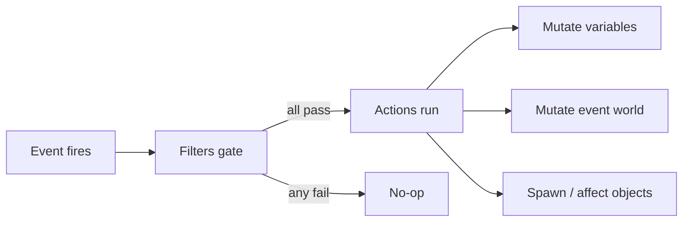

# Scenario / modding system

> How-to companions: [Create your first scenario](../../modding/author-a-scenario/) to write one
> in RON with existing primitives, or [Extend the scenario engine](../guide-extend-scenarios/)
> to add new event, filter, action, or object kinds in Rust. The exhaustive
> construct-by-construct catalog for authors is the
> [modding reference](../../modding/reference/); this page is the engine's
> internals.

`crates/nova_scenario` is the data-driven scenario engine, the layer for
missions, objectives, and reactive world behavior. A scenario is a list of
event handlers; each pairs an event with filters (all must pass) and actions
(run in order). It builds on `GameEventsPlugin`/`EventWorld` from
`nova_events`; nova_scenario provides `NovaEventWorld` and the enums below.

## Scenario structure

- `ScenarioConfig` - `id`, `name`, `description`, `cubemap` (skybox), `events`.
- `ScenarioEventConfig` - one handler: `name: EventConfig`, `filters`, `actions`.
- `GameScenarios(HashMap<ScenarioId, ScenarioConfig>)` - all known scenarios,
  populated by `nova_assets` (ready at `GameAssetsStates::Loaded`).
- `CampaignConfig` - `id`, `name`, `scenarios` (ordered member scenario ids,
  hidden ones allowed); a first-class content kind (`Campaign((..))`).
- `GameCampaigns(HashMap<CampaignId, CampaignConfig>)` - all known campaigns, the
  ordered campaign->scenario mapping the Scenarios picker groups/launches by,
  populated by `nova_assets` alongside `GameScenarios`.
- `CurrentScenario(Option<ScenarioConfig>)` - the loaded scenario, if any. The
  `scenario_is_live` run condition gates the ship input/section sets on it.

## Loading / unloading (`loader/`)

- `LoadScenario(ScenarioConfig)` - trigger to load: look one up in
  `GameScenarios`, `commands.trigger(LoadScenario(cfg.clone()))` (see
  `examples/systems/scenario_grammar.rs`). Load tears down the previous scenario, spawns
  the camera, input context, one handler per event, fires `OnStart`. No engine
  light: a scene is lit by the `Light` objects it authors, and one that authors
  none renders black.
- `ScenarioLoaded` - fired after a load; carries `scenario_id`,
  `handler_count`, `object_count` for smoke-test assertions.
- `UnloadScenario` - tears everything down and clears `CurrentScenario`.
- `ScenarioScopedMarker` - any entity carrying it is despawned (recursively)
  on load/unload. Teardown also runs `NovaEventWorld::clear()` and clears all
  HUD hint emphasis.

Cleanup contract: every entity spawned while a scenario is live must (1) carry
`ScenarioScopedMarker` (all scenario objects do), (2) carry `TempEntity` -
`register_scenario_scoping` tags every transient with `ScenarioScopedMarker` the
moment it declares a lifetime, so projectiles, blasts, debris and blast
cosmetics all die with their scenario, (3) be a child of a scoped entity, or
(4) be torn down by a `Remove` observer (the HUDs on `PlayerSpaceshipMarker`).
Anything else leaks.

A `TempEntity` does NOT clean itself up reliably: its countdown runs on
`Time<Virtual>`, which the pause menu and the outcome overlay STOP. A torpedo
blast that fuzed on the frame the player died lived through the whole Defeat
overlay, survived Retry, and destroyed the reloaded scenario's asteroid (task
20260816-103226). Scoping ON the lifetime component, rather than trusting the
lifetime to run out, is what closes that.

## Events (`EventConfig` -> `nova_events`)

| `EventConfig`  | Fires when |
|----------------|------------|
| `OnStart`      | once, right after a scenario loads |
| `OnUpdate`     | every frame while a scenario is live and unpaused (frozen behind the pause menu / outcome frame) |
| `OnTimerEnd`   | once when a keyed scenario timer reaches its deadline |
| `OnDefeated`   | once when a ship is neutralized or directly destroyed; precedes the detailed edge |
| `OnDestroyed`  | an entity is physically destroyed |
| `OnNeutralized` | a ship that was armed loses ALL working weapons, or the flight computer it once had (thrusters play no part) - combat-dead even with its hull intact; the ship is NOT despawned |
| `OnEnter`      | a body enters an area/zone |
| `OnExit`       | a body leaves an area/zone |
| `OnOrbitStart` / `OnOrbitStable` / `OnOrbitUnstable` / `OnOrbitEnd` | one-shot ORBIT maneuver and Hold-phase transitions; destruction does not synthesize orbit edges |
| `OnTravelLockStart` / `OnTravelLockEnd` | the player's TRAVEL lock lands on or leaves a scenario object |
| `OnCombatLockStart` / `OnCombatLockEnd` | the player's COMBAT lock lands on or leaves a scenario object; AI locks never fire these |

Entities carry `EntityId(String)` and `EntityTypeName(String)`. Pair events all
have the same filter shape - a subject `id` and an `other_id`/`other_type_name`
- though which entity is the subject is per-event (area vs ship, well vs ship,
target vs locker; see the Filters section). Lock lifecycle events are one-shot
edges. A target switch queues end-old, then start-new.

Orbit lifecycle has no hidden timer; scenarios compose `OnOrbitStable` /
`OnOrbitUnstable` / `OnOrbitEnd` with keyed timers when they require a
continuous hold.

The event-driven pipeline reads like this: an event fires, its filters gate
whether it proceeds, and if they all pass its actions run in order and mutate
scenario state.


```mermaid
flowchart LR
  Event["Event fires"] --> Filters["Filters gate"]
  Filters -->|all pass| Actions["Actions run"]
  Filters -->|any fail| Stop["No-op"]
  Actions --> Vars["Mutate variables"]
  Actions --> World["Mutate event world"]
  Actions --> Objects["Spawn / affect objects"]
```

## Filters (`EventFilterConfig`)

- `Entity(EntityFilterConfig)` - match the event's PRIMARY entity (`id` /
  `type_name`, the subject) and its OTHER party (`other_id` / `other_type_name`);
  which entity is which is per-event (for `OnEnter`, `id` is the area and
  `other_id` the body that entered). Each field optional, all set fields must
  match, and the fields are read for FILTERING only - never passed to actions.
  Per-event table + examples in
  [Create your first scenario](../../modding/author-a-scenario/#4-events-filters-and-actions).
- `Timer(TimerFilterConfig)` - match an `OnTimerEnd` payload by its keyed timer name.
- `Expression(ExpressionFilterConfig)` - evaluate a `VariableConditionNode`
  against the scenario variables.
- `Conditional(ConditionalFilterConfig)` - `Not` / `And` / `Or` combinators;
  build with `ConditionalFilterConfig::not/and/or(...)`.

## Actions (`EventActionConfig`)

- `DebugMessage` - log a message.
- `VariableSet` - evaluate an expression into a scenario variable.
- `TimerStart` / `TimerCancel` - start, restart, or cancel a keyed scenario
  timer. Timers use the pause-frozen scenario clock; expiry removes the key
  before firing `OnTimerEnd`.
- `Objective` / `ObjectiveComplete` - add or complete a HUD objective by id.
- `ObjectiveMarkerAttach` / `ObjectiveMarkerDetach` - add/remove the gold
  marker chip (label + distance) on the scoped object by id; a despawned
  target detaches implicitly.
- `HintEmphasisSet` / `HintEmphasisClear` - pulse one keybind-dock chip gold
  (verbs: STOP, GOTO, ORBIT, CANCEL, RADAR, COMPONENT, RCS); availability never
  changes, and teardown clears all emphasis. The dock hides verbs you cannot
  use, so an emphasis on an unavailable verb REVEALS its chip (pulsing in the
  dim band) - that is how a tutorial points at a key before it lights up.
- `SpawnScenarioObject(ScenarioObjectConfig)` - spawn an object (see below).
- `ScatterObjects(ScatterObjectsConfig)` - seeded scatter of many objects in a
  zone (the base asteroid fields); a fixed try budget keeps separation
  best-effort.
- `DespawnScenarioObject` - despawn the scoped object whose id matches
  (scoped-only lookup, so ship sections with colliding ids are safe).
- `SetSpeedCap` - install (`Some(cap)`) or remove (`None`) the manual
  `FlightSpeedCap` on a scoped ship by id.
- `SetControllerVerb` - enable/disable one flight verb (STOP/GOTO/ORBIT/LOCK/RCS)
  on a scoped ship's controller sections by id.
- `SetAllegiance` - overwrite a scoped ship's `Allegiance` (Player/Enemy/Neutral)
  by id at runtime; the neutral-until-provoked primitive (wake a Neutral ship
  by flipping it to Enemy).
- `ForceTorpedoLaunch` - order a scoped ship's torpedo bays to launch at a
  named target (`ScriptedTorpedoOrder`): the scripted counterpart of the AI's
  launch decision for controller-less emplacements; bay cooldown/ammo still
  gate the launch, the AI envelope/LOS/cadence gates do not apply, and a
  missing target skips the launch.
- `CreateScenarioArea(ScenarioAreaConfig)` - spawn a spherical sensor zone
  (id, name, position, rotation, radius) that drives `OnEnter`/`OnExit`.
- `NextScenario` - queue a switch to another scenario by id; `linger: true`
  defers the switch until something clears the flag (the Enter/DPadDown
  scenario-advance input, or the outcome overlay's Continue/Retry button).
- `Outcome { outcome, message? }` - declare the scenario's win/lose: shows the
  outcome overlay (gold VICTORY / red DEFEAT banner, the optional message, and
  buttons) and freezes the simulation behind it the same way the pause menu
  does - the app enters `PauseStates::Paused` while the outcome is set, so
  physics, AI, weapons and timers stop until it clears (the overlay's own
  buttons and the [Enter] advance stay live). Presentation only; compose what
  happens next from the existing vocabulary: pair with `NextScenario(linger:
  true)` so Continue/Retry (or Enter) rides the queued switch, or queue nothing
  and the overlay offers only Main Menu (Enter exits there too). In strict RON
  the optional message keeps its variant: `Outcome((outcome: Defeat, message:
  Some("...")))`. Cleared by scenario teardown like emphasis and objectives
  (clearing it also releases the pause).
- `SetCamera { position, look_at }` - pose the scenario camera (the
  `ScenarioCameraMarker` entity) at `position` looking at `look_at`. It drops
  `WASDCameraController` and pins the pose as a `ScriptedCameraPose`,
  re-enforced every frame in `CameraAuthoritySystems::Override` - both
  controllers keep writing the camera `Transform` otherwise
  (same swap the player-ship-spawn observer does). No-op with a warning if no
  scenario camera is present. Part of the in-engine photo-mode surface.
- `Screenshot { path }` - capture the primary window to a PNG at `path`, built
  on Bevy's `Screenshot::primary_window()` + `save_to_disk` (no capture crate).
  A relative `path` resolves under the `NOVA_SHOT_DIR` env var when set (so an
  example or a packaging script can redirect all captures to a staging folder),
  else it is relative to the working directory; the parent dir is created if
  missing. Pair `SetCamera` (pose) + settle frames + `Screenshot` (capture) to
  script a framed shot; the `screenshots/` examples drive exactly this, through
  the autopilot's `pose_camera` + settle + `shoot` step idiom (see the
  "Automation harness" page).
- `SetSkybox { cubemap, brightness? }` - swap the scenario's skybox cubemap
  mid-scenario (a modding hook). `cubemap` is authored as an asset path (the same
  `AssetRef` layer the scenario's initial `cubemap` uses); `brightness` is
  optional and keeps the current value when omitted. The install is deferred: the
  action tags the scenario camera with a `PendingSkyboxSwap`, and
  `apply_pending_skybox_swaps` inserts the real `SkyboxConfig` only once the new
  image has loaded, because the skybox setup observer reads the image immediately
  and would panic on a not-yet-loaded handle. A failed load leaves the sky
  unchanged (warned); no scenario camera present is a no-op.
- `HudReadout { slot, variable, format?, label?, visible? }` - show, update, or
  clear a named HUD readout bound to a scenario variable (the DISPLAY half of
  the scenario-variable vocabulary; `StoryMessage` is speaker text, this is a
  live number). `slot` is a stable id (update or clear just that one; run
  several side by side). `variable` names the scenario variable whose CURRENT
  value the readout shows, read live every frame - e.g. `scenario_elapsed` for a
  run clock, or any authored counter. `format` is `Number` (one decimal, the
  default), `Integer` (rounded, no decimals) or `Time` (`mm:ss.s`, e.g.
  `01:23.4`). `label` is an optional caption (e.g. `Some("TIME")`, shown
  upper-cased before the value). `visible` defaults to `true` (show/update);
  `false` clears the slot. One fire is enough for a live readout - it tracks the
  variable thereafter. The value freezes on pause and behind the outcome overlay
  because the bound variable does (`scenario_elapsed` stops ticking there), so a
  time-trial's FINAL time simply holds on the HUD through the Victory banner. It
  is an Instrument-tier widget (shown whenever the HUD is on) and clears
  at scenario teardown like the comms panel, so it cannot leak into the next
  scenario or the menu. RON:
  `HudReadout((slot: "run_timer", variable: "scenario_elapsed", format: Time, label: Some("TIME")))`;
  clear with `HudReadout((slot: "run_timer", variable: "scenario_elapsed", visible: false))`.

## Variables and the event world (`world.rs`, `variables.rs`)

`NovaEventWorld` holds the scenario state: variables, objectives,
`next_scenario`, and a queue of deferred command closures. Filters and actions
mutate only this resource, never the Bevy `World`; world access goes through
`world.push_command(|commands| ...)`. Each frame `state_to_world_system` syncs
objectives into `GameObjectives` (write-on-diff), runs a queued non-lingering
`NextScenario` switch, and drains the command queue.

The drain is CHUNKED, not one flush. A chapter's `OnStart` queues a closure per
object, and applying them together cost one ~300 ms frame - a frame nothing can
be drawn on, so the LOADING panel froze on the exact frames it exists to cover.
Commands are applied one at a time until `SPAWN_DRAIN_BUDGET` (3 ms) of the
frame is spent, so a big scene arrives over several frames and a slower machine
takes MORE FRAMES rather than a longer one. One command per apply is also what
keeps each object atomic: a ship's sections all land inside one apply, so the
`Added<SectionLinkPoints>` batch the integrity graph and the derived skin key
off is complete the first time they see it.

While commands remain, the scenario is SETTLING (`EventWorld::is_settling`).
The dispatcher holds every handler, and a handler that queues world work stops
the current pass, so no handler ever runs against a world known to be
incomplete. The scenario clock stops, keyed timers do not expire, watches are
not sampled, the `OnUpdate` pulse does not fire, and the LOADING panel stays up.
The world is not yet LIVE, rather than briefly inconsistent. Held events are not
dropped: they dispatch in order on the frame the world goes live.

Variables are typed literals (`String`, `Number`, `Boolean`) with a small
expression tree: `VariableExpressionNode` (add/subtract), `VariableTermNode`
(multiply/divide), `VariableFactorNode` (literal/name/parens);
`VariableConditionNode` (less/greater/equal) yields booleans for filters.

### Transition pacing (the three gears)

A scenario switch has three speeds (task 20260717-163050):

- **Hard cut** - `NextScenario((scenario_id: "x", linger: false))`:
  instant. Never pair it with an `Outcome` in the same handler (the
  teardown swallows the overlay; content lint warns).
- **Delayed cut** - `NextScenario((scenario_id: "x", linger: false,
  delay: Some(4.0)))`: the world keeps playing for the delay (a story
  line can land and be read), then cuts. Ticks on virtual
  (pause-frozen) time, so a player pausing holds the cut. Non-positive or
  omitted = instant.
- **Modal hold** - `Outcome((...))` + `NextScenario((..., linger:
  true))`: the banner freezes the sim and Continue/Retry releases the
  chain. Add `auto_advance_secs: Some(6.0)` to the Outcome for a TIMED
  banner: it advances by itself after that many real seconds (the pause
  stops virtual time, not the wall clock) - the player can still click
  sooner.

### Story pacing (`StoryMessage` and the comms stack)

Story lines display through a bottom-left CHAT stack, not latest-wins:
lines show in arrival order with a fade and a comms blip, newest at the
bottom and older lines pushed upward. Each card holds ~8s before fading;
at most 3 cards are visible and 4 more wait (oldest dropped; the full log
stays in the feed). The player can dismiss the oldest visible card with
<kbd>V</kbd> or skip queued backlog into view with <kbd>B</kbd>. Author an
optional per-line hold and icon with strict-RON `Some`:

```ron
StoryMessage((
    speaker: "Foreman Okono",
    text: "Read this slowly.",
    dwell: Some(15.0),
    icon: Some("self://icons/okono.png"),
)),
```

`dwell` clamps to [3, 30] seconds (content lint warns outside it). Omit
`icon` for the HUD fallback tile; authored icons are normal `AssetRef<Image>`
paths, so use `self://` for files listed by the same bundle or `dep://` for a
declared dependency. The stack means a burst is readable - but prefer one line
per beat anyway (the beat-sheet convention); the queue is the safety
net, not the style.

### Typed queries and watched variables

The engine exposes read-only world state through typed queries. A scenario can
sample a query each live, unpaused update into a watched variable. The watch
owns its variable name, so normal `Name("...")` expressions and HUD readouts
work while `VariableSet` writes are rejected.

```ron
watches: [
    (
        variable: "scenario_elapsed",
        query: Scenario((property: Elapsed)),
    ),
    (
        variable: "player_speed",
        query: Entity((
            filter: (id: "player_spaceship"),
            property: Speed,
        )),
    ),
],
```

The internal scenario clock always exists for timers. `Scenario(Elapsed)`
exposes it to content. `Entity` is strict-single: the id must match exactly one
entity with the required property. Missing or duplicate matches make the query
unavailable and expression gates fail closed. Watches freeze under pause and
clear at teardown; retries restart elapsed time.

A one-shot timed beat is the clock threshold plus your own fired-flag:

```ron
filters: [
    Expression((GreaterThan(
        Term(Factor(Name("scenario_elapsed"))),
        Term(Factor(Literal(Number(30.0)))),
    ))),
    Expression((Equal(
        Term(Factor(Name("beat_fired"))),
        Term(Factor(Literal(Number(0.0)))),
    ))),
],
actions: [
    VariableSet((key: "beat_fired", expression: Term(Factor(Literal(Number(1.0)))))),
    // ... the beat ...
],
```

Seed `beat_fired: 0` in `OnStart` (an unseeded gate fails closed forever).

A repeating wave is the same shape gating on `elapsed > next_at`, rearmed
inside its own action (seed `next_at` in `OnStart` too):

```ron
filters: [
    Expression((GreaterThan(
        Term(Factor(Name("scenario_elapsed"))),
        Term(Factor(Name("next_at"))),
    ))),
],
actions: [
    VariableSet((
        key: "next_at",
        expression: Add(Factor(Name("next_at")), Term(Factor(Literal(Number(30.0))))),
    )),
    // ... spawn the wave ...
],
```

You can also SNAPSHOT the clock into your own variable to measure a
duration since an event (`VariableSet((key: "ambush_started", expression:
Term(Factor(Name("scenario_elapsed")))))`, then gate on
`elapsed > ambush_started + grace` via an `Add` expression) - reading the
watched name is fine; writing it is rejected. The example mod's
arena ships a timed comms nudge and a timed bonus spawn as copyable worked
examples.

To SHOW the clock (or any variable) on the HUD, use `HudReadout` with the
`Time` format - `HudReadout((slot: "run_timer", variable: "scenario_elapsed",
format: Time, label: Some("TIME")))` in `OnStart` gives a live `mm:ss.s` run
clock that freezes at the final time behind the Victory overlay (the clock
stops ticking on pause). See `HudReadout` in the actions list. The Gauntlet
worked example wires exactly this as a time-trial with a clean-run bonus.

## Scenario patterns

The event vocabulary has no built-in "state" beyond scenario variables, so the
shipped mods build their control flow out of one numeric variable plus
`Expression` filters. Two idioms recur; both are worked end to end in the
[Gauntlet worked example](#the-gauntlet-worked-example) below. Excerpts here are
verbatim from `webmods/gauntlet/gauntlet.content.ron`.

### The gate-counter ordering pattern

A single numeric variable acts as a state machine that enforces ORDERED entry:
each stage's handler is guarded on the counter holding that stage's value, and
the last thing the handler does is bump the counter to arm the NEXT stage only.
An event that arrives out of order finds the counter on a different value and
does nothing.

Gauntlet's variable is `gate` (the index of the gate to thread next, `1..=7`).
`OnStart` seeds it:

```ron
VariableSet((
    key: "gate",
    expression: Term(Factor(Literal(Number(1.0)))),
)),
```

Each gate's `OnEnter` handler carries two filters - an `Entity` filter that
matches the area/body, and an `Expression` filter that pins the counter - so
only the in-order entry fires:

```ron
(
    name: OnEnter,
    filters: [
        Entity((
            id: Some("gauntlet_gate_1"),
            other_id: Some("player_spaceship"),
        )),
        Expression((Equal(
            Term(Factor(Name("gate"))),
            Term(Factor(Literal(Number(1.0)))),
        ))),
    ],
    actions: [
        ObjectiveComplete((id: "gate_1")),
        VariableSet((
            key: "gate",
            expression: Term(Factor(Literal(Number(2.0)))),
        )),
        // ... re-point the objective marker at gate 2 ...
    ],
),
```

Because gate 2's handler filters `Equal(gate, 2.0)`, flying through gate 3
early - or back through gate 1 again - matches no live handler and is inert. The
`scenario_gate_course` rig's
`gates_advance_only_in_order_and_only_for_the_named_ship` test pins exactly
this on a synthetic course: an out-of-order entry does not advance `gate`.

Use it whenever stages must be visited in sequence (a gate run, a guided tour, a
tutorial's step chain). The base `shakedown_run` starter uses the same idiom
with a `beat` counter; see [Built-in scenarios](#built-in-scenarios).

### The act-gating pattern

A post-decision event can otherwise flip an already-decided outcome: in Gauntlet
a wreck normally means Defeat, but a wreck that drifts into a rock AFTER the win
must not overwrite the earned Victory. The fix is to guard the Defeat handler on
the same counter, past a terminal value the winning handler sets.

The FINISH handler bumps `gate` one past the last real gate (to `8.0`, the
terminal done-state) as it declares Victory:

```ron
// Terminal: bump past the last gate so no OnEnter re-fires
// AND the player-death Defeat handler (gated gate < 8) can
// never flip an earned Victory to Defeat.
VariableSet((
    key: "gate",
    expression: Term(Factor(Literal(Number(8.0)))),
)),
Outcome((
    outcome: Victory,
    message: Some("You ran the gauntlet clean. ..."),
)),
```

The `OnDestroyed` Defeat handler is then guarded `gate < 8`, so a death blast
after the course is finished declares nothing:

```ron
(
    name: OnDestroyed,
    filters: [
        Entity((
            id: Some("player_spaceship"),
        )),
        Expression((LessThan(
            Term(Factor(Name("gate"))),
            Term(Factor(Literal(Number(8.0)))),
        ))),
    ],
    actions: [
        Outcome((
            outcome: Defeat,
            message: Some("You wore your hull down to nothing ..."),
        )),
        NextScenario((
            scenario_id: "gauntlet_run",
            linger: true,
        )),
    ],
),
```

The rig's `wrecking_after_the_win_declares_nothing` test seeds `gate` to `8.0`,
fires the death, and asserts no outcome and no retry. Use this whenever a lethal
event can still fire after the scenario is decided (a boss's death explosion
catching the player, a wreck sliding into a hazard): pick a terminal counter
value the winning handler sets, and guard every outcome handler against it.

### The Gauntlet worked example

`webmods/gauntlet` is the reference implementation for both patterns. Trace it
end to end:

- The content file `webmods/gauntlet/gauntlet.content.ron` - one NEW scenario,
  no base overrides; the gate-counter and act-gating idioms above live here with
  header comments explaining the two geometric invariants.
- The time-trial wiring: `OnStart` fires one `HudReadout` on `scenario_elapsed`
  (`Time` format) for a live `mm:ss.s` clock, and seeds a `crash` counter that
  hazard-zone `OnEnter` handlers bump on each graze. Crossing FINISH bumps `gate`
  to its terminal `8.0`, then TWO `crash`-gated `Outcome(Victory)` handlers fire
  in the same pulse (exactly one matches): `crash == 0` earns the CLEAN RUN
  banner, `crash > 0` the plain finish. The final time is shown by the frozen
  readout behind the banner (the clock stops on the outcome pause), so the banner
  text only has to vary the clean-run line - no message interpolation needed.
- The test rig `crates/nova_assets/tests/scenario_gate_course.rs` - authors a
  synthetic course as a RON string, drives the real handlers, and pins the
  ordered-gate sequencing, the repeatable penalty zone, the two counter-keyed
  win banners, the act-gating and the readout wiring. Run it with
  `cargo test -p nova_assets --test scenario_gate_course`. Geometry invariants
  (gate areas do not overlap; the racing line clears every rock's worst-case
  body past `ASTEROID_GEOMETRIC_FACTOR_MAX`) are a CONTENT concern, checked per
  bundle by `content lint`.
- The [first-scenario guide's completed flow](../../modding/author-a-scenario/#3-plan-one-short-story)
  is the gentler, single-counter cousin of the gate-counter pattern.

## Scenario objects (`objects/`, `ScenarioObjectKind`)

All share `BaseScenarioObjectConfig` (id, name, position, rotation) and spawn
scoped entities via `base_scenario_object`, which deliberately carries no body:
each kind declares its own `RigidBody` (only the asteroid and the spaceship
are dynamic), and the asteroid alone opts into `Dynamic` +
`TransformInterpolation`.

- `Anchor(AnchorConfig)` - an invisible point publishing a `GravityWell` with
  an AUTHORED `body_radius` (deterministic, unlike the asteroid's mesh-derived
  radius) and an optional `mass`; no mesh, no collider, no `BodyRadius` - an
  orbit-target / bodiless-gravity anchor for scenes that do not want a rock.
- `Asteroid(AsteroidConfig)` - radius, texture, health, `mass` (the body's
  `mu`: it alone sets both the pull `a = mu / r^2` and the sphere of influence,
  the distance where that decays to `GravitySettings::soi_cutoff_accel` - so
  author it by the SOI you want, `mu = soi_cutoff_accel * soi^2`),
  `invulnerable` (no health node, so its gravity well cannot die),
  `lock_signature` override, an optional `seed` pinning the noise silhouette
  (and so the derived `BodyRadius`) across runs, and optional per-spawn
  `impact_sound` / `destroy_sound`
  (`Some("dep://base/sounds/impact.wav")` / `explosion.wav`) so
  a scenario rock can carry its own hit and death audio, the same surface a
  section's `base` block exposes. Spawned ship sections take the same two
  fields; see [Ship sections for mods](../../modding/sections/).
- `Spaceship(SpaceshipConfig)` - sections plus a `SpaceshipController`:
  `None`, `Player` (input mapping, optional `speed_cap`, and `infinite_ammo` -
  a debug-only cheat a shipped build ignores), or
  `AI` (patrol route, orbit directive,
  optional `leash` break-off radius, optional
  `engage_delay: Some(secs)` arrival grace - the ship flies its passive
  routine and refuses to engage until the delay elapses, going hot
  immediately and permanently if shot; pair it with a clock-spaced
  warning story beat so enemies ARRIVE instead of appearing: `elapsed >
  T` announce line -> spawn far with `engage_delay` covering the
  approach -> the fight starts when the player has read the warning;
  optional `engage_range` hostile-detection override (`AIEngageRange`),
  `pd_range` point-defense override (`AIPointDefenseRange`),
  `waypoint_slack` patrol-arrival override (`AIWaypointSlack`), and
  `arrival_standoff` GOTO-rest override (`FlightArrivalStandoff`)). The
  ship-level `collapse_threshold: Some(0.1)` overrides the structural-collapse
  fraction (`StructuralCollapseThreshold`, default 0.25): the share of the hull
  a ship was BUILT with below which it comes apart on its own.
  Section geometry is linted: overlapping unit-cube cells and a
  turret/torpedo mount whose base (local -Y under its rotation) points at
  an empty neighbor cell are `content lint` errors (see the authoring
  guide's sharp edges). See [Ship sections (internals)](../sections/).
- `Beacon(BeaconConfig)` - nav waypoint with an automatic HUD chip: label,
  radius, color, optional `lock_signature`, optional `area_radius` (the
  beacon doubles as its own `OnEnter`/`OnExit` trigger).
- `SalvageCrate(SalvageCrateConfig)` - proximity pickup (`size`,
  `area_radius`): flying through fires `OnEnter` under the crate's id; pair
  with `DespawnScenarioObject` and a counter variable.
- `Light(LightConfig)` - the scene's own lighting (`objects/light.rs`), an
  ordinary spawned kind. Load-bearing: a scenario that spawns no `Light`
  renders black - the engine no longer supplies one.

## Built-in scenarios

The builders live under
`crates/nova_authoring/src/base_content/scenarios/`. `sandbox/` owns
`asteroid_field` and `asteroid_next`; `main_menu/` gives each menu backdrop its
own file; and `nova_protocol/` owns the campaign chapters plus shared cast and
pacing vocabulary. Its `shakedown/` module builds the New Game starter - the
beat-chain reference: one `beat` counter gates every handler, and count
milestones run on `OnUpdate` handlers keyed on the counter (handler order
within one event is not load-bearing). The builders are an OFFLINE inventory,
not the runtime path: `content -- gen` serializes them to
the committed `assets/base/scenarios/*.content.ron`, `base.bundle.ron` lists
them, and `crates/nova_assets/src/merge.rs` merges the parsed RON into
`GameScenarios` like any mod's. `content_ron_parity` pins builders == RON.

## Adding new pieces

- Event: event + info structs in `nova_events/src/lib.rs`, an `EventConfig`
  variant in `events.rs`, and something that fires it (engine-driven events
  live in `loader/` - `OnStart` in `lifecycle.rs`, `OnUpdate` in `clock.rs`,
  the orbit/lock trackers in `trackers.rs`; area events in `objects/area.rs`;
  `OnNeutralized` fires from `nova_gameplay`'s integrity stack).
- Action: config struct + `EventAction<NovaEventWorld>` impl in the right
  `actions/` submodule (`flow`/`mission`/`ship`/`spawn`/`view`), plus an
  `EventActionConfig` variant in `actions/mod.rs`.
- Filter: same pattern in `filters.rs` (`EventFilterConfig`).
- Object: a module under `objects/` (config + bundle function, plugin in
  `objects/mod.rs`) plus a `ScenarioObjectKind` variant/match in
  `actions/spawn.rs`.
