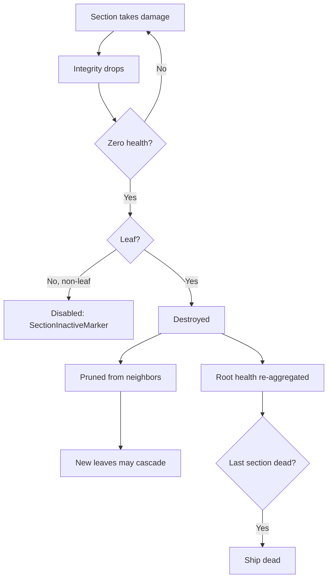

# Spaceship sections and integrity

> To add a new section kind, follow the guide
> [Add a ship section](../guide-add-section/).

Ships are assembled from modular **sections**. Each section is a child entity of
the ship root with its own collider, mass, and health, and contributes one
behavior (structure, thrust, steering, guns). The **integrity** system tracks
how sections connect and handles damage, disabling, and cascading destruction.

## Sections (`nova_ship::sections`)

A section is a `SectionConfig { base: BaseSectionConfig, kind: SectionKind }`.
`BaseSectionConfig` is shared by all kinds: `id`, `name`, `description`, `mass`,
`health`, optional `collider`, structural `link_points`, and `hide_in_editor`.

`SectionKind` variants (one module per kind under `crates/nova_ship/src/sections/`;
`turret_section/` and `torpedo_section/` are directories, not single files):

| Kind         | What it does |
|--------------|--------------|
| `Hull`       | Passive structure/armor. Just a `render_mesh`. |
| `Thruster`   | Forward thrust (`magnitude`); drives the exhaust visual. |
| `Controller` | PD attitude controller (`frequency`, `damping_ratio`, `max_torque`). Also grants flight `verbs` (STOP/GOTO/ORBIT maneuvers plus LOCK targeting and RCS fine-translation). A ship needs one to be drivable. |
| `Turret`     | Aims and fires bullets. An authored joint tree (hinges + muzzles, each joint with its own `offset`/`axis`/`speed`/limits/`render_mesh`), section-wide `muzzle_speed` + authored `bullet_damage` + `bullet_kind`, per-muzzle `fire_rate`, optional `ammo_capacity`. |
| `Torpedo`    | Torpedo bay. Fires guided torpedoes that detonate an Explosive area blast (`blast_radius`, `blast_damage`), optional `ammo_capacity`. |

`GameSections(Vec<SectionConfig>)` is the resource of section blueprints.
Generic prototypes are authored in
`crates/nova_authoring/src/base_content/sections/standard.rs`; semantic craft
parts live under `base_content/ships/`. Their explicit `section_catalog()` is
generated into `assets/base/sections/base.content.ron` by `content -- gen` and
merged into the resource by
`crates/nova_assets/src/merge.rs`. Look one up with
`sections.get_section("basic_thruster_section")`.

### Meshes and colliders (authorable)

Two authorable knobs decouple a section's look and physics from the default unit
cube (`crates/nova_ship/src/sections/base_section.rs`). Unset content still uses
the unit-cube defaults:

- `render_mesh_transform` (optional, on every mesh-bearing kind; for turrets
  it sits per JOINT in the joint tree) - an offset /
  rotation / scale applied to the section's render mesh child ONLY, so a model
  can be re-seated visually without moving the collider or (for turrets) the
  joint tree. Type `RenderMeshTransform`.
- `collider` on `BaseSectionConfig` (optional) - the physics shape:
  `Cuboid { size }`, `Sphere { radius }`, `Capsule { radius, length }`, or
  `Cylinder { radius, height }` (the last three along local Y). `None` resolves
  to the unit cube (`Cuboid { size: (1,1,1) }`) - the shape every section had
  before colliders were authorable. Section mass is `density * collider_volume`,
  so a larger collider is also heavier.

## Building a ship

A `SpaceshipConfig` (`crates/nova_scenario/src/objects/spaceship.rs`) has a
`controller` (`None`, `Player`, or `AI`), an `allegiance`, and a list of
`SpaceshipSectionConfig`, each placing one section at a `position` + `rotation`
relative to the ship root (world units), with a `source` (`Inline` /
`Prototype`) and optional `modifications`. The player
config carries the input mapping (section id -> key/gamepad bindings) plus
`speed_cap` and `infinite_ammo`; the AI config carries `patrol`/`orbit`/`leash`/`engage_delay`.

Spawning: the base scenario bundle gives the root `RigidBody::Dynamic`; the
spaceship object adds `SpaceshipRootMarker`, and an observer
(`insert_spaceship_sections`) spawns each section as a direct child. Every
section gets `SectionMarker`, its `Collider` (the authored `collider` shape, or
a unit cube by default), `SectionLinkPoints`, `ConnectedTo`, and `Health` (`base_section` in
`sections/base_section.rs`), so the ship is one rigid body whose child colliders
each carry their own health.

See the semantic Racer, CargoA, and CargoB builders under
`crates/nova_authoring/src/base_content/ships/` for complete generated examples.
The editor (`crates/nova_editor`) assembles ships interactively using
`preview_section`, which has no health or rigid body and never enters the
damage pipeline.

## Integrity: damage -> disable -> destroy

The destruction stack is nova's own, in
`crates/nova_gameplay/src/integrity/`, with the ship adapter in
`crates/nova_ship/src/sections/integrity.rs`. `NovaIntegrityPlugin` composes five
generic pieces:

- `health.rs` - the hit-point store: `Health`, `HealthApplyDamage` and the
  `HealthZeroMarker` its observer adds at zero.
- `core.rs` (`IntegrityCorePlugin`) - the generic disable/destroy core, plus
  the mass-times-velocity impact damage.
- Ship-owned `ShipIntegrityPlugin` - derives the section graph, handles disabled
  sections, and rolls section health up to the ship root.
- `explode.rs` - reacts to destruction: debris, mesh fragments, `OnDestroyedEvent`.
- `neutralize.rs` - combat-death: fires `OnNeutralized` when a ship stops
  being a threat.

Graph build: every section prototype authors local `link_points` with an id,
position, and outward unit normal. When avian links a collider to its body
(`ColliderOf`), `ShipIntegrityPlugin` transforms those points into ship-root
space. Coincident points with opposed normals become symmetric `ConnectedTo`
neighbor edges. IDs are for diagnostics and UI, not compatibility. A malformed,
ambiguous, or disconnected graph is rejected as a whole; collider contact and
center distance never create fallback edges. `SpaceshipRootMarker` declares the
body as `IntegrityRoot`. Asteroids declare the same root role and give their lone
collider node an empty list, so it is a leaf.

Editor placement mates the same sockets, so the editor cannot build a ship the
graph would reject. `snap_placement` (`nova_ship::sections::link_points`) poses a
part from one mate: the two sockets become coincident and their normals opposed,
which leaves only the ROLL about that axis free - the builder's choice, alongside
which of the part's own sockets does the mating. `candidate_link_point_mates` is
the same pairing WITHOUT the ambiguity and connectivity gates, because a ship
under assembly is legitimately disconnected; the editor uses it to see which
sockets are taken and to refuse a placement that would leave one with two
suitors. Collider bounds enter only as the overlap refusal, under the ship lint's
rule: interpenetration is allowed exactly where a mate says the interface is
intentional.

`scripts/cut-obj-into-parts.py` proposes candidates for freshly cut parts: two
parts whose bounds meet at a seam and overlap across it get one socket each at
the centre of that shared face, written into the part manifest as `link_points`.
A recipe part can author its own list instead (in ship space, like every other
recipe coordinate), which replaces the generated one. They are candidates for a
human to judge - shipped gameplay sockets stay hand-authored in `nova_authoring`.

Damage flow:

1. A hit triggers `HealthApplyDamage` (`nova_gameplay::integrity::health`);
   its observer subtracts the amount and adds `HealthZeroMarker` at zero. The amount also bubbles up `ChildOf`, clamped to
   what the section actually had left - so overkill on one section cannot kill
   the ship (a 1000 hit on a 100 hp section costs the root 100).
2. Zero health -> `IntegrityDisabledMarker`. A disabled non-leaf section is only
   deactivated (`SectionInactiveMarker`); a disabled **leaf** is destroyed.
3. Destruction prunes the node from its neighbors' lists, which can create new
   leaves and cascade: shooting off the structure collapses what hung from it.
4. `aggregate_ship_health` keeps the root's health equal to the sum of its
   living sections; when the last section dies, the root dies with it.

The cascade a single section walks through:

## Typed damage (`crates/nova_gameplay/src/damage.rs`)

Weapon damage is authored, not emergent from bullet physics. A projectile
carries `ProjectileDamage { amount, kind }` with a `DamageType`: `Kinetic`,
`ArmorPiercing`, `Emp`, or `Explosive`. On hit, the amount is scaled by a
`resistance(section class, damage type)` table (for example EMP is 3.0 vs the
Controller but 0.1 vs Hull; Kinetic is always 1.0) and only then applied via
`HealthApplyDamage`. Targets without a `SectionDamageClass` (asteroids) take
the raw amount. Turret bullets are given a near-zero physical mass so the
impact path's mass-times-velocity damage
(`on_impact_collision_deal_damage`, `integrity/core.rs`) is negligible;
torpedoes detonate a typed `NovaBlast` (Explosive, linear falloff,
`damage.rs`) instead of an untyped blast.

## Ammo

- `SectionAmmo` (`sections/ammo.rs`): optional magazine on a weapon section.
  Absent = unlimited fire; `ammo_capacity` in the turret/torpedo config opts in.
  The player `infinite_ammo` flag builds that ship's weapons without magazines.
- `SectionReload` (`sections/ammo.rs`): optional auto-reload/regen on a magazine,
  from the turret/torpedo config `reload`. `tick_section_reload` (FixedUpdate)
  refills a spent magazine on a timer - discrete reload-to-full on empty
  (`only_when_empty`, `rounds_per_cycle = capacity`) or continuous per-round
  regen. Add-only vs the fire path's consume, so no ordering is needed. Only a
  weapon that has a magazine can reload, so unlimited weapons never do. Its
  `progress()` is what the diegetic ammo readout draws a reload state from.
- `LoadedBullet` (`sections/turret_section/mod.rs`): the turret's loaded-round slot
  (damage type + amount), seeded from the config. Fired bullets and the HUD ammo
  readout colors read this slot, so swapping ammo types is one component write.
